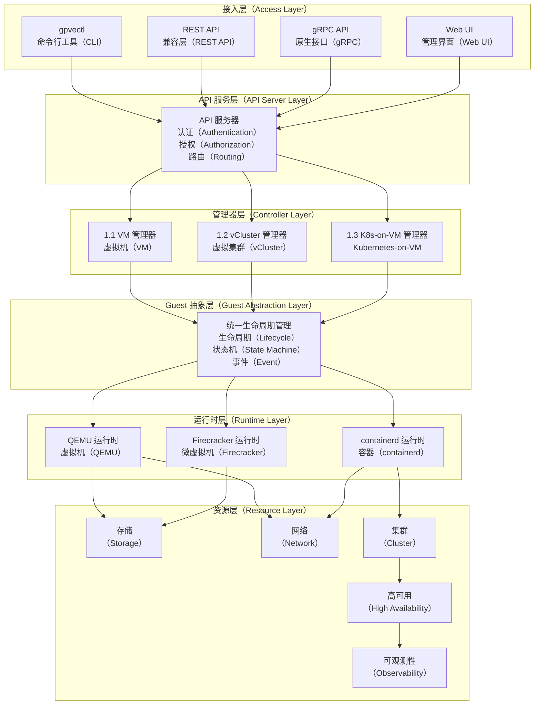

<div align="center">
  <!---->
  
  # go-proxmox
  
  **面向混合工作负载的云原生基础设施运行时**
  
  [](https://github.com/turtacn/go-proxmox/actions)
  [](https://go.dev/)
  [](LICENSE)
  [](https://goreportcard.com/report/github.com/turtacn/go-proxmox)
  [](docs/architecture.md)
  [](https://github.com/turtacn/go-proxmox/releases)
  
  [English](README.md) | [中文](README-zh.md)
  
</div>

---

## 使命宣言

**go-proxmox** 是面向云原生时代重新构想的下一代基础设施运行时。通过使用 Go 语言重构 Proxmox VE 的核心能力，我们构建了一个统一的计算平面，使 **虚拟机（VM）** 和 **vCluster（轻量级 Kubernetes）** 成为 **平等的一等公民**。

我们的目标是弥合传统虚拟化与云原生工作负载之间的鸿沟，使组织能够在单一、一致的平台上运行虚拟机、容器和 AI 工作负载——从边缘设备到数据中心规模。

---

## 为什么选择 go-proxmox？

### 我们解决的行业痛点

| 挑战 | 传统解决方案 | go-proxmox 方案 |
|------|------------|----------------|
| **工具碎片化** | VM 和 Kubernetes 分别管理 | 统一的 API 和生命周期管理 |
| **运维复杂** | 多个控制面，体验不一致 | 单一二进制，一致的使用体验 |
| **资源低效** | 因隔离边界导致的资源过度配置 | 共享资源池，细粒度隔离 |
| **部署缓慢** | 基于重量级 VM 的 Kubernetes 集群 | vCluster 秒级启动 |
| **锁定风险** | 专有超融合平台 | 开源、可插拔架构 |
| **AI 工作负载缺口** | 传统平台缺乏 AI/Agent 优化 | 原生支持 AI 推理和 Agent 工作负载 |

### 核心差异化优势

```

┌─────────────────────────────────────────────────────────────────┐
│                    go-proxmox 优势                              │
├─────────────────────────────────────────────────────────────────┤
│                                                                 │
│  1. 统一抽象                                                     │
│     VM 和 vCluster 共享相同的 Guest 接口                          │
│     通用的调度、存储、网络语义                                     │
│                                                                 │
│  2. 单二进制部署                                                  │
│     从边缘到数据中心的一致体验                                     │
│     基本运行零外部依赖                                            │
│                                                                 │
│  3. 声明式优先 API                                               │
│     GitOps 就绪，Kubernetes 风格资源                              │
│     与 Proxmox 生态完全兼容的 REST API                            │
│                                                                 │
│  4. 可插拔运行时                                                  │
│     QEMU/KVM、Firecracker、containerd                           │
│     按工作负载选择隔离级别                                         │
│                                                                 │
│  5. 内置可观测性                                                  │
│     原生 OpenTelemetry，eBPF 驱动的深度洞察                       │
│     统一的日志、指标、追踪                                         │
│                                                                 │
│  6. AI 就绪架构                                                   │
│     针对推理工作负载优化                                          │
│     原生 Agent/A2A 编排支持                                       │
│                                                                 │
└─────────────────────────────────────────────────────────────────┘

```

---

## 核心功能

### 基础能力

- **VM 管理**：完整的 QEMU/KVM 生命周期（创建、启动、停止、迁移、快照、克隆）
- **vCluster 支持**：具有硬件级隔离的轻量级 Kubernetes 集群
- **在线迁移**：跨节点零停机 VM 和 vCluster 迁移
- **高可用**：可配置 Fencing 策略的自动故障转移
- **存储抽象**：支持 LVM、ZFS、Ceph、NFS 的可插拔驱动
- **网络管理**：Linux Bridge、VLAN、SDN 以及 nftables 防火墙

### 企业级功能

- **多租户**：细粒度 RBAC 与资源配额
- **集群联邦**：从单一控制面管理多个集群
- **备份集成**：兼容 Proxmox Backup Server 协议
- **审计日志**：不可篡改的合规审计追踪

### AI 与云原生

- **GPU 直通**：支持 NVIDIA/AMD GPU 的 AI 推理
- **vGPU 调度**：跨多个工作负载共享 GPU
- **Agent 编排**：原生支持 AI Agent 工作流
- **Serverless 就绪**：事件驱动工作负载的快速冷启动

---

## 架构概览



详细架构文档请参阅 [docs/architecture.md](docs/architecture.md)。

---

## 快速开始

### 前置条件

* Go 1.22 或更高版本
* Linux 内核 5.10+ 且支持 KVM
* QEMU 6.0+（用于 VM 运行时）
* containerd 1.7+（用于 vCluster 运行时）

### 安装

#### 从源码构建

```bash
# 克隆仓库
git clone https://github.com/turtacn/go-proxmox.git
cd go-proxmox

# 构建所有二进制文件
make build

# 安装到系统
sudo make install
```

#### 使用 go install

```bash
# 安装 CLI 工具
go install github.com/turtacn/go-proxmox/cmd/gpvectl@latest

# 安装服务端（运行时操作需要 root 权限）
go install github.com/turtacn/go-proxmox/cmd/gpve-server@latest
go install github.com/turtacn/go-proxmox/cmd/gpve-agent@latest
```

#### 容器镜像

```bash
# 拉取官方镜像
docker pull ghcr.io/turtacn/go-proxmox:latest

# 运行服务
docker run -d --privileged \
  -v /var/run/libvirt:/var/run/libvirt \
  -v /var/lib/gpve:/var/lib/gpve \
  -p 8006:8006 \
  ghcr.io/turtacn/go-proxmox:latest
```

### 快速上手

#### 初始化单节点集群

```bash
# 初始化集群
gpvectl cluster init --name my-cluster

# 验证节点状态
gpvectl node list
```

#### 创建第一个虚拟机

```bash
# 从云镜像创建 VM
gpvectl vm create \
  --name ubuntu-vm \
  --cores 2 \
  --memory 4096 \
  --disk local:32G \
  --cdrom local:iso/ubuntu-22.04.iso \
  --net bridge=vmbr0

# 启动 VM
gpvectl vm start ubuntu-vm

# 检查 VM 状态
gpvectl vm status ubuntu-vm
```

#### 创建 vCluster

```bash
# 创建轻量级 Kubernetes 集群
gpvectl vcluster create \
  --name dev-cluster \
  --cores 4 \
  --memory 8192 \
  --k8s-version 1.29

# 获取 kubeconfig
gpvectl vcluster kubeconfig dev-cluster > ~/.kube/dev-cluster.yaml

# 访问集群
export KUBECONFIG=~/.kube/dev-cluster.yaml
kubectl get nodes
```

---

## 使用示例

### 编程式 API 使用

```go
package main

import (
    "context"
    "fmt"
    "log"

    "github.com/turtacn/go-proxmox/pkg/client"
    "github.com/turtacn/go-proxmox/pkg/guest/types"
)

func main() {
    // 创建客户端
    c, err := client.New("https://localhost:8006", client.WithToken("your-api-token"))
    if err != nil {
        log.Fatal(err)
    }

    ctx := context.Background()

    // 创建 VM 规格
    vmSpec := &types.VMSpec{
        Name:   "api-created-vm",
        Cores:  2,
        Memory: 4096,
        Disks: []types.DiskSpec{
            {Storage: "local", Size: "32G"},
        },
        Networks: []types.NetSpec{
            {Bridge: "vmbr0", Model: "virtio"},
        },
    }

    // 创建 VM
    vm, err := c.VMs().Create(ctx, vmSpec)
    if err != nil {
        log.Fatal(err)
    }
    fmt.Printf("已创建 VM: %s (ID: %d)\n", vm.Name, vm.ID)

    // 启动 VM
    if err := c.VMs().Start(ctx, vm.ID); err != nil {
        log.Fatal(err)
    }
    fmt.Println("VM 启动成功")

    // 列出所有 Guest（VM + vCluster）
    guests, err := c.Guests().List(ctx)
    if err != nil {
        log.Fatal(err)
    }
    for _, g := range guests {
        fmt.Printf("Guest: %s, 类型: %s, 状态: %s\n", g.Name, g.Type, g.Status)
    }
}
```

### 声明式配置

```yaml
# vm-example.yaml
apiVersion: gpve.io/v1
kind: VirtualMachine
metadata:
  name: production-db
  labels:
    app: database
    env: production
spec:
  cores: 8
  memory: 32768
  disks:
    - storage: ceph-pool
      size: 500G
      cache: writeback
  networks:
    - bridge: vmbr0
      vlan: 100
      firewall: true
  ha:
    enabled: true
    group: database-ha
---
apiVersion: gpve.io/v1
kind: VCluster
metadata:
  name: staging-k8s
spec:
  cores: 4
  memory: 16384
  kubernetes:
    version: "1.29"
    cni: flannel
    features:
      - metrics-server
      - ingress-nginx
```

```bash
# 应用配置
gpvectl apply -f vm-example.yaml
```

---

## 性能基准

go-proxmox 专为生产工作负载设计，主要性能指标：

| 基准测试        | 指标     | go-proxmox | 参考      |
| ----------- | ------ | ---------- | ------- |
| VM 启动时间     | 冷启动    | < 3s       | QEMU 基线 |
| vCluster 启动 | Pod 就绪 | < 5s       | k3s 标准  |
| API 延迟      | P99    | < 50ms     | 压力测试下   |
| 在线迁移        | 停机时间   | < 100ms    | 8GB VM  |
| Guest 密度    | 每节点    | 200+       | 混合负载    |
| Oracle RAC  | TPC-C  | 认证         | 企业数据库   |
| K8s 一致性     | CNCF   | 100%       | v1.29   |

---

## 项目状态

| 阶段            | 状态  | 描述                 |
| ------------- | --- | ------------------ |
| 阶段 0：基础       | 进行中 | 核心抽象、配置、认证、可观测性    |
| 阶段 1：VM 运行时   | 进行中 | 完整的 VM 生命周期管理      |
| 阶段 2：存储与网络    | 进行中 | 多后端存储、SDN          |
| 阶段 3：集群与高可用   | 进行中 | 多节点、在线迁移、高可用       |
| 阶段 4：vCluster | 进行中 | 轻量级 Kubernetes 运行时 |
| 阶段 5：K8s 集成   | 进行中 | K8s-on-VM、统一管理     |

---

## 开发环境设置

```bash
# 克隆您的 fork
git clone https://github.com/YOUR_USERNAME/go-proxmox.git
cd go-proxmox

# 安装开发依赖
make dev-deps

# 运行测试
make test

# 运行代码检查
make lint

# 开发构建
make build-dev
```

---

## 文档

* [架构指南](docs/architecture.md) - 详细系统架构
* [API 参考](docs/apis.md) - REST 和 gRPC API 文档
* [运维指南](docs/operations.md) - 部署与运维
* [开发指南](docs/development.md) - 贡献与开发设置

---

## 许可证

go-proxmox 采用 [Apache License 2.0](LICENSE) 许可证。

```
Copyright 2024 The go-proxmox Authors

Licensed under the Apache License, Version 2.0 (the "License");
you may not use this file except in compliance with the License.
You may obtain a copy of the License at

    http://www.apache.org/licenses/LICENSE-2.0

Unless required by applicable law or agreed to in writing, software
distributed under the License is distributed on an "AS IS" BASIS,
WITHOUT WARRANTIES OR CONDITIONS OF ANY KIND, either express or implied.
See the License for the specific language governing permissions and
limitations under the License.
```

---

## 致谢

go-proxmox 站在巨人的肩膀上：

* [Proxmox VE](https://www.proxmox.com/) - 灵感来源与兼容目标
* [QEMU/KVM](https://www.qemu.org/) - 虚拟化运行时
* [containerd](https://containerd.io/) - 容器运行时
* [k3s](https://k3s.io/) - 轻量级 Kubernetes
* [etcd](https://etcd.io/) - 分布式状态存储

---

<div align="center">
  <b>为云原生基础设施社区倾情打造</b>
  <br><br>
  <a href="https://github.com/turtacn/go-proxmox/stargazers">在 GitHub 上给我们 Star</a>
</div>