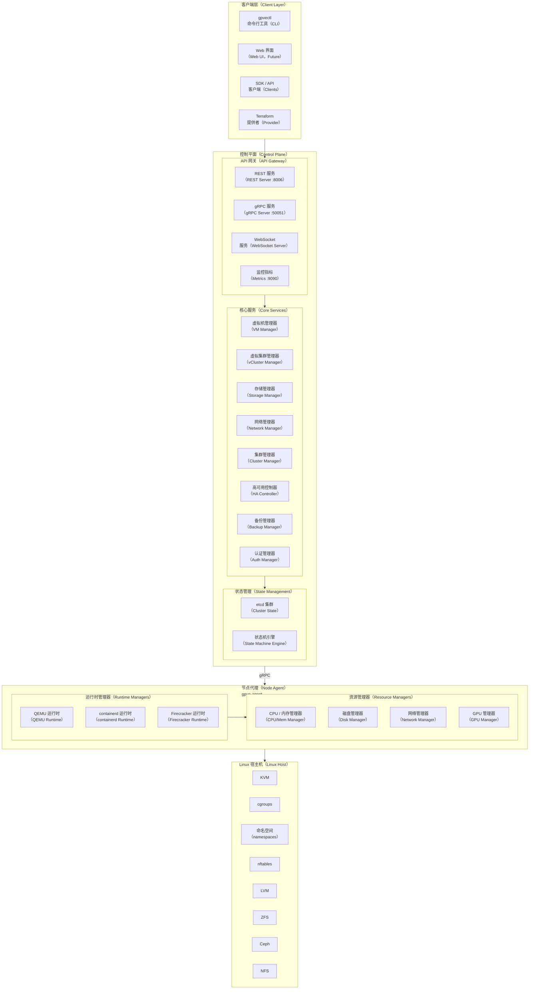
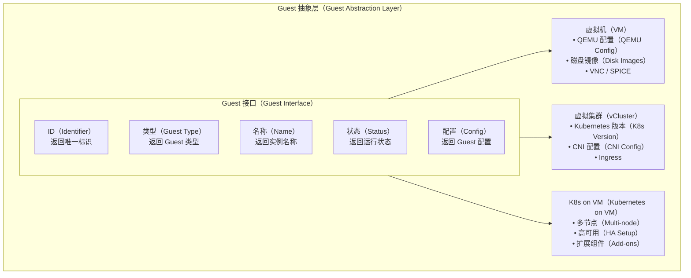
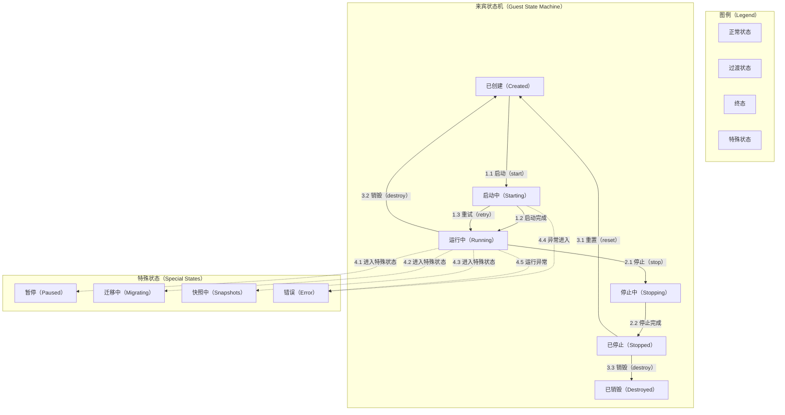
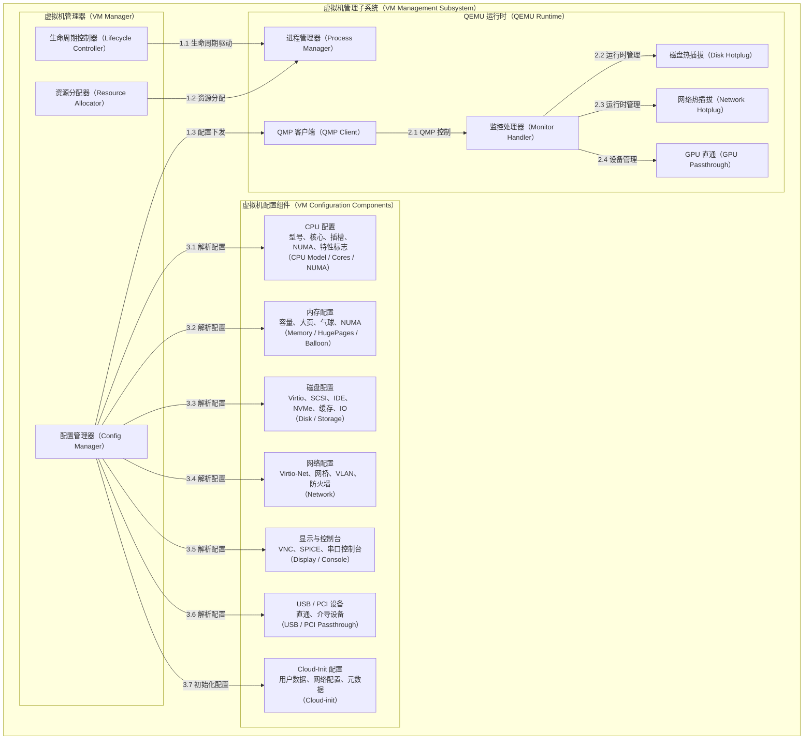
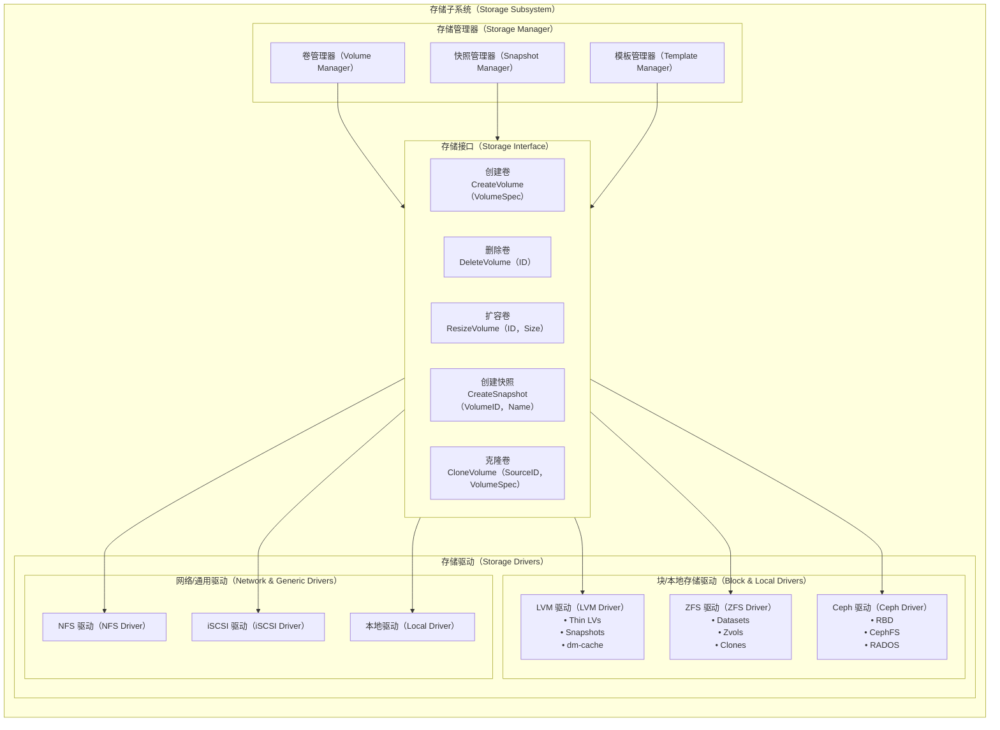

# go-proxmox Architecture Document

## Document Information

| Item | Value |
|------|-------|
| Version | 1.0.0 |
| Status | Draft |
| Last Updated | 2026-01 |
| Authors | go-proxmox Architecture Team |

---

## Table of Contents

1. [Executive Summary](#executive-summary)
2. [Design Principles](#design-principles)
3. [System Overview](#system-overview)
4. [Core Subsystems](#core-subsystems)
5. [Data Flow](#data-flow)
6. [Security Architecture](#security-architecture)
7. [Scalability & Performance](#scalability--performance)
8. [Deployment Models](#deployment-models)
9. [Integration Points](#integration-points)
10. [Future Roadmap](#future-roadmap)

---

## Executive Summary

go-proxmox is a next-generation infrastructure runtime that unifies virtual machine and lightweight Kubernetes (vCluster) management into a single, coherent platform. Built from the ground up in Go, it reimagines Proxmox VE's capabilities for the cloud-native era while maintaining API compatibility with the existing Proxmox ecosystem.

### Key Architectural Goals

1. **Unified Guest Abstraction**: VMs and vClusters share the same lifecycle semantics
2. **Single Binary Simplicity**: Minimal dependencies, edge-to-datacenter deployment
3. **Pluggable Runtimes**: Support multiple virtualization backends
4. **Cloud-Native First**: Declarative APIs, GitOps-ready, Kubernetes-compatible
5. **Production Ready**: Built-in observability, HA, and enterprise features

---

## Design Principles

### 1. Separation of Concerns

```mermaid
graph TD
    %% 架构分层总览（Architectural Layers）

    %% API层
    subgraph API[API层（API Layer）]
        API1[协议处理（Protocol Handling）<br/>REST、gRPC]
        API2[请求校验（Request Validation）]
        API3[响应格式化（Response Formatting）]
        API1 --> API2 --> API3
    end

    %% 服务层
    subgraph SVC[服务层（Service Layer）]
        SVC1[业务逻辑（Business Logic）]
        SVC2[流程编排（Orchestration）]
        SVC3[事务管理（Transaction Management）]
        SVC1 --> SVC2 --> SVC3
    end

    %% 领域层
    subgraph DOM[领域层（Domain Layer）]
        DOM1[核心实体（Core Entities）<br/>VM、vCluster、Node]
        DOM2[领域规则（Domain Rules）]
        DOM3[状态机（State Machines）]
        DOM1 --> DOM2 --> DOM3
    end

    %% 基础设施层
    subgraph INF[基础设施层（Infrastructure Layer）]
        INF1[运行时驱动（Runtime Drivers）<br/>QEMU、containerd]
        INF2[存储后端（Storage Backends）]
        INF3[网络实现（Network Implementations）]
        INF1 --> INF2 --> INF3
    end

    %% 层级调用关系
    API --> SVC
    SVC --> DOM
    DOM --> INF

````

### 2. Interface-Driven Design

All major components are defined by interfaces, enabling:
- Easy testing through mocks
- Pluggable implementations
- Clear contracts between layers

```go
// Example: Guest interface unifies VM and vCluster
type Guest interface {
    ID() string
    Type() GuestType
    Start(ctx context.Context) error
    Stop(ctx context.Context, opts StopOptions) error
    Status() GuestStatus
    Migrate(ctx context.Context, target Node) error
}
````

### 3. Event-Driven Architecture

```mermaid
graph LR
    %% ==================== 图例（Legend） ====================
    %% 蓝色：事件生产与传输；绿色：事件存储；橙色：事件消费
    subgraph LG[图例（Legend）]
        L1[事件生产（Producer）]
        L2[事件总线（Event Bus）]
        L3[事件订阅（Subscriber）]
    end

    %% ==================== 架构主体 ====================
    %% 模块命名规则：大写缩写[中文名称（English Term）]

    subgraph EB[事件总线架构（Event Bus Architecture）]

        %% ---------- 事件生产 ----------
        subgraph PR[事件生产方（Producer）]
            P1[1.1 虚拟机启动<br/>（VM Start）]
            P2[1.2 虚拟机停止<br/>（VM Stop）]
            P3[1.3 虚拟机迁移<br/>（Migration）]
            P4[1.4 快照创建<br/>（Snapshot）]
        end

        %% ---------- 事件总线 ----------
        subgraph BUS[事件总线（Event Bus）]
            B1[2.1 事件接收与分发<br/>（Event Dispatch）]
        end

        %% ---------- 事件队列 ----------
        subgraph Q[事件队列（Event Queue）]
            Q1[2.2 内存队列<br/>（In-Memory Queue）<br/>可插拔：NATS]
        end

        %% ---------- 事件订阅 ----------
        subgraph SUB[事件订阅方（Subscribers）]
            S1[3.1 高可用控制器<br/>（HA Controller）]
            S2[3.2 指标采集<br/>（Metrics）]
            S3[3.3 审计日志<br/>（Audit Log）]
            S4[3.4 Webhooks<br/>（Webhooks）]
        end
    end

    %% ==================== 业务流程 ====================
    %% 1.x → 2.x → 3.x 分层业务流

    P1 -->|1.x 事件产生| B1
    P2 -->|1.x 事件产生| B1
    P3 -->|1.x 事件产生| B1
    P4 -->|1.x 事件产生| B1

    B1 -->|2.x 事件缓冲| Q1
    Q1 -->|2.x 事件投递| S1
    Q1 -->|2.x 事件投递| S2
    Q1 -->|2.x 事件投递| S3
    Q1 -->|2.x 事件投递| S4

```

### 4. Fail-Safe Defaults

* All operations are idempotent where possible
* Graceful degradation on component failure
* Automatic retry with exponential backoff
* Circuit breaker patterns for external dependencies

---

## System Overview

### High-Level Architecture



### Component Descriptions

| Component       | Description            | Responsibility                                |
| --------------- | ---------------------- | --------------------------------------------- |
| **gpvectl**     | Command-line interface | User interaction, scripting, automation       |
| **gpve-server** | Control plane server   | API handling, orchestration, state management |
| **gpve-agent**  | Node agent             | Local resource management, runtime execution  |
| **etcd**        | Distributed KV store   | Cluster state, leader election, configuration |

---

## Core Subsystems

### 1. Guest Abstraction Layer

The Guest abstraction is the cornerstone of go-proxmox's unified approach to workload management.



#### Guest State Machine



### 2. VM Management Subsystem



#### QEMU Command Generation

```go
// Example: QEMU command builder
type QEMUCommandBuilder struct {
    machine    MachineType
    cpu        CPUConfig
    memory     MemoryConfig
    drives     []DriveConfig
    networks   []NetworkConfig
    displays   []DisplayConfig
    devices    []DeviceConfig
}

func (b *QEMUCommandBuilder) Build() []string {
    args := []string{
        "-name", b.name,
        "-machine", string(b.machine),
        "-cpu", b.cpu.Model,
        "-smp", fmt.Sprintf("cores=%d,sockets=%d", b.cpu.Cores, b.cpu.Sockets),
        "-m", fmt.Sprintf("%dM", b.memory.SizeMB),
    }
    // Add drives, networks, etc.
    return args
}
```

### 3. vCluster Subsystem

```mermaid
graph TB
    %% ========================
    %% 图例（Legend）
    %% 蓝色：管理与控制组件
    %% 绿色：控制平面组件
    %% 橙色：数据平面组件
    %% 灰色：隔离与运行模式说明
    %% ========================

    %% ========================
    %% 顶层模块：vCluster 子系统
    %% ========================
    subgraph VCS[VC[虚拟集群子系统（vCluster Subsystem）]]


        %% ========================
        %% vCluster 管理器
        %% ========================
        subgraph VCM[VCM[vCluster 管理器（vCluster Manager）]]
            VCM1[生命周期控制器<br/>（Lifecycle Controller）]
            VCM2[K8s API 代理<br/>（Kubernetes API Proxy）]
            VCM3[Kubeconfig 生成器<br/>（Kubeconfig Generator）]
        end


        %% ========================
        %% vCluster 实例
        %% ========================
        subgraph VCI[VCI[vCluster 实例（vCluster Instance）]]

            %% -------- 控制平面 --------
            subgraph CP[CP[控制平面（Control Plane）]]
                CP1[kube-apiserver<br/>（API Server）]
                CP2[控制器管理器<br/>（Controller Manager）]
                CP3[调度器<br/>（Scheduler）]
                CP4[etcd（内嵌）<br/>（Embedded etcd）]
                CP5[CoreDNS<br/>（DNS Service）]
            end

            %% -------- 数据平面（可选） --------
            subgraph DP[DP[数据平面（可选）（Data Plane - Optional）]]
                DP1[kubelet<br/>（Node Agent）]
                DP2[containerd<br/>（Container Runtime）]
                DP3[CNI 插件<br/>（Container Network Interface）]
            end
        end


        %% ========================
        %% 管理器到实例的关系
        %% ========================
        VCM1 --> CP1
        VCM2 --> CP1
        VCM3 --> CP1

    end


    %% ========================
    %% 隔离模式说明
    %% ========================
    subgraph ISO[ISO[隔离模式（Isolation Modes）]]
        ISO1[命名空间隔离<br/>共享内核，命名空间级隔离<br/>（Namespace Isolation）]
        ISO2[容器级隔离<br/>基于 containerd，cgroup 隔离<br/>（Container Isolation）]
        ISO3[微型虚拟机隔离<br/>Firecracker，硬件级隔离<br/>（MicroVM Isolation）]
        ISO4[完整虚拟机隔离<br/>QEMU/KVM，完全隔离<br/>（Full VM Isolation）]
    end

    VCI --- ISO

```

### 4. Storage Subsystem



#### Storage Volume Types

| Type         | Use Case         | Features                                  |
| ------------ | ---------------- | ----------------------------------------- |
| **Raw**      | High performance | Direct block access, no overhead          |
| **QCOW2**    | Flexibility      | Snapshots, thin provisioning, compression |
| **VMDK**     | VMware compat    | Import/export VMware VMs                  |
| **VHD/VHDX** | Hyper-V compat   | Import/export Hyper-V VMs                 |

### 5. Network Subsystem

```mermaid

```

#### Firewall Architecture

```mermaid
┌─────────────────────────────────────────────────────────────────┐
│                    Firewall Architecture                        │
├─────────────────────────────────────────────────────────────────┤
│                                                                 │
│  ┌───────────────────────────────────────────────────────────┐  │
│  │                   Rule Hierarchy                          │  │
│  │                                                           │  │
│  │    ┌─────────────────────────────────────────────┐       │  │
│  │    │          Datacenter Rules                   │       │  │
│  │    │         (Global policies)                   │       │  │
│  │    └────────────────────┬────────────────────────┘       │  │
│  │                         │                                 │  │
│  │    ┌────────────────────┴────────────────────────┐       │  │
│  │    │           Cluster Rules                     │       │  │
│  │    │        (Cluster-wide policies)              │       │  │
│  │    └────────────────────┬────────────────────────┘       │  │
│  │                         │                                 │  │
│  │    ┌────────────────────┴────────────────────────┐       │  │
│  │    │           Node Rules                        │       │  │
│  │    │         (Host firewall)                     │       │  │
│  │    └────────────────────┬────────────────────────┘       │  │
│  │                         │                                 │  │
│  │    ┌────────────────────┴────────────────────────┐       │  │
│  │    │         Guest Rules                         │       │  │
│  │    │     (Per-VM/vCluster firewall)              │       │  │
│  │    └─────────────────────────────────────────────┘       │  │
│  │                                                           │  │
│  └───────────────────────────────────────────────────────────┘  │
│                                                                 │
│  Implementation: nftables with automatic rule generation        │
│                                                                 │
└─────────────────────────────────────────────────────────────────┘
```

### 6. Cluster & HA Subsystem

```
┌─────────────────────────────────────────────────────────────────┐
│                    Cluster & HA Subsystem                       │
├─────────────────────────────────────────────────────────────────┤
│                                                                 │
│  ┌───────────────────────────────────────────────────────────┐  │
│  │                   Cluster Manager                         │  │
│  │  ┌─────────────┐  ┌─────────────┐  ┌─────────────┐       │  │
│  │  │    Node     │  │  Quorum     │  │  Config     │       │  │
│  │  │  Registry   │  │  Manager    │  │  Sync       │       │  │
│  │  └──────┬──────┘  └──────┬──────┘  └──────┬──────┘       │  │
│  └─────────┼────────────────┼────────────────┼───────────────┘  │
│            │                │                │                  │
│            ▼                ▼                ▼                  │
│  ┌───────────────────────────────────────────────────────────┐  │
│  │                   Cluster Topology                        │  │
│  │                                                           │  │
│  │    ┌─────────┐     ┌─────────┐     ┌─────────┐           │  │
│  │    │  Node1  │◀───▶│  Node2  │◀───▶│  Node3  │           │  │
│  │    │(Leader) │     │(Follower│     │(Follower│           │  │
│  │    └────┬────┘     └────┬────┘     └────┬────┘           │  │
│  │         │               │               │                 │  │
│  │         └───────────────┴───────────────┘                 │  │
│  │                         │                                 │  │
│  │    ┌────────────────────┴────────────────────────┐       │  │
│  │    │              etcd Cluster                   │       │  │
│  │    │         (Raft-based consensus)              │       │  │
│  │    └─────────────────────────────────────────────┘       │  │
│  │                                                           │  │
│  └───────────────────────────────────────────────────────────┘  │
│                                                                 │
│  ┌───────────────────────────────────────────────────────────┐  │
│  │                   HA Controller                           │  │
│  │                                                           │  │
│  │    ┌─────────────────────────────────────────────┐       │  │
│  │    │             Health Monitoring               │       │  │
│  │    │  • Node heartbeat (1s interval)            │       │  │
│  │    │  • Guest health checks                     │       │  │
│  │    │  • Storage reachability                    │       │  │
│  │    │  • Network connectivity                    │       │  │
│  │    └─────────────────────────────────────────────┘       │  │
│  │                         │                                 │  │
│  │                         ▼                                 │  │
│  │    ┌─────────────────────────────────────────────┐       │  │
│  │    │             Failure Detection               │       │  │
│  │    │  • Timeout: 30s (configurable)             │       │  │
│  │    │  • Quorum-based decision                   │       │  │
│  │    │  • Split-brain prevention                  │       │  │
│  │    └─────────────────────────────────────────────┘       │  │
│  │                         │                                 │  │
│  │                         ▼                                 │  │
│  │    ┌─────────────────────────────────────────────┐       │  │
│  │    │               Fencing                       │       │  │
│  │    │  • IPMI/BMC power control                  │       │  │
│  │    │  • PDU-based fencing                       │       │  │
│  │    │  • Storage-based fencing (SCSI PR)         │       │  │
│  │    │  • Watchdog timer                          │       │  │
│  │    └─────────────────────────────────────────────┘       │  │
│  │                         │                                 │  │
│  │                         ▼                                 │  │
│  │    ┌─────────────────────────────────────────────┐       │  │
│  │    │              Recovery                       │       │  │
│  │    │  • Guest restart on healthy node           │       │  │
│  │    │  • Respect resource constraints            │       │  │
│  │    │  • Maintain HA group affinity              │       │  │
│  │    └─────────────────────────────────────────────┘       │  │
│  │                                                           │  │
│  └───────────────────────────────────────────────────────────┘  │
│                                                                 │
└─────────────────────────────────────────────────────────────────┘
```

### 7. API Subsystem

```
┌─────────────────────────────────────────────────────────────────┐
│                      API Subsystem                              │
├─────────────────────────────────────────────────────────────────┤
│                                                                 │
│  ┌───────────────────────────────────────────────────────────┐  │
│  │                   API Gateway                             │  │
│  │  ┌─────────────┐  ┌─────────────┐  ┌─────────────┐       │  │
│  │  │    HTTP     │  │    gRPC     │  │  WebSocket  │       │  │
│  │  │   Router    │  │   Server    │  │   Handler   │       │  │
│  │  └──────┬──────┘  └──────┬──────┘  └──────┬──────┘       │  │
│  └─────────┼────────────────┼────────────────┼───────────────┘  │
│            │                │                │                  │
│            └────────────────┴────────────────┘                  │
│                             │                                   │
│  ┌───────────────────────────────────────────────────────────┐  │
│  │                   Middleware Stack                        │  │
│  │  ┌─────────────────────────────────────────────────────┐  │  │
│  │  │  Request Logging → Auth → Rate Limit → Validation   │  │  │
│  │  └─────────────────────────────────────────────────────┘  │  │
│  └───────────────────────────────────────────────────────────┘  │
│                             │                                   │
│  ┌───────────────────────────────────────────────────────────┐  │
│  │                   API Endpoints                           │  │
│  │                                                           │  │
│  │  REST API (Proxmox Compatible):                           │  │
│  │  ┌─────────────────────────────────────────────────────┐  │  │
│  │  │  /api2/json/nodes                                   │  │  │
│  │  │  /api2/json/nodes/{node}/qemu                       │  │  │
│  │  │  /api2/json/nodes/{node}/qemu/{vmid}/status         │  │  │
│  │  │  /api2/json/nodes/{node}/storage                    │  │  │
│  │  │  /api2/json/cluster                                 │  │  │
│  │  │  /api2/json/access                                  │  │  │
│  │  └─────────────────────────────────────────────────────┘  │  │
│  │                                                           │  │
│  │  Native REST API (Extended):                              │  │
│  │  ┌─────────────────────────────────────────────────────┐  │  │
│  │  │  /v1/guests                                         │  │  │
│  │  │  /v1/vclusters                                      │  │  │
│  │  │  /v1/vclusters/{id}/kubeconfig                      │  │  │
│  │  │  /v1/templates                                      │  │  │
│  │  │  /v1/federation                                     │  │  │
│  │  └─────────────────────────────────────────────────────┘  │  │
│  │                                                           │  │
│  │  gRPC Services:                                           │  │
│  │  ┌─────────────────────────────────────────────────────┐  │  │
│  │  │  GuestService.Create/Start/Stop/Migrate             │  │  │
│  │  │  VClusterService.Create/Kubeconfig/Scale            │  │  │
│  │  │  StorageService.CreateVolume/Snapshot               │  │  │
│  │  │  ClusterService.Join/Leave/Status                   │  │  │
│  │  │  StreamService.Events/Logs/Metrics                  │  │  │
│  │  └─────────────────────────────────────────────────────┘  │  │
│  │                                                           │  │
│  └───────────────────────────────────────────────────────────┘  │
│                                                                 │
└─────────────────────────────────────────────────────────────────┘
```

### 8. Authentication & Authorization

```
┌─────────────────────────────────────────────────────────────────┐
│                Authentication & Authorization                   │
├─────────────────────────────────────────────────────────────────┤
│                                                                 │
│  ┌───────────────────────────────────────────────────────────┐  │
│  │                  Auth Flow                                │  │
│  │                                                           │  │
│  │    Client                 Server                          │  │
│  │      │                      │                             │  │
│  │      │  1. Login Request    │                             │  │
│  │      │─────────────────────▶│                             │  │
│  │      │  (user/pass/realm)   │                             │  │
│  │      │                      │                             │  │
│  │      │                      │  2. Authenticate            │  │
│  │      │                      │────────────────┐            │  │
│  │      │                      │                │            │  │
│  │      │                      │◀───────────────┘            │  │
│  │      │                      │                             │  │
│  │      │  3. Token Response   │                             │  │
│  │      │◀─────────────────────│                             │  │
│  │      │  (JWT + CSRF)        │                             │  │
│  │      │                      │                             │  │
│  │      │  4. API Request      │                             │  │
│  │      │─────────────────────▶│                             │  │
│  │      │  (Bearer Token)      │                             │  │
│  │      │                      │                             │  │
│  │      │                      │  5. Validate & Authorize    │  │
│  │      │                      │────────────────┐            │  │
│  │      │                      │                │            │  │
│  │      │                      │◀───────────────┘            │  │
│  │      │                      │                             │  │
│  │      │  6. Response         │                             │  │
│  │      │◀─────────────────────│                             │  │
│  │      │                      │                             │  │
│  │                                                           │  │
│  └───────────────────────────────────────────────────────────┘  │
│                                                                 │
│  ┌───────────────────────────────────────────────────────────┐  │
│  │              Authentication Providers                     │  │
│  │  ┌───────────┐  ┌───────────┐  ┌───────────┐             │  │
│  │  │   PAM     │  │   LDAP    │  │   OIDC    │             │  │
│  │  │  (Local)  │  │   /AD     │  │           │             │  │
│  │  └───────────┘  └───────────┘  └───────────┘             │  │
│  │  ┌───────────┐  ┌───────────┐  ┌───────────┐             │  │
│  │  │ API Token │  │   SAML    │  │   2FA     │             │  │
│  │  │           │  │           │  │  (TOTP)   │             │  │
│  │  └───────────┘  └───────────┘  └───────────┘             │  │
│  └───────────────────────────────────────────────────────────┘  │
│                                                                 │
│  ┌───────────────────────────────────────────────────────────┐  │
│  │              Authorization (RBAC)                         │  │
│  │                                                           │  │
│  │    ┌─────────┐      ┌─────────┐      ┌─────────┐         │  │
│  │    │  Users  │─────▶│  Roles  │─────▶│ Permissions│       │  │
│  │    └─────────┘      └─────────┘      └─────────┘         │  │
│  │         │                                  │              │  │
│  │         │           ┌─────────┐            │              │  │
│  │         └──────────▶│ Groups  │────────────┘              │  │
│  │                     └─────────┘                           │  │
│  │                                                           │  │
│  │  Permission Format: <resource>.<action>[@<path>]          │  │
│  │  Examples:                                                │  │
│  │    • VM.Allocate                                         │  │
│  │    • VM.PowerMgmt@/nodes/node1                           │  │
│  │    • Datastore.AllocateSpace@/storage/local              │  │
│  │    • VCluster.Create                                     │  │
│  │    • Sys.Audit                                           │  │
│  │                                                           │  │
│  └───────────────────────────────────────────────────────────┘  │
│                                                                 │
└─────────────────────────────────────────────────────────────────┘
```

---

## Data Flow

### VM Creation Flow

```
┌─────────────────────────────────────────────────────────────────┐
│                    VM Creation Flow                             │
├─────────────────────────────────────────────────────────────────┤
│                                                                 │
│  ┌─────────┐     ┌─────────┐     ┌─────────┐     ┌─────────┐   │
│  │ Client  │     │  API    │     │ Service │     │  Agent  │   │
│  │         │     │ Server  │     │  Layer  │     │         │   │
│  └────┬────┘     └────┬────┘     └────┬────┘     └────┬────┘   │
│       │               │               │               │        │
│       │ 1. POST /vms  │               │               │        │
│       │──────────────▶│               │               │        │
│       │               │               │               │        │
│       │               │ 2. Validate   │               │        │
│       │               │──────────────▶│               │        │
│       │               │               │               │        │
│       │               │               │ 3. Allocate   │        │
│       │               │               │    VMID       │        │
│       │               │               │───────┐       │        │
│       │               │               │       │       │        │
│       │               │               │◀──────┘       │        │
│       │               │               │               │        │
│       │               │               │ 4. Select Node│        │
│       │               │               │    (Scheduler)│        │
│       │               │               │───────┐       │        │
│       │               │               │       │       │        │
│       │               │               │◀──────┘       │        │
│       │               │               │               │        │
│       │               │               │ 5. Create     │        │
│       │               │               │    Resources  │        │
│       │               │               │──────────────▶│        │
│       │               │               │               │        │
│       │               │               │               │ 6. Alloc│
│       │               │               │               │   Disk │
│       │               │               │               │───┐    │
│       │               │               │               │   │    │
│       │               │               │               │◀──┘    │
│       │               │               │               │        │
│       │               │               │               │ 7. Setup│
│       │               │               │               │ Network│
│       │               │               │               │───┐    │
│       │               │               │               │   │    │
│       │               │               │               │◀──┘    │
│       │               │               │               │        │
│       │               │               │               │ 8. Save │
│       │               │               │               │  Config│
│       │               │               │               │───┐    │
│       │               │               │               │   │    │
│       │               │               │               │◀──┘    │
│       │               │               │               │        │
│       │               │               │ 9. Created    │        │
│       │               │               │◀──────────────│        │
│       │               │               │               │        │
│       │               │ 10. Store     │               │        │
│       │               │     State     │               │        │
│       │               │◀──────────────│               │        │
│       │               │               │               │        │
│       │ 11. Response  │               │               │        │
│       │◀──────────────│               │               │        │
│       │   (VM ID)     │               │               │        │
│                                                                 │
└─────────────────────────────────────────────────────────────────┘
```

### Live Migration Flow

```
┌─────────────────────────────────────────────────────────────────┐
│                    Live Migration Flow                          │
├─────────────────────────────────────────────────────────────────┤
│                                                                 │
│  ┌─────────────┐           ┌─────────────┐                     │
│  │Source Node  │           │Target Node  │                     │
│  │  (Agent)    │           │  (Agent)    │                     │
│  └──────┬──────┘           └──────┬──────┘                     │
│         │                         │                            │
│         │ 1. Pre-migration checks │                            │
│         │─────────────────────────▶                            │
│         │    • CPU compatibility  │                            │
│         │    • Storage access     │                            │
│         │    • Network reachable  │                            │
│         │                         │                            │
│         │ 2. Prepare target       │                            │
│         │─────────────────────────▶                            │
│         │    • Reserve resources  │                            │
│         │    • Setup QEMU         │                            │
│         │                         │                            │
│         │ 3. Memory pre-copy      │                            │
│         │═════════════════════════▶                            │
│         │    (iterative rounds)   │                            │
│         │                         │                            │
│         │ 4. Stop & Transfer      │                            │
│         │═════════════════════════▶                            │
│         │    • Final memory       │                            │
│         │    • Device state       │                            │
│         │                         │                            │
│         │ 5. Resume on target     │                            │
│         │                        ─┼─                           │
│         │                         │ VM Running                 │
│         │                         │                            │
│         │ 6. Cleanup source       │                            │
│         │ ─ ─ ─ ─ ─ ─ ─ ─ ─ ─ ─ ─│                            │
│         │                         │                            │
│                                                                 │
│  Timeline:                                                      │
│  ┌────────────────────────────────────────────────────────┐    │
│  │ Pre-copy ──────────────────────▶│◀─ Downtime ─▶│       │    │
│  │ (seconds to minutes)             (< 100ms)              │    │
│  └────────────────────────────────────────────────────────┘    │
│                                                                 │
└─────────────────────────────────────────────────────────────────┘
```

---

## Security Architecture

### Defense in Depth

```
┌─────────────────────────────────────────────────────────────────┐
│                    Security Layers                              │
├─────────────────────────────────────────────────────────────────┤
│                                                                 │
│  Layer 1: Network Security                                      │
│  ┌─────────────────────────────────────────────────────────┐   │
│  │  • TLS 1.3 for all API communications                   │   │
│  │  • mTLS for inter-node communication                    │   │
│  │  • Network segmentation (management vs guest)           │   │
│  │  • Firewall rules (nftables)                            │   │
│  └─────────────────────────────────────────────────────────┘   │
│                                                                 │
│  Layer 2: Authentication & Authorization                        │
│  ┌─────────────────────────────────────────────────────────┐   │
│  │  • Multi-factor authentication support                  │   │
│  │  • Fine-grained RBAC                                    │   │
│  │  • API token with scoped permissions                    │   │
│  │  • Session management with secure cookies               │   │
│  └─────────────────────────────────────────────────────────┘   │
│                                                                 │
│  Layer 3: Workload Isolation                                    │
│  ┌─────────────────────────────────────────────────────────┐   │
│  │  • Hardware virtualization (KVM/VT-x)                   │   │
│  │  • Seccomp filters for QEMU                             │   │
│  │  • SELinux/AppArmor profiles                            │   │
│  │  • cgroups resource limits                              │   │
│  │  • Namespace isolation for vClusters                    │   │
│  └─────────────────────────────────────────────────────────┘   │
│                                                                 │
│  Layer 4: Data Security                                         │
│  ┌─────────────────────────────────────────────────────────┐   │
│  │  • Encryption at rest (LUKS, ZFS encryption)            │   │
│  │  • Encryption in transit (TLS, SSH)                     │   │
│  │  • Secure key management                                │   │
│  │  • Secrets management (HashiCorp Vault integration)     │   │
│  └─────────────────────────────────────────────────────────┘   │
│                                                                 │
│  Layer 5: Audit & Compliance                                    │
│  ┌─────────────────────────────────────────────────────────┐   │
│  │  • Comprehensive audit logging                          │   │
│  │  • Change tracking                                      │   │
│  │  • Compliance reporting                                 │   │
│  │  • Security event alerting                              │   │
│  └─────────────────────────────────────────────────────────┘   │
│                                                                 │
└─────────────────────────────────────────────────────────────────┘
```

### Certificate Management

```
┌─────────────────────────────────────────────────────────────────┐
│                Certificate Architecture                         │
├─────────────────────────────────────────────────────────────────┤
│                                                                 │
│    ┌─────────────────────────────────────────┐                 │
│    │              Root CA                     │                 │
│    │         (Cluster-wide)                   │                 │
│    └─────────────────┬───────────────────────┘                 │
│                      │                                          │
│           ┌──────────┴──────────┐                              │
│           ▼                     ▼                              │
│    ┌─────────────┐       ┌─────────────┐                       │
│    │ Server CA   │       │ Client CA   │                       │
│    └──────┬──────┘       └──────┬──────┘                       │
│           │                     │                               │
│    ┌──────┴──────┐       ┌──────┴──────┐                       │
│    ▼             ▼       ▼             ▼                       │
│ ┌──────┐     ┌──────┐ ┌──────┐     ┌──────┐                   │
│ │Node1 │     │Node2 │ │Admin │     │Agent │                   │
│ │ Cert │     │ Cert │ │ Cert │     │ Cert │                   │
│ └──────┘     └──────┘ └──────┘     └──────┘                   │
│                                                                 │
│  Auto-renewal: 30 days before expiry                           │
│  Key rotation: Supported without downtime                      │
│                                                                 │
└─────────────────────────────────────────────────────────────────┘
```

---

## Scalability & Performance

### Horizontal Scaling

```
┌─────────────────────────────────────────────────────────────────┐
│                    Scaling Architecture                         │
├─────────────────────────────────────────────────────────────────┤
│                                                                 │
│  Single Node:          Small Cluster:        Large Cluster:    │
│  ┌───────────┐         ┌───────────┐        ┌───────────┐     │
│  │           │         │   ┌───┐   │        │  ┌─────┐  │     │
│  │  ┌─────┐  │         │   │N1 │   │        │  │ N1  │  │     │
│  │  │All-in│  │         │   └─┬─┘   │        │  └──┬──┘  │     │
│  │  │-One  │  │         │     │     │        │     │     │     │
│  │  └─────┘  │         │ ┌───┴───┐ │        │ ┌───┴───┐ │     │
│  │           │         │ │       │ │        │ │       │ │     │
│  │           │         │┌┴─┐   ┌─┴┐│        │┌┴─┐   ┌─┴┐│     │
│  └───────────┘         ││N2│   │N3││        ││N2│...│Nn││     │
│                        │└──┘   └──┘│        │└──┘   └──┘│     │
│  Guests: ~50           └───────────┘        └───────────┘     │
│                        Guests: ~300         Guests: ~5000+    │
│                                                                 │
│  ┌─────────────────────────────────────────────────────────┐   │
│  │                  Scaling Dimensions                      │   │
│  │                                                          │   │
│  │  Vertical:                                               │   │
│  │  • More CPU cores per node                              │   │
│  │  • More RAM per node                                    │   │
│  │  • Faster storage (NVMe)                                │   │
│  │                                                          │   │
│  │  Horizontal:                                             │   │
│  │  • Add more nodes                                       │   │
│  │  • Distribute workloads                                 │   │
│  │  • Federate clusters                                    │   │
│  │                                                          │   │
│  └─────────────────────────────────────────────────────────┘   │
│                                                                 │
└─────────────────────────────────────────────────────────────────┘
```

### Performance Optimizations

| Area        | Optimization                        | Impact               |
| ----------- | ----------------------------------- | -------------------- |
| **CPU**     | KVM paravirtualization, CPU pinning | ~5% overhead         |
| **Memory**  | Huge pages, KSM, ballooning         | Better density       |
| **Storage** | io_uring, virtio-blk, cache modes   | Near-native IOPS     |
| **Network** | vhost-net, multiqueue, XDP          | Line-rate throughput |
| **API**     | Connection pooling, caching         | < 50ms P99           |

---

## Deployment Models

### Single Node

```
┌─────────────────────────────────────────────────────────────────┐
│                    Single Node Deployment                       │
├─────────────────────────────────────────────────────────────────┤
│                                                                 │
│  ┌─────────────────────────────────────────────────────────┐   │
│  │                     Single Host                          │   │
│  │  ┌─────────────────────────────────────────────────────┐ │   │
│  │  │              gpve-server + gpve-agent               │ │   │
│  │  │                   (Combined)                         │ │   │
│  │  └─────────────────────────────────────────────────────┘ │   │
│  │  ┌─────────────────────────────────────────────────────┐ │   │
│  │  │              Embedded etcd (single)                 │ │   │
│  │  └─────────────────────────────────────────────────────┘ │   │
│  │  ┌─────────────────────────────────────────────────────┐ │   │
│  │  │               Local Storage                         │ │   │
│  │  │         (LVM, ZFS, Directory)                       │ │   │
│  │  └─────────────────────────────────────────────────────┘ │   │
│  └─────────────────────────────────────────────────────────┘   │
│                                                                 │
│  Use cases: Development, edge, small deployments               │
│                                                                 │
└─────────────────────────────────────────────────────────────────┘
```

### Multi-Node Cluster

```
┌─────────────────────────────────────────────────────────────────┐
│                  Multi-Node Cluster Deployment                  │
├─────────────────────────────────────────────────────────────────┤
│                                                                 │
│    ┌─────────────┐  ┌─────────────┐  ┌─────────────┐           │
│    │   Node 1    │  │   Node 2    │  │   Node 3    │           │
│    │  (Leader)   │  │  (Follower) │  │  (Follower) │           │
│    │             │  │             │  │             │           │
│    │ ┌─────────┐ │  │ ┌─────────┐ │  │ ┌─────────┐ │           │
│    │ │ Server  │ │  │ │ Server  │ │  │ │ Server  │ │           │
│    │ └─────────┘ │  │ └─────────┘ │  │ └─────────┘ │           │
│    │ ┌─────────┐ │  │ ┌─────────┐ │  │ ┌─────────┐ │           │
│    │ │ Agent   │ │  │ │ Agent   │ │  │ │ Agent   │ │           │
│    │ └─────────┘ │  │ └─────────┘ │  │ └─────────┘ │           │
│    │ ┌─────────┐ │  │ ┌─────────┐ │  │ ┌─────────┐ │           │
│    │ │  etcd   │◀┼──┼▶│  etcd   │◀┼──┼▶│  etcd   │ │           │
│    │ └─────────┘ │  │ └─────────┘ │  │ └─────────┘ │           │
│    └──────┬──────┘  └──────┬──────┘  └──────┬──────┘           │
│           │                │                │                   │
│           └────────────────┴────────────────┘                   │
│                            │                                    │
│    ┌───────────────────────┴───────────────────────────────┐   │
│    │                  Shared Storage                        │   │
│    │              (Ceph, NFS, iSCSI)                        │   │
│    └───────────────────────────────────────────────────────┘   │
│                                                                 │
│  Use cases: Production, HA required, medium scale              │
│                                                                 │
└─────────────────────────────────────────────────────────────────┘
```

### Federated Clusters

```
┌─────────────────────────────────────────────────────────────────┐
│                  Federated Cluster Deployment                   │
├─────────────────────────────────────────────────────────────────┤
│                                                                 │
│  ┌───────────────────────────────────────────────────────────┐  │
│  │                    Federation Layer                       │  │
│  │              (Central Management Plane)                   │  │
│  └────────────────────────┬──────────────────────────────────┘  │
│                           │                                     │
│       ┌───────────────────┼───────────────────┐                │
│       │                   │                   │                │
│       ▼                   ▼                   ▼                │
│  ┌─────────┐        ┌─────────┐        ┌─────────┐            │
│  │Cluster A│        │Cluster B│        │Cluster C│            │
│  │(Region1)│        │(Region2)│        │(Edge)   │            │
│  │         │        │         │        │         │            │
│  │┌───┬───┐│        │┌───┬───┐│        │  ┌───┐  │            │
│  ││N1 │N2 ││        ││N1 │N2 ││        │  │N1 │  │            │
│  │├───┼───┤│        │├───┼───┤│        │  └───┘  │            │
│  ││N3 │N4 ││        ││N3 │N4 ││        │         │            │
│  │└───┴───┘│        │└───┴───┘│        │         │            │
│  └─────────┘        └─────────┘        └─────────┘            │
│                                                                 │
│  Features:                                                      │
│  • Centralized monitoring                                      │
│  • Cross-cluster migration (async)                             │
│  • Global resource visibility                                  │
│  • Unified authentication                                      │
│                                                                 │
└─────────────────────────────────────────────────────────────────┘
```

---

## Integration Points

### External System Integration

```
┌─────────────────────────────────────────────────────────────────┐
│                    Integration Architecture                     │
├─────────────────────────────────────────────────────────────────┤
│                                                                 │
│  ┌───────────────────────────────────────────────────────────┐  │
│  │                     go-proxmox                            │  │
│  └───────────────────────────┬───────────────────────────────┘  │
│                              │                                  │
│    ┌─────────────────────────┼─────────────────────────┐       │
│    │                         │                         │       │
│    ▼                         ▼                         ▼       │
│  ┌───────────┐         ┌───────────┐         ┌───────────┐    │
│  │ Terraform │         │   Packer  │         │  Ansible  │    │
│  │ Provider  │         │  Builder  │         │  Modules  │    │
│  └───────────┘         └───────────┘         └───────────┘    │
│                                                                 │
│    ┌─────────────────────────┼─────────────────────────┐       │
│    │                         │                         │       │
│    ▼                         ▼                         ▼       │
│  ┌───────────┐         ┌───────────┐         ┌───────────┐    │
│  │Prometheus │         │  Grafana  │         │   Loki    │    │
│  │ (Metrics) │         │ (Dashboards)│        │  (Logs)   │    │
│  └───────────┘         └───────────┘         └───────────┘    │
│                                                                 │
│    ┌─────────────────────────┼─────────────────────────┐       │
│    │                         │                         │       │
│    ▼                         ▼                         ▼       │
│  ┌───────────┐         ┌───────────┐         ┌───────────┐    │
│  │ Vault     │         │   LDAP    │         │   OIDC    │    │
│  │ (Secrets) │         │   (Auth)  │         │  (Auth)   │    │
│  └───────────┘         └───────────┘         └───────────┘    │
│                                                                 │
└─────────────────────────────────────────────────────────────────┘
```

### Kubernetes Integration

```
┌─────────────────────────────────────────────────────────────────┐
│                 Kubernetes Integration Modes                    │
├─────────────────────────────────────────────────────────────────┤
│                                                                 │
│  Mode 1: vCluster (Lightweight)                                 │
│  ┌─────────────────────────────────────────────────────────┐   │
│  │  go-proxmox hosts lightweight K8s clusters              │   │
│  │  as first-class guests alongside VMs                    │   │
│  └─────────────────────────────────────────────────────────┘   │
│                                                                 │
│  Mode 2: K8s-on-VM (Traditional)                                │
│  ┌─────────────────────────────────────────────────────────┐   │
│  │  Full K8s clusters running on VMs                       │   │
│  │  managed by go-proxmox (kubeadm, k3s, RKE2)             │   │
│  └─────────────────────────────────────────────────────────┘   │
│                                                                 │
│  Mode 3: Cluster API Provider                                   │
│  ┌─────────────────────────────────────────────────────────┐   │
│  │  go-proxmox as infrastructure provider for              │   │
│  Cluster API, enabling GitOps workflows                    │   │
│  └─────────────────────────────────────────────────────────┘   │
│                                                                 │
│  Mode 4: KubeVirt Compatibility                                 │
│  ┌─────────────────────────────────────────────────────────┐   │
│  │  API compatibility layer for KubeVirt-style             │   │
│  │  VM management from Kubernetes                          │   │
│  └─────────────────────────────────────────────────────────┘   │
│                                                                 │
└─────────────────────────────────────────────────────────────────┘
```

---

## Appendix

### A. Technology Stack

| Component             | Technology               | Rationale                               |
| --------------------- | ------------------------ | --------------------------------------- |
| **Language**          | Go 1.21+                 | Performance, concurrency, single binary |
| **Hypervisor**        | QEMU/KVM                 | Industry standard, feature-rich         |
| **Consensus**         | etcd (embedded)          | Proven, Raft-based, K8s-native          |
| **API**               | REST + gRPC              | Compatibility + Performance             |
| **Web UI**            | Vue.js 3 + TypeScript    | Modern, reactive, type-safe             |
| **Database**          | etcd + pgsql (optional) | Distributed + Local state               |
| **Container Runtime** | containerd               | K8s standard, lightweight               |
| **Networking**        | Linux bridge, nftables   | Native, performant                      |
| **Storage**           | LVM, ZFS, Ceph drivers   | Flexibility                             |

### B. Port Assignments

| Port      | Service       | Protocol |
| --------- | ------------- | -------- |
| 8006      | Web UI + API  | HTTPS    |
| 8007      | Internal API  | HTTPS    |
| 3128      | SPICE Proxy   | TCP      |
| 5900-5999 | VNC           | TCP      |
| 2379-2380 | etcd          | TCP      |
| 9100      | Node Exporter | HTTP     |
| 9090      | Metrics       | HTTP     |

### C. File System Layout

```
/etc/gpve/
├── gpve.conf              # Main configuration
├── nodes.conf             # Cluster node list
├── user.conf              # User database
├── acl.conf               # ACL rules
├── storage.conf           # Storage definitions
├── datacenter.conf        # DC-wide settings
└── certs/                 # TLS certificates
    ├── ca.crt
    ├── server.crt
    └── server.key

/var/lib/gpve/
├── guests/                # Guest configurations
│   ├── qemu/
│   │   ├── 100.conf
│   │   └── 101.conf
│   └── vcluster/
│       └── vc-001.conf
├── images/                # ISO images
├── templates/             # VM templates
├── snippets/              # Cloud-init snippets
└── etcd/                  # etcd data directory

/var/run/gpve/
├── qemu/                  # QEMU runtime
│   ├── 100.pid
│   ├── 100.qmp            # QMP socket
│   └── 100.serial         # Serial console
└── vcluster/              # vCluster runtime
    └── vc-001/

/var/log/gpve/
├── gpve-server.log        # Server logs
├── gpve-agent.log         # Agent logs
├── tasks/                 # Task logs
│   └── <task-id>.log
└── firewall.log           # Firewall logs
```

### D. Configuration Example

```yaml
# /etc/gpve/gpve.yaml
cluster:
  name: "production"
  node_name: "node1"
  
api:
  listen: "0.0.0.0:8006"
  tls:
    cert_file: "/etc/gpve/certs/server.crt"
    key_file: "/etc/gpve/certs/server.key"
  cors:
    allowed_origins: ["https://management.example.com"]

etcd:
  endpoints:
    - "https://node1:2379"
    - "https://node2:2379"
    - "https://node3:2379"
  tls:
    cert_file: "/etc/gpve/certs/etcd-client.crt"
    key_file: "/etc/gpve/certs/etcd-client.key"
    ca_file: "/etc/gpve/certs/etcd-ca.crt"

storage:
  - name: "local"
    type: "dir"
    path: "/var/lib/gpve/images"
    content: ["images", "iso", "snippets"]
  
  - name: "local-lvm"
    type: "lvm"
    vg_name: "pve"
    content: ["rootdir", "images"]
    
  - name: "ceph-pool"
    type: "rbd"
    pool: "vm-pool"
    content: ["images"]

network:
  bridges:
    - name: "vmbr0"
      ports: ["eth0"]
      address: "10.0.0.1/24"
      gateway: "10.0.0.254"
    - name: "vmbr1"
      ports: ["eth1"]
      vlan_aware: true

ha:
  enabled: true
  fencing:
    - type: "ipmi"
      options:
        address: "10.0.100.1"
        user: "admin"
        password_file: "/etc/gpve/ipmi-password"

logging:
  level: "info"
  format: "json"
  output: "/var/log/gpve/gpve-server.log"

metrics:
  enabled: true
  listen: ":9090"
  path: "/metrics"
```

### E. Glossary

| Term                  | Definition                                             |
| --------------------- | ------------------------------------------------------ |
| **Guest**             | Generic term for VM or vCluster instance               |
| **VMID**              | Unique numeric identifier for a VM (100-999999999)     |
| **vCluster**          | Lightweight virtual Kubernetes cluster                 |
| **QMP**               | QEMU Machine Protocol - JSON-based VM control          |
| **Fencing**           | Isolating a failed node to prevent data corruption     |
| **Live Migration**    | Moving a running VM between nodes without downtime     |
| **HA**                | High Availability - automatic failover on node failure |
| **SPICE**             | Protocol for remote desktop access                     |
| **Cloud-init**        | Industry standard for VM initialization                |
| **Thin Provisioning** | Allocating storage on-demand                           |

---

## References

1. [QEMU Documentation](https://www.qemu.org/docs/master/)
2. [KVM Documentation](https://www.linux-kvm.org/page/Documents)
3. [etcd Documentation](https://etcd.io/docs/)
4. [vCluster Documentation](https://www.vcluster.com/docs)
5. [Proxmox VE API Documentation](https://pve.proxmox.com/pve-docs/api-viewer/)
6. [Linux Bridge Documentation](https://wiki.linuxfoundation.org/networking/bridge)
7. [nftables Wiki](https://wiki.nftables.org/)

---

*Document Version: 1.0*
*Last Updated: 2026*