# go-proxmox 系统架构设计文档

> 版本：1.0.0  
> 最后更新：2026-01  
> 文档状态：正式发布

---

## 目录

1. [概述](#1-概述)
2. [问题域与解决方案全景](#2-问题域与解决方案全景)
3. [核心架构原则](#3-核心架构原则)
4. [系统分层架构](#4-系统分层架构)
5. [核心组件详细设计](#5-核心组件详细设计)
6. [关键业务场景设计](#6-关键业务场景设计)
7. [数据模型与状态机](#7-数据模型与状态机)
8. [部署架构](#8-部署架构)
9. [可观测性设计](#9-可观测性设计)
10. [安全架构](#10-安全架构)
11. [性能基准与优化策略](#11-性能基准与优化策略)
12. [项目目录结构](#12-项目目录结构)
13. [代码生成计划](#13-代码生成计划)
14. [参考资料](#14-参考资料)

---

## 1. 概述

### 1.1 项目定位

go-proxmox 是 Proxmox VE 核心虚拟化能力的现代化 Golang 重构实现，旨在构建一个云原生时代的统一计算平台。该平台将传统虚拟机（VirtualMachine，简称 VM）与轻量级虚拟 Kubernetes 集群（VirtualCluster，简称 VC）作为平等的一等公民资源进行统一管理。

### 1.2 设计目标

本项目遵循以下核心设计目标：

| 目标维度 | 具体要求 | 度量标准 |
|---------|---------|---------|
| 统一性 | VM 与 VC 共享存储、网络、配额抽象 | 单一 API 覆盖所有资源类型 |
| 简洁性 | 单二进制部署，声明式配置 | 部署步骤 ≤5 步 |
| 高性能 | 控制面低延迟，高密度资源 | p99 <100ms，≥500 VM/节点 |
| 可维护性 | 模块化设计，清晰边界 | 模块独立测试覆盖率 ≥80% |
| 兼容性 | Proxmox VE API 兼容 | VM 操作 100% 兼容 |

### 1.3 技术选型概览

```mermaid
graph LR
    subgraph 核心技术栈
        GO[Go 1.22+<br/>主开发语言]
        QEMU[QEMU/KVM<br/>虚拟化后端]
        QMP[QMP 协议<br/>VM 控制]
        VCLUSTER[vCluster<br/>虚拟 K8s]
    end
    
    subgraph 存储后端
        ZFS[ZFS]
        LVM[LVM-thin]
        CEPH[Ceph RBD]
        NFS[NFS/iSCSI]
    end
    
    subgraph 网络基础
        BRIDGE[Linux Bridge]
        VLAN[VLAN/VXLAN]
        NFT[nftables]
    end
    
    subgraph 集群协调
        ETCD[etcd<br/>状态存储]
        RAFT[Raft<br/>共识协议]
    end
    
    GO --> QMP
    GO --> VCLUSTER
    QEMU --> ZFS
    QEMU --> LVM
    QEMU --> CEPH
    QEMU --> NFS
    GO --> BRIDGE
    GO --> ETCD
````

---

## 2. 问题域与解决方案全景

### 2.1 行业痛点分析（DFX 问题全景）

基于对超融合基础设施行业的深入分析，包括 SmartX、VMware 等竞争对手的技术特点，以及云原生与 AI 工作负载的新兴需求，我们识别出以下核心问题域：

```mermaid
graph TB
    subgraph P1[问题域一：资源管理割裂]
        P1A[VM 与容器分离管理]
        P1B[存储抽象不统一]
        P1C[网络配置碎片化]
        P1D[配额模型不一致]
    end
    
    subgraph P2[问题域二：多租户隔离不足]
        P2A[Namespace 隔离粒度粗]
        P2B[控制面共享风险]
        P2C[数据面隔离弱]
        P2D[审计追溯困难]
    end
    
    subgraph P3[问题域三：云原生兼容性差]
        P3A[K8s 部署复杂]
        P3B[缺乏原生 VC 支持]
        P3C[AI 工作负载适配弱]
        P3D[Serverless 支持缺失]
    end
    
    subgraph P4[问题域四：运维复杂度高]
        P4A[多二进制部署]
        P4B[配置分散]
        P4C[升级风险大]
        P4D[故障定位困难]
    end
    
    subgraph P5[问题域五：性能与可扩展性]
        P5A[控制面延迟高]
        P5B[大规模集群瓶颈]
        P5C[迁移效率低]
        P5D[资源调度非最优]
    end
    
    P1 --> S1[统一资源模型]
    P2 --> S2[分层隔离架构]
    P3 --> S3[原生 VC 支持]
    P4 --> S4[单二进制设计]
    P5 --> S5[高性能引擎]
```

### 2.2 解决方案全景

针对上述问题域，go-proxmox 提出以下系统性解决方案：

| 问题域     | 解决方案              | 核心技术                                    | 预期效果            |
| ------- | ----------------- | --------------------------------------- | --------------- |
| 资源管理割裂  | 统一资源抽象层           | 共享状态机、通用存储/网络插件接口                       | 单一 API 管理 VM/VC |
| 多租户隔离不足 | 分层隔离架构            | 独立控制面、L1-L3 运行时隔离                       | 租户间零信任隔离        |
| 云原生兼容性差 | 原生 VirtualCluster | vCluster Private Nodes、kubelet-in-netns | 分钟级 K8s 供给      |
| 运维复杂度高  | 单二进制统一部署          | gpve-server/gpve-agent 架构               | 部署时间降低 80%      |
| 性能与可扩展性 | 高性能控制引擎           | Go 并发模型、本地缓存、批量操作                       | p99 延迟 <100ms   |

### 2.3 预期效果与展望

#### 短期效果（Phase 1-3，6个月内）

* 完成 VM 全生命周期管理，达到 Proxmox VE 功能对等
* 存储抽象层支持 ZFS、LVM-thin、Ceph RBD
* 基础网络功能（Bridge、VLAN）就绪
* 单节点性能基准达标

#### 中期效果（Phase 4-5，12个月内）

* VirtualCluster 作为一等公民资源完整可用
* 多节点集群、HA、迁移功能完善
* Oracle RAC 等企业数据库认证通过
* Kubernetes Conformance 100% 通过

#### 长期展望（Phase 6+，18个月后）

* AI Agent/Agentic AI 工作负载原生支持
* Serverless 函数计算能力集成
* A2A（Agent-to-Agent）MCP 协议支持
* 全球化部署与边缘计算场景覆盖

---

## 3. 核心架构原则

### 3.1 设计原则体系

go-proxmox 的架构设计严格遵循以下原则，这些原则源于工程现实主义而非理论优雅性：

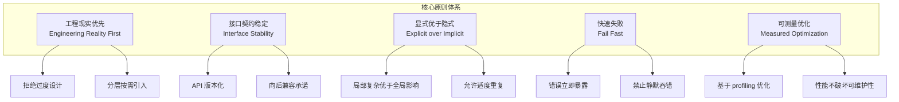
```mermaid
graph TD
    subgraph 核心原则体系
        direction TB
        PR1[工程现实优先<br/>Engineering Reality First]
        PR2[接口契约稳定<br/>Interface Stability]
        PR3[显式优于隐式<br/>Explicit over Implicit]
        PR4[快速失败<br/>Fail Fast]
        PR5[可测量优化<br/>Measured Optimization]
    end
    
    PR1 --> D1[拒绝过度设计]
    PR1 --> D2[分层按需引入]
    
    PR2 --> D3[API 版本化]
    PR2 --> D4[向后兼容承诺]
    
    PR3 --> D5[局部复杂优于全局影响]
    PR3 --> D6[允许适度重复]
    
    PR4 --> D7[错误立即暴露]
    PR4 --> D8[禁止静默吞错]
    
    PR5 --> D9[基于 profiling 优化]
    PR5 --> D10[性能不破坏可维护性]
```

### 3.2 约束条件

以下是不可违背的硬性约束：

| 约束类型 | 约束内容                | 理由           |
| ---- | ------------------- | ------------ |
| 技术约束 | 不使用 libvirt         | 保持直接控制、减少抽象层 |
| 技术约束 | 不使用 kubevirt        | 避免嵌套虚拟化复杂性   |
| 架构约束 | 单 monorepo          | 便于交叉引用、版本一致性 |
| 部署约束 | 支持单二进制              | 简化运维、降低部署风险  |
| 兼容约束 | Proxmox REST API 兼容 | 保护用户现有投资     |

---

## 4. 系统分层架构

### 4.1 整体分层视图

go-proxmox 采用经典的四层架构设计，每一层具有明确的职责边界和依赖方向：

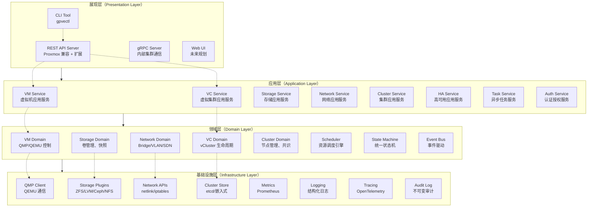
```mermaid
graph TB
    subgraph PL[展现层（Presentation Layer）]
        REST[REST API Server<br/>Proxmox 兼容 + 扩展]
        GRPC[gRPC Server<br/>内部集群通信]
        CLI[CLI Tool<br/>gpvectl]
        WEB[Web UI<br/>未来规划]
    end
    
    subgraph AL[应用层（Application Layer）]
        VMS[VM Service<br/>虚拟机应用服务]
        VCS[VC Service<br/>虚拟集群应用服务]
        STS[Storage Service<br/>存储应用服务]
        NTS[Network Service<br/>网络应用服务]
        CLS[Cluster Service<br/>集群应用服务]
        HAS[HA Service<br/>高可用应用服务]
        TKS[Task Service<br/>异步任务服务]
        AUS[Auth Service<br/>认证授权服务]
    end
    
    subgraph DL[领域层（Domain Layer）]
        VMD[VM Domain<br/>QMP/QEMU 控制]
        VCD[VC Domain<br/>vCluster 生命周期]
        STD[Storage Domain<br/>卷管理、快照]
        NTD[Network Domain<br/>Bridge/VLAN/SDN]
        CLD[Cluster Domain<br/>节点管理、共识]
        SCD[Scheduler<br/>资源调度引擎]
        SMD[State Machine<br/>统一状态机]
        EVT[Event Bus<br/>事件驱动]
    end
    
    subgraph IL[基础设施层（Infrastructure Layer）]
        QMP[QMP Client<br/>QEMU 通信]
        STP[Storage Plugins<br/>ZFS/LVM/Ceph/NFS]
        NTP[Network APIs<br/>netlink/iptables]
        CST[Cluster Store<br/>etcd/嵌入式]
        MET[Metrics<br/>Prometheus]
        LOG[Logging<br/>结构化日志]
        TRC[Tracing<br/>OpenTelemetry]
        AUD[Audit Log<br/>不可变审计]
    end
    
    PL --> AL
    AL --> DL
    DL --> IL
    
    %% 跨层依赖说明
    REST -.-> VMS
    REST -.-> VCS
    CLI -.-> REST
    VMS -.-> VMD
    VCS -.-> VCD
    VMD -.-> QMP
    VCD -.-> CST
    STD -.-> STP
    NTD -.-> NTP
```

### 4.2 层间交互规则

展现层与应用层之间采用 DTO（Data Transfer Object）进行数据传递，应用层与领域层之间通过领域接口进行交互，领域层与基础设施层之间通过仓储接口和适配器模式解耦：

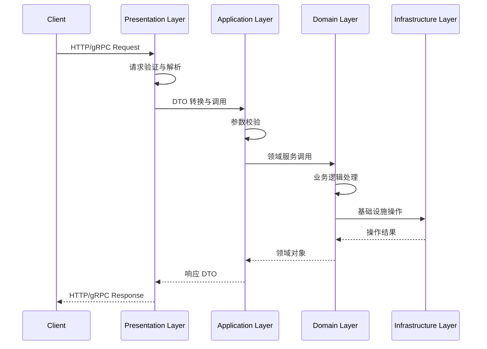
```mermaid
sequenceDiagram
    participant C as Client
    participant P as Presentation Layer
    participant A as Application Layer
    participant D as Domain Layer
    participant I as Infrastructure Layer
    
    C->>P: HTTP/gRPC Request
    P->>P: 请求验证与解析
    P->>A: DTO 转换与调用
    A->>A: 参数校验
    A->>D: 领域服务调用
    D->>D: 业务逻辑处理
    D->>I: 基础设施操作
    I-->>D: 操作结果
    D-->>A: 领域对象
    A-->>P: 响应 DTO
    P-->>C: HTTP/gRPC Response
```

### 4.3 模块边界定义

每个模块遵循高内聚、低耦合原则，通过接口定义明确边界：

| 模块        | 职责       | 对外接口                              | 依赖模块                                 |
| --------- | -------- | --------------------------------- | ------------------------------------ |
| VM        | 虚拟机全生命周期 | VMService, VMRepository           | Storage, Network, Scheduler          |
| VC        | 虚拟集群管理   | VCService, VCRepository           | Storage, Network, Scheduler, Cluster |
| Storage   | 存储资源抽象   | StorageService, VolumeRepository  | -                                    |
| Network   | 网络资源抽象   | NetworkService, NetworkRepository | -                                    |
| Cluster   | 集群协调     | ClusterService, NodeRepository    | -                                    |
| Scheduler | 资源调度     | SchedulerService                  | Cluster                              |
| HA        | 高可用管理    | HAService                         | Cluster, VM, VC                      |

---

## 5. 核心组件详细设计

### 5.1 QMP 客户端引擎

QMP（QEMU Machine Protocol）客户端是 VM 控制的核心组件，负责与 QEMU 进程进行 JSON-RPC 通信。

#### 5.1.1 设计目标

* 支持同步和异步命令执行
* 连接池管理，支持高并发场景
* 事件监听与回调机制
* 完善的错误处理和重连机制

#### 5.1.2 组件结构

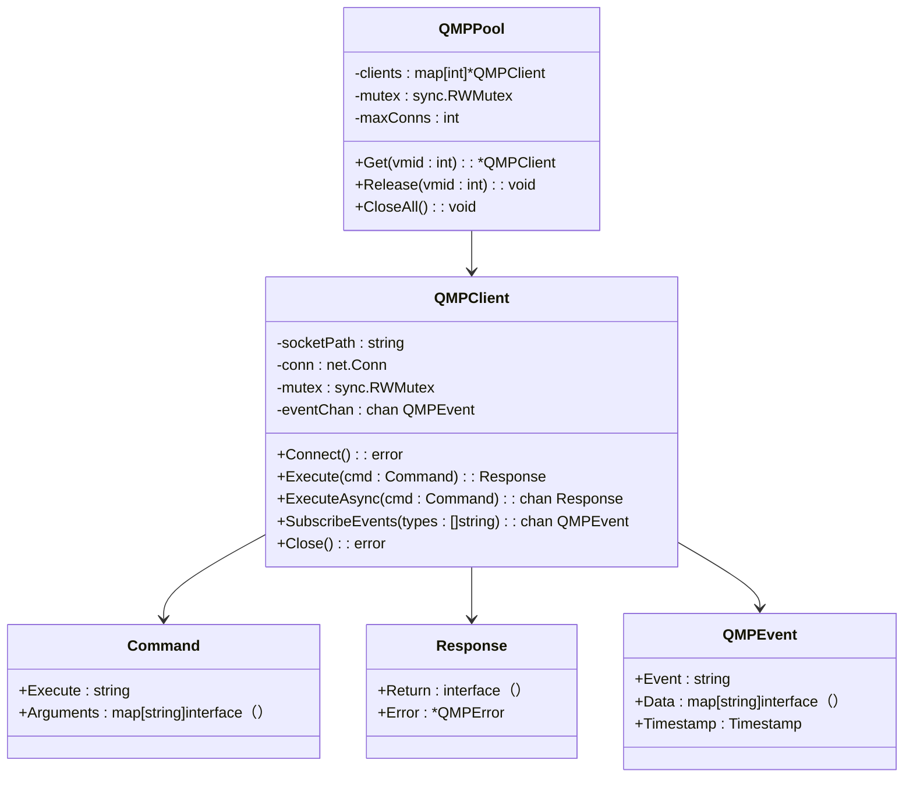
```mermaid
classDiagram
    class QMPClient {
        -socketPath : string
        -conn : net.Conn
        -mutex : sync.RWMutex
        -eventChan : chan QMPEvent
        +Connect() : error
        +Execute(cmd : Command) : Response
        +ExecuteAsync(cmd : Command) : chan Response
        +SubscribeEvents(types : []string) : chan QMPEvent
        +Close() : error
    }

    class QMPPool {
        -clients : map[int]*QMPClient
        -mutex : sync.RWMutex
        -maxConns : int
        +Get(vmid : int) : *QMPClient
        +Release(vmid : int) : void
        +CloseAll() : void
    }

    class Command {
        +Execute : string
        +Arguments : map[string]interface（）
    }

    class Response {
        +Return : interface（）
        +Error : *QMPError
    }

    class QMPEvent {
        +Event : string
        +Data : map[string]interface（）
        +Timestamp : Timestamp
    }

    QMPPool --> QMPClient
    QMPClient --> Command
    QMPClient --> Response
    QMPClient --> QMPEvent

```

#### 5.1.3 核心流程

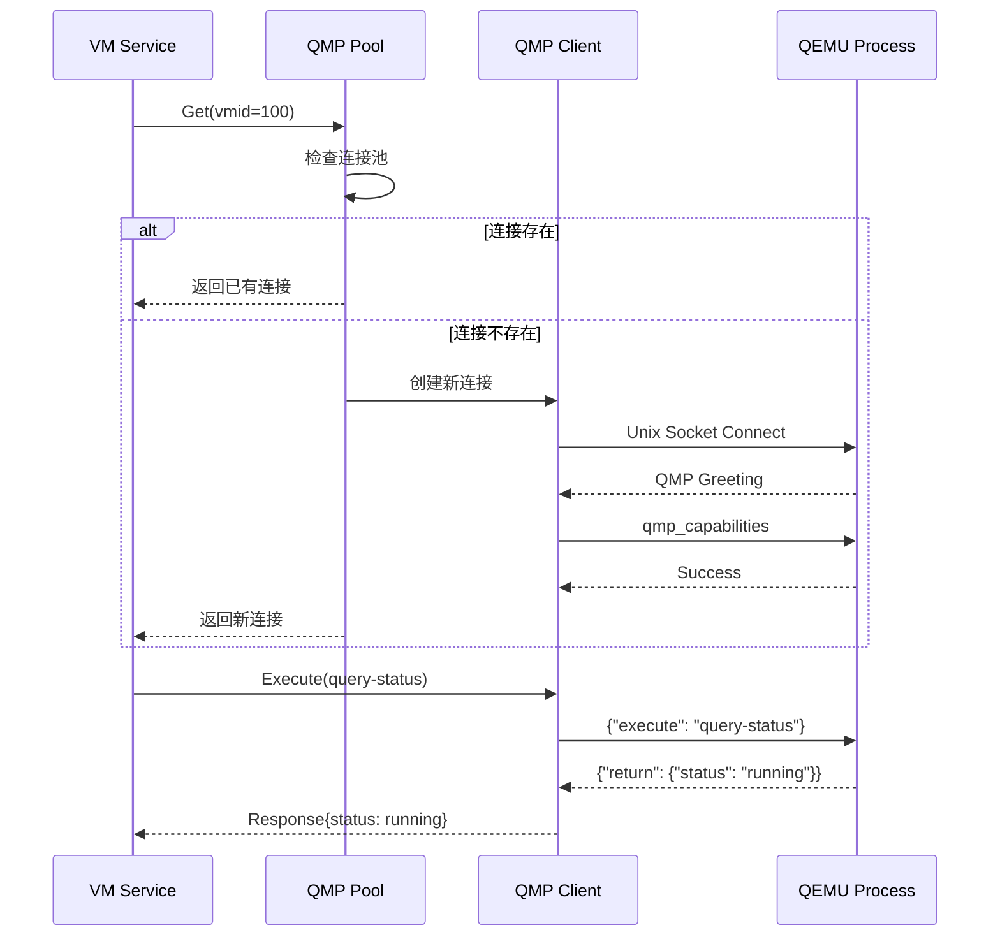
```mermaid
sequenceDiagram
    participant S as VM Service
    participant P as QMP Pool
    participant C as QMP Client
    participant Q as QEMU Process
    
    S->>P: Get(vmid=100)
    P->>P: 检查连接池
    alt 连接存在
        P-->>S: 返回已有连接
    else 连接不存在
        P->>C: 创建新连接
        C->>Q: Unix Socket Connect
        Q-->>C: QMP Greeting
        C->>Q: qmp_capabilities
        Q-->>C: Success
        P-->>S: 返回新连接
    end
    
    S->>C: Execute(query-status)
    C->>Q: {"execute": "query-status"}
    Q-->>C: {"return": {"status": "running"}}
    C-->>S: Response{status: running}
```

### 5.2 存储插件系统

存储抽象层是 go-proxmox 的核心基础设施之一，通过统一接口支持多种存储后端。

#### 5.2.1 插件接口定义

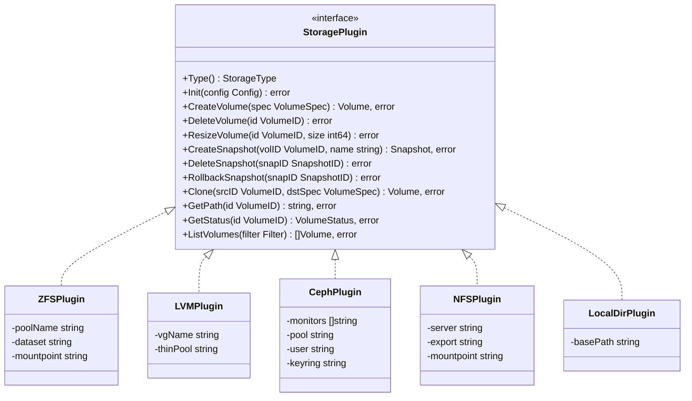
```mermaid
classDiagram
    class StoragePlugin {
        <<interface>>
        +Type() StorageType
        +Init(config Config) error
        +CreateVolume(spec VolumeSpec) Volume, error
        +DeleteVolume(id VolumeID) error
        +ResizeVolume(id VolumeID, size int64) error
        +CreateSnapshot(volID VolumeID, name string) Snapshot, error
        +DeleteSnapshot(snapID SnapshotID) error
        +RollbackSnapshot(snapID SnapshotID) error
        +Clone(srcID VolumeID, dstSpec VolumeSpec) Volume, error
        +GetPath(id VolumeID) string, error
        +GetStatus(id VolumeID) VolumeStatus, error
        +ListVolumes(filter Filter) []Volume, error
    }
    
    class ZFSPlugin {
        -poolName string
        -dataset string
        -mountpoint string
    }
    
    class LVMPlugin {
        -vgName string
        -thinPool string
    }
    
    class CephPlugin {
        -monitors []string
        -pool string
        -user string
        -keyring string
    }
    
    class NFSPlugin {
        -server string
        -export string
        -mountpoint string
    }
    
    class LocalDirPlugin {
        -basePath string
    }
    
    StoragePlugin <|.. ZFSPlugin
    StoragePlugin <|.. LVMPlugin
    StoragePlugin <|.. CephPlugin
    StoragePlugin <|.. NFSPlugin
    StoragePlugin <|.. LocalDirPlugin
```

#### 5.2.2 存储管理器

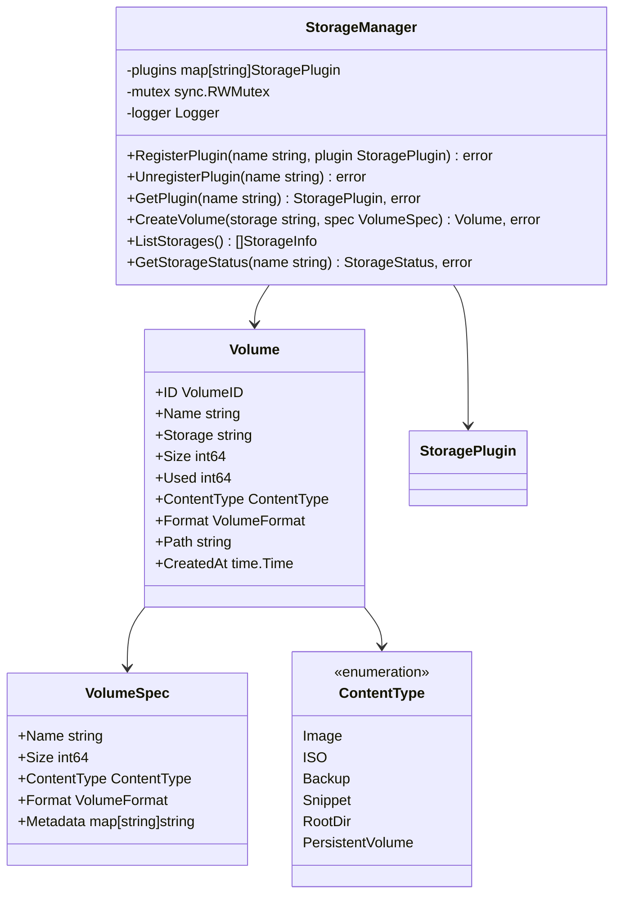
```mermaid
classDiagram
    class StorageManager {
        -plugins map[string]StoragePlugin
        -mutex sync.RWMutex
        -logger Logger
        +RegisterPlugin(name string, plugin StoragePlugin) error
        +UnregisterPlugin(name string) error
        +GetPlugin(name string) StoragePlugin, error
        +CreateVolume(storage string, spec VolumeSpec) Volume, error
        +ListStorages() []StorageInfo
        +GetStorageStatus(name string) StorageStatus, error
    }
    
    class VolumeSpec {
        +Name string
        +Size int64
        +ContentType ContentType
        +Format VolumeFormat
        +Metadata map[string]string
    }
    
    class Volume {
        +ID VolumeID
        +Name string
        +Storage string
        +Size int64
        +Used int64
        +ContentType ContentType
        +Format VolumeFormat
        +Path string
        +CreatedAt time.Time
    }
    
    class ContentType {
        <<enumeration>>
        Image
        ISO
        Backup
        Snippet
        RootDir
        PersistentVolume
    }
    
    StorageManager --> StoragePlugin
    StorageManager --> Volume
    Volume --> VolumeSpec
    Volume --> ContentType
```

#### 5.2.3 内容类型支持矩阵

| 内容类型             | 描述      | 支持的存储后端                    | 主要使用场景              |
| ---------------- | ------- | -------------------------- | ------------------- |
| Image            | VM 磁盘镜像 | ZFS, LVM, Ceph, NFS, Local | VM 根盘、数据盘           |
| ISO              | 安装镜像    | NFS, Local                 | 系统安装                |
| Backup           | 备份文件    | NFS, Local, Ceph           | VM/VC 备份            |
| Snippet          | 配置片段    | NFS, Local                 | Cloud-init, Hook 脚本 |
| RootDir          | 容器根目录   | ZFS, Local                 | 容器存储                |
| PersistentVolume | K8s PV  | ZFS, LVM, Ceph             | VC 持久化存储            |

### 5.3 VirtualCluster 控制器

VirtualCluster 控制器是实现 VC 作为一等公民资源的核心组件。

#### 5.3.1 控制面架构

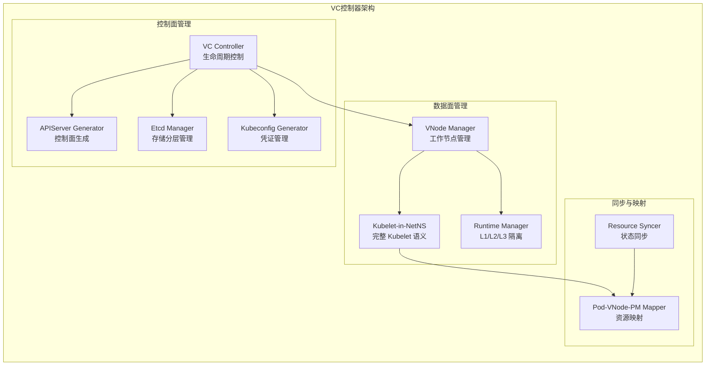
```mermaid
graph TB
    subgraph VC控制器架构
        direction TB
        
        subgraph CPA[控制面管理]
            VCCTL[VC Controller<br/>生命周期控制]
            APIGEN[APIServer Generator<br/>控制面生成]
            ETCDMGR[Etcd Manager<br/>存储分层管理]
            KUBEGEN[Kubeconfig Generator<br/>凭证管理]
        end
        
        subgraph DPA[数据面管理]
            VNODEMGR[VNode Manager<br/>工作节点管理]
            KUBELET[Kubelet-in-NetNS<br/>完整 Kubelet 语义]
            RUNTIME[Runtime Manager<br/>L1/L2/L3 隔离]
        end
        
        subgraph SYN[同步与映射]
            MAPPER[Pod-VNode-PM Mapper<br/>资源映射]
            SYNCER[Resource Syncer<br/>状态同步]
        end
    end
    
    VCCTL --> APIGEN
    VCCTL --> ETCDMGR
    VCCTL --> KUBEGEN
    VCCTL --> VNODEMGR
    VNODEMGR --> KUBELET
    VNODEMGR --> RUNTIME
    KUBELET --> MAPPER
    SYNCER --> MAPPER
```

#### 5.3.2 VNode 实现模式

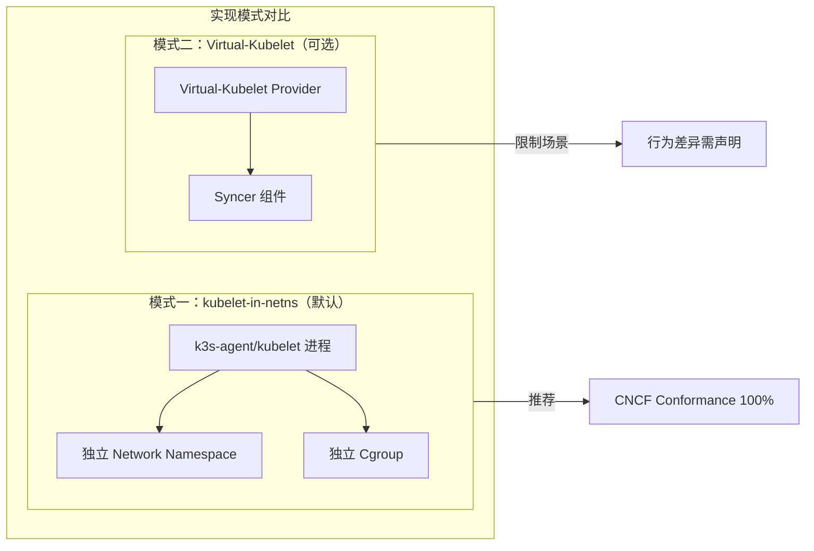
```mermaid
graph LR
    subgraph 实现模式对比
        direction TB
        
        subgraph M1[模式一：kubelet-in-netns（默认）]
            K1[k3s-agent/kubelet 进程]
            NS1[独立 Network Namespace]
            CG1[独立 Cgroup]
            K1 --> NS1
            K1 --> CG1
        end
        
        subgraph M2[模式二：Virtual-Kubelet（可选）]
            VK[Virtual-Kubelet Provider]
            SYNC[Syncer 组件]
            VK --> SYNC
        end
    end
    
    M1 -->|推荐| CONF[CNCF Conformance 100%]
    M2 -->|限制场景| LIMIT[行为差异需声明]
```

#### 5.3.3 运行时隔离级别

| 隔离级别 | 实现技术             | 安全边界             | 性能开销 | 适用场景        |
| ---- | ---------------- | ---------------- | ---- | ----------- |
| L1   | runc             | Namespace/Cgroup | 最低   | 可信租户、开发测试   |
| L2   | Kata Containers  | 轻量 VM 沙箱         | 中等   | 生产多租户       |
| L3   | QEMU/KVM microvm | 完整硬件虚拟化          | 较高   | 高安全要求、不可信代码 |

#### 5.3.4 VC 生命周期状态机

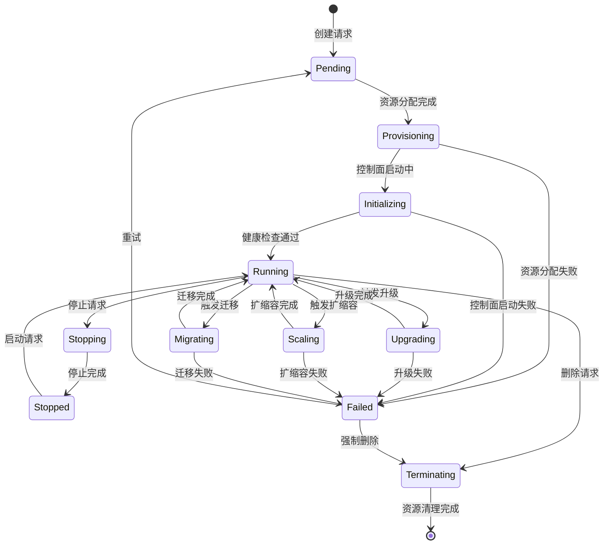
```mermaid
stateDiagram-v2
    [*] --> Pending: 创建请求
    Pending --> Provisioning: 资源分配完成
    Provisioning --> Initializing: 控制面启动中
    Initializing --> Running: 健康检查通过
    Running --> Upgrading: 触发升级
    Upgrading --> Running: 升级完成
    Running --> Scaling: 触发扩缩容
    Scaling --> Running: 扩缩容完成
    Running --> Migrating: 触发迁移
    Migrating --> Running: 迁移完成
    Running --> Stopping: 停止请求
    Stopping --> Stopped: 停止完成
    Stopped --> Running: 启动请求
    Running --> Terminating: 删除请求
    Terminating --> [*]: 资源清理完成
    
    Provisioning --> Failed: 资源分配失败
    Initializing --> Failed: 控制面启动失败
    Upgrading --> Failed: 升级失败
    Scaling --> Failed: 扩缩容失败
    Migrating --> Failed: 迁移失败
    Failed --> Pending: 重试
    Failed --> Terminating: 强制删除
```

### 5.4 调度引擎

调度引擎负责 VM 和 VC 资源的智能放置决策。

#### 5.4.1 调度器架构

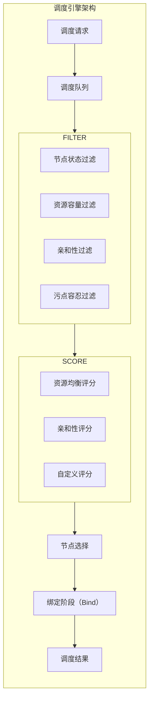
```mermaid
graph TB
    subgraph 调度引擎架构
        direction TB
        
        REQ[调度请求] --> QUEUE[调度队列]
        QUEUE --> FILTER[过滤阶段（Filter）]
        
        subgraph FILTER
            F1[节点状态过滤]
            F2[资源容量过滤]
            F3[亲和性过滤]
            F4[污点容忍过滤]
        end
        
        FILTER --> SCORE[打分阶段（Score）]
        
        subgraph SCORE
            S1[资源均衡评分]
            S2[亲和性评分]
            S3[自定义评分]
        end
        
        SCORE --> SELECT[节点选择]
        SELECT --> BIND[绑定阶段（Bind）]
        BIND --> RESULT[调度结果]
    end
```

#### 5.4.2 调度策略

| 策略名称              | 适用场景     | 核心算法        | 配置参数                 |
| ----------------- | -------- | ----------- | -------------------- |
| HA Spread         | 高可用部署    | 反亲和性最大化     | topologyKey, maxSkew |
| Utilization       | 资源最大化利用  | Bin Packing | utilizationThreshold |
| GPU Aware         | GPU 工作负载 | GPU 类型匹配    | gpuType, gpuCount    |
| Latency Optimized | 低延迟要求    | 网络拓扑感知      | maxHops              |

### 5.5 集群共识层

集群共识层负责多节点间的状态一致性和领导者选举。

#### 5.5.1 共识架构

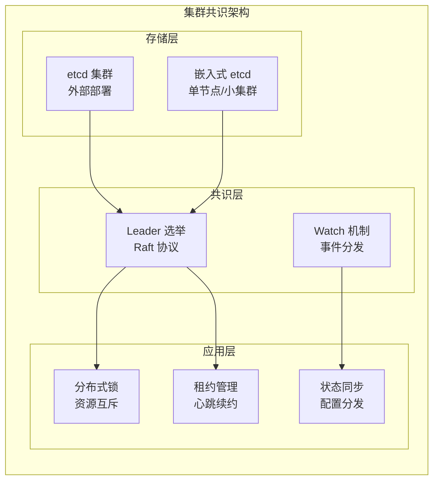
```mermaid
graph TB
    subgraph 集群共识架构
        direction TB
        
        subgraph 存储层
            ETCD[etcd 集群<br/>外部部署]
            EMBED[嵌入式 etcd<br/>单节点/小集群]
        end
        
        subgraph 共识层
            LEADER[Leader 选举<br/>Raft 协议]
            WATCH[Watch 机制<br/>事件分发]
        end
        
        subgraph 应用层
            LOCK[分布式锁<br/>资源互斥]
            LEASE[租约管理<br/>心跳续约]
            SYNC[状态同步<br/>配置分发]
        end
    end
    
    ETCD --> LEADER
    EMBED --> LEADER
    LEADER --> LOCK
    LEADER --> LEASE
    WATCH --> SYNC
```

---

## 6. 关键业务场景设计

### 6.1 VM 创建流程

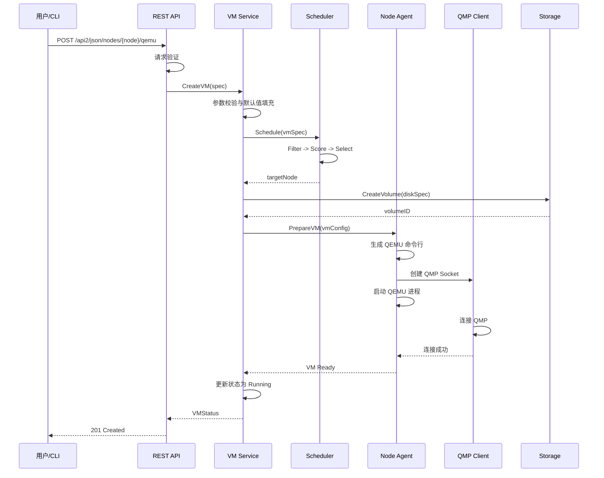
```mermaid
sequenceDiagram
    participant U as 用户/CLI
    participant R as REST API
    participant V as VM Service
    participant S as Scheduler
    participant N as Node Agent
    participant Q as QMP Client
    participant ST as Storage
    
    U->>R: POST /api2/json/nodes/{node}/qemu
    R->>R: 请求验证
    R->>V: CreateVM(spec)
    V->>V: 参数校验与默认值填充
    V->>S: Schedule(vmSpec)
    S->>S: Filter -> Score -> Select
    S-->>V: targetNode
    
    V->>ST: CreateVolume(diskSpec)
    ST-->>V: volumeID
    
    V->>N: PrepareVM(vmConfig)
    N->>N: 生成 QEMU 命令行
    N->>Q: 创建 QMP Socket
    N->>N: 启动 QEMU 进程
    Q->>Q: 连接 QMP
    Q-->>N: 连接成功
    N-->>V: VM Ready
    
    V->>V: 更新状态为 Running
    V-->>R: VMStatus
    R-->>U: 201 Created
```

### 6.2 VM 热迁移流程

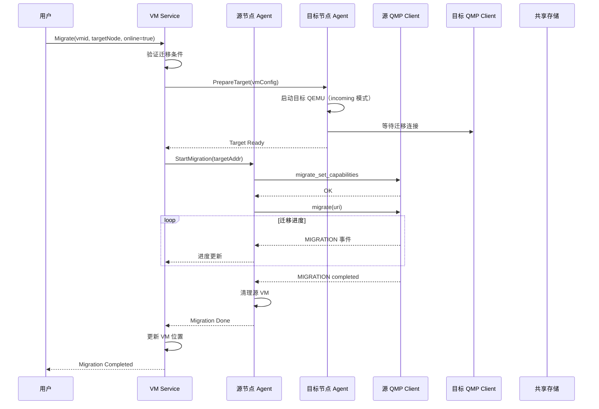
```mermaid
sequenceDiagram
    participant U as 用户
    participant V as VM Service
    participant SRC as 源节点 Agent
    participant DST as 目标节点 Agent
    participant Q1 as 源 QMP Client
    participant Q2 as 目标 QMP Client
    participant ST as 共享存储
    
    U->>V: Migrate(vmid, targetNode, online=true)
    V->>V: 验证迁移条件
    V->>DST: PrepareTarget(vmConfig)
    DST->>DST: 启动目标 QEMU（incoming 模式）
    DST->>Q2: 等待迁移连接
    DST-->>V: Target Ready
    
    V->>SRC: StartMigration(targetAddr)
    SRC->>Q1: migrate_set_capabilities
    Q1-->>SRC: OK
    SRC->>Q1: migrate(uri)
    
    loop 迁移进度
        Q1-->>SRC: MIGRATION 事件
        SRC-->>V: 进度更新
    end
    
    Q1-->>SRC: MIGRATION completed
    SRC->>SRC: 清理源 VM
    SRC-->>V: Migration Done
    
    V->>V: 更新 VM 位置
    V-->>U: Migration Completed
```

### 6.3 VirtualCluster 创建流程

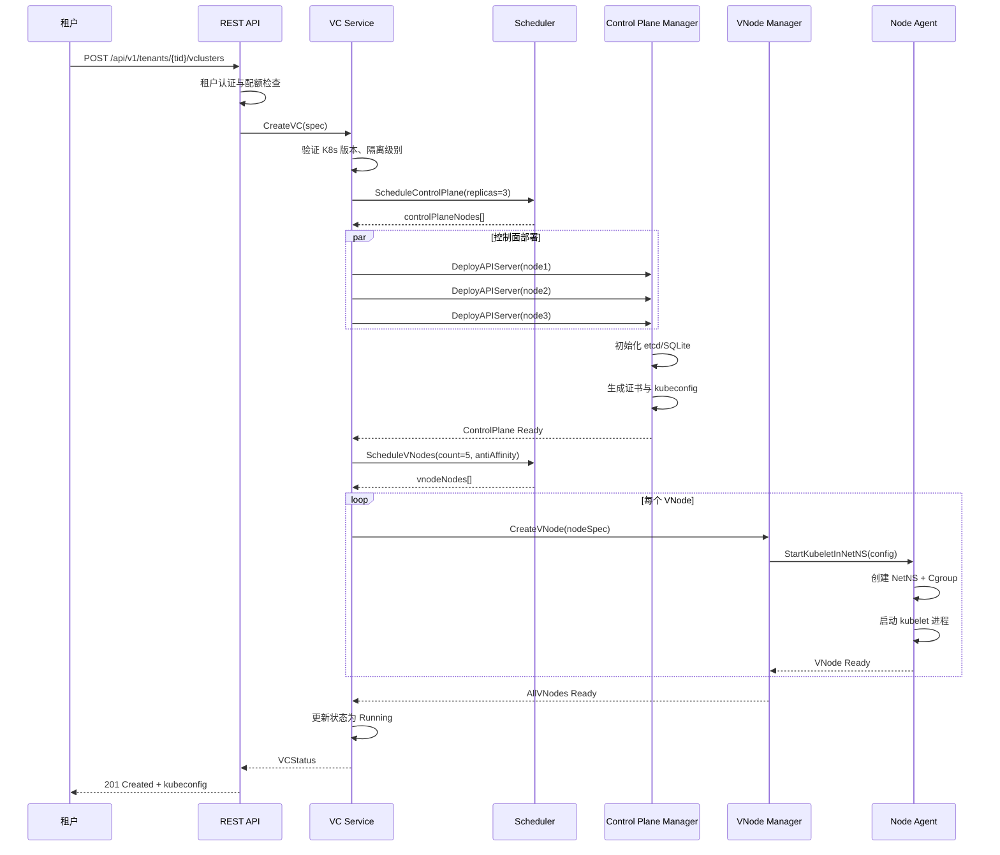
```mermaid
sequenceDiagram
    participant U as 租户
    participant R as REST API
    participant VC as VC Service
    participant S as Scheduler
    participant CP as Control Plane Manager
    participant VN as VNode Manager
    participant N as Node Agent
    
    U->>R: POST /api/v1/tenants/{tid}/vclusters
    R->>R: 租户认证与配额检查
    R->>VC: CreateVC(spec)
    
    VC->>VC: 验证 K8s 版本、隔离级别
    VC->>S: ScheduleControlPlane(replicas=3)
    S-->>VC: controlPlaneNodes[]
    
    par 控制面部署
        VC->>CP: DeployAPIServer(node1)
        VC->>CP: DeployAPIServer(node2)
        VC->>CP: DeployAPIServer(node3)
    end
    
    CP->>CP: 初始化 etcd/SQLite
    CP->>CP: 生成证书与 kubeconfig
    CP-->>VC: ControlPlane Ready
    
    VC->>S: ScheduleVNodes(count=5, antiAffinity)
    S-->>VC: vnodeNodes[]
    
    loop 每个 VNode
        VC->>VN: CreateVNode(nodeSpec)
        VN->>N: StartKubeletInNetNS(config)
        N->>N: 创建 NetNS + Cgroup
        N->>N: 启动 kubelet 进程
        N-->>VN: VNode Ready
    end
    
    VN-->>VC: AllVNodes Ready
    VC->>VC: 更新状态为 Running
    VC-->>R: VCStatus
    R-->>U: 201 Created + kubeconfig
```

### 6.4 资源映射查询流程

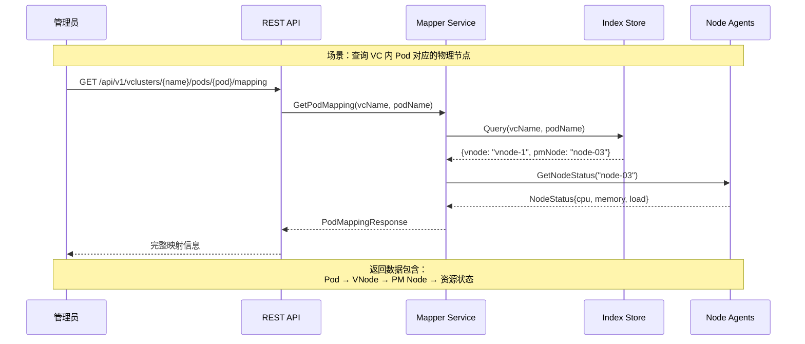
```mermaid
sequenceDiagram
    participant A as 管理员
    participant R as REST API
    participant M as Mapper Service
    participant I as Index Store
    participant N as Node Agents
    
    Note over A,N: 场景：查询 VC 内 Pod 对应的物理节点

    A->>R: GET /api/v1/vclusters/{name}/pods/{pod}/mapping
    R->>M: GetPodMapping(vcName, podName)
    M->>I: Query(vcName, podName)
    I-->>M: {vnode: "vnode-1", pmNode: "node-03"}
    M->>N: GetNodeStatus("node-03")
    N-->>M: NodeStatus{cpu, memory, load}
    M-->>R: PodMappingResponse
    R-->>A: 完整映射信息
    
    Note over A,N: 返回数据包含：<br/>Pod → VNode → PM Node → 资源状态
```

---

## 7. 数据模型与状态机

### 7.1 核心实体模型

#### 7.1.1 VirtualMachine 模型

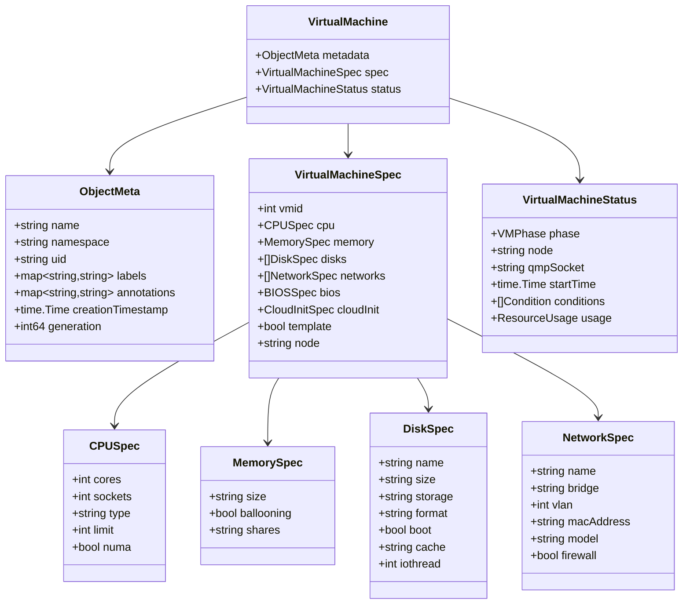
```mermaid
classDiagram
    class VirtualMachine {
        +ObjectMeta metadata
        +VirtualMachineSpec spec
        +VirtualMachineStatus status
    }
    
    class ObjectMeta {
        +string name
        +string namespace
        +string uid
        +map~string,string~ labels
        +map~string,string~ annotations
        +time.Time creationTimestamp
        +int64 generation
    }
    
    class VirtualMachineSpec {
        +int vmid
        +CPUSpec cpu
        +MemorySpec memory
        +[]DiskSpec disks
        +[]NetworkSpec networks
        +BIOSSpec bios
        +CloudInitSpec cloudInit
        +bool template
        +string node
    }
    
    class VirtualMachineStatus {
        +VMPhase phase
        +string node
        +string qmpSocket
        +time.Time startTime
        +[]Condition conditions
        +ResourceUsage usage
    }
    
    class CPUSpec {
        +int cores
        +int sockets
        +string type
        +int limit
        +bool numa
    }
    
    class MemorySpec {
        +string size
        +bool ballooning
        +string shares
    }
    
    class DiskSpec {
        +string name
        +string size
        +string storage
        +string format
        +bool boot
        +string cache
        +int iothread
    }
    
    class NetworkSpec {
        +string name
        +string bridge
        +int vlan
        +string macAddress
        +string model
        +bool firewall
    }
    
    VirtualMachine --> ObjectMeta
    VirtualMachine --> VirtualMachineSpec
    VirtualMachine --> VirtualMachineStatus
    VirtualMachineSpec --> CPUSpec
    VirtualMachineSpec --> MemorySpec
    VirtualMachineSpec --> DiskSpec
    VirtualMachineSpec --> NetworkSpec
```

#### 7.1.2 VirtualCluster 模型

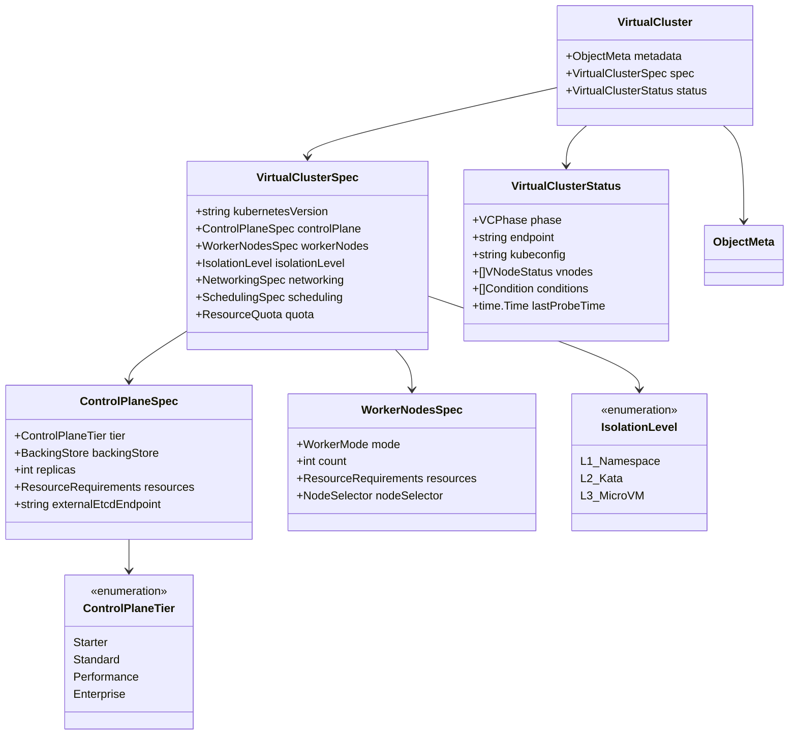
```mermaid
classDiagram
    class VirtualCluster {
        +ObjectMeta metadata
        +VirtualClusterSpec spec
        +VirtualClusterStatus status
    }
    
    class VirtualClusterSpec {
        +string kubernetesVersion
        +ControlPlaneSpec controlPlane
        +WorkerNodesSpec workerNodes
        +IsolationLevel isolationLevel
        +NetworkingSpec networking
        +SchedulingSpec scheduling
        +ResourceQuota quota
    }
    
    class ControlPlaneSpec {
        +ControlPlaneTier tier
        +BackingStore backingStore
        +int replicas
        +ResourceRequirements resources
        +string externalEtcdEndpoint
    }
    
    class WorkerNodesSpec {
        +WorkerMode mode
        +int count
        +ResourceRequirements resources
        +NodeSelector nodeSelector
    }
    
    class VirtualClusterStatus {
        +VCPhase phase
        +string endpoint
        +string kubeconfig
        +[]VNodeStatus vnodes
        +[]Condition conditions
        +time.Time lastProbeTime
    }
    
    class IsolationLevel {
        <<enumeration>>
        L1_Namespace
        L2_Kata
        L3_MicroVM
    }
    
    class ControlPlaneTier {
        <<enumeration>>
        Starter
        Standard
        Performance
        Enterprise
    }
    
    VirtualCluster --> ObjectMeta
    VirtualCluster --> VirtualClusterSpec
    VirtualCluster --> VirtualClusterStatus
    VirtualClusterSpec --> ControlPlaneSpec
    VirtualClusterSpec --> WorkerNodesSpec
    VirtualClusterSpec --> IsolationLevel
    ControlPlaneSpec --> ControlPlaneTier
```

#### 7.1.3 Node 模型

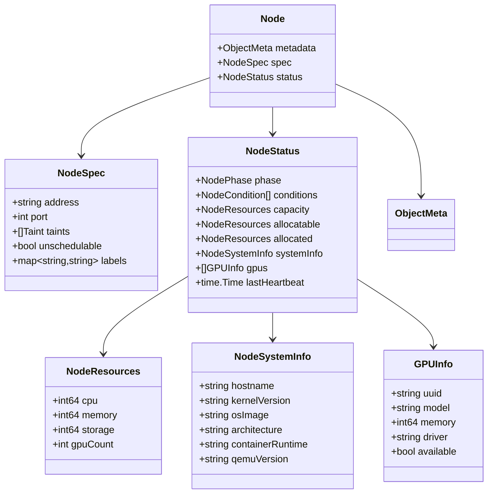
```mermaid
classDiagram
    class Node {
        +ObjectMeta metadata
        +NodeSpec spec
        +NodeStatus status
    }
    
    class NodeSpec {
        +string address
        +int port
        +[]Taint taints
        +bool unschedulable
        +map~string,string~ labels
    }
    
    class NodeStatus {
        +NodePhase phase
        +NodeCondition[] conditions
        +NodeResources capacity
        +NodeResources allocatable
        +NodeResources allocated
        +NodeSystemInfo systemInfo
        +[]GPUInfo gpus
        +time.Time lastHeartbeat
    }
    
    class NodeResources {
        +int64 cpu
        +int64 memory
        +int64 storage
        +int gpuCount
    }
    
    class NodeSystemInfo {
        +string hostname
        +string kernelVersion
        +string osImage
        +string architecture
        +string containerRuntime
        +string qemuVersion
    }
    
    class GPUInfo {
        +string uuid
        +string model
        +int64 memory
        +string driver
        +bool available
    }
    
    Node --> ObjectMeta
    Node --> NodeSpec
    Node --> NodeStatus
    NodeStatus --> NodeResources
    NodeStatus --> NodeSystemInfo
    NodeStatus --> GPUInfo
```

### 7.2 统一状态机设计

VM 和 VC 共享统一的状态机框架，确保生命周期管理的一致性：

#### 7.2.1 VM 状态机

```mermaid
stateDiagram-v2
    [*] --> Pending: 创建请求
    
    Pending --> Creating: 开始创建
    Creating --> Stopped: 创建完成（未自动启动）
    Creating --> Starting: 创建完成（自动启动）
    
    Stopped --> Starting: 启动命令
    Starting --> Running: QEMU 就绪
    
    Running --> Stopping: 停止命令
    Running --> Paused: 暂停命令
    Running --> Migrating: 迁移命令
    Running --> Snapshotting: 快照命令
    
    Stopping --> Stopped: 优雅关闭完成
    Stopping --> Stopped: 强制停止
    
    Paused --> Running: 恢复命令
    Paused --> Stopping: 停止命令
    
    Migrating --> Running: 迁移完成
    Migrating --> Failed: 迁移失败
    
    Snapshotting --> Running: 快照完成
    Snapshotting --> Failed: 快照失败
    
    Running --> Rebooting: 重启命令
    Rebooting --> Running: 重启完成
    
    Stopped --> Deleting: 删除命令
    Failed --> Deleting: 删除命令
    Deleting --> [*]: 资源清理完成
    
    Creating --> Failed: 创建失败
    Starting --> Failed: 启动失败
    Failed --> Stopped: 重置状态
```

#### 7.2.2 状态转换事件

| 当前状态     | 事件               | 目标状态             | 触发条件      | 副作用           |
| -------- | ---------------- | ---------------- | --------- | ------------- |
| Pending  | CreateStarted    | Creating         | 资源分配成功    | 分配 VMID       |
| Creating | CreateCompleted  | Stopped/Starting | QEMU 进程创建 | 生成 QMP Socket |
| Stopped  | StartRequested   | Starting         | 用户请求      | 启动 QEMU       |
| Starting | QMPReady         | Running          | QMP 连接成功  | 发送事件          |
| Running  | StopRequested    | Stopping         | 用户请求/故障   | 发送 ACPI 信号    |
| Running  | MigrateRequested | Migrating        | 用户请求/HA   | 开始内存复制        |

### 7.3 配额模型

配额模型确保多租户环境下的资源公平分配：

```mermaid
classDiagram
    class ResourceQuota {
        +ObjectMeta metadata
        +ResourceQuotaSpec spec
        +ResourceQuotaStatus status
    }
    
    class ResourceQuotaSpec {
        +ResourceList requests
        +ResourceList limits
        +OvercommitRatios overcommit
        +ScopeSelector scopeSelector
    }
    
    class ResourceList {
        +Quantity cpu
        +Quantity memory
        +Quantity storage
        +int vmCount
        +int vcCount
        +int gpuCount
    }
    
    class OvercommitRatios {
        +float64 cpu
        +float64 memory
    }
    
    class ResourceQuotaStatus {
        +ResourceList used
        +ResourceList hard
    }
    
    ResourceQuota --> ResourceQuotaSpec
    ResourceQuota --> ResourceQuotaStatus
    ResourceQuotaSpec --> ResourceList
    ResourceQuotaSpec --> OvercommitRatios
    ResourceQuotaStatus --> ResourceList
```

---

## 8. 部署架构

### 8.1 单节点部署

适用于开发测试和小规模场景：

```mermaid
graph TB
    subgraph 单节点部署
        direction TB
        
        CLIENT[客户端] --> SERVER[gpve-server<br/>API + 控制面]
        SERVER --> AGENT[gpve-agent<br/>本地执行]
        AGENT --> QEMU[QEMU 进程组]
        AGENT --> STORAGE[本地存储<br/>ZFS/LVM]
        
        subgraph 嵌入组件
            EMBED_ETCD[嵌入式 etcd]
            EMBED_DB[嵌入式 SQLite]
        end
        
        SERVER --> EMBED_ETCD
        SERVER --> EMBED_DB
    end
```

### 8.2 高可用集群部署

适用于生产环境：

```mermaid
graph TB
    subgraph 高可用集群部署
        direction TB
        
        LB[负载均衡器] --> SERVER1[gpve-server-1]
        LB --> SERVER2[gpve-server-2]
        LB --> SERVER3[gpve-server-3]
        
        subgraph 控制面
            SERVER1
            SERVER2
            SERVER3
        end
        
        subgraph etcd集群
            ETCD1[etcd-1]
            ETCD2[etcd-2]
            ETCD3[etcd-3]
        end
        
        SERVER1 --> ETCD1
        SERVER2 --> ETCD2
        SERVER3 --> ETCD3
        
        subgraph 计算节点
            direction LR
            subgraph Node1
                AGENT1[gpve-agent]
                QEMU1[QEMU VMs]
                VC1[VClusters]
            end
            subgraph Node2
                AGENT2[gpve-agent]
                QEMU2[QEMU VMs]
                VC2[VClusters]
            end
            subgraph NodeN
                AGENTN[gpve-agent]
                QEMUN[QEMU VMs]
                VCN[VClusters]
            end
        end
        
        SERVER1 --> AGENT1
        SERVER2 --> AGENT2
        SERVER3 --> AGENTN
        
        subgraph 共享存储
            CEPH[Ceph 集群]
        end
        
        AGENT1 --> CEPH
        AGENT2 --> CEPH
        AGENTN --> CEPH
    end
```

### 8.3 组件清单

| 组件         | 二进制         | 部署位置  | 职责                      |
| ---------- | ----------- | ----- | ----------------------- |
| API Server | gpve-server | 控制节点  | REST/gRPC API, 调度, 集群管理 |
| Node Agent | gpve-agent  | 每个节点  | VM/VC 执行, 监控上报          |
| CLI Tool   | gpvectl     | 管理工作站 | 命令行管理工具                 |
| etcd       | 外部/嵌入       | 控制节点  | 集群状态存储                  |

---

## 9. 可观测性设计

### 9.1 指标体系

```mermaid
graph TB
    subgraph 指标收集架构
        direction TB
        
        subgraph 指标源
            VM_METRICS[VM 指标<br/>CPU/Memory/Disk/Net]
            VC_METRICS[VC 指标<br/>Pod/Node/API 延迟]
            NODE_METRICS[节点指标<br/>系统资源]
            CTRL_METRICS[控制面指标<br/>API 请求/调度]
        end
        
        PROM[Prometheus]
        
        VM_METRICS --> PROM
        VC_METRICS --> PROM
        NODE_METRICS --> PROM
        CTRL_METRICS --> PROM
        
        PROM --> GRAFANA[Grafana 仪表板]
        PROM --> ALERT[AlertManager]
        ALERT --> NOTIFY[通知渠道]
    end
```

### 9.2 核心指标定义

| 指标名称                                 | 类型        | 标签                  | 描述         |
| ------------------------------------ | --------- | ------------------- | ---------- |
| gpve_vm_cpu_usage_ratio              | Gauge     | vmid, node          | VM CPU 使用率 |
| gpve_vm_memory_usage_bytes           | Gauge     | vmid, node          | VM 内存使用量   |
| gpve_vm_disk_read_bytes_total        | Counter   | vmid, disk          | 磁盘读取总量     |
| gpve_vm_network_tx_bytes_total       | Counter   | vmid, interface     | 网络发送总量     |
| gpve_vc_pod_count                    | Gauge     | vcluster, namespace | VC Pod 数量  |
| gpve_vc_api_request_duration_seconds | Histogram | vcluster, verb      | VC API 延迟  |
| gpve_node_allocatable_cpu_cores      | Gauge     | node                | 可分配 CPU 核数 |
| gpve_scheduler_attempts_total        | Counter   | result              | 调度尝试次数     |

### 9.3 日志规范

```mermaid
graph LR
    subgraph 结构化日志
        direction TB
        
        LOG[日志事件] --> FIELDS[标准字段]
        
        FIELDS --> TS[timestamp]
        FIELDS --> LVL[level]
        FIELDS --> MSG[message]
        FIELDS --> TRACE[trace_id]
        FIELDS --> SPAN[span_id]
        FIELDS --> COMP[component]
        FIELDS --> RES[resource]
    end
    
    subgraph 日志级别
        ERROR[ERROR: 需立即处理]
        WARN[WARN: 潜在问题]
        INFO[INFO: 重要事件]
        DEBUG[DEBUG: 调试信息]
    end
```

### 9.4 分布式追踪

```mermaid
sequenceDiagram
    participant C as Client
    participant A as API Server
    participant S as Scheduler
    participant N as Node Agent
    participant Q as QMP
    
    Note over C,Q: Trace ID: abc123
    
    C->>A: [Span-1] CreateVM Request
    A->>A: [Span-2] Validate & Parse
    A->>S: [Span-3] Schedule
    S->>S: [Span-4] Filter & Score
    S-->>A: [Span-3] Node Selected
    A->>N: [Span-5] Execute
    N->>Q: [Span-6] Start QEMU
    Q-->>N: [Span-6] Success
    N-->>A: [Span-5] VM Running
    A-->>C: [Span-1] Response
```

### 9.5 审计日志

审计日志记录所有安全相关操作，具有不可变性：

```go
// 审计日志条目结构
type AuditEntry struct {
    Timestamp   time.Time              `json:"timestamp"`
    RequestID   string                 `json:"requestId"`
    User        string                 `json:"user"`
    UserGroups  []string               `json:"userGroups"`
    Verb        string                 `json:"verb"`
    Resource    string                 `json:"resource"`
    Name        string                 `json:"name"`
    Namespace   string                 `json:"namespace"`
    SourceIP    string                 `json:"sourceIP"`
    UserAgent   string                 `json:"userAgent"`
    StatusCode  int                    `json:"statusCode"`
    Message     string                 `json:"message"`
    Extra       map[string]interface{} `json:"extra,omitempty"`
}
```

---

## 10. 安全架构

### 10.1 安全层次

```mermaid
graph TB
    subgraph 安全架构层次
        direction TB
        
        subgraph L1[传输层安全]
            TLS[mTLS 通信]
            CERT[证书管理]
        end
        
        subgraph L2[认证层]
            TOKEN[Token 认证]
            OIDC[OIDC 集成]
            CERT_AUTH[客户端证书]
        end
        
        subgraph L3[授权层]
            RBAC[RBAC 策略]
            TENANT[租户隔离]
            QUOTA[配额控制]
        end
        
        subgraph L4[数据层安全]
            ENCRYPT[数据加密]
            SEAL[密钥管理]
            AUDIT[审计日志]
        end
        
        subgraph L5[运行时安全]
            SECBOOT[安全启动]
            TPM[vTPM]
            ISOLATION[容器隔离]
        end
    end
    
    L1 --> L2 --> L3 --> L4 --> L5
```

### 10.2 RBAC 模型

```mermaid
classDiagram
    class User {
        +string name
        +string[] groups
    }
    
    class Role {
        +string name
        +Rule[] rules
    }
    
    class Rule {
        +string[] apiGroups
        +string[] resources
        +string[] verbs
        +string[] resourceNames
    }
    
    class RoleBinding {
        +string name
        +Subject[] subjects
        +RoleRef roleRef
    }
    
    class Subject {
        +string kind
        +string name
        +string namespace
    }
    
    User --> RoleBinding : 绑定
    RoleBinding --> Role : 引用
    Role --> Rule : 包含
    RoleBinding --> Subject : 主体
```

### 10.3 预定义角色

| 角色名称          | 权限范围      | 典型用户    |
| ------------- | --------- | ------- |
| cluster-admin | 所有资源完全控制  | 平台管理员   |
| tenant-admin  | 租户内所有资源   | 租户管理员   |
| vm-operator   | VM 生命周期操作 | 运维人员    |
| vc-operator   | VC 生命周期操作 | K8s 管理员 |
| viewer        | 只读访问      | 审计人员    |

---

## 11. 性能基准与优化策略

### 11.1 性能目标

| 场景        | 指标      | 目标值        | 测试方法 |
| --------- | ------- | ---------- | ---- |
| API 响应延迟  | p50/p99 | 10ms/100ms | 负载测试 |
| VM 创建时间   | 端到端     | <30s       | 计时测试 |
| VC 创建时间   | 含控制面    | <60s       | 计时测试 |
| 热迁移停机     | 最大停机    | <500ms     | 迁移测试 |
| 单节点 VM 密度 | 最大数量    | ≥500       | 密度测试 |
| 单节点 VC 密度 | 最大数量    | ≥1000      | 密度测试 |
| 调度吞吐量     | 每秒调度    | ≥100       | 压力测试 |

### 11.2 优化策略

```mermaid
graph TB
    subgraph 性能优化策略
        direction TB
        
        subgraph 控制面优化
            CACHE[本地缓存<br/>减少 etcd 访问]
            BATCH[批量操作<br/>减少网络往返]
            ASYNC[异步处理<br/>非阻塞 I/O]
            POOL[连接池<br/>复用连接]
        end
        
        subgraph 数据面优化
            HUGEPAGE[大页内存<br/>减少 TLB Miss]
            IOTHREAD[IO 线程<br/>并行磁盘 I/O]
            VHOST[vhost-net<br/>零拷贝网络]
            NUMA[NUMA 绑定<br/>内存本地性]
        end
        
        subgraph 存储优化
            THIN[精简置备<br/>按需分配]
            SNAP_LAZY[懒快照<br/>COW 语义]
            READ_CACHE[读缓存<br/>热点数据]
        end
    end
```

---

## 12. 项目目录结构

```
go-proxmox/
├── cmd/                           # 主程序入口
│   ├── gpve-server/              # 控制面服务器
│   │   └── main.go
│   ├── gpve-agent/               # 节点代理
│   │   └── main.go
│   └── gpvectl/                  # CLI 工具
│       └── main.go
│
├── pkg/                          # 公共库代码
│   ├── api/                      # API 定义
│   │   ├── v1/                   # v1 版本
│   │   │   ├── types.go          # 核心类型
│   │   │   ├── vm_types.go       # VM 类型
│   │   │   ├── vc_types.go       # VC 类型
│   │   │   ├── storage_types.go  # 存储类型
│   │   │   ├── network_types.go  # 网络类型
│   │   │   ├── node_types.go     # 节点类型
│   │   │   └── register.go       # 类型注册
│   │   └── validation/           # 验证逻辑
│   │
│   ├── client/                   # 客户端 SDK
│   │   ├── client.go
│   │   ├── vm_client.go
│   │   ├── vc_client.go
│   │   └── options.go
│   │
│   ├── errors/                   # 错误定义
│   │   ├── errors.go
│   │   └── codes.go
│   │
│   └── version/                  # 版本信息
│       └── version.go
│
├── internal/                     # 内部实现
│   ├── server/                   # 服务器实现
│   │   ├── server.go
│   │   ├── config.go
│   │   └── routes.go
│   │
│   ├── agent/                    # 代理实现
│   │   ├── agent.go
│   │   └── config.go
│   │
│   ├── services/                 # 应用服务层
│   │   ├── vm/
│   │   │   ├── service.go
│   │   │   └── service_test.go
│   │   ├── vc/
│   │   │   ├── service.go
│   │   │   └── service_test.go
│   │   ├── storage/
│   │   │   ├── service.go
│   │   │   └── service_test.go
│   │   ├── network/
│   │   │   ├── service.go
│   │   │   └── service_test.go
│   │   ├── cluster/
│   │   │   ├── service.go
│   │   │   └── service_test.go
│   │   ├── scheduler/
│   │   │   ├── service.go
│   │   │   ├── filter.go
│   │   │   ├── score.go
│   │   │   └── service_test.go
│   │   ├── ha/
│   │   │   ├── service.go
│   │   │   └── service_test.go
│   │   └── task/
│   │       ├── service.go
│   │       └── service_test.go
│   │
│   ├── domain/                   # 领域层
│   │   ├── vm/
│   │   │   ├── entity.go
│   │   │   ├── repository.go
│   │   │   ├── state_machine.go
│   │   │   └── events.go
│   │   ├── vc/
│   │   │   ├── entity.go
│   │   │   ├── repository.go
│   │   │   ├── state_machine.go
│   │   │   └── events.go
│   │   ├── storage/
│   │   │   ├── volume.go
│   │   │   ├── snapshot.go
│   │   │   └── repository.go
│   │   ├── network/
│   │   │   ├── bridge.go
│   │   │   ├── firewall.go
│   │   │   └── repository.go
│   │   └── cluster/
│   │       ├── node.go
│   │       ├── consensus.go
│   │       └── repository.go
│   │
│   ├── infrastructure/           # 基础设施层
│   │   ├── qmp/                  # QMP 客户端
│   │   │   ├── client.go
│   │   │   ├── commands.go
│   │   │   ├── events.go
│   │   │   ├── pool.go
│   │   │   └── client_test.go
│   │   ├── storage/              # 存储插件
│   │   │   ├── plugin.go
│   │   │   ├── manager.go
│   │   │   ├── zfs/
│   │   │   │   ├── plugin.go
│   │   │   │   └── plugin_test.go
│   │   │   ├── lvm/
│   │   │   │   ├── plugin.go
│   │   │   │   └── plugin_test.go
│   │   │   ├── ceph/
│   │   │   │   ├── plugin.go
│   │   │   │   └── plugin_test.go
│   │   │   ├── nfs/
│   │   │   │   ├── plugin.go
│   │   │   │   └── plugin_test.go
│   │   │   └── local/
│   │   │       ├── plugin.go
│   │   │       └── plugin_test.go
│   │   ├── network/              # 网络实现
│   │   │   ├── bridge.go
│   │   │   ├── vlan.go
│   │   │   ├── firewall.go
│   │   │   └── netlink.go
│   │   ├── cluster/              # 集群存储
│   │   │   ├── etcd.go
│   │   │   ├── embedded.go
│   │   │   └── store.go
│   │   ├── vcluster/             # vCluster 集成
│   │   │   ├── controller.go
│   │   │   ├── vnode.go
│   │   │   └── syncer.go
│   │   └── observability/        # 可观测性
│   │       ├── metrics.go
│   │       ├── logging.go
│   │       ├── tracing.go
│   │       └── audit.go
│   │
│   ├── handlers/                 # HTTP/gRPC 处理器
│   │   ├── rest/
│   │   │   ├── vm_handler.go
│   │   │   ├── vc_handler.go
│   │   │   ├── storage_handler.go
│   │   │   ├── network_handler.go
│   │   │   ├── node_handler.go
│   │   │   └── middleware.go
│   │   └── grpc/
│   │       ├── agent_service.go
│   │       └── cluster_service.go
│   │
│   └── util/                     # 工具函数
│       ├── retry/
│       ├── concurrent/
│       └── convert/
│
├── api/                          # API 规范文件
│   ├── openapi/
│   │   └── openapi.yaml
│   └── proto/
│       ├── agent.proto
│       └── cluster.proto
│
├── configs/                      # 配置文件模板
│   ├── gpve-server.yaml.example
│   ├── gpve-agent.yaml.example
│   └── prometheus/
│       └── rules.yaml
│
├── deployments/                  # 部署相关
│   ├── systemd/
│   │   ├── gpve-server.service
│   │   └── gpve-agent.service
│   ├── docker/
│   │   ├── Dockerfile.server
│   │   └── Dockerfile.agent
│   └── kubernetes/
│       ├── server-deployment.yaml
│       └── agent-daemonset.yaml
│
├── scripts/                      # 构建和工具脚本
│   ├── build.sh
│   ├── test.sh
│   ├── generate.sh
│   └── release.sh
│
├── test/                         # 测试相关
│   ├── e2e/                      # 端到端测试
│   │   ├── vm_test.go
│   │   ├── vc_test.go
│   │   └── migration_test.go
│   ├── integration/              # 集成测试
│   │   ├── storage_test.go
│   │   └── network_test.go
│   └── fixtures/                 # 测试数据
│       ├── vm_specs.yaml
│       └── vc_specs.yaml
│
├── docs/                         # 文档
│   ├── architecture.md           # 本文档
│   ├── apis.md                   # API 文档
│   ├── development.md            # 开发指南
│   ├── deployment.md             # 部署指南
│   └── diagrams/                 # 架构图源文件
│
├── tools/                        # 开发工具
│   └── codegen/                  # 代码生成器
│
├── go.mod
├── go.sum
├── Makefile
├── README.md
├── README-zh.md
├── LICENSE
├── CONTRIBUTING.md
└── .gitignore
```

---

## 13. 代码生成计划

基于上述架构设计，按优先级分阶段实现各组件。

### 13.1 Phase 0：项目基础（已完成）

| 任务     | 文件               | 状态 |
| ------ | ---------------- | -- |
| 项目脚手架  | go.mod, Makefile | ✅  |
| 核心类型定义 | pkg/api/v1/*.go  | ✅  |
| 错误定义   | pkg/errors/*.go  | ✅  |
| 版本信息   | pkg/version/*.go | ✅  |

### 13.2 Phase 1：存储抽象层

| 任务          | 文件                                              | 优先级 |
| ----------- | ----------------------------------------------- | --- |
| 存储插件接口      | internal/infrastructure/storage/plugin.go       | P0  |
| 存储管理器       | internal/infrastructure/storage/manager.go      | P0  |
| 本地目录插件      | internal/infrastructure/storage/local/plugin.go | P0  |
| ZFS 插件      | internal/infrastructure/storage/zfs/plugin.go   | P1  |
| LVM-thin 插件 | internal/infrastructure/storage/lvm/plugin.go   | P1  |
| NFS 插件      | internal/infrastructure/storage/nfs/plugin.go   | P2  |
| Ceph RBD 插件 | internal/infrastructure/storage/ceph/plugin.go  | P2  |
| 存储领域服务      | internal/domain/storage/*.go                    | P0  |
| 存储应用服务      | internal/services/storage/service.go            | P0  |

### 13.3 Phase 2：网络抽象层

| 任务              | 文件                                           | 优先级 |
| --------------- | -------------------------------------------- | --- |
| 网络接口定义          | internal/infrastructure/network/interface.go | P0  |
| Linux Bridge 实现 | internal/infrastructure/network/bridge.go    | P0  |
| VLAN 支持         | internal/infrastructure/network/vlan.go      | P1  |
| nftables 防火墙    | internal/infrastructure/network/firewall.go  | P1  |
| netlink 封装      | internal/infrastructure/network/netlink.go   | P0  |
| 网络领域服务          | internal/domain/network/*.go                 | P0  |
| 网络应用服务          | internal/services/network/service.go         | P0  |

### 13.4 Phase 3：VM 核心功能

| 任务              | 文件                                      | 优先级 |
| --------------- | --------------------------------------- | --- |
| QMP 客户端         | internal/infrastructure/qmp/client.go   | P0  |
| QMP 连接池         | internal/infrastructure/qmp/pool.go     | P0  |
| QMP 命令封装        | internal/infrastructure/qmp/commands.go | P0  |
| QMP 事件处理        | internal/infrastructure/qmp/events.go   | P1  |
| VM 状态机          | internal/domain/vm/state_machine.go     | P0  |
| VM 仓储接口         | internal/domain/vm/repository.go        | P0  |
| VM 应用服务         | internal/services/vm/service.go         | P0  |
| VM REST Handler | internal/handlers/rest/vm_handler.go    | P0  |

### 13.5 Phase 4：集群与调度

| 任务         | 文件                                          | 优先级 |
| ---------- | ------------------------------------------- | --- |
| etcd 客户端封装 | internal/infrastructure/cluster/etcd.go     | P0  |
| 嵌入式 etcd   | internal/infrastructure/cluster/embedded.go | P1  |
| 节点管理       | internal/domain/cluster/node.go             | P0  |
| 调度过滤器      | internal/services/scheduler/filter.go       | P0  |
| 调度评分器      | internal/services/scheduler/score.go        | P0  |
| 调度服务       | internal/services/scheduler/service.go      | P0  |
| 集群应用服务     | internal/services/cluster/service.go        | P0  |

### 13.6 Phase 5：VirtualCluster

| 任务              | 文件                                             | 优先级 |
| --------------- | ---------------------------------------------- | --- |
| VC 控制器          | internal/infrastructure/vcluster/controller.go | P0  |
| VNode 管理器       | internal/infrastructure/vcluster/vnode.go      | P0  |
| 资源同步器           | internal/infrastructure/vcluster/syncer.go     | P1  |
| VC 状态机          | internal/domain/vc/state_machine.go            | P0  |
| VC 仓储接口         | internal/domain/vc/repository.go               | P0  |
| VC 应用服务         | internal/services/vc/service.go                | P0  |
| VC REST Handler | internal/handlers/rest/vc_handler.go           | P0  |

### 13.7 Phase 6：生产加固

| 任务      | 文件                                               | 优先级 |
| ------- | ------------------------------------------------ | --- |
| HA 服务   | internal/services/ha/service.go                  | P0  |
| 热迁移     | internal/services/vm/migrate.go                  | P0  |
| 指标导出    | internal/infrastructure/observability/metrics.go | P0  |
| 结构化日志   | internal/infrastructure/observability/logging.go | P0  |
| 分布式追踪   | internal/infrastructure/observability/tracing.go | P1  |
| 审计日志    | internal/infrastructure/observability/audit.go   | P0  |
| RBAC 实现 | internal/services/auth/rbac.go                   | P0  |

---

## 14. 参考资料

### 14.1 技术规范

1. **QEMU Machine Protocol (QMP)**

   * 官方文档：[https://www.qemu.org/docs/master/interop/qmp-spec.html](https://www.qemu.org/docs/master/interop/qmp-spec.html)
   * 命令参考：[https://www.qemu.org/docs/master/interop/qmp-ref.html](https://www.qemu.org/docs/master/interop/qmp-ref.html)

2. **vCluster**

   * 架构文档：[https://www.vcluster.com/docs/architecture/basics](https://www.vcluster.com/docs/architecture/basics)
   * API 参考：[https://www.vcluster.com/docs/reference/](https://www.vcluster.com/docs/reference/)

3. **Proxmox VE API**

   * REST API：[https://pve.proxmox.com/pve-docs/api-viewer/](https://pve.proxmox.com/pve-docs/api-viewer/)

4. **Kubernetes API Conventions**

   * 设计规范：[https://github.com/kubernetes/community/blob/master/contributors/devel/sig-architecture/api-conventions.md](https://github.com/kubernetes/community/blob/master/contributors/devel/sig-architecture/api-conventions.md)

### 14.2 竞品分析

| 竞品                 | 优势             | 劣势               | go-proxmox 对标策略 |
| ------------------ | -------------- | ---------------- | --------------- |
| **Proxmox VE**     | 成熟稳定、社区活跃      | Perl 技术栈老旧、扩展困难  | 兼容 API，现代化实现    |
| **SmartX**         | 超融合一体化、企业支持    | 闭源、价格高           | 开源替代，功能对等       |
| **Harvester**      | K8s 原生、CNCF 项目 | 依赖 kubevirt、复杂度高 | 直接 QEMU，简化架构    |
| **VMware vSphere** | 企业标准、生态完善      | 许可证昂贵、厂商锁定       | 开源开放、成本优势       |

### 14.3 设计参考

1. **领域驱动设计（DDD）**

   * Eric Evans, "Domain-Driven Design: Tackling Complexity in the Heart of Software"

2. **清洁架构**

   * Robert C. Martin, "Clean Architecture: A Craftsman's Guide to Software Structure and Design"

3. **Go 项目布局**

   * [https://github.com/golang-standards/project-layout](https://github.com/golang-standards/project-layout)

4. **Kubernetes 控制器模式**

   * [https://kubernetes.io/docs/concepts/architecture/controller/](https://kubernetes.io/docs/concepts/architecture/controller/)

---

## 附录 A：术语表

| 术语   | 英文                    | 定义                              |
| ---- | --------------------- | ------------------------------- |
| 虚拟机  | Virtual Machine (VM)  | 通过 QEMU/KVM 运行的完整操作系统实例         |
| 虚拟集群 | Virtual Cluster (VC)  | 在共享 Kubernetes 集群上运行的独立 K8s 控制面 |
| 物理节点 | Physical Machine (PM) | 运行 gpve-agent 的物理服务器            |
| 虚拟节点 | Virtual Node (VNode)  | VC 内的工作节点，由 kubelet-in-netns 实现 |
| 控制面  | Control Plane         | 管理集群状态的组件集合                     |
| 数据面  | Data Plane            | 执行实际工作负载的组件                     |
| QMP  | QEMU Machine Protocol | QEMU 的 JSON-RPC 控制协议            |
| 热迁移  | Live Migration        | VM 在不停机情况下从一个节点移动到另一个节点         |
| 隔离级别 | Isolation Level       | 工作负载之间的安全边界强度                   |

---

## 附录 B：配置参考

### B.1 gpve-server 配置示例

```yaml
# /etc/gpve/server.yaml
apiVersion: gpve.io/v1
kind: ServerConfiguration

server:
  address: "0.0.0.0"
  port: 8443
  tlsCertFile: "/etc/gpve/pki/server.crt"
  tlsKeyFile: "/etc/gpve/pki/server.key"

cluster:
  name: "production-cluster"
  etcd:
    endpoints:
      - "https://etcd-1:2379"
      - "https://etcd-2:2379"
      - "https://etcd-3:2379"
    certFile: "/etc/gpve/pki/etcd-client.crt"
    keyFile: "/etc/gpve/pki/etcd-client.key"
    caFile: "/etc/gpve/pki/etcd-ca.crt"

scheduler:
  defaultStrategy: "ha-spread"
  plugins:
    filter:
      - "NodeResourcesFit"
      - "NodeAffinity"
      - "TaintToleration"
    score:
      - "BalancedAllocation"
      - "LeastAllocated"

storage:
  defaults:
    vmDisk: "local-zfs"
    iso: "local"
    backup: "nfs-backup"

logging:
  level: "info"
  format: "json"
  output: "/var/log/gpve/server.log"

metrics:
  enabled: true
  address: ":9090"
  path: "/metrics"
```

### B.2 gpve-agent 配置示例

```yaml
# /etc/gpve/agent.yaml
apiVersion: gpve.io/v1
kind: AgentConfiguration

agent:
  nodeName: "node-01"
  address: "192.168.1.101"
  port: 8444

server:
  endpoint: "https://gpve-server:8443"
  token: "${GPVE_BOOTSTRAP_TOKEN}"
  caFile: "/etc/gpve/pki/ca.crt"

qemu:
  binaryPath: "/usr/bin/qemu-system-x86_64"
  defaultMachine: "q35"
  defaultCPU: "host"

storage:
  plugins:
    - name: "local-zfs"
      type: "zfs"
      config:
        pool: "rpool/gpve"
        mountpoint: "/var/lib/gpve/images"
    - name: "local-lvm"
      type: "lvm"
      config:
        vgName: "gpve-vg"
        thinPool: "data"

network:
  defaultBridge: "vmbr0"
  bridges:
    - name: "vmbr0"
      address: "192.168.1.1/24"
      ports:
        - "eth0"
    - name: "vmbr1"
      vlanAware: true
      ports:
        - "eth1"

resources:
  reservedCPU: "1"
  reservedMemory: "2Gi"
  overcommit:
    cpu: 4.0
    memory: 1.5

logging:
  level: "info"
  format: "json"
  output: "/var/log/gpve/agent.log"
```

---

## 附录 C：API 快速参考

### C.1 VM 操作 API

```
# 列出 VM
GET /api2/json/nodes/{node}/qemu

# 创建 VM
POST /api2/json/nodes/{node}/qemu
Content-Type: application/json
{
  "vmid": 100,
  "name": "my-vm",
  "memory": 8192,
  "cores": 4,
  "sockets": 1,
  "scsi0": "local-zfs:100,size=100G",
  "net0": "virtio,bridge=vmbr0"
}

# 获取 VM 状态
GET /api2/json/nodes/{node}/qemu/{vmid}/status/current

# 启动 VM
POST /api2/json/nodes/{node}/qemu/{vmid}/status/start

# 停止 VM
POST /api2/json/nodes/{node}/qemu/{vmid}/status/stop

# 迁移 VM
POST /api2/json/nodes/{node}/qemu/{vmid}/migrate
{
  "target": "node-02",
  "online": true
}

# 创建快照
POST /api2/json/nodes/{node}/qemu/{vmid}/snapshot
{
  "snapname": "backup-20260101"
}

# 删除 VM
DELETE /api2/json/nodes/{node}/qemu/{vmid}
```

### C.2 VirtualCluster API（扩展）

```
# 列出 VirtualCluster
GET /api/v1/tenants/{tenantId}/vclusters

# 创建 VirtualCluster
POST /api/v1/tenants/{tenantId}/vclusters
Content-Type: application/json
{
  "name": "dev-cluster",
  "kubernetesVersion": "1.30",
  "controlPlane": {
    "tier": "standard",
    "backingStore": "sqlite",
    "replicas": 1
  },
  "workerNodes": {
    "mode": "private",
    "count": 3
  },
  "isolationLevel": "L2"
}

# 获取 VirtualCluster 详情
GET /api/v1/tenants/{tenantId}/vclusters/{name}

# 获取 kubeconfig
GET /api/v1/tenants/{tenantId}/vclusters/{name}/kubeconfig

# 升级 VirtualCluster
POST /api/v1/tenants/{tenantId}/vclusters/{name}/upgrade
{
  "targetVersion": "1.31"
}

# 扩缩容
PATCH /api/v1/tenants/{tenantId}/vclusters/{name}/scale
{
  "workerNodes": {
    "count": 5
  }
}

# 删除 VirtualCluster
DELETE /api/v1/tenants/{tenantId}/vclusters/{name}
```

---

## 文档修订历史

| 版本    | 日期      | 作者              | 修订内容 |
| ----- | ------- | --------------- | ---- |
| 1.0.0 | 2026-01 | go-proxmox Team | 初始版本 |

---

<div align="center">
  <sub>本文档持续更新中，欢迎贡献改进建议</sub>
</div>