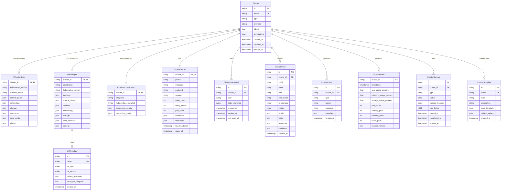

````markdown
# vCluster & Kubernetes Manager Design

> **Document Version**: 1.0.0
> **Last Updated**: 2024-01-15
> **Status**: Draft
> **Authors**: go-proxmox Architecture Team

---

## Table of Contents

1. [Executive Summary](#executive-summary)
2. [Design Goals & Principles](#design-goals--principles)
3. [Architecture Overview](#architecture-overview)
4. [vCluster Subsystem](#vcluster-subsystem)
5. [K8s-on-VM Subsystem](#k8s-on-vm-subsystem)
6. [Unified Cluster Management](#unified-cluster-management)
7. [Data Model](#data-model)
8. [API Design](#api-design)
9. [Lifecycle Management](#lifecycle-management)
10. [Networking](#networking)
11. [Storage Integration](#storage-integration)
12. [Security](#security)
13. [Observability](#observability)
14. [High Availability](#high-availability)
15. [Implementation Plan](#implementation-plan)

---

## Executive Summary

### Purpose

This document provides a comprehensive design for managing Kubernetes clusters within go-proxmox, supporting three distinct deployment models:

1. **vCluster**: Lightweight virtual Kubernetes clusters running as first-class guests
2. **K8s-on-VM**: Full Kubernetes clusters deployed on virtual machines
3. **External Clusters**: Existing Kubernetes clusters imported for unified management

### Key Value Propositions

```mermaid
mindmap
  root((Kubernetes<br/>Management))
    vCluster
      Lightweight
      Fast provisioning
      Resource efficient
      Multi-tenancy
      Development/Testing
    K8s-on-VM
      Production grade
      Full isolation
      Custom configurations
      Bare-metal like
      Enterprise workloads
    Unified Management
      Single pane of glass
      Consistent APIs
      Cross-cluster operations
      Centralized monitoring
      Policy enforcement
````

### Scope

| In Scope                      | Out of Scope                                      |
| ----------------------------- | ------------------------------------------------- |
| vCluster lifecycle management | Application deployment (GitOps tools handle this) |
| K8s-on-VM provisioning        | Service mesh implementation                       |
| Unified cluster registry      | Detailed CNI implementation                       |
| Kubeconfig management         | Specific workload management                      |
| Cross-cluster visibility      | Multi-cloud federation                            |
| Basic cluster operations      | Advanced Kubernetes operators                     |

---

## Design Goals & Principles

### Goals

```mermaid
graph LR
    subgraph "Primary Goals"
        G1[Simplicity]
        G2[Flexibility]
        G3[Consistency]
        G4[Security]
        G5[Scalability]
    end
    
    subgraph "Outcomes"
        O1[Easy cluster provisioning]
        O2[Multiple deployment options]
        O3[Unified management experience]
        O4[Zero-trust security model]
        O5[1000+ clusters support]
    end
    
    G1 --> O1
    G2 --> O2
    G3 --> O3
    G4 --> O4
    G5 --> O5
```

### Design Principles

1. **Kubernetes-Native**: Leverage Kubernetes patterns and APIs where possible
2. **Infrastructure Agnostic**: Abstract underlying infrastructure details
3. **Declarative First**: Support declarative configuration with imperative fallback
4. **Secure by Default**: Zero-trust networking, encrypted communications
5. **Observable**: Built-in metrics, logging, and tracing
6. **Extensible**: Plugin architecture for custom integrations

---

## Architecture Overview

### High-Level Architecture


### Component Interaction Flow


---

## vCluster Subsystem

### Overview

vCluster provides lightweight virtual Kubernetes clusters that run as isolated workloads within go-proxmox. Unlike traditional K8s-on-VM, vClusters share the underlying infrastructure more efficiently while maintaining logical isolation.

### vCluster Architecture


### vCluster Isolation Modes


### vCluster Component Details

#### Control Plane Components


#### vCluster Configuration Structure

```go
// VClusterSpec defines the desired state of a vCluster
type VClusterSpec struct {
    // Metadata
    Name        string            `json:"name"`
    Namespace   string            `json:"namespace,omitempty"`
    Labels      map[string]string `json:"labels,omitempty"`
    Annotations map[string]string `json:"annotations,omitempty"`
    
    // Kubernetes Version
    KubernetesVersion string `json:"kubernetesVersion"` // e.g., "1.29.0"
    
    // Isolation Mode
    IsolationMode IsolationMode `json:"isolationMode"` // namespace, container, microvm, vm
    
    // Control Plane Configuration
    ControlPlane ControlPlaneConfig `json:"controlPlane"`
    
    // Networking
    Networking VClusterNetworking `json:"networking"`
    
    // Storage
    Storage VClusterStorage `json:"storage"`
    
    // Resource Limits
    Resources ResourceRequirements `json:"resources"`
    
    // High Availability
    HA HAConfig `json:"ha,omitempty"`
    
    // Sync Configuration
    Sync SyncConfig `json:"sync"`
    
    // Plugins
    Plugins []PluginConfig `json:"plugins,omitempty"`
}

type ControlPlaneConfig struct {
    // Replicas for HA
    Replicas int32 `json:"replicas"`
    
    // API Server configuration
    APIServer APIServerConfig `json:"apiServer"`
    
    // Controller Manager configuration
    ControllerManager ControllerManagerConfig `json:"controllerManager"`
    
    // Scheduler configuration
    Scheduler SchedulerConfig `json:"scheduler"`
    
    // etcd configuration
    Etcd EtcdConfig `json:"etcd"`
    
    // CoreDNS configuration
    CoreDNS CoreDNSConfig `json:"coreDNS"`
}

type IsolationMode string

const (
    IsolationNamespace IsolationMode = "namespace"
    IsolationContainer IsolationMode = "container"
    IsolationMicroVM   IsolationMode = "microvm"
    IsolationVM        IsolationMode = "vm"
)

type VClusterNetworking struct {
    // Service CIDR
    ServiceCIDR string `json:"serviceCIDR"` // e.g., "10.96.0.0/12"
    
    // Pod CIDR
    PodCIDR string `json:"podCIDR"` // e.g., "10.244.0.0/16"
    
    // DNS Domain
    DNSDomain string `json:"dnsDomain"` // e.g., "cluster.local"
    
    // Expose method
    Expose ExposeConfig `json:"expose"`
}

type ExposeConfig struct {
    // Type: LoadBalancer, NodePort, Ingress
    Type string `json:"type"`
    
    // NodePort specific
    NodePort *int32 `json:"nodePort,omitempty"`
    
    // LoadBalancer specific
    LoadBalancerIP string `json:"loadBalancerIP,omitempty"`
    
    // Ingress specific
    Ingress *IngressConfig `json:"ingress,omitempty"`
}

type SyncConfig struct {
    // Resources to sync from vCluster to host
    ToHost SyncToHost `json:"toHost"`
    
    // Resources to sync from host to vCluster
    FromHost SyncFromHost `json:"fromHost"`
}

type SyncToHost struct {
    Pods            SyncRule `json:"pods"`
    Services        SyncRule `json:"services"`
    ConfigMaps      SyncRule `json:"configMaps"`
    Secrets         SyncRule `json:"secrets"`
    Endpoints       SyncRule `json:"endpoints"`
    PersistentVolumeClaims SyncRule `json:"persistentVolumeClaims"`
    Ingresses       SyncRule `json:"ingresses"`
    NetworkPolicies SyncRule `json:"networkPolicies"`
}

type SyncFromHost struct {
    Nodes            SyncRule `json:"nodes"`
    StorageClasses   SyncRule `json:"storageClasses"`
    IngressClasses   SyncRule `json:"ingressClasses"`
    PriorityClasses  SyncRule `json:"priorityClasses"`
}

type SyncRule struct {
    Enabled bool `json:"enabled"`
    // Selector for filtering resources
    Selector *metav1.LabelSelector `json:"selector,omitempty"`
}
```

### vCluster Lifecycle State Machine


### vCluster Manager Implementation

```go
// VClusterManager handles vCluster lifecycle
type VClusterManager struct {
    // Dependencies
    store           store.Store
    networkManager  *network.Manager
    storageManager  *storage.Manager
    templateEngine  *template.Engine
    metricsRecorder *metrics.Recorder
    
    // Runtime
    controller      *VClusterController
    reconciler      *VClusterReconciler
    
    // Configuration
    config          VClusterManagerConfig
    
    // State
    mu              sync.RWMutex
    clusters        map[string]*VCluster
}

// VClusterManagerConfig configuration for the manager
type VClusterManagerConfig struct {
    // Default Kubernetes version
    DefaultK8sVersion string
    
    // Default isolation mode
    DefaultIsolationMode IsolationMode
    
    // Image registry
    ImageRegistry string
    
    // Resource defaults
    DefaultResources ResourceRequirements
    
    // Reconciliation interval
    ReconcileInterval time.Duration
    
    // Health check interval
    HealthCheckInterval time.Duration
}

// Create creates a new vCluster
func (m *VClusterManager) Create(ctx context.Context, spec VClusterSpec) (*VCluster, error) {
    m.mu.Lock()
    defer m.mu.Unlock()
    
    // Validate spec
    if err := m.validateSpec(&spec); err != nil {
        return nil, fmt.Errorf("invalid spec: %w", err)
    }
    
    // Generate cluster ID
    clusterID := m.generateClusterID(spec.Name)
    
    // Apply defaults
    m.applyDefaults(&spec)
    
    // Create vCluster object
    vc := &VCluster{
        ID:        clusterID,
        Spec:      spec,
        Status:    VClusterStatus{Phase: VClusterPhasePending},
        CreatedAt: time.Now(),
    }
    
    // Store in registry
    if err := m.store.CreateVCluster(ctx, vc); err != nil {
        return nil, fmt.Errorf("failed to store vCluster: %w", err)
    }
    
    // Trigger async provisioning
    go m.provision(context.Background(), vc)
    
    m.clusters[clusterID] = vc
    m.metricsRecorder.RecordVClusterCreated(spec.IsolationMode)
    
    return vc, nil
}

// provision handles the async provisioning of a vCluster
func (m *VClusterManager) provision(ctx context.Context, vc *VCluster) {
    log := logger.FromContext(ctx).With("vcluster", vc.ID)
    
    // Update status to provisioning
    m.updateStatus(ctx, vc.ID, VClusterStatus{
        Phase:   VClusterPhaseProvisioning,
        Message: "Allocating resources",
    })
    
    // Step 1: Allocate network resources
    log.Info("Allocating network resources")
    netConfig, err := m.allocateNetwork(ctx, vc)
    if err != nil {
        m.handleProvisionError(ctx, vc.ID, "network allocation", err)
        return
    }
    vc.Status.Network = netConfig
    
    // Step 2: Allocate storage resources
    log.Info("Allocating storage resources")
    storageConfig, err := m.allocateStorage(ctx, vc)
    if err != nil {
        m.handleProvisionError(ctx, vc.ID, "storage allocation", err)
        return
    }
    vc.Status.Storage = storageConfig
    
    // Step 3: Update status to initializing
    m.updateStatus(ctx, vc.ID, VClusterStatus{
        Phase:   VClusterPhaseInitializing,
        Message: "Deploying control plane components",
        Network: netConfig,
        Storage: storageConfig,
    })
    
    // Step 4: Deploy control plane based on isolation mode
    log.Info("Deploying control plane", "isolationMode", vc.Spec.IsolationMode)
    if err := m.deployControlPlane(ctx, vc); err != nil {
        m.handleProvisionError(ctx, vc.ID, "control plane deployment", err)
        return
    }
    
    // Step 5: Wait for control plane to be ready
    log.Info("Waiting for control plane to be ready")
    if err := m.waitForControlPlane(ctx, vc); err != nil {
        m.handleProvisionError(ctx, vc.ID, "control plane readiness", err)
        return
    }
    
    // Step 6: Generate kubeconfig
    log.Info("Generating kubeconfig")
    kubeconfig, err := m.generateKubeconfig(ctx, vc)
    if err != nil {
        m.handleProvisionError(ctx, vc.ID, "kubeconfig generation", err)
        return
    }
    vc.Status.Kubeconfig = kubeconfig
    
    // Step 7: Install system components
    log.Info("Installing system components")
    if err := m.installSystemComponents(ctx, vc); err != nil {
        m.handleProvisionError(ctx, vc.ID, "system components installation", err)
        return
    }
    
    // Step 8: Mark as running
    m.updateStatus(ctx, vc.ID, VClusterStatus{
        Phase:      VClusterPhaseRunning,
        Message:    "vCluster is ready",
        Network:    netConfig,
        Storage:    storageConfig,
        Kubeconfig: kubeconfig,
        Endpoint:   m.getEndpoint(vc),
        ReadyAt:    ptr(time.Now()),
    })
    
    log.Info("vCluster provisioning complete")
}

// deployControlPlane deploys control plane based on isolation mode
func (m *VClusterManager) deployControlPlane(ctx context.Context, vc *VCluster) error {
    switch vc.Spec.IsolationMode {
    case IsolationNamespace:
        return m.deployNamespaceIsolated(ctx, vc)
    case IsolationContainer:
        return m.deployContainerIsolated(ctx, vc)
    case IsolationMicroVM:
        return m.deployMicroVMIsolated(ctx, vc)
    case IsolationVM:
        return m.deployVMIsolated(ctx, vc)
    default:
        return fmt.Errorf("unknown isolation mode: %s", vc.Spec.IsolationMode)
    }
}

// deployNamespaceIsolated deploys vCluster in namespace isolation mode
func (m *VClusterManager) deployNamespaceIsolated(ctx context.Context, vc *VCluster) error {
    // Generate manifests from templates
    manifests, err := m.templateEngine.Render("vcluster/namespace", map[string]interface{}{
        "Name":              vc.Spec.Name,
        "Namespace":         vc.Spec.Namespace,
        "KubernetesVersion": vc.Spec.KubernetesVersion,
        "ControlPlane":      vc.Spec.ControlPlane,
        "Networking":        vc.Spec.Networking,
        "Resources":         vc.Spec.Resources,
    })
    if err != nil {
        return fmt.Errorf("failed to render templates: %w", err)
    }
    
    // Apply manifests
    for _, manifest := range manifests {
        if err := m.applyManifest(ctx, manifest); err != nil {
            return fmt.Errorf("failed to apply manifest: %w", err)
        }
    }
    
    return nil
}

// deployMicroVMIsolated deploys vCluster in MicroVM isolation mode
func (m *VClusterManager) deployMicroVMIsolated(ctx context.Context, vc *VCluster) error {
    // Create Firecracker/Cloud Hypervisor configuration
    vmConfig := MicroVMConfig{
        Name:      vc.Spec.Name,
        Kernel:    m.config.MicroVMKernel,
        Rootfs:    m.config.MicroVMRootfs,
        VCPUs:     vc.Spec.Resources.Requests.CPU().Value(),
        MemoryMB:  vc.Spec.Resources.Requests.Memory().Value() / (1024 * 1024),
        NetworkConfig: MicroVMNetworkConfig{
            TapDevice: fmt.Sprintf("tap-%s", vc.ID[:8]),
            MacAddress: m.generateMacAddress(),
            IPAddress:  vc.Status.Network.PodCIDR,
        },
    }
    
    // Start MicroVM
    if err := m.startMicroVM(ctx, vmConfig); err != nil {
        return fmt.Errorf("failed to start microVM: %w", err)
    }
    
    // Bootstrap Kubernetes inside MicroVM
    if err := m.bootstrapK8sInMicroVM(ctx, vc); err != nil {
        return fmt.Errorf("failed to bootstrap k8s: %w", err)
    }
    
    return nil
}

// GetKubeconfig returns the kubeconfig for a vCluster
func (m *VClusterManager) GetKubeconfig(ctx context.Context, clusterID string, opts KubeconfigOptions) ([]byte, error) {
    vc, err := m.Get(ctx, clusterID)
    if err != nil {
        return nil, err
    }
    
    if vc.Status.Phase != VClusterPhaseRunning {
        return nil, fmt.Errorf("vCluster is not running: %s", vc.Status.Phase)
    }
    
    // Build kubeconfig
    config := clientcmdapi.Config{
        APIVersion: "v1",
        Kind:       "Config",
        Clusters: map[string]*clientcmdapi.Cluster{
            vc.Spec.Name: {
                Server:                   vc.Status.Endpoint,
                CertificateAuthorityData: vc.Status.CACert,
            },
        },
        Contexts: map[string]*clientcmdapi.Context{
            vc.Spec.Name: {
                Cluster:  vc.Spec.Name,
                AuthInfo: opts.User,
            },
        },
        CurrentContext: vc.Spec.Name,
        AuthInfos: map[string]*clientcmdapi.AuthInfo{
            opts.User: {
                ClientCertificateData: opts.ClientCert,
                ClientKeyData:         opts.ClientKey,
            },
        },
    }
    
    // Serialize kubeconfig
    return clientcmd.Write(config)
}
```

### vCluster Templates

```yaml
# templates/vcluster/namespace/deployment.yaml
apiVersion: apps/v1
kind: Deployment
metadata:
  name: {{ .Name }}-vcluster
  namespace: {{ .Namespace }}
  labels:
    app: vcluster
    vcluster.gpve.io/name: {{ .Name }}
spec:
  replicas: {{ .ControlPlane.Replicas }}
  selector:
    matchLabels:
      app: vcluster
      vcluster.gpve.io/name: {{ .Name }}
  template:
    metadata:
      labels:
        app: vcluster
        vcluster.gpve.io/name: {{ .Name }}
    spec:
      serviceAccountName: {{ .Name }}-vcluster
      containers:
      # Syncer container
      - name: syncer
        image: {{ .ImageRegistry }}/vcluster:{{ .Version }}
        args:
          - --name={{ .Name }}
          - --service-cidr={{ .Networking.ServiceCIDR }}
          - --pod-cidr={{ .Networking.PodCIDR }}
          - --sync={{ .Sync.ToHost | toArgs }}
        env:
          - name: POD_IP
            valueFrom:
              fieldRef:
                fieldPath: status.podIP
        volumeMounts:
          - name: data
            mountPath: /data
          - name: certs
            mountPath: /pki
        resources:
          {{- .Resources.Syncer | toYAML | nindent 10 }}
      
      # API Server container  
      - name: api-server
        image: {{ .ImageRegistry }}/kube-apiserver:v{{ .KubernetesVersion }}
        command:
          - kube-apiserver
          - --advertise-address=$(POD_IP)
          - --bind-address=0.0.0.0
          - --secure-port=6443
          - --etcd-servers=https://127.0.0.1:2379
          - --etcd-cafile=/pki/etcd/ca.crt
          - --etcd-certfile=/pki/apiserver-etcd-client.crt
          - --etcd-keyfile=/pki/apiserver-etcd-client.key
          - --tls-cert-file=/pki/apiserver.crt
          - --tls-private-key-file=/pki/apiserver.key
          - --client-ca-file=/pki/ca.crt
          - --service-cluster-ip-range={{ .Networking.ServiceCIDR }}
          - --service-account-issuer=https://kubernetes.default.svc
          - --service-account-key-file=/pki/sa.pub
          - --service-account-signing-key-file=/pki/sa.key
          - --authorization-mode=Node,RBAC
          - --enable-admission-plugins=NodeRestriction
          {{- range .ControlPlane.APIServer.ExtraArgs }}
          - {{ . }}
          {{- end }}
        env:
          - name: POD_IP
            valueFrom:
              fieldRef:
                fieldPath: status.podIP
        volumeMounts:
          - name: certs
            mountPath: /pki
        resources:
          {{- .Resources.APIServer | toYAML | nindent 10 }}
        livenessProbe:
          httpGet:
            path: /livez
            port: 6443
            scheme: HTTPS
          initialDelaySeconds: 10
          periodSeconds: 10
        readinessProbe:
          httpGet:
            path: /readyz
            port: 6443
            scheme: HTTPS
          initialDelaySeconds: 5
          periodSeconds: 5
      
      # Controller Manager container
      - name: controller-manager
        image: {{ .ImageRegistry }}/kube-controller-manager:v{{ .KubernetesVersion }}
        command:
          - kube-controller-manager
          - --kubeconfig=/pki/controller-manager.kubeconfig
          - --authentication-kubeconfig=/pki/controller-manager.kubeconfig
          - --authorization-kubeconfig=/pki/controller-manager.kubeconfig
          - --bind-address=0.0.0.0
          - --cluster-cidr={{ .Networking.PodCIDR }}
          - --service-cluster-ip-range={{ .Networking.ServiceCIDR }}
          - --cluster-signing-cert-file=/pki/ca.crt
          - --cluster-signing-key-file=/pki/ca.key
          - --root-ca-file=/pki/ca.crt
          - --service-account-private-key-file=/pki/sa.key
          - --use-service-account-credentials=true
          - --controllers=*,bootstrapsigner,tokencleaner
        volumeMounts:
          - name: certs
            mountPath: /pki
        resources:
          {{- .Resources.ControllerManager | toYAML | nindent 10 }}
      
      # Scheduler container
      - name: scheduler
        image: {{ .ImageRegistry }}/kube-scheduler:v{{ .KubernetesVersion }}
        command:
          - kube-scheduler
          - --kubeconfig=/pki/scheduler.kubeconfig
          - --authentication-kubeconfig=/pki/scheduler.kubeconfig
          - --authorization-kubeconfig=/pki/scheduler.kubeconfig
          - --bind-address=0.0.0.0
        volumeMounts:
          - name: certs
            mountPath: /pki
        resources:
          {{- .Resources.Scheduler | toYAML | nindent 10 }}
      
      # etcd container
      - name: etcd
        image: {{ .ImageRegistry }}/etcd:{{ .ControlPlane.Etcd.Version }}
        command:
          - etcd
          - --name={{ .Name }}
          - --data-dir=/data/etcd
          - --listen-client-urls=https://0.0.0.0:2379
          - --advertise-client-urls=https://127.0.0.1:2379
          - --listen-peer-urls=https://0.0.0.0:2380
          - --initial-advertise-peer-urls=https://127.0.0.1:2380
          - --initial-cluster={{ .Name }}=https://127.0.0.1:2380
          - --initial-cluster-state=new
          - --cert-file=/pki/etcd/server.crt
          - --key-file=/pki/etcd/server.key
          - --trusted-ca-file=/pki/etcd/ca.crt
          - --client-cert-auth=true
          - --peer-cert-file=/pki/etcd/peer.crt
          - --peer-key-file=/pki/etcd/peer.key
          - --peer-trusted-ca-file=/pki/etcd/ca.crt
          - --peer-client-cert-auth=true
        volumeMounts:
          - name: data
            mountPath: /data
          - name: certs
            mountPath: /pki
        resources:
          {{- .Resources.Etcd | toYAML | nindent 10 }}
      
      volumes:
        - name: data
          persistentVolumeClaim:
            claimName: {{ .Name }}-data
        - name: certs
          secret:
            secretName: {{ .Name }}-certs
      
      {{- if .ControlPlane.NodeSelector }}
      nodeSelector:
        {{- .ControlPlane.NodeSelector | toYAML | nindent 8 }}
      {{- end }}
      
      {{- if .ControlPlane.Tolerations }}
      tolerations:
        {{- .ControlPlane.Tolerations | toYAML | nindent 8 }}
      {{- end }}
      
      affinity:
        podAntiAffinity:
          preferredDuringSchedulingIgnoredDuringExecution:
            - weight: 100
              podAffinityTerm:
                labelSelector:
                  matchLabels:
                    app: vcluster
                    vcluster.gpve.io/name: {{ .Name }}
                topologyKey: kubernetes.io/hostname
```

---

## K8s-on-VM Subsystem

### Overview

K8s-on-VM provides full Kubernetes clusters running on virtual machines managed by go-proxmox. This approach offers complete isolation, custom kernel support, and production-grade deployments.

### Supported Distributions


### K8s-on-VM Architecture


### K8s-on-VM Configuration Structure

```go
// K8sClusterSpec defines the desired state of a K8s-on-VM cluster
type K8sClusterSpec struct {
    // Metadata
    Name        string            `json:"name"`
    Labels      map[string]string `json:"labels,omitempty"`
    Annotations map[string]string `json:"annotations,omitempty"`
    
    // Distribution
    Distribution K8sDistribution `json:"distribution"`
    
    // Kubernetes Version
    KubernetesVersion string `json:"kubernetesVersion"`
    
    // Topology
    Topology ClusterTopology `json:"topology"`
    
    // Control Plane configuration
    ControlPlane ControlPlaneSpec `json:"controlPlane"`
    
    // Worker configuration
    Workers []WorkerPoolSpec `json:"workers"`
    
    // Networking
    Network K8sNetworkSpec `json:"network"`
    
    // Storage
    Storage K8sStorageSpec `json:"storage"`
    
    // Load Balancer
    LoadBalancer LoadBalancerSpec `json:"loadBalancer"`
    
    // Add-ons
    Addons AddonsSpec `json:"addons"`
    
    // Security
    Security SecuritySpec `json:"security"`
    
    // Backup
    Backup BackupSpec `json:"backup,omitempty"`
}

type K8sDistribution struct {
    // Type: kubeadm, k3s, k0s, rke2, talos
    Type string `json:"type"`
    
    // Version of the distribution (if different from K8s version)
    Version string `json:"version,omitempty"`
    
    // Custom configuration for the distribution
    Config map[string]interface{} `json:"config,omitempty"`
}

type ClusterTopology struct {
    // Single control plane or HA
    HighAvailability bool `json:"highAvailability"`
    
    // External etcd cluster
    ExternalEtcd *ExternalEtcdSpec `json:"externalEtcd,omitempty"`
    
    // Placement constraints
    Placement PlacementSpec `json:"placement,omitempty"`
}

type ControlPlaneSpec struct {
    // Number of control plane nodes (1 or 3+)
    Replicas int32 `json:"replicas"`
    
    // VM Template to use
    Template string `json:"template"`
    
    // VM Resources
    Resources VMResources `json:"resources"`
    
    // Additional disks
    AdditionalDisks []DiskSpec `json:"additionalDisks,omitempty"`
    
    // Node placement
    Placement NodePlacement `json:"placement,omitempty"`
    
    // Taints
    Taints []corev1.Taint `json:"taints,omitempty"`
}

type WorkerPoolSpec struct {
    // Pool name
    Name string `json:"name"`
    
    // Number of workers
    Replicas int32 `json:"replicas"`
    
    // Min/Max for autoscaling
    MinReplicas *int32 `json:"minReplicas,omitempty"`
    MaxReplicas *int32 `json:"maxReplicas,omitempty"`
    
    // VM Template
    Template string `json:"template"`
    
    // VM Resources
    Resources VMResources `json:"resources"`
    
    // Additional disks
    AdditionalDisks []DiskSpec `json:"additionalDisks,omitempty"`
    
    // Labels for the nodes
    Labels map[string]string `json:"labels,omitempty"`
    
    // Taints for the nodes
    Taints []corev1.Taint `json:"taints,omitempty"`
    
    // Node placement
    Placement NodePlacement `json:"placement,omitempty"`
}

type VMResources struct {
    // CPU cores
    Cores int32 `json:"cores"`
    
    // CPU sockets
    Sockets int32 `json:"sockets,omitempty"`
    
    // Memory in MB
    Memory int64 `json:"memory"`
    
    // Root disk size in GB
    DiskSize int64 `json:"diskSize"`
    
    // CPU type
    CPUType string `json:"cpuType,omitempty"`
    
    // Enable NUMA
    NUMA bool `json:"numa,omitempty"`
}

type K8sNetworkSpec struct {
    // Pod CIDR
    PodCIDR string `json:"podCIDR"`
    
    // Service CIDR
    ServiceCIDR string `json:"serviceCIDR"`
    
    // DNS Domain
    DNSDomain string `json:"dnsDomain"`
    
    // CNI Plugin
    CNI CNISpec `json:"cni"`
    
    // VM Network configuration
    VMNetwork VMNetworkSpec `json:"vmNetwork"`
}

type CNISpec struct {
    // Type: calico, cilium, flannel, weave, custom
    Type string `json:"type"`
    
    // Version
    Version string `json:"version,omitempty"`
    
    // Custom configuration
    Config map[string]interface{} `json:"config,omitempty"`
}

type VMNetworkSpec struct {
    // Bridge name
    Bridge string `json:"bridge"`
    
    // VLAN tag
    VLAN *int32 `json:"vlan,omitempty"`
    
    // IP allocation: dhcp, static, cloud-init
    IPAllocation string `json:"ipAllocation"`
    
    // Static IP range (if IPAllocation is static)
    IPRange *IPRangeSpec `json:"ipRange,omitempty"`
    
    // Gateway
    Gateway string `json:"gateway,omitempty"`
    
    // DNS servers
    DNS []string `json:"dns,omitempty"`
}

type LoadBalancerSpec struct {
    // Type: haproxy, metallb, kube-vip, external
    Type string `json:"type"`
    
    // Virtual IP for API server
    VirtualIP string `json:"virtualIP,omitempty"`
    
    // External load balancer address
    ExternalAddress string `json:"externalAddress,omitempty"`
    
    // Port for API server (default 6443)
    APIServerPort int32 `json:"apiServerPort,omitempty"`
    
    // Additional configuration
    Config map[string]interface{} `json:"config,omitempty"`
}

type AddonsSpec struct {
    // Metrics Server
    MetricsServer *AddonConfig `json:"metricsServer,omitempty"`
    
    // Ingress Controller
    Ingress *IngressAddonConfig `json:"ingress,omitempty"`
    
    // Cert Manager
    CertManager *AddonConfig `json:"certManager,omitempty"`
    
    // Storage provisioner
    StorageProvisioner *StorageAddonConfig `json:"storageProvisioner,omitempty"`
    
    // Monitoring (Prometheus stack)
    Monitoring *MonitoringAddonConfig `json:"monitoring,omitempty"`
    
    // Custom Helm charts
    CustomCharts []HelmChartConfig `json:"customCharts,omitempty"`
}
```

### K8s-on-VM Provisioning Flow


### K8s-on-VM Manager Implementation

```go
// K8sVMManager manages K8s-on-VM clusters
type K8sVMManager struct {
    store          store.Store
    vmManager      *vm.Manager
    templateMgr    *template.Manager
    networkMgr     *network.Manager
    storageMgr     *storage.Manager
    bootstrapMgr   *bootstrap.Manager
    
    config         K8sVMManagerConfig
    
    mu             sync.RWMutex
    clusters       map[string]*K8sCluster
}

// Create creates a new K8s-on-VM cluster
func (m *K8sVMManager) Create(ctx context.Context, spec K8sClusterSpec) (*K8sCluster, error) {
    log := logger.FromContext(ctx)
    
    // Validate spec
    if err := m.validateSpec(&spec); err != nil {
        return nil, fmt.Errorf("invalid spec: %w", err)
    }
    
    // Generate cluster ID
    clusterID := m.generateClusterID(spec.Name)
    
    // Create cluster object
    cluster := &K8sCluster{
        ID:        clusterID,
        Spec:      spec,
        Status:    K8sClusterStatus{Phase: K8sClusterPhasePending},
        CreatedAt: time.Now(),
    }
    
    // Store cluster
    if err := m.store.CreateK8sCluster(ctx, cluster); err != nil {
        return nil, fmt.Errorf("failed to store cluster: %w", err)
    }
    
    // Start async provisioning
    go m.provisionCluster(context.Background(), cluster)
    
    log.Info("K8s cluster creation initiated", "clusterID", clusterID)
    return cluster, nil
}

// provisionCluster handles the async provisioning
func (m *K8sVMManager) provisionCluster(ctx context.Context, cluster *K8sCluster) {
    log := logger.FromContext(ctx).With("cluster", cluster.ID)
    
    // Phase 1: Plan infrastructure
    log.Info("Planning infrastructure")
    plan, err := m.planInfrastructure(ctx, cluster)
    if err != nil {
        m.handleError(ctx, cluster, "planning", err)
        return
    }
    
    // Phase 2: Provision VMs
    log.Info("Provisioning virtual machines")
    m.updatePhase(ctx, cluster.ID, K8sClusterPhaseProvisioning)
    
    nodes, err := m.provisionVMs(ctx, cluster, plan)
    if err != nil {
        m.handleError(ctx, cluster, "vm provisioning", err)
        return
    }
    cluster.Status.Nodes = nodes
    
    // Phase 3: Setup load balancer
    log.Info("Setting up load balancer")
    endpoint, err := m.setupLoadBalancer(ctx, cluster, plan)
    if err != nil {
        m.handleError(ctx, cluster, "load balancer setup", err)
        return
    }
    cluster.Status.Endpoint = endpoint
    
    // Phase 4: Bootstrap Kubernetes
    log.Info("Bootstrapping Kubernetes")
    m.updatePhase(ctx, cluster.ID, K8sClusterPhaseBootstrapping)
    
    if err := m.bootstrapKubernetes(ctx, cluster, plan); err != nil {
        m.handleError(ctx, cluster, "kubernetes bootstrap", err)
        return
    }
    
    // Phase 5: Install CNI
    log.Info("Installing CNI plugin")
    if err := m.installCNI(ctx, cluster); err != nil {
        m.handleError(ctx, cluster, "CNI installation", err)
        return
    }
    
    // Phase 6: Install add-ons
    log.Info("Installing add-ons")
    m.updatePhase(ctx, cluster.ID, K8sClusterPhaseInstallingAddons)
    
    if err := m.installAddons(ctx, cluster); err != nil {
        m.handleError(ctx, cluster, "addon installation", err)
        return
    }
    
    // Phase 7: Generate credentials
    log.Info("Generating cluster credentials")
    creds, err := m.generateCredentials(ctx, cluster)
    if err != nil {
        m.handleError(ctx, cluster, "credential generation", err)
        return
    }
    cluster.Status.Credentials = creds
    
    // Mark as ready
    m.updateStatus(ctx, cluster.ID, K8sClusterStatus{
        Phase:       K8sClusterPhaseRunning,
        Message:     "Cluster is ready",
        Nodes:       nodes,
        Endpoint:    endpoint,
        Credentials: creds,
        ReadyAt:     ptr(time.Now()),
    })
    
    log.Info("K8s cluster provisioning complete")
}

// InfrastructurePlan defines the VM provisioning plan
type InfrastructurePlan struct {
    // Cluster info
    ClusterID   string
    ClusterName string
    
    // Control plane VMs
    ControlPlaneVMs []VMPlan
    
    // Worker VMs by pool
    WorkerVMs map[string][]VMPlan
    
    // Load balancer
    LoadBalancer *VMPlan
    
    // External etcd (if applicable)
    EtcdVMs []VMPlan
    
    // Network plan
    Network NetworkPlan
    
    // Bootstrap configuration
    Bootstrap BootstrapPlan
}

type VMPlan struct {
    // VM identification
    Name     string
    Role     string // control-plane, worker, etcd, lb
    PoolName string // for workers
    
    // Resources
    Cores    int32
    Memory   int64
    DiskSize int64
    
    // Template
    Template string
    
    // Network
    Network VMNetworkPlan
    
    // Cloud-init configuration
    CloudInit CloudInitConfig
    
    // Placement
    TargetNode string
    
    // Additional disks
    AdditionalDisks []DiskPlan
}

// planInfrastructure creates the infrastructure plan
func (m *K8sVMManager) planInfrastructure(ctx context.Context, cluster *K8sCluster) (*InfrastructurePlan, error) {
    plan := &InfrastructurePlan{
        ClusterID:   cluster.ID,
        ClusterName: cluster.Spec.Name,
        WorkerVMs:   make(map[string][]VMPlan),
    }
    
    // Plan network
    netPlan, err := m.planNetwork(ctx, cluster)
    if err != nil {
        return nil, fmt.Errorf("failed to plan network: %w", err)
    }
    plan.Network = netPlan
    
    // Plan control plane VMs
    for i := int32(0); i < cluster.Spec.ControlPlane.Replicas; i++ {
        vmPlan := VMPlan{
            Name:     fmt.Sprintf("%s-cp-%d", cluster.Spec.Name, i+1),
            Role:     "control-plane",
            Cores:    cluster.Spec.ControlPlane.Resources.Cores,
            Memory:   cluster.Spec.ControlPlane.Resources.Memory,
            DiskSize: cluster.Spec.ControlPlane.Resources.DiskSize,
            Template: cluster.Spec.ControlPlane.Template,
            Network: VMNetworkPlan{
                Bridge: cluster.Spec.Network.VMNetwork.Bridge,
                IP:     netPlan.ControlPlaneIPs[i],
            },
        }
        
        // Determine target node
        vmPlan.TargetNode = m.selectNode(ctx, cluster.Spec.ControlPlane.Placement, i)
        
        // Generate cloud-init
        vmPlan.CloudInit = m.generateControlPlaneCloudInit(cluster, i, netPlan)
        
        plan.ControlPlaneVMs = append(plan.ControlPlaneVMs, vmPlan)
    }
    
    // Plan worker VMs for each pool
    for _, pool := range cluster.Spec.Workers {
        var poolVMs []VMPlan
        
        for i := int32(0); i < pool.Replicas; i++ {
            vmPlan := VMPlan{
                Name:     fmt.Sprintf("%s-%s-%d", cluster.Spec.Name, pool.Name, i+1),
                Role:     "worker",
                PoolName: pool.Name,
                Cores:    pool.Resources.Cores,
                Memory:   pool.Resources.Memory,
                DiskSize: pool.Resources.DiskSize,
                Template: pool.Template,
                Network: VMNetworkPlan{
                    Bridge: cluster.Spec.Network.VMNetwork.Bridge,
                    IP:     netPlan.WorkerIPs[pool.Name][i],
                },
            }
            
            vmPlan.TargetNode = m.selectNode(ctx, pool.Placement, i)
            vmPlan.CloudInit = m.generateWorkerCloudInit(cluster, pool, i, netPlan)
            
            poolVMs = append(poolVMs, vmPlan)
        }
        
        plan.WorkerVMs[pool.Name] = poolVMs
    }
    
    // Plan load balancer if using internal LB
    if cluster.Spec.LoadBalancer.Type != "external" {
        plan.LoadBalancer = &VMPlan{
            Name:     fmt.Sprintf("%s-lb", cluster.Spec.Name),
            Role:     "lb",
            Cores:    2,
            Memory:   2048,
            DiskSize: 20,
            Template: "ubuntu-22.04-minimal",
            Network: VMNetworkPlan{
                Bridge: cluster.Spec.Network.VMNetwork.Bridge,
                IP:     netPlan.LoadBalancerIP,
                VIP:    cluster.Spec.LoadBalancer.VirtualIP,
            },
        }
        plan.LoadBalancer.CloudInit = m.generateLBCloudInit(cluster, netPlan)
    }
    
    // Plan bootstrap
    plan.Bootstrap = m.planBootstrap(cluster, netPlan)
    
    return plan, nil
}

// provisionVMs provisions all VMs according to the plan
func (m *K8sVMManager) provisionVMs(ctx context.Context, cluster *K8sCluster, plan *InfrastructurePlan) ([]NodeInfo, error) {
    var nodes []NodeInfo
    var mu sync.Mutex
    var wg sync.WaitGroup
    errCh := make(chan error, 1)
    
    // Helper to provision a single VM
    provisionVM := func(vmPlan VMPlan) {
        defer wg.Done()
        
        // Create VM spec
        vmSpec := vm.CreateSpec{
            Name:     vmPlan.Name,
            Template: vmPlan.Template,
            Cores:    vmPlan.Cores,
            Memory:   vmPlan.Memory,
            Disk: vm.DiskSpec{
                Size:    vmPlan.DiskSize,
                Storage: m.config.DefaultStorage,
            },
            Network: vm.NetworkSpec{
                Bridge: vmPlan.Network.Bridge,
                IP:     vmPlan.Network.IP,
            },
            CloudInit: vmPlan.CloudInit,
            TargetNode: vmPlan.TargetNode,
            Tags: []string{
                fmt.Sprintf("k8s-cluster:%s", cluster.ID),
                fmt.Sprintf("k8s-role:%s", vmPlan.Role),
            },
        }
        
        // Create and start VM
        vmInstance, err := m.vmManager.Create(ctx, vmSpec)
        if err != nil {
            select {
            case errCh <- fmt.Errorf("failed to create VM %s: %w", vmPlan.Name, err):
            default:
            }
            return
        }
        
        if err := m.vmManager.Start(ctx, vmInstance.ID); err != nil {
            select {
            case errCh <- fmt.Errorf("failed to start VM %s: %w", vmPlan.Name, err):
            default:
            }
            return
        }
        
        // Wait for VM to be ready
        if err := m.waitForVM(ctx, vmInstance.ID); err != nil {
            select {
            case errCh <- fmt.Errorf("VM %s not ready: %w", vmPlan.Name, err):
            default:
            }
            return
        }
        
        mu.Lock()
        nodes = append(nodes, NodeInfo{
            VMID:     vmInstance.ID,
            Name:     vmPlan.Name,
            Role:     vmPlan.Role,
            PoolName: vmPlan.PoolName,
            IP:       vmPlan.Network.IP,
            Node:     vmPlan.TargetNode,
            Status:   "Ready",
        })
        mu.Unlock()
    }
    
    // Provision load balancer first (if needed)
    if plan.LoadBalancer != nil {
        wg.Add(1)
        go provisionVM(*plan.LoadBalancer)
        wg.Wait()
        
        select {
        case err := <-errCh:
            return nil, err
        default:
        }
    }
    
    // Provision control plane VMs
    for _, vmPlan := range plan.ControlPlaneVMs {
        wg.Add(1)
        go provisionVM(vmPlan)
    }
    
    // Provision worker VMs
    for _, poolVMs := range plan.WorkerVMs {
        for _, vmPlan := range poolVMs {
            wg.Add(1)
            go provisionVM(vmPlan)
        }
    }
    
    wg.Wait()
    
    select {
    case err := <-errCh:
        return nil, err
    default:
    }
    
    return nodes, nil
}

// bootstrapKubernetes bootstraps the Kubernetes cluster
func (m *K8sVMManager) bootstrapKubernetes(ctx context.Context, cluster *K8sCluster, plan *InfrastructurePlan) error {
    switch cluster.Spec.Distribution.Type {
    case "kubeadm":
        return m.bootstrapKubeadm(ctx, cluster, plan)
    case "k3s":
        return m.bootstrapK3s(ctx, cluster, plan)
    case "k0s":
        return m.bootstrapK0s(ctx, cluster, plan)
    case "rke2":
        return m.bootstrapRKE2(ctx, cluster, plan)
    case "talos":
        return m.bootstrapTalos(ctx, cluster, plan)
    default:
        return fmt.Errorf("unsupported distribution: %s", cluster.Spec.Distribution.Type)
    }
}

// bootstrapKubeadm bootstraps a cluster using kubeadm
func (m *K8sVMManager) bootstrapKubeadm(ctx context.Context, cluster *K8sCluster, plan *InfrastructurePlan) error {
    log := logger.FromContext(ctx)
    
    // Generate kubeadm configuration
    kubeadmConfig := m.generateKubeadmConfig(cluster, plan)
    
    // Get first control plane node
    firstCP := plan.ControlPlaneVMs[0]
    
    // Initialize first control plane
    log.Info("Initializing first control plane", "node", firstCP.Name)
    
    initCmd := fmt.Sprintf(`
        cat > /tmp/kubeadm-config.yaml << 'EOF'
%s
EOF
        kubeadm init --config /tmp/kubeadm-config.yaml --upload-certs
    `, kubeadmConfig)
    
    output, err := m.executeOnVM(ctx, firstCP.Name, initCmd)
    if err != nil {
        return fmt.Errorf("kubeadm init failed: %w, output: %s", err, output)
    }
    
    // Extract join commands
    cpJoinCmd, workerJoinCmd, err := m.extractJoinCommands(output)
    if err != nil {
        return fmt.Errorf("failed to extract join commands: %w", err)
    }
    
    // Join additional control planes
    if len(plan.ControlPlaneVMs) > 1 {
        var wg sync.WaitGroup
        errCh := make(chan error, len(plan.ControlPlaneVMs)-1)
        
        for _, cpNode := range plan.ControlPlaneVMs[1:] {
            wg.Add(1)
            go func(node VMPlan) {
                defer wg.Done()
                log.Info("Joining control plane", "node", node.Name)
                
                if _, err := m.executeOnVM(ctx, node.Name, cpJoinCmd); err != nil {
                    errCh <- fmt.Errorf("failed to join %s: %w", node.Name, err)
                }
            }(cpNode)
        }
        
        wg.Wait()
        close(errCh)
        
        for err := range errCh {
            if err != nil {
                return err
            }
        }
    }
    
    // Join workers
    var wg sync.WaitGroup
    errCh := make(chan error, m.countWorkers(plan))
    
    for poolName, poolVMs := range plan.WorkerVMs {
        for _, workerNode := range poolVMs {
            wg.Add(1)
            go func(node VMPlan, pool string) {
                defer wg.Done()
                log.Info("Joining worker", "node", node.Name, "pool", pool)
                
                if _, err := m.executeOnVM(ctx, node.Name, workerJoinCmd); err != nil {
                    errCh <- fmt.Errorf("failed to join worker %s: %w", node.Name, err)
                }
            }(workerNode, poolName)
        }
    }
    
    wg.Wait()
    close(errCh)
    
    for err := range errCh {
        if err != nil {
            return err
        }
    }
    
    // Apply node labels and taints
    if err := m.applyNodeConfiguration(ctx, cluster, plan); err != nil {
        return fmt.Errorf("failed to apply node configuration: %w", err)
    }
    
    return nil
}

// generateKubeadmConfig generates kubeadm configuration
func (m *K8sVMManager) generateKubeadmConfig(cluster *K8sCluster, plan *InfrastructurePlan) string {
    config := fmt.Sprintf(`
apiVersion: kubeadm.k8s.io/v1beta3
kind: InitConfiguration
localAPIEndpoint:
  advertiseAddress: %s
  bindPort: 6443
nodeRegistration:
  criSocket: unix:///var/run/containerd/containerd.sock
  kubeletExtraArgs:
    node-ip: %s
---
apiVersion: kubeadm.k8s.io/v1beta3
kind: ClusterConfiguration
kubernetesVersion: v%s
clusterName: %s
controlPlaneEndpoint: "%s:6443"
networking:
  podSubnet: %s
  serviceSubnet: %s
  dnsDomain: %s
apiServer:
  certSANs:
  - %s
  - %s
`, 
        plan.ControlPlaneVMs[0].Network.IP,
        plan.ControlPlaneVMs[0].Network.IP,
        cluster.Spec.KubernetesVersion,
        cluster.Spec.Name,
        cluster.Status.Endpoint,
        cluster.Spec.Network.PodCIDR,
        cluster.Spec.Network.ServiceCIDR,
        cluster.Spec.Network.DNSDomain,
        cluster.Status.Endpoint,
        cluster.Spec.LoadBalancer.VirtualIP,
    )
    
    // Add all control plane IPs as SANs
    for _, cp := range plan.ControlPlaneVMs {
        config += fmt.Sprintf("  - %s\n", cp.Network.IP)
    }
    
    // Add etcd configuration if external
    if cluster.Spec.Topology.ExternalEtcd != nil {
        config += fmt.Sprintf(`
etcd:
  external:
    endpoints:
%s
    caFile: /etc/kubernetes/pki/etcd/ca.crt
    certFile: /etc/kubernetes/pki/apiserver-etcd-client.crt
    keyFile: /etc/kubernetes/pki/apiserver-etcd-client.key
`, m.formatEtcdEndpoints(cluster.Spec.Topology.ExternalEtcd.Endpoints))
    }
    
    return config
}
```

### Bootstrap Scripts

```yaml
# templates/k8s-vm/cloud-init/control-plane.yaml
#cloud-config
hostname: {{ .Name }}
fqdn: {{ .Name }}.{{ .ClusterName }}.local
manage_etc_hosts: true

users:
  - name: {{ .SSHUser }}
    sudo: ALL=(ALL) NOPASSWD:ALL
    shell: /bin/bash
    ssh_authorized_keys:
      - {{ .SSHPublicKey }}

package_update: true
package_upgrade: true

packages:
  - apt-transport-https
  - ca-certificates
  - curl
  - gnupg
  - lsb-release
  - socat
  - conntrack
  - ipset

write_files:
  - path: /etc/modules-load.d/k8s.conf
    content: |
      overlay
      br_netfilter
  
  - path: /etc/sysctl.d/k8s.conf
    content: |
      net.bridge.bridge-nf-call-iptables  = 1
      net.bridge.bridge-nf-call-ip6tables = 1
      net.ipv4.ip_forward                 = 1
  
  - path: /etc/containerd/config.toml
    content: |
      version = 2
      [plugins]
        [plugins."io.containerd.grpc.v1.cri"]
          sandbox_image = "registry.k8s.io/pause:3.9"
          [plugins."io.containerd.grpc.v1.cri".containerd]
            [plugins."io.containerd.grpc.v1.cri".containerd.runtimes]
              [plugins."io.containerd.grpc.v1.cri".containerd.runtimes.runc]
                runtime_type = "io.containerd.runc.v2"
                [plugins."io.containerd.grpc.v1.cri".containerd.runtimes.runc.options]
                  SystemdCgroup = true

runcmd:
  # Load kernel modules
  - modprobe overlay
  - modprobe br_netfilter
  - sysctl --system
  
  # Disable swap
  - swapoff -a
  - sed -i '/swap/d' /etc/fstab
  
  # Install containerd
  - curl -fsSL https://download.docker.com/linux/ubuntu/gpg | gpg --dearmor -o /usr/share/keyrings/docker-archive-keyring.gpg
  - echo "deb [arch=amd64 signed-by=/usr/share/keyrings/docker-archive-keyring.gpg] https://download.docker.com/linux/ubuntu $(lsb_release -cs) stable" > /etc/apt/sources.list.d/docker.list
  - apt-get update
  - apt-get install -y containerd.io
  - mkdir -p /etc/containerd
  - containerd config default > /etc/containerd/config.toml.default
  - systemctl restart containerd
  - systemctl enable containerd
  
  # Install Kubernetes components
  - curl -fsSL https://pkgs.k8s.io/core:/stable:/v{{ .K8sVersionMajorMinor }}/deb/Release.key | gpg --dearmor -o /usr/share/keyrings/kubernetes-apt-keyring.gpg
  - echo "deb [signed-by=/usr/share/keyrings/kubernetes-apt-keyring.gpg] https://pkgs.k8s.io/core:/stable:/v{{ .K8sVersionMajorMinor }}/deb/ /" > /etc/apt/sources.list.d/kubernetes.list
  - apt-get update
  - apt-get install -y kubelet={{ .K8sVersion }}-* kubeadm={{ .K8sVersion }}-* kubectl={{ .K8sVersion }}-*
  - apt-mark hold kubelet kubeadm kubectl
  - systemctl enable kubelet
  
  # Signal ready
  - touch /var/lib/cloud/instance/boot-finished

final_message: "Control plane node {{ .Name }} is ready after $UPTIME seconds"
```

---

## Unified Cluster Management

### Architecture


### Cluster Registry Data Model


### Unified Cluster Manager Implementation

```go
// UnifiedClusterManager provides a unified interface for all cluster types
type UnifiedClusterManager struct {
    // Cluster providers
    providers map[ClusterType]ClusterProvider
    
    // Core components
    registry    *ClusterRegistry
    discovery   *ClusterDiscovery
    health      *HealthMonitor
    credentials *CredentialManager
    
    // Event handling
    eventBus    *EventBus
    
    // Configuration
    config      UnifiedClusterManagerConfig
    
    // State
    mu          sync.RWMutex
}

// ClusterType represents the type of cluster
type ClusterType string

const (
    ClusterTypeVCluster  ClusterType = "vcluster"
    ClusterTypeK8sVM     ClusterType = "k8s-vm"
    ClusterTypeExternal  ClusterType = "external"
    ClusterTypeClusterAPI ClusterType = "cluster-api"
)

// ClusterProvider interface that all cluster managers must implement
type ClusterProvider interface {
    // Type returns the cluster type this provider handles
    Type() ClusterType
    
    // Create creates a new cluster
    Create(ctx context.Context, spec ClusterSpec) (*Cluster, error)
    
    // Get retrieves a cluster by ID
    Get(ctx context.Context, id string) (*Cluster, error)
    
    // List lists all clusters managed by this provider
    List(ctx context.Context, opts ListOptions) ([]*Cluster, error)
    
    // Update updates a cluster
    Update(ctx context.Context, id string, spec ClusterSpec) (*Cluster, error)
    
    // Delete deletes a cluster
    Delete(ctx context.Context, id string, opts DeleteOptions) error
    
    // GetKubeconfig returns the kubeconfig for a cluster
    GetKubeconfig(ctx context.Context, id string) ([]byte, error)
    
    // GetStatus returns the current status of a cluster
    GetStatus(ctx context.Context, id string) (*ClusterStatus, error)
    
    // Scale scales the cluster
    Scale(ctx context.Context, id string, scaleSpec ScaleSpec) error
    
    // Upgrade upgrades the cluster
    Upgrade(ctx context.Context, id string, upgradeSpec UpgradeSpec) error
}

// Cluster represents a unified cluster object
type Cluster struct {
    // Identity
    ID          string            `json:"id"`
    Name        string            `json:"name"`
    Type        ClusterType       `json:"type"`
    
    // Metadata
    Labels      map[string]string `json:"labels,omitempty"`
    Annotations map[string]string `json:"annotations,omitempty"`
    
    // Specification (type-specific)
    Spec        interface{}       `json:"spec"`
    
    // Status
    Status      ClusterStatus     `json:"status"`
    
    // Timestamps
    CreatedAt   time.Time         `json:"createdAt"`
    UpdatedAt   time.Time         `json:"updatedAt"`
}

// ClusterStatus represents the unified status of a cluster
type ClusterStatus struct {
    Phase           ClusterPhase      `json:"phase"`
    Message         string            `json:"message,omitempty"`
    Endpoint        string            `json:"endpoint,omitempty"`
    Version         string            `json:"version,omitempty"`
    NodeCount       int               `json:"nodeCount"`
    ReadyNodeCount  int               `json:"readyNodeCount"`
    PodCount        int               `json:"podCount,omitempty"`
    Conditions      []ClusterCondition `json:"conditions,omitempty"`
    Resources       ResourceStatus    `json:"resources,omitempty"`
    LastHeartbeat   *time.Time        `json:"lastHeartbeat,omitempty"`
}

// NewUnifiedClusterManager creates a new unified cluster manager
func NewUnifiedClusterManager(config UnifiedClusterManagerConfig) (*UnifiedClusterManager, error) {
    ucm := &UnifiedClusterManager{
        providers:   make(map[ClusterType]ClusterProvider),
        registry:    NewClusterRegistry(config.Store),
        discovery:   NewClusterDiscovery(config.DiscoveryConfig),
        health:      NewHealthMonitor(config.HealthConfig),
        credentials: NewCredentialManager(config.CredentialConfig),
        eventBus:    NewEventBus(),
        config:      config,
    }
    
    // Register built-in providers
    if config.EnableVCluster {
        vcm, err := NewVClusterManager(config.VClusterConfig)
        if err != nil {
            return nil, fmt.Errorf("failed to create vCluster manager: %w", err)
        }
        ucm.RegisterProvider(vcm)
    }
    
    if config.EnableK8sVM {
        kvm, err := NewK8sVMManager(config.K8sVMConfig)
        if err != nil {
            return nil, fmt.Errorf("failed to create K8s-VM manager: %w", err)
        }
        ucm.RegisterProvider(kvm)
    }
    
    if config.EnableExternal {
        ext, err := NewExternalClusterManager(config.ExternalConfig)
        if err != nil {
            return nil, fmt.Errorf("failed to create external cluster manager: %w", err)
        }
        ucm.RegisterProvider(ext)
    }
    
    // Start background processes
    go ucm.runHealthMonitor()
    go ucm.runDiscovery()
    
    return ucm, nil
}

// RegisterProvider registers a cluster provider
func (m *UnifiedClusterManager) RegisterProvider(provider ClusterProvider) {
    m.mu.Lock()
    defer m.mu.Unlock()
    m.providers[provider.Type()] = provider
}

// Create creates a new cluster using the appropriate provider
func (m *UnifiedClusterManager) Create(ctx context.Context, req CreateClusterRequest) (*Cluster, error) {
    log := logger.FromContext(ctx)
    
    // Get the appropriate provider
    provider, ok := m.providers[req.Type]
    if !ok {
        return nil, fmt.Errorf("unsupported cluster type: %s", req.Type)
    }
    
    // Create the cluster
    cluster, err := provider.Create(ctx, req.Spec)
    if err != nil {
        return nil, fmt.Errorf("failed to create cluster: %w", err)
    }
    
    // Register in unified registry
    if err := m.registry.Register(ctx, cluster); err != nil {
        log.Error("Failed to register cluster in registry", "error", err)
        // Non-fatal, cluster is still created
    }
    
    // Emit event
    m.eventBus.Publish(ClusterEvent{
        Type:      EventClusterCreated,
        ClusterID: cluster.ID,
        Timestamp: time.Now(),
    })
    
    return cluster, nil
}

// List lists all clusters across all providers
func (m *UnifiedClusterManager) List(ctx context.Context, opts ListOptions) ([]*Cluster, error) {
    var allClusters []*Cluster
    var mu sync.Mutex
    var wg sync.WaitGroup
    
    m.mu.RLock()
    providers := make([]ClusterProvider, 0, len(m.providers))
    for _, p := range m.providers {
        providers = append(providers, p)
    }
    m.mu.RUnlock()
    
    errCh := make(chan error, len(providers))
    
    for _, provider := range providers {
        // Filter by type if specified
        if opts.Type != "" && provider.Type() != opts.Type {
            continue
        }
        
        wg.Add(1)
        go func(p ClusterProvider) {
            defer wg.Done()
            
            clusters, err := p.List(ctx, opts)
            if err != nil {
                errCh <- fmt.Errorf("failed to list from %s: %w", p.Type(), err)
                return
            }
            
            mu.Lock()
            allClusters = append(allClusters, clusters...)
            mu.Unlock()
        }(provider)
    }
    
    wg.Wait()
    close(errCh)
    
    // Collect errors but don't fail completely
    var errs []error
    for err := range errCh {
        errs = append(errs, err)
    }
    
    if len(errs) > 0 && len(allClusters) == 0 {
        return nil, errors.Join(errs...)
    }
    
    // Sort by creation time
    sort.Slice(allClusters, func(i, j int) bool {
        return allClusters[i].CreatedAt.After(allClusters[j].CreatedAt)
    })
    
    return allClusters, nil
}

// GetKubeconfig returns the kubeconfig for any cluster
func (m *UnifiedClusterManager) GetKubeconfig(ctx context.Context, id string, opts KubeconfigOptions) ([]byte, error) {
    // Look up cluster in registry to determine type
    cluster, err := m.registry.Get(ctx, id)
    if err != nil {
        return nil, fmt.Errorf("cluster not found: %w", err)
    }
    
    provider, ok := m.providers[cluster.Type]
    if !ok {
        return nil, fmt.Errorf("no provider for cluster type: %s", cluster.Type)
    }
    
    kubeconfig, err := provider.GetKubeconfig(ctx, id)
    if err != nil {
        return nil, err
    }
    
    // Apply options (e.g., embed certificates, set context name)
    if opts.EmbedCerts {
        kubeconfig, err = m.embedCertificates(kubeconfig)
        if err != nil {
            return nil, err
        }
    }
    
    if opts.ContextName != "" {
        kubeconfig, err = m.renameContext(kubeconfig, opts.ContextName)
        if err != nil {
            return nil, err
        }
    }
    
    return kubeconfig, nil
}

// ConnectToCluster returns a Kubernetes client for the specified cluster
func (m *UnifiedClusterManager) ConnectToCluster(ctx context.Context, id string) (kubernetes.Interface, error) {
    kubeconfig, err := m.GetKubeconfig(ctx, id, KubeconfigOptions{EmbedCerts: true})
    if err != nil {
        return nil, err
    }
    
    config, err := clientcmd.RESTConfigFromKubeConfig(kubeconfig)
    if err != nil {
        return nil, fmt.Errorf("failed to create REST config: %w", err)
    }
    
    client, err := kubernetes.NewForConfig(config)
    if err != nil {
        return nil, fmt.Errorf("failed to create Kubernetes client: %w", err)
    }
    
    return client, nil
}

// ExecuteOnCluster executes an operation on a specific cluster
func (m *UnifiedClusterManager) ExecuteOnCluster(ctx context.Context, id string, op ClusterOperation) error {
    client, err := m.ConnectToCluster(ctx, id)
    if err != nil {
        return err
    }
    
    return op.Execute(ctx, client)
}

// ExecuteOnMultipleClusters executes an operation on multiple clusters
func (m *UnifiedClusterManager) ExecuteOnMultipleClusters(ctx context.Context, ids []string, op ClusterOperation) map[string]error {
    results := make(map[string]error)
    var mu sync.Mutex
    var wg sync.WaitGroup
    
    for _, id := range ids {
        wg.Add(1)
        go func(clusterID string) {
            defer wg.Done()
            
            err := m.ExecuteOnCluster(ctx, clusterID, op)
            
            mu.Lock()
            results[clusterID] = err
            mu.Unlock()
        }(id)
    }
    
    wg.Wait()
    return results
}
```

### External Cluster Manager

```go
// ExternalClusterManager manages external Kubernetes clusters
type ExternalClusterManager struct {
    store    store.Store
    health   *HealthChecker
    config   ExternalClusterConfig
}

// ExternalClusterSpec defines an external cluster to import
type ExternalClusterSpec struct {
    // Name of the cluster
    Name string `json:"name"`
    
    // Kubeconfig to access the cluster
    Kubeconfig []byte `json:"kubeconfig"`
    
    // Or connection details
    Connection *ClusterConnection `json:"connection,omitempty"`
    
    // Labels
    Labels map[string]string `json:"labels,omitempty"`
    
    // Monitoring configuration
    Monitoring MonitoringConfig `json:"monitoring,omitempty"`
}

type ClusterConnection struct {
    // API Server endpoint
    Endpoint string `json:"endpoint"`
    
    // CA Certificate
    CACert []byte `json:"caCert"`
    
    // Authentication method
    Auth AuthConfig `json:"auth"`
}

type AuthConfig struct {
    // Type: token, certificate, oidc, exec
    Type string `json:"type"`
    
    // Token authentication
    Token string `json:"token,omitempty"`
    
    // Certificate authentication
    ClientCert []byte `json:"clientCert,omitempty"`
    ClientKey  []byte `json:"clientKey,omitempty"`
    
    // OIDC configuration
    OIDC *OIDCConfig `json:"oidc,omitempty"`
    
    // Exec configuration
    Exec *ExecConfig `json:"exec,omitempty"`
}

// Import imports an external cluster
func (m *ExternalClusterManager) Import(ctx context.Context, spec ExternalClusterSpec) (*Cluster, error) {
    log := logger.FromContext(ctx)
    
    // Validate connection
    if err := m.validateConnection(ctx, spec); err != nil {
        return nil, fmt.Errorf("failed to validate connection: %w", err)
    }
    
    // Generate cluster ID
    clusterID := generateClusterID("ext", spec.Name)
    
    // Create cluster object
    cluster := &Cluster{
        ID:     clusterID,
        Name:   spec.Name,
        Type:   ClusterTypeExternal,
        Labels: spec.Labels,
        Spec:   spec,
        Status: ClusterStatus{
            Phase:   ClusterPhaseConnecting,
            Message: "Connecting to external cluster",
        },
        CreatedAt: time.Now(),
    }
    
    // Store credentials securely
    if err := m.storeCredentials(ctx, clusterID, spec); err != nil {
        return nil, fmt.Errorf("failed to store credentials: %w", err)
    }
    
    // Store cluster
    if err := m.store.CreateCluster(ctx, cluster); err != nil {
        return nil, fmt.Errorf("failed to store cluster: %w", err)
    }
    
    // Start async discovery
    go m.discoverClusterDetails(context.Background(), cluster)
    
    log.Info("External cluster imported", "id", clusterID, "name", spec.Name)
    return cluster, nil
}

// discoverClusterDetails discovers and populates cluster information
func (m *ExternalClusterManager) discoverClusterDetails(ctx context.Context, cluster *Cluster) {
    log := logger.FromContext(ctx).With("cluster", cluster.ID)
    
    // Connect to cluster
    client, err := m.connectToCluster(ctx, cluster.ID)
    if err != nil {
        m.updateStatus(ctx, cluster.ID, ClusterStatus{
            Phase:   ClusterPhaseFailed,
            Message: fmt.Sprintf("Failed to connect: %v", err),
        })
        return
    }
    
    // Get cluster version
    version, err := client.Discovery().ServerVersion()
    if err != nil {
        log.Error("Failed to get server version", "error", err)
    }
    
    // Get nodes
    nodes, err := client.CoreV1().Nodes().List(ctx, metav1.ListOptions{})
    if err != nil {
        log.Error("Failed to list nodes", "error", err)
    }
    
    // Get namespaces count
    namespaces, err := client.CoreV1().Namespaces().List(ctx, metav1.ListOptions{})
    if err != nil {
        log.Error("Failed to list namespaces", "error", err)
    }
    
    // Get pods count
    pods, err := client.CoreV1().Pods("").List(ctx, metav1.ListOptions{})
    if err != nil {
        log.Error("Failed to list pods", "error", err)
    }
    
    // Calculate ready nodes
    readyNodes := 0
    for _, node := range nodes.Items {
        for _, condition := range node.Status.Conditions {
            if condition.Type == corev1.NodeReady && condition.Status == corev1.ConditionTrue {
                readyNodes++
                break
            }
        }
    }
    
    // Update status
    m.updateStatus(ctx, cluster.ID, ClusterStatus{
        Phase:          ClusterPhaseRunning,
        Message:        "Connected to external cluster",
        Version:        version.GitVersion,
        NodeCount:      len(nodes.Items),
        ReadyNodeCount: readyNodes,
        PodCount:       len(pods.Items),
        Resources: ResourceStatus{
            Namespaces: len(namespaces.Items),
        },
        LastHeartbeat: ptr(time.Now()),
    })
    
    log.Info("External cluster discovery complete",
        "version", version.GitVersion,
        "nodes", len(nodes.Items),
        "pods", len(pods.Items))
}
```

### Cluster Registry

```go
// ClusterRegistry provides a unified registry for all clusters
type ClusterRegistry struct {
    store     store.Store
    cache     *cache.Cache
    indexer   *ClusterIndexer
    
    mu        sync.RWMutex
}

// ClusterIndexer provides efficient cluster lookups
type ClusterIndexer struct {
    // Index by name
    byName map[string]string // name -> id
    
    // Index by type
    byType map[ClusterType][]string // type -> []id
    
    // Index by label
    byLabel map[string]map[string][]string // label key -> label value -> []id
    
    // Index by status
    byStatus map[ClusterPhase][]string // phase -> []id
}

// Register registers a cluster in the registry
func (r *ClusterRegistry) Register(ctx context.Context, cluster *Cluster) error {
    r.mu.Lock()
    defer r.mu.Unlock()
    
    // Store in database
    if err := r.store.CreateCluster(ctx, cluster); err != nil {
        return err
    }
    
    // Update cache
    r.cache.Set(cluster.ID, cluster, cache.DefaultExpiration)
    
    // Update indexes
    r.indexer.Add(cluster)
    
    return nil
}

// Get retrieves a cluster by ID
func (r *ClusterRegistry) Get(ctx context.Context, id string) (*Cluster, error) {
    // Check cache first
    if cached, found := r.cache.Get(id); found {
        return cached.(*Cluster), nil
    }
    
    // Load from store
    cluster, err := r.store.GetCluster(ctx, id)
    if err != nil {
        return nil, err
    }
    
    // Update cache
    r.cache.Set(id, cluster, cache.DefaultExpiration)
    
    return cluster, nil
}

// Query queries clusters based on criteria
func (r *ClusterRegistry) Query(ctx context.Context, query ClusterQuery) ([]*Cluster, error) {
    r.mu.RLock()
    defer r.mu.RUnlock()
    
    var candidateIDs []string
    
    // Start with type filter if specified
    if query.Type != "" {
        candidateIDs = r.indexer.byType[query.Type]
    }
    
    // Apply label filters
    if len(query.Labels) > 0 {
        for key, value := range query.Labels {
            labelIDs := r.indexer.byLabel[key][value]
            if candidateIDs == nil {
                candidateIDs = labelIDs
            } else {
                candidateIDs = intersect(candidateIDs, labelIDs)
            }
        }
    }
    
    // Apply status filter
    if query.Phase != "" {
        statusIDs := r.indexer.byStatus[query.Phase]
        if candidateIDs == nil {
            candidateIDs = statusIDs
        } else {
            candidateIDs = intersect(candidateIDs, statusIDs)
        }
    }
    
    // If no filters, get all
    if candidateIDs == nil {
        return r.store.ListClusters(ctx, store.ListOptions{
            Limit:  query.Limit,
            Offset: query.Offset,
        })
    }
    
    // Fetch clusters
    clusters := make([]*Cluster, 0, len(candidateIDs))
    for _, id := range candidateIDs {
        cluster, err := r.Get(ctx, id)
        if err != nil {
            continue
        }
        clusters = append(clusters, cluster)
    }
    
    // Apply pagination
    if query.Offset > 0 && query.Offset < len(clusters) {
        clusters = clusters[query.Offset:]
    }
    if query.Limit > 0 && query.Limit < len(clusters) {
        clusters = clusters[:query.Limit]
    }
    
    return clusters, nil
}

// ClusterQuery defines query criteria
type ClusterQuery struct {
    Type    ClusterType       `json:"type,omitempty"`
    Phase   ClusterPhase      `json:"phase,omitempty"`
    Labels  map[string]string `json:"labels,omitempty"`
    Name    string            `json:"name,omitempty"`
    Limit   int               `json:"limit,omitempty"`
    Offset  int               `json:"offset,omitempty"`
}
```

---

## Data Model

### Complete Entity Relationship Diagram



### Database Schema

```sql
-- Clusters table (unified)
CREATE TABLE clusters (
    id VARCHAR(64) PRIMARY KEY,
    name VARCHAR(255) NOT NULL UNIQUE,
    type VARCHAR(32) NOT NULL, -- 'vcluster', 'k8s-vm', 'external'
    provider VARCHAR(64),
    labels JSONB DEFAULT '{}',
    annotations JSONB DEFAULT '{}',
    created_at TIMESTAMP WITH TIME ZONE DEFAULT NOW(),
    updated_at TIMESTAMP WITH TIME ZONE DEFAULT NOW(),
    deleted_at TIMESTAMP WITH TIME ZONE,
    
    CONSTRAINT valid_type CHECK (type IN ('vcluster', 'k8s-vm', 'external', 'cluster-api'))
);

CREATE INDEX idx_clusters_type ON clusters(type);
CREATE INDEX idx_clusters_labels ON clusters USING GIN(labels);
CREATE INDEX idx_clusters_deleted_at ON clusters(deleted_at);

-- vCluster specifications
CREATE TABLE vcluster_specs (
    cluster_id VARCHAR(64) PRIMARY KEY REFERENCES clusters(id) ON DELETE CASCADE,
    kubernetes_version VARCHAR(32) NOT NULL,
    isolation_mode VARCHAR(32) NOT NULL,
    control_plane JSONB NOT NULL,
    networking JSONB NOT NULL,
    storage JSONB,
    resources JSONB NOT NULL,
    sync_config JSONB,
    plugins JSONB DEFAULT '[]',
    
    CONSTRAINT valid_isolation CHECK (isolation_mode IN ('namespace', 'container', 'microvm', 'vm'))
);

-- K8s-on-VM specifications
CREATE TABLE k8s_vm_specs (
    cluster_id VARCHAR(64) PRIMARY KEY REFERENCES clusters(id) ON DELETE CASCADE,
    distribution VARCHAR(32) NOT NULL,
    kubernetes_version VARCHAR(32) NOT NULL,
    topology JSONB NOT NULL,
    control_plane JSONB NOT NULL,
    workers JSONB NOT NULL,
    networking JSONB NOT NULL,
    storage JSONB,
    load_balancer JSONB NOT NULL,
    addons JSONB DEFAULT '{}',
    security JSONB DEFAULT '{}',
    
    CONSTRAINT valid_distribution CHECK (distribution IN ('kubeadm', 'k3s', 'k0s', 'rke2', 'talos'))
);

-- External cluster specifications
CREATE TABLE external_cluster_specs (
    cluster_id VARCHAR(64) PRIMARY KEY REFERENCES clusters(id) ON DELETE CASCADE,
    endpoint VARCHAR(512) NOT NULL,
    kubeconfig_encrypted BYTEA,
    connection_config JSONB,
    monitoring_config JSONB DEFAULT '{}'
);

-- Cluster status
CREATE TABLE cluster_status (
    cluster_id VARCHAR(64) PRIMARY KEY REFERENCES clusters(id) ON DELETE CASCADE,
    phase VARCHAR(32) NOT NULL,
    message TEXT,
    endpoint VARCHAR(512),
    version VARCHAR(32),
    node_count INTEGER DEFAULT 0,
    ready_nodes INTEGER DEFAULT 0,
    pod_count INTEGER DEFAULT 0,
    conditions JSONB DEFAULT '[]',
    resources JSONB DEFAULT '{}',
    last_heartbeat TIMESTAMP WITH TIME ZONE,
    ready_at TIMESTAMP WITH TIME ZONE,
    updated_at TIMESTAMP WITH TIME ZONE DEFAULT NOW()
);

CREATE INDEX idx_cluster_status_phase ON cluster_status(phase);

-- Cluster credentials (encrypted)
CREATE TABLE cluster_credentials (
    id VARCHAR(64) PRIMARY KEY,
    cluster_id VARCHAR(64) NOT NULL REFERENCES clusters(id) ON DELETE CASCADE,
    type VARCHAR(32) NOT NULL, -- 'kubeconfig', 'ca-cert', 'client-cert', 'token'
    data_encrypted BYTEA NOT NULL,
    created_at TIMESTAMP WITH TIME ZONE DEFAULT NOW(),
    expires_at TIMESTAMP WITH TIME ZONE,
    last_used_at TIMESTAMP WITH TIME ZONE
);

CREATE INDEX idx_credentials_cluster ON cluster_credentials(cluster_id);

-- Cluster nodes
CREATE TABLE cluster_nodes (
    id VARCHAR(64) PRIMARY KEY,
    cluster_id VARCHAR(64) NOT NULL REFERENCES clusters(id) ON DELETE CASCADE,
    vmid VARCHAR(32),
    name VARCHAR(255) NOT NULL,
    role VARCHAR(32) NOT NULL, -- 'control-plane', 'worker', 'etcd'
    pool_name VARCHAR(64),
    ip_address VARCHAR(45),
    status VARCHAR(32) NOT NULL,
    labels JSONB DEFAULT '{}',
    taints JSONB DEFAULT '[]',
    resources JSONB DEFAULT '{}',
    conditions JSONB DEFAULT '[]',
    created_at TIMESTAMP WITH TIME ZONE DEFAULT NOW(),
    updated_at TIMESTAMP WITH TIME ZONE DEFAULT NOW(),
    
    UNIQUE(cluster_id, name)
);

CREATE INDEX idx_nodes_cluster ON cluster_nodes(cluster_id);
CREATE INDEX idx_nodes_role ON cluster_nodes(role);
CREATE INDEX idx_nodes_status ON cluster_nodes(status);

-- Cluster events
CREATE TABLE cluster_events (
    id VARCHAR(64) PRIMARY KEY,
    cluster_id VARCHAR(64) NOT NULL REFERENCES clusters(id) ON DELETE CASCADE,
    type VARCHAR(32) NOT NULL,
    reason VARCHAR(64),
    message TEXT,
    metadata JSONB DEFAULT '{}',
    timestamp TIMESTAMP WITH TIME ZONE DEFAULT NOW()
);

CREATE INDEX idx_events_cluster ON cluster_events(cluster_id);
CREATE INDEX idx_events_timestamp ON cluster_events(timestamp DESC);

-- Cluster metrics (time-series, consider TimescaleDB)
CREATE TABLE cluster_metrics (
    cluster_id VARCHAR(64) NOT NULL REFERENCES clusters(id) ON DELETE CASCADE,
    timestamp TIMESTAMP WITH TIME ZONE NOT NULL,
    cpu_usage_percent REAL,
    memory_usage_percent REAL,
    storage_usage_percent REAL,
    pod_count INTEGER,
    running_pods INTEGER,
    pending_pods INTEGER,
    failed_pods INTEGER,
    custom_metrics JSONB DEFAULT '{}',
    
    PRIMARY KEY (cluster_id, timestamp)
);

CREATE INDEX idx_metrics_timestamp ON cluster_metrics(timestamp DESC);

-- Cluster backups
CREATE TABLE cluster_backups (
    id VARCHAR(64) PRIMARY KEY,
    cluster_id VARCHAR(64) NOT NULL REFERENCES clusters(id) ON DELETE CASCADE,
    type VARCHAR(32) NOT NULL, -- 'full', 'etcd', 'resources'
    status VARCHAR(32) NOT NULL,
    storage_location VARCHAR(512),
    size_bytes BIGINT,
    started_at TIMESTAMP WITH TIME ZONE,
    completed_at TIMESTAMP WITH TIME ZONE,
    expires_at TIMESTAMP WITH TIME ZONE,
    metadata JSONB DEFAULT '{}'
);

CREATE INDEX idx_backups_cluster ON cluster_backups(cluster_id);
CREATE INDEX idx_backups_status ON cluster_backups(status);

-- VM Templates
CREATE TABLE vm_templates (
    id VARCHAR(64) PRIMARY KEY,
    name VARCHAR(255) NOT NULL UNIQUE,
    os_type VARCHAR(32) NOT NULL,
    os_version VARCHAR(32),
    default_resources JSONB NOT NULL,
    cloud_init_template TEXT,
    created_at TIMESTAMP WITH TIME ZONE DEFAULT NOW(),
    updated_at TIMESTAMP WITH TIME ZONE DEFAULT NOW()
);

-- Cluster Templates
CREATE TABLE cluster_templates (
    id VARCHAR(64) PRIMARY KEY,
    name VARCHAR(255) NOT NULL UNIQUE,
    type VARCHAR(32) NOT NULL,
    description TEXT,
    spec_template JSONB NOT NULL,
    default_values JSONB DEFAULT '{}',
    created_at TIMESTAMP WITH TIME ZONE DEFAULT NOW(),
    updated_at TIMESTAMP WITH TIME ZONE DEFAULT NOW()
);
```

---

## API Design

### REST API Endpoints


### API Specification

```go
// Router setup for cluster management APIs
func (s *Server) setupClusterRoutes(r chi.Router) {
    // Unified cluster endpoints
    r.Route("/api/v1/clusters", func(r chi.Router) {
        r.Use(s.authMiddleware)
        
        r.Get("/", s.handleListClusters)
        r.Post("/", s.handleCreateCluster)
        
        r.Route("/{clusterID}", func(r chi.Router) {
            r.Use(s.clusterCtxMiddleware)
            
            r.Get("/", s.handleGetCluster)
            r.Put("/", s.handleUpdateCluster)
            r.Delete("/", s.handleDeleteCluster)
            
            // Kubeconfig
            r.Get("/kubeconfig", s.handleGetKubeconfig)
            
            // Operations
            r.Post("/scale", s.handleScaleCluster)
            r.Post("/upgrade", s.handleUpgradeCluster)
            r.Post("/backup", s.handleBackupCluster)
            r.Post("/restore", s.handleRestoreCluster)
            
            // Status and metrics
            r.Get("/status", s.handleGetClusterStatus)
            r.Get("/metrics", s.handleGetClusterMetrics)
            r.Get("/events", s.handleGetClusterEvents)
            
            // Nodes
            r.Get("/nodes", s.handleListClusterNodes)
            r.Post("/nodes", s.handleAddClusterNode)
            r.Delete("/nodes/{nodeID}", s.handleRemoveClusterNode)
        })
    })
    
    // vCluster-specific endpoints
    r.Route("/api/v1/vclusters", func(r chi.Router) {
        r.Use(s.authMiddleware)
        
        r.Post("/", s.handleCreateVCluster)
        
        r.Route("/{clusterID}", func(r chi.Router) {
            r.Post("/suspend", s.handleSuspendVCluster)
            r.Post("/resume", s.handleResumeVCluster)
            r.Get("/sync-status", s.handleGetVClusterSyncStatus)
        })
    })
    
    // K8s-VM-specific endpoints
    r.Route("/api/v1/k8s-clusters", func(r chi.Router) {
        r.Use(s.authMiddleware)
        
        r.Post("/", s.handleCreateK8sVMCluster)
        
        r.Route("/{clusterID}", func(r chi.Router) {
            // Worker pool management
            r.Get("/pools", s.handleListWorkerPools)
            r.Post("/pools", s.handleCreateWorkerPool)
            r.Put("/pools/{poolName}", s.handleUpdateWorkerPool)
            r.Delete("/pools/{poolName}", s.handleDeleteWorkerPool)
            
            // etcd operations
            r.Get("/etcd/status", s.handleGetEtcdStatus)
            r.Post("/etcd/defrag", s.handleDefragEtcd)
            r.Post("/etcd/snapshot", s.handleSnapshotEtcd)
        })
    })
    
    // External cluster endpoints
    r.Route("/api/v1/external-clusters", func(r chi.Router) {
        r.Use(s.authMiddleware)
        
        r.Post("/import", s.handleImportExternalCluster)
        r.Post("/{clusterID}/refresh", s.handleRefreshExternalCluster)
        r.Post("/{clusterID}/disconnect", s.handleDisconnectExternalCluster)
    })
    
    // Templates
    r.Route("/api/v1/cluster-templates", func(r chi.Router) {
        r.Use(s.authMiddleware)
        
        r.Get("/", s.handleListClusterTemplates)
        r.Post("/", s.handleCreateClusterTemplate)
        r.Get("/{templateID}", s.handleGetClusterTemplate)
        r.Put("/{templateID}", s.handleUpdateClusterTemplate)
        r.Delete("/{templateID}", s.handleDeleteClusterTemplate)
    })
}

// API Request/Response types

// CreateClusterRequest unified cluster creation request
type CreateClusterRequest struct {
    // Cluster type
    Type ClusterType `json:"type" validate:"required,oneof=vcluster k8s-vm external"`
    
    // Cluster name
    Name string `json:"name" validate:"required,dns_label"`
    
    // Labels
    Labels map[string]string `json:"labels,omitempty"`
    
    // Template to use (optional)
    Template string `json:"template,omitempty"`
    
    // Type-specific specification (one of the following)
    VCluster *VClusterSpec       `json:"vcluster,omitempty"`
    K8sVM    *K8sClusterSpec     `json:"k8sVM,omitempty"`
    External *ExternalClusterSpec `json:"external,omitempty"`
}

// ClusterResponse unified cluster response
type ClusterResponse struct {
    ID          string            `json:"id"`
    Name        string            `json:"name"`
    Type        ClusterType       `json:"type"`
    Labels      map[string]string `json:"labels,omitempty"`
    Status      ClusterStatus     `json:"status"`
    Endpoint    string            `json:"endpoint,omitempty"`
    CreatedAt   time.Time         `json:"createdAt"`
    UpdatedAt   time.Time         `json:"updatedAt"`
    
    // Type-specific details
    Spec        interface{}       `json:"spec,omitempty"`
}

// ListClustersResponse paginated cluster list
type ListClustersResponse struct {
    Items      []ClusterResponse `json:"items"`
    TotalCount int               `json:"totalCount"`
    Page       int               `json:"page"`
    PageSize   int               `json:"pageSize"`
}

// ScaleClusterRequest cluster scaling request
type ScaleClusterRequest struct {
    // For K8s-VM: scale specific pool
    PoolName string `json:"poolName,omitempty"`
    
    // Target replica count
    Replicas int32 `json:"replicas" validate:"required,min=0"`
}

// UpgradeClusterRequest cluster upgrade request
type UpgradeClusterRequest struct {
    // Target Kubernetes version
    TargetVersion string `json:"targetVersion" validate:"required"`
    
    // Upgrade strategy
    Strategy UpgradeStrategy `json:"strategy,omitempty"`
    
    // Max unavailable during upgrade
    MaxUnavailable *intstr.IntOrString `json:"maxUnavailable,omitempty"`
}

type UpgradeStrategy string

const (
    UpgradeStrategyRolling  UpgradeStrategy = "rolling"
    UpgradeStrategyInPlace  UpgradeStrategy = "in-place"
    UpgradeStrategyBlueGreen UpgradeStrategy = "blue-green"
)

// Handler implementations

func (s *Server) handleCreateCluster(w http.ResponseWriter, r *http.Request) {
    ctx := r.Context()
    
    var req CreateClusterRequest
    if err := json.NewDecoder(r.Body).Decode(&req); err != nil {
        s.respondError(w, http.StatusBadRequest, "Invalid request body", err)
        return
    }
    
    if err := s.validator.Struct(req); err != nil {
        s.respondError(w, http.StatusBadRequest, "Validation failed", err)
        return
    }
    
    // Create cluster using unified manager
    cluster, err := s.clusterManager.Create(ctx, req)
    if err != nil {
        s.respondError(w, http.StatusInternalServerError, "Failed to create cluster", err)
        return
    }
    
    s.respondJSON(w, http.StatusCreated, toClusterResponse(cluster))
}

func (s *Server) handleGetKubeconfig(w http.ResponseWriter, r *http.Request) {
    ctx := r.Context()
    clusterID := chi.URLParam(r, "clusterID")
    
    // Parse options from query params
    opts := KubeconfigOptions{
        EmbedCerts:  r.URL.Query().Get("embed") == "true",
        ContextName: r.URL.Query().Get("context"),
        ExpiryHours: parseIntOrDefault(r.URL.Query().Get("expiry"), 24),
    }
    
    kubeconfig, err := s.clusterManager.GetKubeconfig(ctx, clusterID, opts)
    if err != nil {
        s.respondError(w, http.StatusInternalServerError, "Failed to get kubeconfig", err)
        return
    }
    
    // Return as downloadable file or JSON
    format := r.URL.Query().Get("format")
    if format == "file" {
        w.Header().Set("Content-Type", "application/x-yaml")
        w.Header().Set("Content-Disposition", fmt.Sprintf("attachment; filename=%s-kubeconfig.yaml", clusterID))
        w.Write(kubeconfig)
        return
    }
    
    s.respondJSON(w, http.StatusOK, map[string]string{
        "kubeconfig": base64.StdEncoding.EncodeToString(kubeconfig),
    })
}

func (s *Server) handleScaleCluster(w http.ResponseWriter, r *http.Request) {
    ctx := r.Context()
    clusterID := chi.URLParam(r, "clusterID")
    
    var req ScaleClusterRequest
    if err := json.NewDecoder(r.Body).Decode(&req); err != nil {
        s.respondError(w, http.StatusBadRequest, "Invalid request body", err)
        return
    }
    
    if err := s.clusterManager.Scale(ctx, clusterID, ScaleSpec{
        PoolName: req.PoolName,
        Replicas: req.Replicas,
    }); err != nil {
        s.respondError(w, http.StatusInternalServerError, "Failed to scale cluster", err)
        return
    }
    
    // Return updated cluster status
    cluster, _ := s.clusterManager.Get(ctx, clusterID)
    s.respondJSON(w, http.StatusOK, toClusterResponse(cluster))
}
```

### gRPC API

```protobuf
syntax = "proto3";

package gpve.cluster.v1;

option go_package = "github.com/go-proxmox/gpve/api/cluster/v1";

import "google/protobuf/timestamp.proto";
import "google/protobuf/struct.proto";

// ClusterService provides cluster management operations
service ClusterService {
    // Cluster CRUD
    rpc CreateCluster(CreateClusterRequest) returns (Cluster);
    rpc GetCluster(GetClusterRequest) returns (Cluster);
    rpc ListClusters(ListClustersRequest) returns (ListClustersResponse);
    rpc UpdateCluster(UpdateClusterRequest) returns (Cluster);
    rpc DeleteCluster(DeleteClusterRequest) returns (DeleteClusterResponse);
    
    // Kubeconfig
    rpc GetKubeconfig(GetKubeconfigRequest) returns (GetKubeconfigResponse);
    
    // Operations
    rpc ScaleCluster(ScaleClusterRequest) returns (Cluster);
    rpc UpgradeCluster(UpgradeClusterRequest) returns (stream UpgradeProgress);
    
    // Streaming
    rpc WatchCluster(WatchClusterRequest) returns (stream ClusterEvent);
    rpc WatchClusters(WatchClustersRequest) returns (stream ClusterEvent);
    
    // Cluster connection
    rpc ExecInCluster(stream ExecRequest) returns (stream ExecResponse);
}

message Cluster {
    string id = 1;
    string name = 2;
    ClusterType type = 3;
    map<string, string> labels = 4;
    ClusterStatus status = 5;
    google.protobuf.Struct spec = 6;
    google.protobuf.Timestamp created_at = 7;
    google.protobuf.Timestamp updated_at = 8;
}

enum ClusterType {
    CLUSTER_TYPE_UNSPECIFIED = 0;
    CLUSTER_TYPE_VCLUSTER = 1;
    CLUSTER_TYPE_K8S_VM = 2;
    CLUSTER_TYPE_EXTERNAL = 3;
    CLUSTER_TYPE_CLUSTER_API = 4;
}

message ClusterStatus {
    ClusterPhase phase = 1;
    string message = 2;
    string endpoint = 3;
    string version = 4;
    int32 node_count = 5;
    int32 ready_nodes = 6;
    int32 pod_count = 7;
    repeated ClusterCondition conditions = 8;
    google.protobuf.Timestamp last_heartbeat = 9;
}

enum ClusterPhase {
    CLUSTER_PHASE_UNSPECIFIED = 0;
    CLUSTER_PHASE_PENDING = 1;
    CLUSTER_PHASE_PROVISIONING = 2;
    CLUSTER_PHASE_BOOTSTRAPPING = 3;
    CLUSTER_PHASE_RUNNING = 4;
    CLUSTER_PHASE_UPDATING = 5;
    CLUSTER_PHASE_SCALING = 6;
    CLUSTER_PHASE_DELETING = 7;
    CLUSTER_PHASE_FAILED = 8;
    CLUSTER_PHASE_SUSPENDED = 9;
}

message ClusterCondition {
    string type = 1;
    string status = 2;
    string reason = 3;
    string message = 4;
    google.protobuf.Timestamp last_transition_time = 5;
}

message CreateClusterRequest {
    ClusterType type = 1;
    string name = 2;
    map<string, string> labels = 3;
    string template = 4;
    oneof spec {
        VClusterSpec vcluster = 5;
        K8sVMSpec k8s_vm = 6;
        ExternalClusterSpec external = 7;
    }
}

message VClusterSpec {
    string kubernetes_version = 1;
    string isolation_mode = 2;
    string host_cluster_id = 3;
    string namespace = 4;
    VClusterControlPlane control_plane = 5;
    VClusterNetworking networking = 6;
    VClusterResources resources = 7;
}

message K8sVMSpec {
    string distribution = 1;
    string kubernetes_version = 2;
    K8sTopology topology = 3;
    K8sControlPlane control_plane = 4;
    repeated K8sWorkerPool workers = 5;
    K8sNetworking networking = 6;
    K8sLoadBalancer load_balancer = 7;
    K8sAddons addons = 8;
}

message ExternalClusterSpec {
    string endpoint = 1;
    bytes kubeconfig = 2;
    map<string, string> connection_config = 3;
}

message GetClusterRequest {
    string id = 1;
}

message ListClustersRequest {
    ClusterType type = 1;
    map<string, string> labels = 2;
    ClusterPhase phase = 3;
    int32 page_size = 4;
    string page_token = 5;
}

message ListClustersResponse {
    repeated Cluster clusters = 1;
    string next_page_token = 2;
    int32 total_count = 3;
}

message UpdateClusterRequest {
    string id = 1;
    map<string, string> labels = 2;
    google.protobuf.Struct spec = 3;
}

message DeleteClusterRequest {
    string id = 1;
    bool force = 2;
    bool delete_volumes = 3;
}

message DeleteClusterResponse {
    string id = 1;
    string status = 2;
}

message GetKubeconfigRequest {
    string cluster_id = 1;
    bool embed_certs = 2;
    string context_name = 3;
    int32 expiry_hours = 4;
}

message GetKubeconfigResponse {
    bytes kubeconfig = 1;
    google.protobuf.Timestamp expires_at = 2;
}

message ScaleClusterRequest {
    string cluster_id = 1;
    string pool_name = 2;
    int32 replicas = 3;
}

message UpgradeClusterRequest {
    string cluster_id = 1;
    string target_version = 2;
    UpgradeStrategy strategy = 3;
}

enum UpgradeStrategy {
    UPGRADE_STRATEGY_UNSPECIFIED = 0;
    UPGRADE_STRATEGY_ROLLING = 1;
    UPGRADE_STRATEGY_IN_PLACE = 2;
    UPGRADE_STRATEGY_BLUE_GREEN = 3;
}

message UpgradeProgress {
    string cluster_id = 1;
    string phase = 2;
    int32 progress_percent = 3;
    string current_node = 4;
    string message = 5;
    google.protobuf.Timestamp timestamp = 6;
}

message WatchClusterRequest {
    string cluster_id = 1;
}

message WatchClustersRequest {
    ClusterType type = 1;
    map<string, string> labels = 2;
}

message ClusterEvent {
    string cluster_id = 1;
    string event_type = 2;
    string reason = 3;
    string message = 4;
    google.protobuf.Struct metadata = 5;
    google.protobuf.Timestamp timestamp = 6;
}

message ExecRequest {
    string cluster_id = 1;
    string namespace = 2;
    string pod = 3;
    string container = 4;
    repeated string command = 5;
    bytes stdin = 6;
    bool tty = 7;
}

message ExecResponse {
    bytes stdout = 1;
    bytes stderr = 2;
    int32 exit_code = 3;
}
```

---

## Lifecycle Management

### Cluster Lifecycle State Machine


### Lifecycle Manager Implementation

```go
// LifecycleManager handles cluster lifecycle operations
type LifecycleManager struct {
    clusterManager *UnifiedClusterManager
    stateStore     store.Store
    eventBus       *EventBus
    
    // State machines per cluster
    stateMachines  map[string]*ClusterStateMachine
    mu             sync.RWMutex
}

// ClusterStateMachine manages state transitions for a cluster
type ClusterStateMachine struct {
    ClusterID     string
    CurrentState  ClusterPhase
    TargetState   ClusterPhase
    
    // Transition history
    History       []StateTransition
    
    // Current operation
    Operation     *ClusterOperation
    
    mu            sync.Mutex
}

type StateTransition struct {
    FromState   ClusterPhase
    ToState     ClusterPhase
    Trigger     string
    Timestamp   time.Time
    Message     string
    Error       error
}

// Transition attempts to transition to a new state
func (sm *ClusterStateMachine) Transition(ctx context.Context, toState ClusterPhase, trigger string) error {
    sm.mu.Lock()
    defer sm.mu.Unlock()
    
    // Validate transition
    if !sm.canTransition(sm.CurrentState, toState) {
        return fmt.Errorf("invalid transition from %s to %s", sm.CurrentState, toState)
    }
    
    transition := StateTransition{
        FromState: sm.CurrentState,
        ToState:   toState,
        Trigger:   trigger,
        Timestamp: time.Now(),
    }
    
    sm.History = append(sm.History, transition)
    sm.CurrentState = toState
    
    return nil
}

// canTransition checks if a transition is valid
func (sm *ClusterStateMachine) canTransition(from, to ClusterPhase) bool {
    validTransitions := map[ClusterPhase][]ClusterPhase{
        ClusterPhasePending: {
            ClusterPhaseProvisioning,
            ClusterPhaseFailed,
        },
        ClusterPhaseProvisioning: {
            ClusterPhaseBootstrapping,
            ClusterPhaseFailed,
        },
        ClusterPhaseBootstrapping: {
            ClusterPhaseInstalling,
            ClusterPhaseFailed,
        },
        ClusterPhaseInstalling: {
            ClusterPhaseRunning,
            ClusterPhaseFailed,
        },
        ClusterPhaseRunning: {
            ClusterPhaseUpdating,
            ClusterPhaseScaling,
            ClusterPhaseUpgrading,
            ClusterPhaseSuspending,
            ClusterPhaseDeleting,
        },
        ClusterPhaseUpdating: {
            ClusterPhaseRunning,
            ClusterPhaseFailed,
        },
        ClusterPhaseScaling: {
            ClusterPhaseRunning,
            ClusterPhaseFailed,
        },
        ClusterPhaseUpgrading: {
            ClusterPhaseRunning,
            ClusterPhaseFailed,
        },
        ClusterPhaseSuspending: {
            ClusterPhaseSuspended,
        },
        ClusterPhaseSuspended: {
            ClusterPhaseResuming,
            ClusterPhaseDeleting,
        },
        ClusterPhaseResuming: {
            ClusterPhaseRunning,
            ClusterPhaseFailed,
        },
        ClusterPhaseFailed: {
            ClusterPhaseProvisioning, // Retry
            ClusterPhaseDeleting,
        },
        ClusterPhaseDeleting: {
            // Terminal state, no transitions
        },
    }
    
    allowed, exists := validTransitions[from]
    if !exists {
        return false
    }
    
    for _, valid := range allowed {
        if valid == to {
            return true
        }
    }
    
    return false
}

// UpgradeManager handles cluster upgrades
type UpgradeManager struct {
    clusterManager *UnifiedClusterManager
    vmManager      *vm.Manager
    
    // Upgrade strategies
    strategies     map[UpgradeStrategy]UpgradeExecutor
}

// UpgradeExecutor executes an upgrade strategy
type UpgradeExecutor interface {
    Execute(ctx context.Context, cluster *Cluster, targetVersion string, opts UpgradeOptions) error
    Rollback(ctx context.Context, cluster *Cluster) error
    GetProgress(ctx context.Context, clusterID string) (*UpgradeProgress, error)
}

// RollingUpgradeExecutor implements rolling upgrades
type RollingUpgradeExecutor struct {
    clusterManager *UnifiedClusterManager
    vmManager      *vm.Manager
}

func (e *RollingUpgradeExecutor) Execute(ctx context.Context, cluster *Cluster, targetVersion string, opts UpgradeOptions) error {
    log := logger.FromContext(ctx).With("cluster", cluster.ID, "targetVersion", targetVersion)
    
    // Get cluster nodes
    nodes, err := e.getClusterNodes(ctx, cluster)
    if err != nil {
        return fmt.Errorf("failed to get cluster nodes: %w", err)
    }
    
    // Sort nodes: workers first, then control planes
    sortedNodes := e.sortNodesForUpgrade(nodes)
    
    // Calculate max unavailable
    maxUnavailable := e.calculateMaxUnavailable(opts.MaxUnavailable, len(sortedNodes))
    
    // Create upgrade batches
    batches := e.createBatches(sortedNodes, maxUnavailable)
    
    for batchIdx, batch := range batches {
        log.Info("Upgrading batch", "batch", batchIdx+1, "total", len(batches), "nodes", len(batch))
        
        // Upgrade nodes in parallel within batch
        var wg sync.WaitGroup
        errCh := make(chan error, len(batch))
        
        for _, node := range batch {
            wg.Add(1)
            go func(n ClusterNode) {
                defer wg.Done()
                
                if err := e.upgradeNode(ctx, cluster, n, targetVersion); err != nil {
                    errCh <- fmt.Errorf("failed to upgrade node %s: %w", n.Name, err)
                }
            }(node)
        }
        
        wg.Wait()
        close(errCh)
        
        // Check for errors
        for err := range errCh {
            if err != nil {
                return err
            }
        }
        
        // Wait for nodes to be ready
        if err := e.waitForNodesReady(ctx, cluster, batch); err != nil {
            return fmt.Errorf("nodes not ready after upgrade: %w", err)
        }
    }
    
    log.Info("Upgrade complete")
    return nil
}

func (e *RollingUpgradeExecutor) upgradeNode(ctx context.Context, cluster *Cluster, node ClusterNode, targetVersion string) error {
    log := logger.FromContext(ctx).With("node", node.Name)
    
    // 1. Cordon the node
    log.Info("Cordoning node")
    if err := e.cordonNode(ctx, cluster, node); err != nil {
        return err
    }
    
    // 2. Drain the node
    log.Info("Draining node")
    if err := e.drainNode(ctx, cluster, node); err != nil {
        return err
    }
    
    // 3. Perform upgrade based on cluster type
    switch cluster.Type {
    case ClusterTypeK8sVM:
        if err := e.upgradeK8sVMNode(ctx, cluster, node, targetVersion); err != nil {
            return err
        }
    case ClusterTypeVCluster:
        // vCluster control plane upgrade is handled differently
        if err := e.upgradeVClusterControlPlane(ctx, cluster, targetVersion); err != nil {
            return err
        }
    }
    
    // 4. Uncordon the node
    log.Info("Uncordoning node")
    if err := e.uncordonNode(ctx, cluster, node); err != nil {
        return err
    }
    
    return nil
}

func (e *RollingUpgradeExecutor) upgradeK8sVMNode(ctx context.Context, cluster *Cluster, node ClusterNode, targetVersion string) error {
    // SSH into the node and perform upgrade
    sshClient, err := e.getSSHClient(ctx, node)
    if err != nil {
        return err
    }
    defer sshClient.Close()
    
    // Upgrade kubelet and kubectl
    commands := []string{
        fmt.Sprintf("apt-mark unhold kubelet kubectl"),
        fmt.Sprintf("apt-get update"),
        fmt.Sprintf("apt-get install -y kubelet=%s-* kubectl=%s-*", targetVersion, targetVersion),
        fmt.Sprintf("apt-mark hold kubelet kubectl"),
        "systemctl daemon-reload",
        "systemctl restart kubelet",
    }
    
    // For control plane nodes, also upgrade kubeadm and run upgrade
    if node.Role == "control-plane" {
        cpCommands := []string{
            fmt.Sprintf("apt-get install -y kubeadm=%s-*", targetVersion),
        }
        
        // First control plane does upgrade apply, others do upgrade node
        if e.isFirstControlPlane(ctx, cluster, node) {
            cpCommands = append(cpCommands, fmt.Sprintf("kubeadm upgrade apply v%s -y", targetVersion))
        } else {
            cpCommands = append(cpCommands, "kubeadm upgrade node")
        }
        
        commands = append(cpCommands, commands...)
    } else {
        // Worker nodes run upgrade node
        commands = append([]string{"kubeadm upgrade node"}, commands...)
    }
    
    for _, cmd := range commands {
        output, err := sshClient.Run(cmd)
        if err != nil {
            return fmt.Errorf("command failed: %s, output: %s, error: %w", cmd, output, err)
        }
    }
    
    return nil
}
```

### Backup and Restore

```go
// BackupManager handles cluster backups
type BackupManager struct {
    clusterManager *UnifiedClusterManager
    storageBackend BackupStorage
    
    config         BackupConfig
}

// BackupStorage interface for different storage backends
type BackupStorage interface {
    Store(ctx context.Context, backup *ClusterBackup, data io.Reader) error
    Retrieve(ctx context.Context, backupID string) (io.ReadCloser, error)
    Delete(ctx context.Context, backupID string) error
    List(ctx context.Context, clusterID string) ([]*ClusterBackup, error)
}

// CreateBackup creates a backup of a cluster
func (m *BackupManager) CreateBackup(ctx context.Context, clusterID string, opts BackupOptions) (*ClusterBackup, error) {
    log := logger.FromContext(ctx).With("cluster", clusterID)
    
    cluster, err := m.clusterManager.Get(ctx, clusterID)
    if err != nil {
        return nil, err
    }
    
    backup := &ClusterBackup{
        ID:          generateBackupID(clusterID),
        ClusterID:   clusterID,
        Type:        opts.Type,
        Status:      BackupStatusPending,
        StartedAt:   time.Now(),
    }
    
    // Start async backup
    go func() {
        if err := m.executeBackup(context.Background(), cluster, backup, opts); err != nil {
            log.Error("Backup failed", "error", err)
            m.updateBackupStatus(context.Background(), backup.ID, BackupStatusFailed, err.Error())
        }
    }()
    
    return backup, nil
}

func (m *BackupManager) executeBackup(ctx context.Context, cluster *Cluster, backup *ClusterBackup, opts BackupOptions) error {
    log := logger.FromContext(ctx).With("backup", backup.ID)
    
    m.updateBackupStatus(ctx, backup.ID, BackupStatusRunning, "Backup in progress")
    
    switch cluster.Type {
    case ClusterTypeVCluster:
        return m.backupVCluster(ctx, cluster, backup, opts)
    case ClusterTypeK8sVM:
        return m.backupK8sVM(ctx, cluster, backup, opts)
    case ClusterTypeExternal:
        return m.backupExternal(ctx, cluster, backup, opts)
    default:
        return fmt.Errorf("unsupported cluster type for backup: %s", cluster.Type)
    }
}

func (m *BackupManager) backupK8sVM(ctx context.Context, cluster *Cluster, backup *ClusterBackup, opts BackupOptions) error {
    log := logger.FromContext(ctx)
    
    var backupData bytes.Buffer
    tarWriter := tar.NewWriter(&backupData)
    
    // 1. Backup etcd
    if opts.Type == BackupTypeFull || opts.Type == BackupTypeEtcd {
        log.Info("Backing up etcd")
        
        etcdData, err := m.snapshotEtcd(ctx, cluster)
        if err != nil {
            return fmt.Errorf("failed to snapshot etcd: %w", err)
        }
        
        if err := addToTar(tarWriter, "etcd/snapshot.db", etcdData); err != nil {
            return err
        }
    }
    
    // 2. Backup Kubernetes resources
    if opts.Type == BackupTypeFull || opts.Type == BackupTypeResources {
        log.Info("Backing up Kubernetes resources")
        
        client, err := m.clusterManager.ConnectToCluster(ctx, cluster.ID)
        if err != nil {
            return err
        }
        
        // Backup all namespaces
        namespaces, err := client.CoreV1().Namespaces().List(ctx, metav1.ListOptions{})
        if err != nil {
            return err
        }
        
        for _, ns := range namespaces.Items {
            // Skip system namespaces unless explicitly requested
            if !opts.IncludeSystemNamespaces && isSystemNamespace(ns.Name) {
                continue
            }
            
            nsData, err := m.backupNamespace(ctx, client, ns.Name)
            if err != nil {
                log.Warn("Failed to backup namespace", "namespace", ns.Name, "error", err)
                continue
            }
            
            if err := addToTar(tarWriter, fmt.Sprintf("resources/%s.yaml", ns.Name), nsData); err != nil {
                return err
            }
        }
        
        // Backup cluster-scoped resources
        clusterData, err := m.backupClusterResources(ctx, client)
        if err != nil {
            return err
        }
        
        if err := addToTar(tarWriter, "resources/cluster.yaml", clusterData); err != nil {
            return err
        }
    }
    
    // 3. Backup cluster configuration
    log.Info("Backing up cluster configuration")
    
    configData, err := json.Marshal(cluster)
    if err != nil {
        return err
    }
    
    if err := addToTar(tarWriter, "config/cluster.json", configData); err != nil {
        return err
    }
    
    tarWriter.Close()
    
    // 4. Compress
    var compressed bytes.Buffer
    gzWriter := gzip.NewWriter(&compressed)
    if _, err := gzWriter.Write(backupData.Bytes()); err != nil {
        return err
    }
    gzWriter.Close()
    
    // 5. Store backup
    backup.SizeBytes = int64(compressed.Len())
    
    if err := m.storageBackend.Store(ctx, backup, &compressed); err != nil {
        return fmt.Errorf("failed to store backup: %w", err)
    }
    
    // 6. Update status
    m.updateBackupStatus(ctx, backup.ID, BackupStatusCompleted, "Backup completed successfully")
    
    log.Info("Backup completed", "size", backup.SizeBytes)
    return nil
}

// RestoreBackup restores a cluster from backup
func (m *BackupManager) RestoreBackup(ctx context.Context, backupID string, opts RestoreOptions) error {
    log := logger.FromContext(ctx).With("backup", backupID)
    
    // Get backup metadata
    backup, err := m.getBackup(ctx, backupID)
    if err != nil {
        return err
    }
    
    // Retrieve backup data
    reader, err := m.storageBackend.Retrieve(ctx, backupID)
    if err != nil {
        return fmt.Errorf("failed to retrieve backup: %w", err)
    }
    defer reader.Close()
    
    // Decompress
    gzReader, err := gzip.NewReader(reader)
    if err != nil {
        return err
    }
    defer gzReader.Close()
    
    tarReader := tar.NewReader(gzReader)
    
    // Process backup contents
    var etcdSnapshot []byte
    var resources []ResourceBackup
    var clusterConfig *Cluster
    
    for {
        header, err := tarReader.Next()
        if err == io.EOF {
            break
        }
        if err != nil {
            return err
        }
        
        data, err := io.ReadAll(tarReader)
        if err != nil {
            return err
        }
        
        switch {
        case header.Name == "etcd/snapshot.db":
            etcdSnapshot = data
        case strings.HasPrefix(header.Name, "resources/"):
            resources = append(resources, ResourceBackup{
                Name: header.Name,
                Data: data,
            })
        case header.Name == "config/cluster.json":
            if err := json.Unmarshal(data, &clusterConfig); err != nil {
                return err
            }
        }
    }
    
    // Perform restore based on options
    if opts.RestoreEtcd && len(etcdSnapshot) > 0 {
        log.Info("Restoring etcd")
        if err := m.restoreEtcd(ctx, backup.ClusterID, etcdSnapshot); err != nil {
            return fmt.Errorf("failed to restore etcd: %w", err)
        }
    }
    
    if opts.RestoreResources && len(resources) > 0 {
        log.Info("Restoring Kubernetes resources")
        if err := m.restoreResources(ctx, backup.ClusterID, resources, opts); err != nil {
            return fmt.Errorf("failed to restore resources: %w", err)
        }
    }
    
    log.Info("Restore completed")
    return nil
}
```

---

## Monitoring and Observability

### Metrics Collection

```go
// ClusterMetricsCollector collects metrics from all clusters
type ClusterMetricsCollector struct {
    clusterManager *UnifiedClusterManager
    store          store.Store
    
    // Prometheus metrics
    clusterStatusGauge     *prometheus.GaugeVec
    clusterNodeGauge       *prometheus.GaugeVec
    clusterPodGauge        *prometheus.GaugeVec
    clusterResourceGauge   *prometheus.GaugeVec
    operationDuration      *prometheus.HistogramVec
    operationTotal         *prometheus.CounterVec
}

func NewClusterMetricsCollector(cm *UnifiedClusterManager) *ClusterMetricsCollector {
    collector := &ClusterMetricsCollector{
        clusterManager: cm,
        
        clusterStatusGauge: prometheus.NewGaugeVec(
            prometheus.GaugeOpts{
                Namespace: "gpve",
                Subsystem: "cluster",
                Name:      "status",
                Help:      "Current status of clusters (1=running, 0=not running)",
            },
            []string{"cluster_id", "cluster_name", "cluster_type", "phase"},
        ),
        
        clusterNodeGauge: prometheus.NewGaugeVec(
            prometheus.GaugeOpts{
                Namespace: "gpve",
                Subsystem: "cluster",
                Name:      "nodes",
                Help:      "Number of nodes in the cluster",
            },
            []string{"cluster_id", "cluster_name", "cluster_type", "status"},
        ),
        
        clusterPodGauge: prometheus.NewGaugeVec(
            prometheus.GaugeOpts{
                Namespace: "gpve",
                Subsystem: "cluster",
                Name:      "pods",
                Help:      "Number of pods in the cluster",
            },
            []string{"cluster_id", "cluster_name", "cluster_type", "status"},
        ),
        
        clusterResourceGauge: prometheus.NewGaugeVec(
            prometheus.GaugeOpts{
                Namespace: "gpve",
                Subsystem: "cluster",
                Name:      "resource_usage",
                Help:      "Resource usage percentage",
            },
            []string{"cluster_id", "cluster_name", "cluster_type", "resource"},
        ),
        
        operationDuration: prometheus.NewHistogramVec(
            prometheus.HistogramOpts{
                Namespace: "gpve",
                Subsystem: "cluster",
                Name:      "operation_duration_seconds",
                Help:      "Duration of cluster operations",
                Buckets:   []float64{1, 5, 10, 30, 60, 120, 300, 600, 1800, 3600},
            },
            []string{"cluster_type", "operation"},
        ),
        
        operationTotal: prometheus.NewCounterVec(
            prometheus.CounterOpts{
                Namespace: "gpve",
                Subsystem: "cluster",
                Name:      "operations_total",
                Help:      "Total number of cluster operations",
            },
            []string{"cluster_type", "operation", "status"},
        ),
    }
    
    // Register metrics
    prometheus.MustRegister(
        collector.clusterStatusGauge,
        collector.clusterNodeGauge,
        collector.clusterPodGauge,
        collector.clusterResourceGauge,
        collector.operationDuration,
        collector.operationTotal,
    )
    
    return collector
}

// Collect collects metrics from all clusters
func (c *ClusterMetricsCollector) Collect(ctx context.Context) error {
    clusters, err := c.clusterManager.List(ctx, ListOptions{})
    if err != nil {
        return err
    }
    
    for _, cluster := range clusters {
        c.collectClusterMetrics(ctx, cluster)
    }
    
    return nil
}

func (c *ClusterMetricsCollector) collectClusterMetrics(ctx context.Context, cluster *Cluster) {
    labels := prometheus.Labels{
        "cluster_id":   cluster.ID,
        "cluster_name": cluster.Name,
        "cluster_type": string(cluster.Type),
    }
    
    // Status
    statusLabels := prometheus.Labels{
        "cluster_id":   cluster.ID,
        "cluster_name": cluster.Name,
        "cluster_type": string(cluster.Type),
        "phase":        string(cluster.Status.Phase),
    }
    
    if cluster.Status.Phase == ClusterPhaseRunning {
        c.clusterStatusGauge.With(statusLabels).Set(1)
    } else {
        c.clusterStatusGauge.With(statusLabels).Set(0)
    }
    
    // Nodes
    nodeLabels := prometheus.Labels{
        "cluster_id":   cluster.ID,
        "cluster_name": cluster.Name,
        "cluster_type": string(cluster.Type),
        "status":       "total",
    }
    c.clusterNodeGauge.With(nodeLabels).Set(float64(cluster.Status.NodeCount))
    
    nodeLabels["status"] = "ready"
    c.clusterNodeGauge.With(nodeLabels).Set(float64(cluster.Status.ReadyNodeCount))
    
    // Collect detailed metrics if cluster is running
    if cluster.Status.Phase == ClusterPhaseRunning {
        c.collectDetailedMetrics(ctx, cluster, labels)
    }
}

func (c *ClusterMetricsCollector) collectDetailedMetrics(ctx context.Context, cluster *Cluster, labels prometheus.Labels) {
    client, err := c.clusterManager.ConnectToCluster(ctx, cluster.ID)
    if err != nil {
        return
    }
    
    // Get pod metrics
    pods, err := client.CoreV1().Pods("").List(ctx, metav1.ListOptions{})
    if err == nil {
        podCounts := map[string]int{
            "running":   0,
            "pending":   0,
            "succeeded": 0,
            "failed":    0,
            "unknown":   0,
        }
        
        for _, pod := range pods.Items {
            status := strings.ToLower(string(pod.Status.Phase))
            podCounts[status]++
        }
        
        for status, count := range podCounts {
            podLabels := prometheus.Labels{
                "cluster_id":   cluster.ID,
                "cluster_name": cluster.Name,
                "cluster_type": string(cluster.Type),
                "status":       status,
            }
            c.clusterPodGauge.With(podLabels).Set(float64(count))
        }
    }
    
    // Get resource metrics from metrics-server if available
    metricsClient, err := metricsv.NewForConfig(c.getRESTConfig(cluster))
    if err == nil {
        nodeMetrics, err := metricsClient.MetricsV1beta1().NodeMetricses().List(ctx, metav1.ListOptions{})
        if err == nil {
            var totalCPU, totalMemory, usedCPU, usedMemory int64
            
            nodes, _ := client.CoreV1().Nodes().List(ctx, metav1.ListOptions{})
            for _, node := range nodes.Items {
                totalCPU += node.Status.Allocatable.Cpu().MilliValue()
                totalMemory += node.Status.Allocatable.Memory().Value()
            }
            
            for _, nm := range nodeMetrics.Items {
                usedCPU += nm.Usage.Cpu().MilliValue()
                usedMemory += nm.Usage.Memory().Value()
            }
            
            if totalCPU > 0 {
                cpuLabels := prometheus.Labels{
                    "cluster_id":   cluster.ID,
                    "cluster_name": cluster.Name,
                    "cluster_type": string(cluster.Type),
                    "resource":     "cpu",
                }
                c.clusterResourceGauge.With(cpuLabels).Set(float64(usedCPU) / float64(totalCPU) * 100)
            }
            
            if totalMemory > 0 {
                memLabels := prometheus.Labels{
                    "cluster_id":   cluster.ID,
                    "cluster_name": cluster.Name,
                    "cluster_type": string(cluster.Type),
                    "resource":     "memory",
                }
                c.clusterResourceGauge.With(memLabels).Set(float64(usedMemory) / float64(totalMemory) * 100)
            }
        }
    }
}
```

### Health Monitoring

```go
// HealthMonitor monitors health of all clusters
type HealthMonitor struct {
    clusterManager *UnifiedClusterManager
    eventBus       *EventBus
    alertManager   *AlertManager
    
    config         HealthMonitorConfig
    
    // Health status cache
    healthCache    map[string]*ClusterHealth
    mu             sync.RWMutex
}

type HealthMonitorConfig struct {
    CheckInterval    time.Duration
    Timeout          time.Duration
    FailureThreshold int
    SuccessThreshold int
}

type ClusterHealth struct {
    ClusterID        string
    Status           HealthStatus
    LastCheck        time.Time
    LastSuccess      time.Time
    ConsecutiveFails int
    Checks           []HealthCheck
}

type HealthStatus string

const (
    HealthStatusHealthy   HealthStatus = "healthy"
    HealthStatusDegraded  HealthStatus = "degraded"
    HealthStatusUnhealthy HealthStatus = "unhealthy"
    HealthStatusUnknown   HealthStatus = "unknown"
)

type HealthCheck struct {
    Name      string
    Status    HealthStatus
    Message   string
    Timestamp time.Time
    Duration  time.Duration
}

// Start starts the health monitor
func (m *HealthMonitor) Start(ctx context.Context) {
    ticker := time.NewTicker(m.config.CheckInterval)
    defer ticker.Stop()
    
    for {
        select {
        case <-ctx.Done():
            return
        case <-ticker.C:
            m.checkAllClusters(ctx)
        }
    }
}

func (m *HealthMonitor) checkAllClusters(ctx context.Context) {
    clusters, err := m.clusterManager.List(ctx, ListOptions{})
    if err != nil {
        logger.FromContext(ctx).Error("Failed to list clusters for health check", "error", err)
        return
    }
    
    var wg sync.WaitGroup
    
    for _, cluster := range clusters {
        // Skip clusters not in running state
        if cluster.Status.Phase != ClusterPhaseRunning {
            continue
        }
        
        wg.Add(1)
        go func(c *Cluster) {
            defer wg.Done()
            m.checkCluster(ctx, c)
        }(cluster)
    }
    
    wg.Wait()
}

func (m *HealthMonitor) checkCluster(ctx context.Context, cluster *Cluster) {
    log := logger.FromContext(ctx).With("cluster", cluster.ID)
    
    checkCtx, cancel := context.WithTimeout(ctx, m.config.Timeout)
    defer cancel()
    
    checks := []HealthCheck{}
    overallHealthy := true
    
    // 1. API Server connectivity check
    apiCheck := m.checkAPIServer(checkCtx, cluster)
    checks = append(checks, apiCheck)
    if apiCheck.Status != HealthStatusHealthy {
        overallHealthy = false
    }
    
    // 2. Control plane components check
    cpCheck := m.checkControlPlane(checkCtx, cluster)
    checks = append(checks, cpCheck)
    if cpCheck.Status == HealthStatusUnhealthy {
        overallHealthy = false
    }
    
    // 3. Node health check
    nodeCheck := m.checkNodes(checkCtx, cluster)
    checks = append(checks, nodeCheck)
    if nodeCheck.Status == HealthStatusUnhealthy {
        overallHealthy = false
    }
    
    // 4. etcd health check (for K8s-VM clusters)
    if cluster.Type == ClusterTypeK8sVM {
        etcdCheck := m.checkEtcd(checkCtx, cluster)
        checks = append(checks, etcdCheck)
        if etcdCheck.Status == HealthStatusUnhealthy {
            overallHealthy = false
        }
    }
    
    // Update health status
    m.mu.Lock()
    health, exists := m.healthCache[cluster.ID]
    if !exists {
        health = &ClusterHealth{
            ClusterID: cluster.ID,
        }
        m.healthCache[cluster.ID] = health
    }
    
    health.LastCheck = time.Now()
    health.Checks = checks
    
    if overallHealthy {
        health.Status = HealthStatusHealthy
        health.LastSuccess = time.Now()
        health.ConsecutiveFails = 0
    } else {
        health.ConsecutiveFails++
        
        if health.ConsecutiveFails >= m.config.FailureThreshold {
            health.Status = HealthStatusUnhealthy
            
            // Trigger alert
            m.alertManager.Alert(ctx, Alert{
                Severity:  AlertSeverityCritical,
                ClusterID: cluster.ID,
                Title:     "Cluster Unhealthy",
                Message:   fmt.Sprintf("Cluster %s has failed %d consecutive health checks", cluster.Name, health.ConsecutiveFails),
                Timestamp: time.Now(),
            })
        } else {
            health.Status = HealthStatusDegraded
        }
    }
    m.mu.Unlock()
    
    log.Debug("Health check complete", "status", health.Status, "checks", len(checks))
}

func (m *HealthMonitor) checkAPIServer(ctx context.Context, cluster *Cluster) HealthCheck {
    start := time.Now()
    check := HealthCheck{
        Name:      "api-server",
        Timestamp: start,
    }
    
    client, err := m.clusterManager.ConnectToCluster(ctx, cluster.ID)
    if err != nil {
        check.Status = HealthStatusUnhealthy
        check.Message = fmt.Sprintf("Failed to connect: %v", err)
        check.Duration = time.Since(start)
        return check
    }
    
    // Try to list namespaces as a connectivity test
    _, err = client.CoreV1().Namespaces().List(ctx, metav1.ListOptions{Limit: 1})
    check.Duration = time.Since(start)
    
    if err != nil {
        check.Status = HealthStatusUnhealthy
        check.Message = fmt.Sprintf("API call failed: %v", err)
    } else {
        check.Status = HealthStatusHealthy
        check.Message = fmt.Sprintf("API server responding in %v", check.Duration)
    }
    
    return check
}

func (m *HealthMonitor) checkControlPlane(ctx context.Context, cluster *Cluster) HealthCheck {
    start := time.Now()
    check := HealthCheck{
        Name:      "control-plane",
        Timestamp: start,
    }
    
    client, err := m.clusterManager.ConnectToCluster(ctx, cluster.ID)
    if err != nil {
        check.Status = HealthStatusUnhealthy
        check.Message = fmt.Sprintf("Failed to connect: %v", err)
        check.Duration = time.Since(start)
        return check
    }
    
    // Check kube-system pods
    pods, err := client.CoreV1().Pods("kube-system").List(ctx, metav1.ListOptions{})
    check.Duration = time.Since(start)
    
    if err != nil {
        check.Status = HealthStatusUnhealthy
        check.Message = fmt.Sprintf("Failed to list control plane pods: %v", err)
        return check
    }
    
    criticalComponents := map[string]bool{
        "kube-apiserver":          false,
        "kube-controller-manager": false,
        "kube-scheduler":          false,
    }
    
    for _, pod := range pods.Items {
        for component := range criticalComponents {
            if strings.Contains(pod.Name, component) {
                if pod.Status.Phase == corev1.PodRunning {
                    criticalComponents[component] = true
                }
            }
        }
    }
    
    unhealthy := []string{}
    for component, running := range criticalComponents {
        if !running {
            unhealthy = append(unhealthy, component)
        }
    }
    
    if len(unhealthy) == 0 {
        check.Status = HealthStatusHealthy
        check.Message = "All control plane components running"
    } else if len(unhealthy) < len(criticalComponents) {
        check.Status = HealthStatusDegraded
        check.Message = fmt.Sprintf("Components not running: %s", strings.Join(unhealthy, ", "))
    } else {
        check.Status = HealthStatusUnhealthy
        check.Message = "All control plane components unhealthy"
    }
    
    return check
}

func (m *HealthMonitor) checkNodes(ctx context.Context, cluster *Cluster) HealthCheck {
    start := time.Now()
    check := HealthCheck{
        Name:      "nodes",
        Timestamp: start,
    }
    
    client, err := m.clusterManager.ConnectToCluster(ctx, cluster.ID)
    if err != nil {
        check.Status = HealthStatusUnhealthy
        check.Message = fmt.Sprintf("Failed to connect: %v", err)
        check.Duration = time.Since(start)
        return check
    }
    
    nodes, err := client.CoreV1().Nodes().List(ctx, metav1.ListOptions{})
    check.Duration = time.Since(start)
    
    if err != nil {
        check.Status = HealthStatusUnhealthy
        check.Message = fmt.Sprintf("Failed to list nodes: %v", err)
        return check
    }
    
    totalNodes := len(nodes.Items)
    readyNodes := 0
    
    for _, node := range nodes.Items {
        for _, condition := range node.Status.Conditions {
            if condition.Type == corev1.NodeReady && condition.Status == corev1.ConditionTrue {
                readyNodes++
                break
            }
        }
    }
    
    if readyNodes == totalNodes {
        check.Status = HealthStatusHealthy
        check.Message = fmt.Sprintf("All %d nodes ready", totalNodes)
    } else if readyNodes > 0 {
        check.Status = HealthStatusDegraded
        check.Message = fmt.Sprintf("%d/%d nodes ready", readyNodes, totalNodes)
    } else {
        check.Status = HealthStatusUnhealthy
        check.Message = "No nodes ready"
    }
    
    return check
}

func (m *HealthMonitor) checkEtcd(ctx context.Context, cluster *Cluster) HealthCheck {
    start := time.Now()
    check := HealthCheck{
        Name:      "etcd",
        Timestamp: start,
    }
    
    // Get etcd endpoints from cluster spec
    spec, ok := cluster.Spec.(*K8sClusterSpec)
    if !ok {
        check.Status = HealthStatusUnknown
        check.Message = "Not a K8s-VM cluster"
        check.Duration = time.Since(start)
        return check
    }
    
    // Connect to etcd and check health
    etcdClient, err := m.getEtcdClient(ctx, cluster, spec)
    if err != nil {
        check.Status = HealthStatusUnhealthy
        check.Message = fmt.Sprintf("Failed to connect to etcd: %v", err)
        check.Duration = time.Since(start)
        return check
    }
    defer etcdClient.Close()
    
    // Check member health
    resp, err := etcdClient.MemberList(ctx)
    check.Duration = time.Since(start)
    
    if err != nil {
        check.Status = HealthStatusUnhealthy
        check.Message = fmt.Sprintf("Failed to list etcd members: %v", err)
        return check
    }
    
    healthyMembers := 0
    for _, member := range resp.Members {
        if member.IsLearner {
            continue
        }
        
        // Check if member is reachable
        statusResp, err := etcdClient.Status(ctx, member.ClientURLs[0])
        if err == nil && statusResp.Header != nil {
            healthyMembers++
        }
    }
    
    totalMembers := len(resp.Members)
    quorum := totalMembers/2 + 1
    
    if healthyMembers >= quorum {
        check.Status = HealthStatusHealthy
        check.Message = fmt.Sprintf("%d/%d etcd members healthy", healthyMembers, totalMembers)
    } else if healthyMembers > 0 {
        check.Status = HealthStatusDegraded
        check.Message = fmt.Sprintf("Below quorum: %d/%d members healthy (quorum: %d)", healthyMembers, totalMembers, quorum)
    } else {
        check.Status = HealthStatusUnhealthy
        check.Message = "No etcd members healthy"
    }
    
    return check
}
```

---

## Security

### Authentication and Authorization

```go
// ClusterAuthManager handles authentication and authorization for cluster operations
type ClusterAuthManager struct {
    rbac          *RBACManager
    tokenManager  *TokenManager
    auditLogger   *AuditLogger
}

// ClusterPermission defines permissions for cluster operations
type ClusterPermission string

const (
    PermissionClusterCreate    ClusterPermission = "cluster:create"
    PermissionClusterRead      ClusterPermission = "cluster:read"
    PermissionClusterUpdate    ClusterPermission = "cluster:update"
    PermissionClusterDelete    ClusterPermission = "cluster:delete"
    PermissionClusterAdmin     ClusterPermission = "cluster:admin"
    PermissionKubeconfigGet    ClusterPermission = "cluster:kubeconfig:get"
    PermissionClusterScale     ClusterPermission = "cluster:scale"
    PermissionClusterUpgrade   ClusterPermission = "cluster:upgrade"
    PermissionClusterBackup    ClusterPermission = "cluster:backup"
    PermissionClusterRestore   ClusterPermission = "cluster:restore"
)

// ClusterRole defines a role with permissions
type ClusterRole struct {
    Name        string              `json:"name"`
    Permissions []ClusterPermission `json:"permissions"`
    Scope       RoleScope           `json:"scope"`
}

type RoleScope struct {
    // All clusters
    AllClusters bool `json:"allClusters,omitempty"`
    
    // Specific clusters
    ClusterIDs []string `json:"clusterIds,omitempty"`
    
    // Clusters with labels
    LabelSelector map[string]string `json:"labelSelector,omitempty"`
    
    // Cluster types
    ClusterTypes []ClusterType `json:"clusterTypes,omitempty"`
}

// Predefined roles
var (
    RoleClusterViewer = ClusterRole{
        Name: "cluster-viewer",
        Permissions: []ClusterPermission{
            PermissionClusterRead,
        },
    }
    
    RoleClusterOperator = ClusterRole{
        Name: "cluster-operator",
        Permissions: []ClusterPermission{
            PermissionClusterRead,
            PermissionClusterUpdate,
            PermissionKubeconfigGet,
            PermissionClusterScale,
        },
    }
    
    RoleClusterAdmin = ClusterRole{
        Name: "cluster-admin",
        Permissions: []ClusterPermission{
            PermissionClusterCreate,
            PermissionClusterRead,
            PermissionClusterUpdate,
            PermissionClusterDelete,
            PermissionClusterAdmin,
            PermissionKubeconfigGet,
            PermissionClusterScale,
            PermissionClusterUpgrade,
            PermissionClusterBackup,
            PermissionClusterRestore,
        },
    }
)

// Authorize checks if a user has permission to perform an operation on a cluster
func (m *ClusterAuthManager) Authorize(ctx context.Context, userID, clusterID string, permission ClusterPermission) error {
    // Get user's roles
    roles, err := m.rbac.GetUserRoles(ctx, userID)
    if err != nil {
        return fmt.Errorf("failed to get user roles: %w", err)
    }
    
    // Check each role
    for _, role := range roles {
        if m.roleHasPermission(role, permission) {
            if m.roleAppliesToCluster(ctx, role, clusterID) {
                // Log successful authorization
                m.auditLogger.Log(ctx, AuditEvent{
                    UserID:     userID,
                    Action:     string(permission),
                    Resource:   "cluster",
                    ResourceID: clusterID,
                    Result:     "allowed",
                    Timestamp:  time.Now(),
                })
                return nil
            }
        }
    }
    
    // Log denied authorization
    m.auditLogger.Log(ctx, AuditEvent{
        UserID:     userID,
        Action:     string(permission),
        Resource:   "cluster",
        ResourceID: clusterID,
        Result:     "denied",
        Timestamp:  time.Now(),
    })
    
    return ErrUnauthorized
}

func (m *ClusterAuthManager) roleHasPermission(role ClusterRole, permission ClusterPermission) bool {
    for _, p := range role.Permissions {
        if p == permission || p == PermissionClusterAdmin {
            return true
        }
    }
    return false
}

func (m *ClusterAuthManager) roleAppliesToCluster(ctx context.Context, role ClusterRole, clusterID string) bool {
    // All clusters scope
    if role.Scope.AllClusters {
        return true
    }
    
    // Specific cluster IDs
    for _, id := range role.Scope.ClusterIDs {
        if id == clusterID {
            return true
        }
    }
    
    // Label selector (requires cluster lookup)
    if len(role.Scope.LabelSelector) > 0 {
        cluster, err := m.getCluster(ctx, clusterID)
        if err == nil {
            if matchesLabels(cluster.Labels, role.Scope.LabelSelector) {
                return true
            }
        }
    }
    
    // Cluster types
    if len(role.Scope.ClusterTypes) > 0 {
        cluster, err := m.getCluster(ctx, clusterID)
        if err == nil {
            for _, t := range role.Scope.ClusterTypes {
                if cluster.Type == t {
                    return true
                }
            }
        }
    }
    
    return false
}
```

### Credential Management

```go
// CredentialManager handles secure storage and retrieval of cluster credentials
type CredentialManager struct {
    store      store.Store
    encryptor  Encryptor
    cache      *cache.Cache
    
    // Key rotation
    keyManager *KeyManager
}

// Encryptor interface for credential encryption
type Encryptor interface {
    Encrypt(plaintext []byte) ([]byte, error)
    Decrypt(ciphertext []byte) ([]byte, error)
    RotateKey(ctx context.Context) error
}

// AESGCMEncryptor implements Encryptor using AES-GCM
type AESGCMEncryptor struct {
    key []byte
    mu  sync.RWMutex
}

func NewAESGCMEncryptor(key []byte) (*AESGCMEncryptor, error) {
    if len(key) != 32 {
        return nil, fmt.Errorf("key must be 32 bytes")
    }
    
    return &AESGCMEncryptor{
        key: key,
    }, nil
}

func (e *AESGCMEncryptor) Encrypt(plaintext []byte) ([]byte, error) {
    e.mu.RLock()
    defer e.mu.RUnlock()
    
    block, err := aes.NewCipher(e.key)
    if err != nil {
        return nil, err
    }
    
    gcm, err := cipher.NewGCM(block)
    if err != nil {
        return nil, err
    }
    
    nonce := make([]byte, gcm.NonceSize())
    if _, err := io.ReadFull(rand.Reader, nonce); err != nil {
        return nil, err
    }
    
    ciphertext := gcm.Seal(nonce, nonce, plaintext, nil)
    return ciphertext, nil
}

func (e *AESGCMEncryptor) Decrypt(ciphertext []byte) ([]byte, error) {
    e.mu.RLock()
    defer e.mu.RUnlock()
    
    block, err := aes.NewCipher(e.key)
    if err != nil {
        return nil, err
    }
    
    gcm, err := cipher.NewGCM(block)
    if err != nil {
        return nil, err
    }
    
    if len(ciphertext) < gcm.NonceSize() {
        return nil, fmt.Errorf("ciphertext too short")
    }
    
    nonce, ciphertext := ciphertext[:gcm.NonceSize()], ciphertext[gcm.NonceSize():]
    plaintext, err := gcm.Open(nil, nonce, ciphertext, nil)
    if err != nil {
        return nil, err
    }
    
    return plaintext, nil
}

// StoreKubeconfig securely stores a kubeconfig
func (m *CredentialManager) StoreKubeconfig(ctx context.Context, clusterID string, kubeconfig []byte) error {
    encrypted, err := m.encryptor.Encrypt(kubeconfig)
    if err != nil {
        return fmt.Errorf("failed to encrypt kubeconfig: %w", err)
    }
    
    cred := &ClusterCredential{
        ID:        generateCredentialID(),
        ClusterID: clusterID,
        Type:      "kubeconfig",
        Data:      encrypted,
        CreatedAt: time.Now(),
    }
    
    if err := m.store.CreateCredential(ctx, cred); err != nil {
        return err
    }
    
    // Cache decrypted kubeconfig
    m.cache.Set(fmt.Sprintf("kubeconfig:%s", clusterID), kubeconfig, time.Hour)
    
    return nil
}

// GetKubeconfig retrieves and decrypts a kubeconfig
func (m *CredentialManager) GetKubeconfig(ctx context.Context, clusterID string) ([]byte, error) {
    // Check cache first
    cacheKey := fmt.Sprintf("kubeconfig:%s", clusterID)
    if cached, found := m.cache.Get(cacheKey); found {
        return cached.([]byte), nil
    }
    
    // Load from store
    cred, err := m.store.GetCredential(ctx, clusterID, "kubeconfig")
    if err != nil {
        return nil, err
    }
    
    // Decrypt
    kubeconfig, err := m.encryptor.Decrypt(cred.Data)
    if err != nil {
        return nil, fmt.Errorf("failed to decrypt kubeconfig: %w", err)
    }
    
    // Update last used
    cred.LastUsedAt = time.Now()
    m.store.UpdateCredential(ctx, cred)
    
    // Cache
    m.cache.Set(cacheKey, kubeconfig, time.Hour)
    
    return kubeconfig, nil
}

// RotateCredentials rotates credentials for a cluster
func (m *CredentialManager) RotateCredentials(ctx context.Context, clusterID string) error {
    log := logger.FromContext(ctx).With("cluster", clusterID)
    
    log.Info("Starting credential rotation")
    
    // This would involve:
    // 1. Generating new certificates/tokens
    // 2. Updating the cluster with new credentials
    // 3. Storing new credentials
    // 4. Invalidating old credentials
    
    // Implementation depends on cluster type
    return nil
}
```

---

## Configuration

### Default Configuration

```yaml
# config/cluster-manager.yaml
clusterManager:
  # General settings
  defaultKubernetesVersion: "1.29.0"
  maxClustersPerUser: 10
  
  # vCluster settings
  vcluster:
    enabled: true
    defaultIsolationMode: "namespace"
    defaultImage: "rancher/k3s:v1.29.0-k3s1"
    controlPlane:
      replicas: 1
      resources:
        requests:
          cpu: "100m"
          memory: "128Mi"
        limits:
          cpu: "1000m"
          memory: "2Gi"
    syncer:
      resources:
        requests:
          cpu: "50m"
          memory: "64Mi"
        limits:
          cpu: "500m"
          memory: "512Mi"
    defaultSync:
      nodes:
        enabled: true
        syncAllNodes: false
      persistentVolumes: true
      ingresses: true
      storageClasses: true
    
  # K8s-on-VM settings
  k8sVM:
    enabled: true
    defaultDistribution: "kubeadm"
    supportedDistributions:
      - kubeadm
      - k3s
      - k0s
      - rke2
    controlPlane:
      defaultCount: 3
      defaultResources:
        cores: 2
        memory: 4096
        disk: 50
    workers:
      defaultCount: 3
      defaultResources:
        cores: 4
        memory: 8192
        disk: 100
    networking:
      defaultCNI: "cilium"
      supportedCNIs:
        - cilium
        - calico
        - flannel
        - weave
      defaultPodCIDR: "10.244.0.0/16"
      defaultServiceCIDR: "10.96.0.0/12"
    loadBalancer:
      defaultType: "haproxy"
      supportedTypes:
        - haproxy
        - keepalived
        - metallb
      defaultPort: 6443
    templates:
      vmTemplate: "ubuntu-22.04-k8s"
      cloudInitPath: "/var/lib/gpve/templates/cloud-init"
    
  # External cluster settings  
  external:
    enabled: true
    discoveryEnabled: true
    healthCheckInterval: 30s
    connectionTimeout: 10s
  
  # Health monitoring
  healthMonitor:
    enabled: true
    checkInterval: 60s
    timeout: 30s
    failureThreshold: 3
    successThreshold: 1
  
  # Backup settings
  backup:
    enabled: true
    defaultRetention: 720h  # 30 days
    storageBackend: "s3"
    s3:
      bucket: "gpve-cluster-backups"
      region: "us-east-1"
      endpoint: ""
    schedule:
      enabled: false
      cron: "0 2 * * *"  # Daily at 2 AM
  
  # Metrics collection
  metrics:
    enabled: true
    collectInterval: 60s
    retentionPeriod: 168h  # 7 days
  
  # Security settings
  security:
    credentialEncryption:
      algorithm: "aes-256-gcm"
      keyRotationInterval: 720h  # 30 days
    kubeconfig:
      defaultExpiry: 24h
      maxExpiry: 168h  # 7 days
    audit:
      enabled: true
      retentionPeriod: 2160h  # 90 days
```

### Environment Variables

```bash
# Cluster Manager Configuration
GPVE_CLUSTER_MANAGER_ENABLED=true
GPVE_CLUSTER_MANAGER_DEFAULT_K8S_VERSION=1.29.0

# vCluster Configuration
GPVE_VCLUSTER_ENABLED=true
GPVE_VCLUSTER_DEFAULT_ISOLATION=namespace
GPVE_VCLUSTER_DEFAULT_IMAGE=rancher/k3s:v1.29.0-k3s1

# K8s-VM Configuration
GPVE_K8S_VM_ENABLED=true
GPVE_K8S_VM_DEFAULT_DISTRIBUTION=kubeadm
GPVE_K8S_VM_DEFAULT_CNI=cilium
GPVE_K8S_VM_VM_TEMPLATE=ubuntu-22.04

# Backup Configuration
GPVE_BACKUP_ENABLED=true
GPVE_BACKUP_STORAGE_BACKEND=s3
GPVE_BACKUP_S3_BUCKET=gpve-cluster-backups
GPVE_BACKUP_S3_REGION=us-east-1
GPVE_BACKUP_S3_ENDPOINT=
GPVE_BACKUP_S3_ACCESS_KEY=
GPVE_BACKUP_S3_SECRET_KEY=

# Security Configuration
GPVE_SECURITY_ENCRYPTION_KEY=base64-encoded-32-byte-key
GPVE_SECURITY_KUBECONFIG_EXPIRY=24h
GPVE_SECURITY_AUDIT_ENABLED=true

# Proxmox Configuration (for K8s-VM)
GPVE_PROXMOX_API_URL=https://proxmox.example.com:8006
GPVE_PROXMOX_API_TOKEN_ID=user@pam!token
GPVE_PROXMOX_API_TOKEN_SECRET=secret
GPVE_PROXMOX_NODE=pve1
GPVE_PROXMOX_STORAGE=local-lvm
GPVE_PROXMOX_NETWORK_BRIDGE=vmbr0

# Host Cluster Configuration (for vCluster)
GPVE_HOST_CLUSTER_KUBECONFIG=/etc/gpve/host-kubeconfig
GPVE_HOST_CLUSTER_NAMESPACE_PREFIX=vc-
```

---

## Integration Patterns

### Event-Driven Architecture

```go
// EventBus provides pub/sub messaging for cluster events
type EventBus struct {
    subscribers map[string][]EventSubscriber
    mu          sync.RWMutex
    
    // Event queue for async processing
    queue       chan ClusterEvent
    
    // Persistence
    store       store.Store
}

type EventSubscriber interface {
    OnEvent(ctx context.Context, event ClusterEvent) error
    EventTypes() []string
}

type ClusterEvent struct {
    ID          string                 `json:"id"`
    Type        string                 `json:"type"`
    ClusterID   string                 `json:"clusterId"`
    ClusterType ClusterType            `json:"clusterType"`
    Timestamp   time.Time              `json:"timestamp"`
    Data        map[string]interface{} `json:"data"`
    Source      string                 `json:"source"`
}

// Event types
const (
    EventClusterCreated       = "cluster.created"
    EventClusterDeleted       = "cluster.deleted"
    EventClusterUpdated       = "cluster.updated"
    EventClusterStatusChanged = "cluster.status.changed"
    EventClusterHealthChanged = "cluster.health.changed"
    EventClusterScaled        = "cluster.scaled"
    EventClusterUpgraded      = "cluster.upgraded"
    EventClusterBackupCreated = "cluster.backup.created"
    EventNodeAdded            = "cluster.node.added"
    EventNodeRemoved          = "cluster.node.removed"
    EventNodeHealthChanged    = "cluster.node.health.changed"
)

// NewEventBus creates a new event bus
func NewEventBus(store store.Store, bufferSize int) *EventBus {
    eb := &EventBus{
        subscribers: make(map[string][]EventSubscriber),
        queue:       make(chan ClusterEvent, bufferSize),
        store:       store,
    }
    
    // Start event processor
    go eb.processEvents()
    
    return eb
}

// Subscribe adds a subscriber for specific event types
func (eb *EventBus) Subscribe(subscriber EventSubscriber) {
    eb.mu.Lock()
    defer eb.mu.Unlock()
    
    for _, eventType := range subscriber.EventTypes() {
        eb.subscribers[eventType] = append(eb.subscribers[eventType], subscriber)
    }
}

// Publish publishes an event
func (eb *EventBus) Publish(ctx context.Context, event ClusterEvent) error {
    // Assign ID and timestamp if not set
    if event.ID == "" {
        event.ID = generateEventID()
    }
    if event.Timestamp.IsZero() {
        event.Timestamp = time.Now()
    }
    
    // Persist event
    if err := eb.store.CreateEvent(ctx, &event); err != nil {
        logger.FromContext(ctx).Error("Failed to persist event", "error", err)
    }
    
    // Queue for async processing
    select {
    case eb.queue <- event:
        return nil
    default:
        return fmt.Errorf("event queue full")
    }
}

func (eb *EventBus) processEvents() {
    for event := range eb.queue {
        eb.dispatchEvent(context.Background(), event)
    }
}

func (eb *EventBus) dispatchEvent(ctx context.Context, event ClusterEvent) {
    eb.mu.RLock()
    subscribers := eb.subscribers[event.Type]
    // Also get wildcard subscribers
    wildcardSubs := eb.subscribers["*"]
    eb.mu.RUnlock()
    
    allSubscribers := append(subscribers, wildcardSubs...)
    
    for _, sub := range allSubscribers {
        go func(s EventSubscriber) {
            if err := s.OnEvent(ctx, event); err != nil {
                logger.FromContext(ctx).Error("Subscriber error",
                    "subscriber", fmt.Sprintf("%T", s),
                    "event", event.Type,
                    "error", err)
            }
        }(sub)
    }
}

// WebhookSubscriber sends events to external webhooks
type WebhookSubscriber struct {
    URL        string
    Secret     string
    EventTypes []string
    client     *http.Client
}

func (w *WebhookSubscriber) OnEvent(ctx context.Context, event ClusterEvent) error {
    payload, err := json.Marshal(event)
    if err != nil {
        return err
    }
    
    req, err := http.NewRequestWithContext(ctx, "POST", w.URL, bytes.NewReader(payload))
    if err != nil {
        return err
    }
    
    // Add signature header
    signature := w.sign(payload)
    req.Header.Set("Content-Type", "application/json")
    req.Header.Set("X-GPVE-Signature", signature)
    req.Header.Set("X-GPVE-Event", event.Type)
    
    resp, err := w.client.Do(req)
    if err != nil {
        return err
    }
    defer resp.Body.Close()
    
    if resp.StatusCode >= 400 {
        return fmt.Errorf("webhook returned status %d", resp.StatusCode)
    }
    
    return nil
}

func (w *WebhookSubscriber) sign(payload []byte) string {
    h := hmac.New(sha256.New, []byte(w.Secret))
    h.Write(payload)
    return hex.EncodeToString(h.Sum(nil))
}

func (w *WebhookSubscriber) EventTypes() []string {
    return w.EventTypes
}

// MetricsSubscriber updates Prometheus metrics based on events
type MetricsSubscriber struct {
    collector *ClusterMetricsCollector
}

func (m *MetricsSubscriber) OnEvent(ctx context.Context, event ClusterEvent) error {
    switch event.Type {
    case EventClusterCreated:
        m.collector.operationTotal.WithLabelValues(
            string(event.ClusterType),
            "create",
            "success",
        ).Inc()
        
    case EventClusterDeleted:
        m.collector.operationTotal.WithLabelValues(
            string(event.ClusterType),
            "delete",
            "success",
        ).Inc()
        
    case EventClusterStatusChanged:
        // Update status gauge
        phase := event.Data["phase"].(string)
        m.collector.clusterStatusGauge.WithLabelValues(
            event.ClusterID,
            event.Data["name"].(string),
            string(event.ClusterType),
            phase,
        ).Set(1)
    }
    
    return nil
}

func (m *MetricsSubscriber) EventTypes() []string {
    return []string{"*"} // Subscribe to all events
}
```

### Plugin System

```go
// ClusterPlugin interface for extending cluster functionality
type ClusterPlugin interface {
    // Plugin metadata
    Name() string
    Version() string
    Description() string
    
    // Lifecycle hooks
    OnClusterCreate(ctx context.Context, cluster *Cluster) error
    OnClusterDelete(ctx context.Context, cluster *Cluster) error
    OnClusterReady(ctx context.Context, cluster *Cluster) error
    
    // Supported cluster types
    SupportedTypes() []ClusterType
    
    // Health check
    HealthCheck(ctx context.Context) error
}

// PluginManager manages cluster plugins
type PluginManager struct {
    plugins  map[string]ClusterPlugin
    mu       sync.RWMutex
    
    eventBus *EventBus
}

// Register registers a plugin
func (pm *PluginManager) Register(plugin ClusterPlugin) error {
    pm.mu.Lock()
    defer pm.mu.Unlock()
    
    name := plugin.Name()
    if _, exists := pm.plugins[name]; exists {
        return fmt.Errorf("plugin %s already registered", name)
    }
    
    pm.plugins[name] = plugin
    
    logger.Info("Plugin registered", "name", name, "version", plugin.Version())
    return nil
}

// ExecuteHook executes a hook for all applicable plugins
func (pm *PluginManager) ExecuteHook(ctx context.Context, hook string, cluster *Cluster) error {
    pm.mu.RLock()
    defer pm.mu.RUnlock()
    
    var errors []error
    
    for name, plugin := range pm.plugins {
        // Check if plugin supports this cluster type
        if !pm.pluginSupportsType(plugin, cluster.Type) {
            continue
        }
        
        var err error
        switch hook {
        case "create":
            err = plugin.OnClusterCreate(ctx, cluster)
        case "delete":
            err = plugin.OnClusterDelete(ctx, cluster)
        case "ready":
            err = plugin.OnClusterReady(ctx, cluster)
        default:
            continue
        }
        
        if err != nil {
            logger.FromContext(ctx).Error("Plugin hook failed",
                "plugin", name,
                "hook", hook,
                "cluster", cluster.ID,
                "error", err)
            errors = append(errors, fmt.Errorf("plugin %s: %w", name, err))
        }
    }
    
    if len(errors) > 0 {
        return fmt.Errorf("plugin hook errors: %v", errors)
    }
    
    return nil
}

func (pm *PluginManager) pluginSupportsType(plugin ClusterPlugin, clusterType ClusterType) bool {
    for _, t := range plugin.SupportedTypes() {
        if t == clusterType {
            return true
        }
    }
    return false
}

// Example plugin: ArgoCD Installation
type ArgoCDPlugin struct {
    helmClient *helm.Client
    config     ArgoCDPluginConfig
}

type ArgoCDPluginConfig struct {
    Enabled       bool   `json:"enabled"`
    Version       string `json:"version"`
    Namespace     string `json:"namespace"`
    AdminPassword string `json:"adminPassword"`
}

func (p *ArgoCDPlugin) Name() string        { return "argocd" }
func (p *ArgoCDPlugin) Version() string     { return "1.0.0" }
func (p *ArgoCDPlugin) Description() string { return "Installs ArgoCD on new clusters" }

func (p *ArgoCDPlugin) SupportedTypes() []ClusterType {
    return []ClusterType{ClusterTypeK8sVM, ClusterTypeVCluster}
}

func (p *ArgoCDPlugin) OnClusterCreate(ctx context.Context, cluster *Cluster) error {
    // Nothing to do on create
    return nil
}

func (p *ArgoCDPlugin) OnClusterReady(ctx context.Context, cluster *Cluster) error {
    if !p.config.Enabled {
        return nil
    }
    
    log := logger.FromContext(ctx).With("plugin", p.Name(), "cluster", cluster.ID)
    log.Info("Installing ArgoCD")
    
    // Install ArgoCD using Helm
    return p.helmClient.Install(ctx, cluster.ID, helm.InstallOptions{
        ReleaseName: "argocd",
        Chart:       "argo/argo-cd",
        Version:     p.config.Version,
        Namespace:   p.config.Namespace,
        CreateNS:    true,
        Values: map[string]interface{}{
            "server": map[string]interface{}{
                "extraArgs": []string{"--insecure"},
            },
            "configs": map[string]interface{}{
                "secret": map[string]interface{}{
                    "argocdServerAdminPassword": p.config.AdminPassword,
                },
            },
        },
    })
}

func (p *ArgoCDPlugin) OnClusterDelete(ctx context.Context, cluster *Cluster) error {
    // Cleanup if needed
    return nil
}

func (p *ArgoCDPlugin) HealthCheck(ctx context.Context) error {
    return nil
}

// Example plugin: Monitoring Stack Installation
type MonitoringPlugin struct {
    helmClient *helm.Client
    config     MonitoringPluginConfig
}

type MonitoringPluginConfig struct {
    Enabled               bool   `json:"enabled"`
    PrometheusVersion     string `json:"prometheusVersion"`
    GrafanaVersion        string `json:"grafanaVersion"`
    Namespace             string `json:"namespace"`
    RemoteWriteURL        string `json:"remoteWriteUrl"`
    GrafanaAdminPassword  string `json:"grafanaAdminPassword"`
}

func (p *MonitoringPlugin) Name() string        { return "monitoring" }
func (p *MonitoringPlugin) Version() string     { return "1.0.0" }
func (p *MonitoringPlugin) Description() string { return "Installs Prometheus and Grafana" }

func (p *MonitoringPlugin) SupportedTypes() []ClusterType {
    return []ClusterType{ClusterTypeK8sVM, ClusterTypeVCluster}
}

func (p *MonitoringPlugin) OnClusterReady(ctx context.Context, cluster *Cluster) error {
    if !p.config.Enabled {
        return nil
    }
    
    log := logger.FromContext(ctx).With("plugin", p.Name(), "cluster", cluster.ID)
    
    // Install kube-prometheus-stack
    log.Info("Installing kube-prometheus-stack")
    
    values := map[string]interface{}{
        "prometheus": map[string]interface{}{
            "prometheusSpec": map[string]interface{}{
                "retention": "24h",
            },
        },
        "grafana": map[string]interface{}{
            "adminPassword": p.config.GrafanaAdminPassword,
        },
    }
    
    // Add remote write if configured
    if p.config.RemoteWriteURL != "" {
        values["prometheus"].(map[string]interface{})["prometheusSpec"].(map[string]interface{})["remoteWrite"] = []map[string]interface{}{
            {
                "url": p.config.RemoteWriteURL,
            },
        }
    }
    
    return p.helmClient.Install(ctx, cluster.ID, helm.InstallOptions{
        ReleaseName: "kube-prometheus-stack",
        Chart:       "prometheus-community/kube-prometheus-stack",
        Version:     p.config.PrometheusVersion,
        Namespace:   p.config.Namespace,
        CreateNS:    true,
        Values:      values,
    })
}

func (p *MonitoringPlugin) OnClusterCreate(ctx context.Context, cluster *Cluster) error {
    return nil
}

func (p *MonitoringPlugin) OnClusterDelete(ctx context.Context, cluster *Cluster) error {
    return nil
}

func (p *MonitoringPlugin) HealthCheck(ctx context.Context) error {
    return nil
}
```

---

## Deployment

### Kubernetes Deployment Manifests

```yaml
# deploy/kubernetes/cluster-manager.yaml
apiVersion: apps/v1
kind: Deployment
metadata:
  name: gpve-cluster-manager
  namespace: gpve-system
  labels:
    app: gpve
    component: cluster-manager
spec:
  replicas: 2
  selector:
    matchLabels:
      app: gpve
      component: cluster-manager
  template:
    metadata:
      labels:
        app: gpve
        component: cluster-manager
      annotations:
        prometheus.io/scrape: "true"
        prometheus.io/port: "8080"
        prometheus.io/path: "/metrics"
    spec:
      serviceAccountName: gpve-cluster-manager
      securityContext:
        runAsNonRoot: true
        runAsUser: 1000
        fsGroup: 1000
      containers:
        - name: cluster-manager
          image: ghcr.io/go-proxmox/gpve-cluster-manager:latest
          imagePullPolicy: Always
          ports:
            - name: http
              containerPort: 8080
            - name: grpc
              containerPort: 9090
            - name: metrics
              containerPort: 8081
          env:
            - name: GPVE_LOG_LEVEL
              value: "info"
            - name: GPVE_LOG_FORMAT
              value: "json"
            - name: GPVE_DB_HOST
              valueFrom:
                secretKeyRef:
                  name: gpve-db-credentials
                  key: host
            - name: GPVE_DB_USER
              valueFrom:
                secretKeyRef:
                  name: gpve-db-credentials
                  key: username
            - name: GPVE_DB_PASSWORD
              valueFrom:
                secretKeyRef:
                  name: gpve-db-credentials
                  key: password
            - name: GPVE_SECURITY_ENCRYPTION_KEY
              valueFrom:
                secretKeyRef:
                  name: gpve-encryption-key
                  key: key
          volumeMounts:
            - name: config
              mountPath: /etc/gpve
              readOnly: true
            - name: host-kubeconfig
              mountPath: /var/run/secrets/host-cluster
              readOnly: true
          resources:
            requests:
              cpu: 100m
              memory: 256Mi
            limits:
              cpu: 1000m
              memory: 1Gi
          livenessProbe:
            httpGet:
              path: /healthz
              port: http
            initialDelaySeconds: 15
            periodSeconds: 20
          readinessProbe:
            httpGet:
              path: /readyz
              port: http
            initialDelaySeconds: 5
            periodSeconds: 10
          securityContext:
            allowPrivilegeEscalation: false
            readOnlyRootFilesystem: true
            capabilities:
              drop:
                - ALL
      volumes:
        - name: config
          configMap:
            name: gpve-cluster-manager-config
        - name: host-kubeconfig
          secret:
            secretName: gpve-host-cluster-kubeconfig
      affinity:
        podAntiAffinity:
          preferredDuringSchedulingIgnoredDuringExecution:
            - weight: 100
              podAffinityTerm:
                labelSelector:
                  matchLabels:
                    app: gpve
                    component: cluster-manager
                topologyKey: kubernetes.io/hostname
---
apiVersion: v1
kind: Service
metadata:
  name: gpve-cluster-manager
  namespace: gpve-system
  labels:
    app: gpve
    component: cluster-manager
spec:
  type: ClusterIP
  ports:
    - name: http
      port: 8080
      targetPort: http
    - name: grpc
      port: 9090
      targetPort: grpc
  selector:
    app: gpve
    component: cluster-manager
---
apiVersion: v1
kind: ServiceAccount
metadata:
  name: gpve-cluster-manager
  namespace: gpve-system
---
apiVersion: rbac.authorization.k8s.io/v1
kind: ClusterRole
metadata:
  name: gpve-cluster-manager
rules:
  # vCluster management
  - apiGroups: [""]
    resources: ["namespaces"]
    verbs: ["create", "delete", "get", "list", "watch"]
  - apiGroups: [""]
    resources: ["pods", "services", "configmaps", "secrets", "serviceaccounts"]
    verbs: ["create", "delete", "get", "list", "watch", "update", "patch"]
  - apiGroups: ["apps"]
    resources: ["deployments", "statefulsets"]
    verbs: ["create", "delete", "get", "list", "watch", "update", "patch"]
  - apiGroups: ["rbac.authorization.k8s.io"]
    resources: ["roles", "rolebindings", "clusterroles", "clusterrolebindings"]
    verbs: ["create", "delete", "get", "list", "watch", "update", "patch"]
  - apiGroups: ["networking.k8s.io"]
    resources: ["ingresses", "networkpolicies"]
    verbs: ["create", "delete", "get", "list", "watch", "update", "patch"]
  - apiGroups: ["storage.k8s.io"]
    resources: ["storageclasses"]
    verbs: ["get", "list", "watch"]
  # Metrics
  - apiGroups: ["metrics.k8s.io"]
    resources: ["nodes", "pods"]
    verbs: ["get", "list"]
---
apiVersion: rbac.authorization.k8s.io/v1
kind: ClusterRoleBinding
metadata:
  name: gpve-cluster-manager
subjects:
  - kind: ServiceAccount
    name: gpve-cluster-manager
    namespace: gpve-system
roleRef:
  apiGroup: rbac.authorization.k8s.io
  kind: ClusterRole
  name: gpve-cluster-manager
---
apiVersion: v1
kind: ConfigMap
metadata:
  name: gpve-cluster-manager-config
  namespace: gpve-system
data:
  config.yaml: |
    clusterManager:
      defaultKubernetesVersion: "1.29.0"
      maxClustersPerUser: 10
      
      vcluster:
        enabled: true
        defaultIsolationMode: "namespace"
        defaultImage: "rancher/k3s:v1.29.0-k3s1"
        
      k8sVM:
        enabled: true
        defaultDistribution: "kubeadm"
        defaultCNI: "cilium"
        
      healthMonitor:
        enabled: true
        checkInterval: 60s
        timeout: 30s
        
      metrics:
        enabled: true
        collectInterval: 60s
```

### Helm Chart Values

```yaml
# charts/gpve-cluster-manager/values.yaml
replicaCount: 2

image:
  repository: ghcr.io/go-proxmox/gpve-cluster-manager
  tag: latest
  pullPolicy: Always

imagePullSecrets: []

serviceAccount:
  create: true
  name: gpve-cluster-manager
  annotations: {}

podAnnotations:
  prometheus.io/scrape: "true"
  prometheus.io/port: "8080"
  prometheus.io/path: "/metrics"

podSecurityContext:
  runAsNonRoot: true
  runAsUser: 1000
  fsGroup: 1000

securityContext:
  allowPrivilegeEscalation: false
  readOnlyRootFilesystem: true
  capabilities:
    drop:
      - ALL

service:
  type: ClusterIP
  httpPort: 8080
  grpcPort: 9090

ingress:
  enabled: false
  className: nginx
  annotations: {}
  hosts:
    - host: cluster-manager.example.com
      paths:
        - path: /
          pathType: Prefix
  tls: []

resources:
  requests:
    cpu: 100m
    memory: 256Mi
  limits:
    cpu: 1000m
    memory: 1Gi

autoscaling:
  enabled: false
  minReplicas: 2
  maxReplicas: 5
  targetCPUUtilizationPercentage: 80
  targetMemoryUtilizationPercentage: 80

nodeSelector: {}

tolerations: []

affinity:
  podAntiAffinity:
    preferredDuringSchedulingIgnoredDuringExecution:
      - weight: 100
        podAffinityTerm:
          labelSelector:
            matchLabels:
              app: gpve
              component: cluster-manager
          topologyKey: kubernetes.io/hostname

# Configuration
config:
  logLevel: info
  logFormat: json
  
  clusterManager:
    defaultKubernetesVersion: "1.29.0"
    maxClustersPerUser: 10
    
    vcluster:
      enabled: true
      defaultIsolationMode: namespace
      defaultImage: rancher/k3s:v1.29.0-k3s1
      
    k8sVM:
      enabled: true
      defaultDistribution: kubeadm
      defaultCNI: cilium
      
    healthMonitor:
      enabled: true
      checkInterval: 60s
      timeout: 30s

# Database configuration
database:
  host: ""
  port: 5432
  name: gpve
  sslMode: require
  existingSecret: gpve-db-credentials
  secretKeys:
    username: username
    password: password

# Encryption key
encryption:
  existingSecret: gpve-encryption-key
  secretKey: key

# Host cluster kubeconfig (for vCluster management)
hostCluster:
  existingSecret: gpve-host-cluster-kubeconfig
  secretKey: kubeconfig

# Proxmox configuration (for K8s-VM)
proxmox:
  enabled: true
  existingSecret: gpve-proxmox-credentials
  apiUrl: ""
  node: ""
  storage: local-lvm
  networkBridge: vmbr0

# Backup storage
backup:
  enabled: true
  storageBackend: s3
  s3:
    bucket: gpve-cluster-backups
    region: us-east-1
    endpoint: ""
    existingSecret: gpve-backup-s3-credentials

# Monitoring
monitoring:
  serviceMonitor:
    enabled: true
    interval: 30s
    labels: {}
  
  prometheusRule:
    enabled: true
    labels: {}
    rules:
      - alert: ClusterUnhealthy
        expr: gpve_cluster_status{phase!="running"} == 1
        for: 5m
        labels:
          severity: critical
        annotations:
          summary: "Cluster {{ $labels.cluster_name }} is unhealthy"
          description: "Cluster {{ $labels.cluster_name }} has been in {{ $labels.phase }} state for more than 5 minutes"
      
      - alert: ClusterNodeNotReady
        expr: gpve_cluster_nodes{status="ready"} < gpve_cluster_nodes{status="total"}
        for: 5m
        labels:
          severity: warning
        annotations:
          summary: "Cluster {{ $labels.cluster_name }} has unhealthy nodes"
          description: "Cluster {{ $labels.cluster_name }} has {{ $value }} nodes not ready"
```

---

## Testing Strategy

### Unit Tests

```go
// internal/cluster/manager_test.go
package cluster

import (
    "context"
    "testing"
    "time"
    
    "github.com/stretchr/testify/assert"
    "github.com/stretchr/testify/mock"
    "github.com/stretchr/testify/require"
)

func TestUnifiedClusterManager_Create(t *testing.T) {
    tests := []struct {
        name        string
        clusterType ClusterType
        spec        interface{}
        wantErr     bool
        errContains string
    }{
        {
            name:        "create vcluster successfully",
            clusterType: ClusterTypeVCluster,
            spec: &VClusterSpec{
                KubernetesVersion: "1.29.0",
                IsolationMode:     IsolationModeNamespace,
                ControlPlane: ControlPlaneSpec{
                    Replicas: 1,
                },
            },
            wantErr: false,
        },
        {
            name:        "create k8s-vm successfully",
            clusterType: ClusterTypeK8sVM,
            spec: &K8sClusterSpec{
                Distribution:      DistributionKubeadm,
                KubernetesVersion: "1.29.0",
                ControlPlane: K8sControlPlaneSpec{
                    Count: 3,
                },
                Workers: []WorkerPoolSpec{
                    {Name: "default", Count: 3},
                },
            },
            wantErr: false,
        },
        {
            name:        "invalid cluster type",
            clusterType: "invalid",
            spec:        nil,
            wantErr:     true,
            errContains: "unsupported cluster type",
        },
    }
    
    for _, tt := range tests {
        t.Run(tt.name, func(t *testing.T) {
            // Setup mocks
            store := new(MockStore)
            vclusterMgr := new(MockVClusterManager)
            k8svmMgr := new(MockK8sVMManager)
            
            manager := &UnifiedClusterManager{
                store:           store,
                vclusterManager: vclusterMgr,
                k8svmManager:    k8svmMgr,
            }
            
            // Setup expectations
            if !tt.wantErr {
                store.On("CreateCluster", mock.Anything, mock.Anything).Return(nil)
                
                switch tt.clusterType {
                case ClusterTypeVCluster:
                    vclusterMgr.On("Create", mock.Anything, mock.Anything).Return(&Cluster{
                        ID:   "vc-123",
                        Type: ClusterTypeVCluster,
                    }, nil)
                case ClusterTypeK8sVM:
                    k8svmMgr.On("Create", mock.Anything, mock.Anything).Return(&Cluster{
                        ID:   "k8s-123",
                        Type: ClusterTypeK8sVM,
                    }, nil)
                }
            }
            
            // Execute
            req := CreateClusterRequest{
                Type: tt.clusterType,
                Name: "test-cluster",
            }
            
            switch tt.clusterType {
            case ClusterTypeVCluster:
                req.VCluster = tt.spec.(*VClusterSpec)
            case ClusterTypeK8sVM:
                req.K8sVM = tt.spec.(*K8sClusterSpec)
            }
            
            cluster, err := manager.Create(context.Background(), req)
            
            // Assert
            if tt.wantErr {
                require.Error(t, err)
                if tt.errContains != "" {
                    assert.Contains(t, err.Error(), tt.errContains)
                }
            } else {
                require.NoError(t, err)
                assert.NotNil(t, cluster)
                assert.Equal(t, tt.clusterType, cluster.Type)
            }
        })
    }
}

// TestLifecycleStateMachine tests state transitions
func TestLifecycleStateMachine(t *testing.T) {
    tests := []struct {
        name      string
        fromState ClusterPhase
        toState   ClusterPhase
        valid     bool
    }{
        {"pending to provisioning", ClusterPhasePending, ClusterPhaseProvisioning, true},
        {"running to updating", ClusterPhaseRunning, ClusterPhaseUpdating, true},
        {"pending to running", ClusterPhasePending, ClusterPhaseRunning, false}, // Invalid
        {"deleting to running", ClusterPhaseDeleting, ClusterPhaseRunning, false}, // Invalid
    }
    
    for _, tt := range tests {
        t.Run(tt.name, func(t *testing.T) {
            sm := &ClusterStateMachine{CurrentState: tt.fromState}
            err := sm.Transition(context.Background(), tt.toState, "test")
            
            if tt.valid {
                assert.NoError(t, err)
                assert.Equal(t, tt.toState, sm.CurrentState)
            } else {
                assert.Error(t, err)
            }
        })
    }
}
```

### Integration Tests

```go
// Integration test pseudocode
func TestVClusterIntegration(t *testing.T) {
    // Skip if not in integration test mode
    if testing.Short() { t.Skip() }
    
    // Setup: Connect to real host cluster
    manager := setupTestManager(t)
    
    // Test: Create vCluster
    cluster := manager.Create(ctx, CreateClusterRequest{
        Type: ClusterTypeVCluster,
        Name: "integration-test-vc",
        VCluster: &VClusterSpec{KubernetesVersion: "1.29.0"},
    })
    
    // Verify: Cluster is running
    waitForClusterReady(t, manager, cluster.ID, 5*time.Minute)
    
    // Test: Get kubeconfig and connect
    kubeconfig := manager.GetKubeconfig(ctx, cluster.ID)
    client := createK8sClient(kubeconfig)
    
    // Verify: Can create resources
    client.CreateNamespace("test-ns")
    client.CreateDeployment("test-ns", "nginx", "nginx:latest")
    
    // Cleanup
    manager.Delete(ctx, cluster.ID, DeleteOptions{Force: true})
}

func TestK8sVMIntegration(t *testing.T) {
    // Similar integration test for K8s-on-VM clusters
    // Tests VM provisioning, K8s bootstrap, scaling, upgrades
}
```

### E2E Tests

```go
// E2E test pseudocode covering full user workflows
func TestE2E_MultiClusterWorkflow(t *testing.T) {
    // 1. Create host cluster (K8s-VM)
    hostCluster := createK8sVMCluster(t, "host-cluster", 3, 3)
    
    // 2. Create vClusters on host
    vclusters := []string{}
    for i := 0; i < 3; i++ {
        vc := createVCluster(t, fmt.Sprintf("tenant-%d", i), hostCluster.ID)
        vclusters = append(vclusters, vc.ID)
    }
    
    // 3. Deploy workloads to each vCluster
    for _, vcID := range vclusters {
        deployWorkload(t, vcID, "nginx", 3)
    }
    
    // 4. Verify isolation between vClusters
    verifyNetworkIsolation(t, vclusters)
    
    // 5. Scale host cluster
    scaleCluster(t, hostCluster.ID, "workers", 5)
    
    // 6. Upgrade host cluster
    upgradeCluster(t, hostCluster.ID, "1.30.0")
    
    // 7. Verify vClusters still functional
    for _, vcID := range vclusters {
        verifyClusterHealthy(t, vcID)
    }
    
    // 8. Backup and restore
    backup := createBackup(t, vclusters[0])
    restoreBackup(t, backup.ID, RestoreOptions{})
    
    // Cleanup
    for _, vcID := range vclusters {
        deleteCluster(t, vcID)
    }
    deleteCluster(t, hostCluster.ID)
}
```

---

## Performance Considerations

### Scalability Targets

| Metric                           | Target  | Notes                     |
| -------------------------------- | ------- | ------------------------- |
| Max clusters per instance        | 1000    | Across all types          |
| Max vClusters per host           | 100     | Depends on host resources |
| Cluster creation time (vCluster) | < 60s   | From request to running   |
| Cluster creation time (K8s-VM)   | < 10min | Including VM provisioning |
| API response time (P99)          | < 100ms | For read operations       |
| Concurrent operations            | 50      | Per manager instance      |
| Health check interval            | 60s     | Configurable              |

### Optimization Strategies

```go
// 1. Connection pooling for cluster connections
type ClusterConnectionPool struct {
    pools    map[string]*kubernetes.Clientset  // Reuse K8s clients
    maxIdle  int
    maxAge   time.Duration
}

// 2. Caching layer for frequently accessed data
type ClusterCache struct {
    clusters    *cache.Cache  // Cluster metadata
    kubeconfigs *cache.Cache  // Decrypted kubeconfigs
    health      *cache.Cache  // Health status
}

// 3. Batch operations for bulk actions
func (m *Manager) BatchCreate(ctx context.Context, requests []CreateClusterRequest) ([]*Cluster, error) {
    // Process in parallel with controlled concurrency
    semaphore := make(chan struct{}, 10)
    // ... parallel execution with error aggregation
}

// 4. Async processing for long-running operations
func (m *Manager) CreateAsync(ctx context.Context, req CreateClusterRequest) (operationID string, err error) {
    // Queue operation and return immediately
    // Client polls for status or uses webhooks
}

// 5. Incremental health checks
func (m *HealthMonitor) IncrementalCheck(ctx context.Context) {
    // Only check clusters that need checking based on last check time and priority
    // High priority: recently failed clusters
    // Low priority: consistently healthy clusters
}
```

---

## Troubleshooting Guide

### Common Issues

#### vCluster Creation Fails

```bash
# Check vCluster controller logs
kubectl logs -n vc-<cluster-name> -l app=vcluster

# Common causes:
# 1. Insufficient resources on host cluster
# 2. PVC provisioning failed
# 3. Network policy blocking communication

# Resolution steps:
kubectl describe pvc -n vc-<cluster-name>
kubectl get events -n vc-<cluster-name> --sort-by='.lastTimestamp'
```

#### K8s-VM Cluster Stuck in Provisioning

```bash
# Check VM status in Proxmox
pvesh get /nodes/<node>/qemu/<vmid>/status/current

# Check cloud-init logs
ssh root@<vm-ip> "cat /var/log/cloud-init-output.log"

# Common causes:
# 1. Network configuration failed
# 2. Package installation timeout
# 3. Disk space issues
```

#### Cluster Health Check Failing

```bash
# Check API server connectivity
curl -k https://<cluster-endpoint>/healthz

# Check control plane components
kubectl get pods -n kube-system -o wide

# Check etcd health (K8s-VM only)
etcdctl endpoint health --endpoints=https://127.0.0.1:2379
```

### Debug Commands

```bash
# Enable debug logging
export GPVE_LOG_LEVEL=debug

# Dump cluster state
gpvectl cluster debug <cluster-id> --output=json > cluster-debug.json

# Force reconcile
gpvectl cluster reconcile <cluster-id> --force

# Manual health check
gpvectl cluster health <cluster-id> --verbose
```

---

## Future Enhancements

### Roadmap

#### Phase 1 (Current)

* [x] vCluster management
* [x] K8s-on-VM management
* [x] External cluster import
* [x] Basic lifecycle operations
* [x] Health monitoring

#### Phase 2 (Next)

* [ ] Cluster templates and blueprints
* [ ] GitOps integration (Flux/ArgoCD)
* [ ] Multi-cluster networking (Submariner/Cilium Mesh)
* [ ] Cluster federation
* [ ] Cost management and chargeback

#### Phase 3 (Future)

* [ ] AI-powered cluster optimization
* [ ] Predictive scaling
* [ ] Chaos engineering integration
* [ ] Compliance scanning
* [ ] Multi-cloud support

### Extensibility Points

```go
// Custom cluster types via plugins
type CustomClusterProvider interface {
    ClusterProvider
    
    // Custom validation
    ValidateSpec(spec interface{}) error
    
    // Custom lifecycle hooks
    PreCreate(ctx context.Context, cluster *Cluster) error
    PostCreate(ctx context.Context, cluster *Cluster) error
    PreDelete(ctx context.Context, cluster *Cluster) error
    PostDelete(ctx context.Context, cluster *Cluster) error
}

// Register custom provider
manager.RegisterProvider("custom-k8s", &MyCustomProvider{})
```

---

## Appendix

### A. Supported Kubernetes Versions

| Distribution | Minimum | Maximum | Default |
| ------------ | ------- | ------- | ------- |
| kubeadm      | 1.26.0  | 1.30.x  | 1.29.0  |
| k3s          | 1.26.0  | 1.30.x  | 1.29.0  |
| k0s          | 1.26.0  | 1.30.x  | 1.29.0  |
| RKE2         | 1.26.0  | 1.30.x  | 1.29.0  |
| vCluster     | 1.26.0  | 1.30.x  | 1.29.0  |

### B. Resource Requirements

#### vCluster (per instance)

| Component     | CPU Request | Memory Request | CPU Limit | Memory Limit |
| ------------- | ----------- | -------------- | --------- | ------------ |
| Control Plane | 100m        | 128Mi          | 1000m     | 2Gi          |
| Syncer        | 50m         | 64Mi           | 500m      | 512Mi        |
| CoreDNS       | 50m         | 64Mi           | 200m      | 256Mi        |

#### K8s-VM (minimum per node)

| Role             | vCPUs | Memory | Disk  |
| ---------------- | ----- | ------ | ----- |
| Control Plane    | 2     | 4Gi    | 50Gi  |
| Worker           | 2     | 4Gi    | 100Gi |
| etcd (dedicated) | 2     | 4Gi    | 50Gi  |

### C. API Reference Summary

| Endpoint                           | Method | Description         |
| ---------------------------------- | ------ | ------------------- |
| `/api/v1/clusters`                 | GET    | List all clusters   |
| `/api/v1/clusters`                 | POST   | Create cluster      |
| `/api/v1/clusters/{id}`            | GET    | Get cluster details |
| `/api/v1/clusters/{id}`            | PUT    | Update cluster      |
| `/api/v1/clusters/{id}`            | DELETE | Delete cluster      |
| `/api/v1/clusters/{id}/kubeconfig` | GET    | Get kubeconfig      |
| `/api/v1/clusters/{id}/scale`      | POST   | Scale cluster       |
| `/api/v1/clusters/{id}/upgrade`    | POST   | Upgrade cluster     |
| `/api/v1/clusters/{id}/backup`     | POST   | Create backup       |
| `/api/v1/clusters/{id}/health`     | GET    | Get health status   |

### D. Glossary

| Term              | Definition                                                               |
| ----------------- | ------------------------------------------------------------------------ |
| **vCluster**      | Virtual Kubernetes cluster running inside a namespace of a host cluster  |
| **Host Cluster**  | The physical Kubernetes cluster that hosts vClusters                     |
| **K8s-VM**        | Full Kubernetes cluster running on virtual machines                      |
| **Control Plane** | Kubernetes master components (API server, controller-manager, scheduler) |
| **Syncer**        | vCluster component that syncs resources between virtual and host cluster |
| **CNI**           | Container Network Interface plugin for pod networking                    |
| **CSI**           | Container Storage Interface for persistent storage                       |

---

*Document Version: 1.0*
*Last Updated: 2024-01*
*Authors: GPVE Team*

```

---

 `docs/vCluster-Manager-Design.md` 

1. **** - 
2. **** - vClusterK8s-on-VM
3. **** - 
4. **** - 
5. **** - 
6. **** - 
7. **** - Kubernetes manifestsHelm chart
8. **** - E2E
9. **** - 
10. **** - 


```
