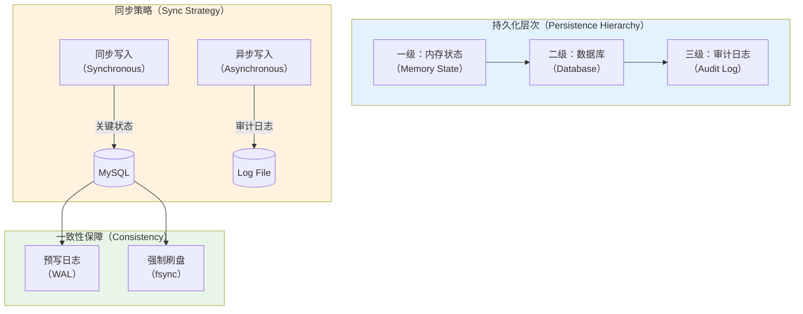
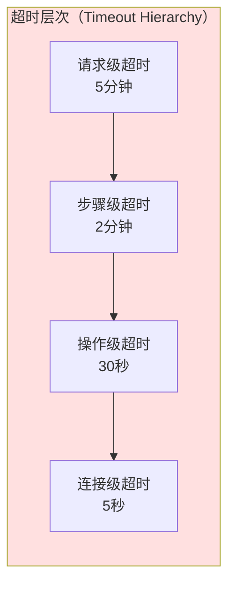

# 虚拟机操作 SAGA 步骤规范实现指南

所有代码仅为示意

## 一、正向步骤三大保障机制

### 1.1 原子性保障实现

#### 1.1.1 数据库事务包装器

所有涉及数据库操作的步骤必须使用事务包装器，确保操作的原子性：

```go
// TxWrapper 数据库事务包装器
type TxWrapper struct {
    db *sql.DB
}

// ExecuteInTransaction 在事务中执行操作
func (w *TxWrapper) ExecuteInTransaction(ctx context.Context, fn func(*sql.Tx) error) error {
    tx, err := w.db.BeginTx(ctx, &sql.TxOptions{
        Isolation: sql.LevelReadCommitted,
    })
    if err != nil {
        return fmt.Errorf("开启事务失败: %w", err)
    }
    
    // 确保事务正确关闭
    defer func() {
        if p := recover(); p != nil {
            _ = tx.Rollback()
            panic(p) // 重新抛出panic
        }
    }()
    
    // 执行业务逻辑
    if err := fn(tx); err != nil {
        if rbErr := tx.Rollback(); rbErr != nil {
            return fmt.Errorf("回滚失败: %v (原始错误: %w)", rbErr, err)
        }
        return err
    }
    
    // 提交事务
    if err := tx.Commit(); err != nil {
        return fmt.Errorf("提交事务失败: %w", err)
    }
    
    return nil
}
```

#### 1.1.2 多阶段操作原子化模式

对于涉及外部系统调用的复杂操作，采用 **预提交-执行-确认** 三阶段模式：

```go
// AtomicMultiStepExecutor 多步骤原子执行器
type AtomicMultiStepExecutor struct {
    txWrapper *TxWrapper
    logger    *zap.Logger
}

// Execute 原子化执行多步骤操作
func (e *AtomicMultiStepExecutor) Execute(ctx context.Context, steps []AtomicStep) error {
    // 阶段1: 预提交 - 在事务中记录意图
    var executionID string
    err := e.txWrapper.ExecuteInTransaction(ctx, func(tx *sql.Tx) error {
        executionID = generateExecutionID()
        
        // 记录执行计划
        _, err := tx.ExecContext(ctx, `
            INSERT INTO execution_log (execution_id, steps, status, created_at)
            VALUES (?, ?, 'pending', NOW())
        `, executionID, marshalSteps(steps))
        
        return err
    })
    if err != nil {
        return fmt.Errorf("预提交失败: %w", err)
    }
    
    // 阶段2: 执行 - 调用外部系统
    executedSteps := make([]string, 0, len(steps))
    for i, step := range steps {
        if err := step.Execute(ctx); err != nil {
            // 执行失败，回滚已执行步骤
            e.rollbackExecutedSteps(ctx, executedSteps)
            
            // 更新执行日志
            e.updateExecutionStatus(ctx, executionID, "failed", err.Error())
            
            return fmt.Errorf("步骤 %d 执行失败: %w", i, err)
        }
        
        executedSteps = append(executedSteps, step.Name())
    }
    
    // 阶段3: 确认 - 持久化成功状态
    err = e.txWrapper.ExecuteInTransaction(ctx, func(tx *sql.Tx) error {
        _, err := tx.ExecContext(ctx, `
            UPDATE execution_log 
            SET status = 'completed', completed_at = NOW()
            WHERE execution_id = ?
        `, executionID)
        return err
    })
    
    if err != nil {
        // 确认失败，标记为异常状态（需要人工介入）
        e.logger.Error("确认阶段失败", 
            zap.String("execution_id", executionID),
            zap.Error(err))
        return fmt.Errorf("确认失败: %w", err)
    }
    
    return nil
}

// rollbackExecutedSteps 回滚已执行的步骤
func (e *AtomicMultiStepExecutor) rollbackExecutedSteps(ctx context.Context, stepNames []string) {
    for i := len(stepNames) - 1; i >= 0; i-- {
        stepName := stepNames[i]
        // 调用对应的清理逻辑
        if err := e.cleanupStep(ctx, stepName); err != nil {
            e.logger.Error("回滚步骤失败", 
                zap.String("step", stepName),
                zap.Error(err))
        }
    }
}
```

#### 1.1.3 虚拟机创建步骤原子性实现示例

```go
// allocateResources 资源预分配（原子性保障）
func (s *VMService) allocateResources(ctx context.Context, req *CreateVMRequest) error {
    executor := NewAtomicMultiStepExecutor(s.txWrapper, s.logger)
    
    steps := []AtomicStep{
        // 步骤1: 选择物理机
        &SelectPMStep{
            scheduler: s.scheduler,
            req:       req,
        },
        
        // 步骤2: 检查配额
        &CheckQuotaStep{
            quotaManager: s.quotaManager,
            tenantID:     req.TenantID,
            vcpus:        req.VCPUs,
            memoryMB:     req.MemoryMB,
        },
        
        // 步骤3: 预留资源
        &ReserveResourceStep{
            resourceManager: s.resourceManager,
            vmID:            req.VMID,
            pmID:            req.PMID,
            vcpus:           req.VCPUs,
            memoryMB:        req.MemoryMB,
        },
    }
    
    return executor.Execute(ctx, steps)
}

// SelectPMStep 物理机选择步骤
type SelectPMStep struct {
    scheduler *Scheduler
    req       *CreateVMRequest
}

func (s *SelectPMStep) Execute(ctx context.Context) error {
    // 使用数据库行锁防止并发调度冲突
    return s.scheduler.txWrapper.ExecuteInTransaction(ctx, func(tx *sql.Tx) error {
        // 锁定候选物理机行
        rows, err := tx.QueryContext(ctx, `
            SELECT pm_id, available_vcpus, available_memory_mb
            FROM physical_machines
            WHERE status = 'active'
              AND available_vcpus >= ?
              AND available_memory_mb >= ?
            ORDER BY available_vcpus DESC
            LIMIT 5
            FOR UPDATE SKIP LOCKED
        `, s.req.VCPUs, s.req.MemoryMB)
        
        if err != nil {
            return err
        }
        defer rows.Close()
        
        if !rows.Next() {
            return ErrNoAvailablePM
        }
        
        var pmID string
        var availVCPUs, availMemMB int
        if err := rows.Scan(&pmID, &availVCPUs, &availMemMB); err != nil {
            return err
        }
        
        // 更新可用资源（乐观锁）
        result, err := tx.ExecContext(ctx, `
            UPDATE physical_machines
            SET available_vcpus = available_vcpus - ?,
                available_memory_mb = available_memory_mb - ?,
                updated_at = NOW()
            WHERE pm_id = ?
              AND available_vcpus = ?
              AND available_memory_mb = ?
        `, s.req.VCPUs, s.req.MemoryMB, pmID, availVCPUs, availMemMB)
        
        if err != nil {
            return err
        }
        
        affected, _ := result.RowsAffected()
        if affected == 0 {
            return ErrConcurrentResourceConflict // 并发冲突，触发重试
        }
        
        s.req.PMID = pmID
        return nil
    })
}

func (s *SelectPMStep) Name() string {
    return "select_physical_machine"
}
```

### 1.2 持久化保障实现

#### 1.2.1 关键状态持久化策略



#### 1.2.2 状态机持久化实现

```go
// StatePersistence 状态持久化管理器
type StatePersistence struct {
    db          *sql.DB
    auditLogger *AuditLogger
}

// PersistVMStateChange 持久化虚拟机状态变更
func (p *StatePersistence) PersistVMStateChange(ctx context.Context, change *VMStateChange) error {
    // 开启事务
    tx, err := p.db.BeginTx(ctx, &sql.TxOptions{
        Isolation: sql.LevelReadCommitted,
    })
    if err != nil {
        return err
    }
    defer tx.Rollback()
    
    // 1. 更新虚拟机状态表
    _, err = tx.ExecContext(ctx, `
        UPDATE virtual_machines
        SET status = ?,
            status_message = ?,
            updated_at = NOW(),
            version = version + 1
        WHERE vm_id = ?
          AND version = ?
    `, change.NewStatus, change.StatusMessage, change.VMID, change.ExpectedVersion)
    
    if err != nil {
        return fmt.Errorf("更新虚拟机状态失败: %w", err)
    }
    
    // 2. 插入状态变更历史
    _, err = tx.ExecContext(ctx, `
        INSERT INTO vm_state_history 
        (vm_id, from_status, to_status, reason, operator, created_at)
        VALUES (?, ?, ?, ?, ?, NOW())
    `, change.VMID, change.OldStatus, change.NewStatus, 
       change.Reason, change.Operator)
    
    if err != nil {
        return fmt.Errorf("插入状态历史失败: %w", err)
    }
    
    // 3. 提交事务（确保fsync）
    if err := tx.Commit(); err != nil {
        return fmt.Errorf("提交事务失败: %w", err)
    }
    
    // 4. 异步写入审计日志（不阻塞主流程）
    go p.auditLogger.LogStateChange(change)
    
    return nil
}

// VMStateChange 虚拟机状态变更
type VMStateChange struct {
    VMID            string
    OldStatus       string
    NewStatus       string
    StatusMessage   string
    Reason          string
    Operator        string
    ExpectedVersion int64 // 乐观锁版本号
}
```

#### 1.2.3 QMP 操作持久化封装

```go
// PersistentQMPClient QMP客户端持久化包装器
type PersistentQMPClient struct {
    qmpClient       *QMPClient
    statePersist    *StatePersistence
    commandRecorder *CommandRecorder
}

// ExecuteWithPersistence 执行QMP命令并持久化
func (c *PersistentQMPClient) ExecuteWithPersistence(
    ctx context.Context, 
    vmID string,
    command QMPCommand,
) error {
    // 1. 记录命令执行意图
    cmdID := c.commandRecorder.RecordIntent(ctx, &CommandIntent{
        VMID:      vmID,
        Command:   command.Name(),
        Args:      command.Args(),
        Timestamp: time.Now(),
    })
    
    // 2. 执行QMP命令
    result, err := c.qmpClient.Execute(ctx, command)
    if err != nil {
        // 记录失败
        c.commandRecorder.RecordFailure(ctx, cmdID, err)
        return err
    }
    
    // 3. 持久化执行结果
    err = c.commandRecorder.RecordSuccess(ctx, &CommandResult{
        CommandID: cmdID,
        Result:    result,
        Timestamp: time.Now(),
    })
    
    if err != nil {
        // 持久化失败，记录警告但不影响业务
        c.commandRecorder.logger.Warn("持久化命令结果失败",
            zap.String("command_id", cmdID),
            zap.Error(err))
    }
    
    return nil
}

// CommandRecorder 命令记录器
type CommandRecorder struct {
    db     *sql.DB
    logger *zap.Logger
}

// RecordIntent 记录命令意图
func (r *CommandRecorder) RecordIntent(ctx context.Context, intent *CommandIntent) string {
    cmdID := generateCommandID()
    
    _, err := r.db.ExecContext(ctx, `
        INSERT INTO qmp_command_log 
        (command_id, vm_id, command, args, status, created_at)
        VALUES (?, ?, ?, ?, 'pending', NOW())
    `, cmdID, intent.VMID, intent.Command, intent.Args)
    
    if err != nil {
        r.logger.Error("记录命令意图失败", zap.Error(err))
    }
    
    return cmdID
}

// RecordSuccess 记录成功结果
func (r *CommandRecorder) RecordSuccess(ctx context.Context, result *CommandResult) error {
    _, err := r.db.ExecContext(ctx, `
        UPDATE qmp_command_log
        SET status = 'success',
            result = ?,
            completed_at = NOW()
        WHERE command_id = ?
    `, result.Result, result.CommandID)
    
    return err
}
```

### 1.3 超时控制实现

#### 1.3.1 分层超时策略



#### 1.3.2 超时控制实现框架

```go
// TimeoutConfig 超时配置
type TimeoutConfig struct {
    RequestTimeout    time.Duration // 请求级超时（SAGA整体）
    StepTimeout       time.Duration // 步骤级超时
    OperationTimeout  time.Duration // 操作级超时（单个QMP命令）
    ConnectionTimeout time.Duration // 连接级超时
}

// DefaultTimeoutConfig 默认超时配置
var DefaultTimeoutConfig = &TimeoutConfig{
    RequestTimeout:    5 * time.Minute,
    StepTimeout:       2 * time.Minute,
    OperationTimeout:  30 * time.Second,
    ConnectionTimeout: 5 * time.Second,
}

// TimeoutExecutor 超时执行器
type TimeoutExecutor struct {
    config *TimeoutConfig
    logger *zap.Logger
}

// ExecuteWithTimeout 带超时执行函数
func (e *TimeoutExecutor) ExecuteWithTimeout(
    ctx context.Context,
    timeout time.Duration,
    fn func(context.Context) error,
) error {
    // 创建带超时的上下文
    execCtx, cancel := context.WithTimeout(ctx, timeout)
    defer cancel()
    
    // 使用通道接收结果
    resultChan := make(chan error, 1)
    
    go func() {
        resultChan <- fn(execCtx)
    }()
    
    select {
    case err := <-resultChan:
        return err
    case <-execCtx.Done():
        if execCtx.Err() == context.DeadlineExceeded {
            e.logger.Warn("操作超时",
                zap.Duration("timeout", timeout))
            return ErrOperationTimeout
        }
        return execCtx.Err()
    }
}
```

#### 1.3.3 虚拟机操作超时实现示例

```go
// createDisk 创建磁盘（带超时控制）
func (s *VMService) createDisk(ctx context.Context, req *CreateVMRequest) (string, error) {
    executor := NewTimeoutExecutor(s.timeoutConfig, s.logger)
    
    var diskID string
    err := executor.ExecuteWithTimeout(ctx, s.timeoutConfig.StepTimeout, 
        func(stepCtx context.Context) error {
            // 准备磁盘创建请求
            diskReq := &CreateDiskRequest{
                DiskID:        generateDiskID(req.VMID),
                VMID:          req.VMID,
                SizeGB:        req.DiskSizeGB,
                Type:          "qcow2",
                SharedStorage: req.SharedStorage,
                PMID:          req.PMID,
            }
            
            // 调用存储服务（带操作级超时）
            opCtx, cancel := context.WithTimeout(stepCtx, s.timeoutConfig.OperationTimeout)
            defer cancel()
            
            disk, err := s.storageService.CreateDisk(opCtx, diskReq)
            if err != nil {
                if opCtx.Err() == context.DeadlineExceeded {
                    return fmt.Errorf("存储服务超时: %w", ErrStorageOperationTimeout)
                }
                return fmt.Errorf("创建磁盘失败: %w", err)
            }
            
            diskID = disk.DiskID
            
            // 持久化磁盘信息（带操作级超时）
            persistCtx, persistCancel := context.WithTimeout(stepCtx, s.timeoutConfig.OperationTimeout)
            defer persistCancel()
            
            err = s.diskRepo.Create(persistCtx, disk)
            if err != nil {
                // 持久化失败，清理已创建的磁盘
                _ = s.storageService.DeleteDisk(stepCtx, diskID)
                return fmt.Errorf("持久化磁盘信息失败: %w", err)
            }
            
            return nil
        })
    
    if err != nil {
        return "", err
    }
    
    return diskID, nil
}

// startQEMUProcess 启动QEMU进程（带超时控制）
func (s *VMService) startQEMUProcess(ctx context.Context, vmID, configPath string) (int, error) {
    executor := NewTimeoutExecutor(s.timeoutConfig, s.logger)
    
    var pid int
    err := executor.ExecuteWithTimeout(ctx, s.timeoutConfig.StepTimeout,
        func(stepCtx context.Context) error {
            // 加载配置
            config, err := s.configStore.Load(stepCtx, configPath)
            if err != nil {
                return err
            }
            
            // 启动进程（带操作级超时）
            startCtx, cancel := context.WithTimeout(stepCtx, s.timeoutConfig.OperationTimeout)
            defer cancel()
            
            process, err := s.processManager.StartWithContext(startCtx, s.buildQEMUCommand(config))
            if err != nil {
                return fmt.Errorf("启动QEMU进程失败: %w", err)
            }
            
            pid = process.PID
            
            // 等待QEMU就绪（带自定义超时）
            readyCtx, readyCancel := context.WithTimeout(stepCtx, 30*time.Second)
            defer readyCancel()
            
            if err := s.waitForQEMUReadyWithContext(readyCtx, pid); err != nil {
                // QEMU启动失败，杀掉进程
                _ = s.processManager.Kill(stepCtx, pid)
                return fmt.Errorf("QEMU就绪超时: %w", err)
            }
            
            return nil
        })
    
    if err != nil {
        return 0, err
    }
    
    return pid, nil
}

// waitForQEMUReadyWithContext 带上下文的QEMU就绪等待
func (s *VMService) waitForQEMUReadyWithContext(ctx context.Context, pid int) error {
    ticker := time.NewTicker(500 * time.Millisecond)
    defer ticker.Stop()
    
    for {
        select {
        case <-ctx.Done():
            return ctx.Err()
        case <-ticker.C:
            // 检查进程存活
            if !s.processManager.IsRunning(pid) {
                return ErrQEMUProcessDied
            }
            
            // 检查QMP socket
            qmpSocket := fmt.Sprintf("/var/run/qemu/%d.sock", pid)
            if s.qmpManager.CanConnect(qmpSocket) {
                return nil
            }
        }
    }
}
```

## 二、补偿步骤三大保障机制

### 2.1 幂等性保障实现

#### 2.1.1 幂等键设计

```go
// IdempotencyKey 幂等键
type IdempotencyKey struct {
    GAID      string // DTM全局事务ID
    BranchID  string // 分支事务ID
    Operation string // 操作类型
    Resource  string // 资源标识（如VM ID）
    Version   int64  // 版本号
}

// Generate 生成幂等键字符串
func (k *IdempotencyKey) Generate() string {
    return fmt.Sprintf("%s:%s:%s:%s:%d", 
        k.GAID, k.BranchID, k.Operation, k.Resource, k.Version)
}

// IdempotencyManager 幂等性管理器
type IdempotencyManager struct {
    cache      *redis.Client
    db         *sql.DB
    defaultTTL time.Duration
}

// CheckAndMark 检查并标记操作已执行
func (m *IdempotencyManager) CheckAndMark(ctx context.Context, key *IdempotencyKey) (bool, error) {
    keyStr := key.Generate()
    
    // 1. 先查缓存（快速路径）
    exists, err := m.cache.Exists(ctx, keyStr).Result()
    if err == nil && exists > 0 {
        return true, nil // 已执行过
    }
    
    // 2. 查数据库（持久化路径）
    var count int
    err = m.db.QueryRowContext(ctx, `
        SELECT COUNT(*) FROM idempotency_records
        WHERE idempotency_key = ? AND status = 'completed'
    `, keyStr).Scan(&count)
    
    if err != nil {
        return false, err
    }
    
    if count > 0 {
        // 回填缓存
        _ = m.cache.Set(ctx, keyStr, "1", m.defaultTTL).Err()
        return true, nil
    }
    
    // 3. 标记为执行中（使用分布式锁）
    locked, err := m.acquireLock(ctx, keyStr)
    if err != nil {
        return false, err
    }
    
    if !locked {
        return true, nil // 其他实例正在执行
    }
    
    // 4. 插入执行记录
    _, err = m.db.ExecContext(ctx, `
        INSERT INTO idempotency_records 
        (idempotency_key, gaid, branch_id, operation, resource, status, created_at)
        VALUES (?, ?, ?, ?, ?, 'in_progress', NOW())
    `, keyStr, key.GAID, key.BranchID, key.Operation, key.Resource)
    
    if err != nil {
        m.releaseLock(ctx, keyStr)
        return false, err
    }
    
    return false, nil // 首次执行
}

// MarkCompleted 标记操作完成
func (m *IdempotencyManager) MarkCompleted(ctx context.Context, key *IdempotencyKey, result interface{}) error {
    keyStr := key.Generate()
    
    // 1. 更新数据库
    _, err := m.db.ExecContext(ctx, `
        UPDATE idempotency_records
        SET status = 'completed',
            result = ?,
            completed_at = NOW()
        WHERE idempotency_key = ?
    `, marshalResult(result), keyStr)
    
    if err != nil {
        return err
    }
    
    // 2. 设置缓存
    _ = m.cache.Set(ctx, keyStr, "1", m.defaultTTL).Err()
    
    // 3. 释放锁
    m.releaseLock(ctx, keyStr)
    
    return nil
}

// acquireLock 获取分布式锁
func (m *IdempotencyManager) acquireLock(ctx context.Context, key string) (bool, error) {
    lockKey := fmt.Sprintf("lock:%s", key)
    return m.cache.SetNX(ctx, lockKey, "1", 30*time.Second).Result()
}

// releaseLock 释放分布式锁
func (m *IdempotencyManager) releaseLock(ctx context.Context, key string) {
    lockKey := fmt.Sprintf("lock:%s", key)
    _ = m.cache.Del(ctx, lockKey).Err()
}
```

#### 2.1.2 补偿步骤幂等性实现示例

```go
// compensateResourceAllocation 补偿资源分配（幂等实现）
func (s *VMService) compensateResourceAllocation(ctx context.Context, vmID string) error {
    // 构造幂等键
    key := &IdempotencyKey{
        GAID:      getGAIDFromContext(ctx),
        BranchID:  getBranchIDFromContext(ctx),
        Operation: "compensate_resource_allocation",
        Resource:  vmID,
        Version:   1,
    }
    
    // 幂等性检查
    executed, err := s.idempotencyManager.CheckAndMark(ctx, key)
    if err != nil {
        return fmt.Errorf("幂等性检查失败: %w", err)
    }
    
    if executed {
        s.logger.Info("资源释放已执行，跳过",
            zap.String("vm_id", vmID))
        return nil // 已执行过，直接返回成功
    }
    
    // 执行实际的资源释放
    err = s.doReleaseResources(ctx, vmID)
    if err != nil {
        return err
    }
    
    // 标记完成
    return s.idempotencyManager.MarkCompleted(ctx, key, nil)
}

// doReleaseResources 执行资源释放（内部实现）
func (s *VMService) doReleaseResources(ctx context.Context, vmID string) error {
    // 1. 查询资源预留信息
    reservation, err := s.resourceManager.GetReservation(ctx, vmID)
    if err != nil {
        if err == ErrReservationNotFound {
            // 资源已释放或从未预留
            return nil
        }
        return err
    }
    
    // 2. 在事务中释放资源
    return s.txWrapper.ExecuteInTransaction(ctx, func(tx *sql.Tx) error {
        // 归还物理机资源
        _, err := tx.ExecContext(ctx, `
            UPDATE physical_machines
            SET available_vcpus = available_vcpus + ?,
                available_memory_mb = available_memory_mb + ?,
                updated_at = NOW()
            WHERE pm_id = ?
        `, reservation.VCPUs, reservation.MemoryMB, reservation.PMID)
        
        if err != nil {
            return err
        }
        
        // 删除预留记录
        _, err = tx.ExecContext(ctx, `
            DELETE FROM resource_reservations
            WHERE vm_id = ?
        `, vmID)
        
        return err
    })
}

// compensateCreateDisk 补偿磁盘创建（幂等实现）
func (s *VMService) compensateCreateDisk(ctx context.Context, vmID string) error {
    diskID := generateDiskID(vmID)
    
    key := &IdempotencyKey{
        GAID:      getGAIDFromContext(ctx),
        BranchID:  getBranchIDFromContext(ctx),
        Operation: "compensate_create_disk",
        Resource:  diskID,
        Version:   1,
    }
    
    executed, err := s.idempotencyManager.CheckAndMark(ctx, key)
    if err != nil {
        return err
    }
    
    if executed {
        return nil
    }
    
    // 执行磁盘删除
    err = s.doDeleteDisk(ctx, diskID)
    if err != nil {
        return err
    }
    
    return s.idempotencyManager.MarkCompleted(ctx, key, nil)
}

// doDeleteDisk 执行磁盘删除（内部实现）
func (s *VMService) doDeleteDisk(ctx context.Context, diskID string) error {
    // 1. 检查磁盘是否存在
    disk, err := s.diskRepo.Get(ctx, diskID)
    if err != nil {
        if err == ErrDiskNotFound {
            return nil // 磁盘不存在，视为已删除
        }
        return err
    }
    
    // 2. 调用存储服务删除物理文件
    err = s.storageService.DeleteDiskFile(ctx, disk.BackendPath)
    if err != nil {
        // 检查是否为"文件不存在"错误
        if isFileNotFoundError(err) {
            s.logger.Warn("磁盘文件不存在，可能已被删除",
                zap.String("disk_id", diskID),
                zap.String("path", disk.BackendPath))
        } else {
            return fmt.Errorf("删除磁盘文件失败: %w", err)
        }
    }
    
    // 3. 删除数据库记录
    return s.diskRepo.Delete(ctx, diskID)
}
```

### 2.2 最终成功保障实现

#### 2.2.1 补偿重试框架

```go
// CompensationRetrier 补偿重试器
type CompensationRetrier struct {
    maxRetries      int
    initialBackoff  time.Duration
    maxBackoff      time.Duration
    backoffMultiplier float64
    logger          *zap.Logger
}

// DefaultCompensationRetrier 默认补偿重试器
var DefaultCompensationRetrier = &CompensationRetrier{
    maxRetries:        10,  // 补偿操作允许更多重试
    initialBackoff:    2 * time.Second,
    maxBackoff:        5 * time.Minute,
    backoffMultiplier: 2.0,
}

// ExecuteWithRetry 带重试的补偿执行
func (r *CompensationRetrier) ExecuteWithRetry(
    ctx context.Context,
    compensationFunc func(context.Context) error,
    funcName string,
) error {
    var lastErr error
    
    for attempt := 0; attempt < r.maxRetries; attempt++ {
        if attempt > 0 {
            // 计算退避时间
            backoff := time.Duration(float64(r.initialBackoff) * 
                math.Pow(r.backoffMultiplier, float64(attempt-1)))
            
            if backoff > r.maxBackoff {
                backoff = r.maxBackoff
            }
            
            r.logger.Info("补偿操作重试",
                zap.String("function", funcName),
                zap.Int("attempt", attempt+1),
                zap.Duration("backoff", backoff))
            
            // 等待退避时间
            select {
            case <-ctx.Done():
                return fmt.Errorf("上下文取消: %w", ctx.Err())
            case <-time.After(backoff):
            }
        }
        
        // 执行补偿操作
        err := compensationFunc(ctx)
        if err == nil {
            if attempt > 0 {
                r.logger.Info("补偿操作重试成功",
                    zap.String("function", funcName),
                    zap.Int("total_attempts", attempt+1))
            }
            return nil
        }
        
        lastErr = err
        
        // 判断是否为不可重试错误
        if !r.isRetryableError(err) {
            r.logger.Error("补偿操作遇到不可重试错误",
                zap.String("function", funcName),
                zap.Error(err))
            return err
        }
        
        r.logger.Warn("补偿操作失败，准备重试",
            zap.String("function", funcName),
            zap.Int("attempt", attempt+1),
            zap.Error(err))
    }
    
    // 达到最大重试次数
    r.logger.Error("补偿操作最终失败",
        zap.String("function", funcName),
        zap.Int("max_retries", r.maxRetries),
        zap.Error(lastErr))
    
    return fmt.Errorf("补偿重试 %d 次后失败: %w", r.maxRetries, lastErr)
}

// isRetryableError 判断错误是否可重试
func (r *CompensationRetrier) isRetryableError(err error) bool {
    retryableErrors := []error{
        ErrNetworkTimeout,
        ErrServiceUnavailable,
        ErrDatabaseDeadlock,
        ErrResourceBusy,
        ErrTemporaryFailure,
    }
    
    for _, retryableErr := range retryableErrors {
        if errors.Is(err, retryableErr) {
            return true
        }
    }
    
    // 检查HTTP状态码
    if httpErr, ok := err.(*HTTPError); ok {
        return httpErr.StatusCode >= 500 && httpErr.StatusCode < 600
    }
    
    return false
}
```

#### 2.2.2 补偿操作集成重试示例

```go
// compensateQEMUProcess 补偿QEMU进程启动（集成重试）
func (s *VMService) compensateQEMUProcess(ctx context.Context, vmID string) error {
    retrier := DefaultCompensationRetrier
    
    return retrier.ExecuteWithRetry(ctx, func(ctx context.Context) error {
        return s.doStopQEMUProcess(ctx, vmID)
    }, "compensate_qemu_process")
}

// doStopQEMUProcess 实际停止QEMU进程
func (s *VMService) doStopQEMUProcess(ctx context.Context, vmID string) error {
    // 1. 查找进程PID
    pid, err := s.processManager.FindByVMID(ctx, vmID)
    if err != nil {
        if err == ErrProcessNotFound {
            return nil // 进程不存在，视为已停止
        }
        return err
    }
    
    // 2. 尝试优雅停止
    err = s.processManager.GracefulStop(ctx, pid, 10*time.Second)
    if err == nil {
        return nil
    }
    
    // 3. 优雅停止失败，强制杀死
    s.logger.Warn("优雅停止失败，强制杀死进程",
        zap.String("vm_id", vmID),
        zap.Int("pid", pid))
    
    return s.processManager.Kill(ctx, pid)
}

// compensateNetworkConfig 补偿网络配置（集成重试）
func (s *VMService) compensateNetworkConfig(ctx context.Context, vmID string) error {
    nicID := generateNICID(vmID)
    retrier := DefaultCompensationRetrier
    
    return retrier.ExecuteWithRetry(ctx, func(ctx context.Context) error {
        return s.doDeleteNIC(ctx, nicID)
    }, "compensate_network_config")
}

// doDeleteNIC 实际删除网络接口
func (s *VMService) doDeleteNIC(ctx context.Context, nicID string) error {
    // 1. 检查NIC是否存在
    nic, err := s.networkService.GetNIC(ctx, nicID)
    if err != nil {
        if err == ErrNICNotFound {
            return nil
        }
        return err
    }
    
    // 2. 调用网络服务删除
    err = s.networkService.DeleteNIC(ctx, nicID)
    if err != nil {
        // 特殊处理：NIC已被删除的错误
        if isNICAlreadyDeletedError(err) {
            s.logger.Warn("NIC已被删除",
                zap.String("nic_id", nicID))
            return nil
        }
        return err
    }
    
    // 3. 删除数据库记录
    return s.nicRepo.Delete(ctx, nicID)
}
```

#### 2.2.3 补偿失败告警机制

```go
// CompensationAlerter 补偿失败告警器
type CompensationAlerter struct {
    alertManager *AlertManager
    logger       *zap.Logger
}

// AlertCompensationFailure 发送补偿失败告警
func (a *CompensationAlerter) AlertCompensationFailure(
    ctx context.Context,
    compensationName string,
    resourceID string,
    err error,
) {
    alert := &Alert{
        Level:    AlertLevelCritical,
        Title:    "SAGA补偿操作失败",
        Message:  fmt.Sprintf("补偿操作 %s 失败，资源 %s 可能处于不一致状态", compensationName, resourceID),
        Error:    err.Error(),
        Resource: resourceID,
        Tags: map[string]string{
            "saga_type":         "vm_lifecycle",
            "compensation_name": compensationName,
            "resource_type":     "virtual_machine",
        },
        Timestamp: time.Now(),
    }
    
    // 发送告警
    if err := a.alertManager.Send(ctx, alert); err != nil {
        a.logger.Error("发送告警失败",
            zap.Error(err),
            zap.String("resource_id", resourceID))
    }
    
    // 记录到数据库
    a.recordFailedCompensation(ctx, compensationName, resourceID, err)
}

// recordFailedCompensation 记录失败的补偿操作
func (a *CompensationAlerter) recordFailedCompensation(
    ctx context.Context,
    compensationName string,
    resourceID string,
    err error,
) {
    _, dbErr := a.db.ExecContext(ctx, `
        INSERT INTO failed_compensations
        (compensation_name, resource_id, error_message, status, created_at)
        VALUES (?, ?, ?, 'pending_manual_fix', NOW())
    `, compensationName, resourceID, err.Error())
    
    if dbErr != nil {
        a.logger.Error("记录失败补偿失败",
            zap.Error(dbErr))
    }
}
```

### 2.3 资源清理保障实现

#### 2.3.1 资源清理检查清单

```go
// ResourceCleanupChecklist 资源清理检查清单
type ResourceCleanupChecklist struct {
    VMID          string
    Checks        []CleanupCheck
    CompletedAt   time.Time
}

// CleanupCheck 清理检查项
type CleanupCheck struct {
    Name        string
    Description string
    Required    bool
    Completed   bool
    Error       error
}

// ResourceCleaner 资源清理器
type ResourceCleaner struct {
    vmService      *VMService
    storageService *StorageService
    networkService *NetworkService
    logger         *zap.Logger
}

// CleanupAllResources 清理所有资源
func (c *ResourceCleaner) CleanupAllResources(ctx context.Context, vmID string) (*ResourceCleanupChecklist, error) {
    checklist := &ResourceCleanupChecklist{
        VMID: vmID,
        Checks: []CleanupCheck{
            {Name: "qemu_process", Description: "停止QEMU进程", Required: true},
            {Name: "qmp_connection", Description: "断开QMP连接", Required: true},
            {Name: "disk_files", Description: "删除磁盘文件", Required: true},
            {Name: "network_config", Description: "清理网络配置", Required: true},
            {Name: "config_files", Description: "删除配置文件", Required: false},
            {Name: "resource_reservation", Description: "释放资源预留", Required: true},
            {Name: "database_records", Description: "清理数据库记录", Required: true},
        },
    }
    
    // 执行每个清理步骤
    for i := range checklist.Checks {
        check := &checklist.Checks[i]
        
        var err error
        switch check.Name {
        case "qemu_process":
            err = c.cleanupQEMUProcess(ctx, vmID)
        case "qmp_connection":
            err = c.cleanupQMPConnection(ctx, vmID)
        case "disk_files":
            err = c.cleanupDiskFiles(ctx, vmID)
        case "network_config":
            err = c.cleanupNetworkConfig(ctx, vmID)
        case "config_files":
            err = c.cleanupConfigFiles(ctx, vmID)
        case "resource_reservation":
            err = c.cleanupResourceReservation(ctx, vmID)
        case "database_records":
            err = c.cleanupDatabaseRecords(ctx, vmID)
        }
        
        if err == nil {
            check.Completed = true
        } else {
            check.Error = err
            c.logger.Error("资源清理失败",
                zap.String("vm_id", vmID),
                zap.String("check", check.Name),
                zap.Error(err))
            
            // 必需项失败则返回错误
            if check.Required {
                return checklist, fmt.Errorf("必需清理项 %s 失败: %w", check.Name, err)
            }
        }
    }
    
    checklist.CompletedAt = time.Now()
    return checklist, nil
}

// cleanupDiskFiles 清理磁盘文件
func (c *ResourceCleaner) cleanupDiskFiles(ctx context.Context, vmID string) error {
    // 1. 查询虚拟机的所有磁盘
    disks, err := c.storageService.GetVMDisks(ctx, vmID)
    if err != nil {
        if err == ErrNoDisksFound {
            return nil
        }
        return err
    }
    
    // 2. 删除每个磁盘
    var multiErr error
    for _, disk := range disks {
        err := c.storageService.DeleteDiskFile(ctx, disk.BackendPath)
        if err != nil && !isFileNotFoundError(err) {
            multiErr = multierror.Append(multiErr, 
                fmt.Errorf("删除磁盘 %s 失败: %w", disk.DiskID, err))
        }
    }
    
    return multiErr
}

// cleanupDatabaseRecords 清理数据库记录
func (c *ResourceCleaner) cleanupDatabaseRecords(ctx context.Context, vmID string) error {
    return c.vmService.txWrapper.ExecuteInTransaction(ctx, func(tx *sql.Tx) error {
        // 删除虚拟机记录
        _, err := tx.ExecContext(ctx, `DELETE FROM virtual_machines WHERE vm_id = ?`, vmID)
        if err != nil {
            return err
        }
        
        // 删除磁盘记录
        _, err = tx.ExecContext(ctx, `DELETE FROM vm_disks WHERE vm_id = ?`, vmID)
        if err != nil {
            return err
        }
        
        // 删除网络接口记录
        _, err = tx.ExecContext(ctx, `DELETE FROM vm_nics WHERE vm_id = ?`, vmID)
        if err != nil {
            return err
        }
        
        // 删除资源配额记录
        _, err = tx.ExecContext(ctx, `DELETE FROM resource_quotas WHERE vm_id = ?`, vmID)
        if err != nil {
            return err
        }
        
        return nil
    })
}
```

#### 2.3.2 资源泄漏检测与修复

```go
// ResourceLeakDetector 资源泄漏检测器
type ResourceLeakDetector struct {
    vmService      *VMService
    storageService *StorageService
    networkService *NetworkService
    db             *sql.DB
    logger         *zap.Logger
}

// DetectAndFix 检测并修复资源泄漏
func (d *ResourceLeakDetector) DetectAndFix(ctx context.Context) error {
    // 1. 检测孤儿磁盘
    orphanDisks, err := d.detectOrphanDisks(ctx)
    if err != nil {
        return err
    }
    
    for _, disk := range orphanDisks {
        d.logger.Warn("发现孤儿磁盘",
            zap.String("disk_id", disk.DiskID),
            zap.String("vm_id", disk.VMID))
        
        if err := d.cleanupOrphanDisk(ctx, disk); err != nil {
            d.logger.Error("清理孤儿磁盘失败",
                zap.String("disk_id", disk.DiskID),
                zap.Error(err))
        }
    }
    
    // 2. 检测孤儿网络接口
    orphanNICs, err := d.detectOrphanNICs(ctx)
    if err != nil {
        return err
    }
    
    for _, nic := range orphanNICs {
        d.logger.Warn("发现孤儿网络接口",
            zap.String("nic_id", nic.NICID),
            zap.String("vm_id", nic.VMID))
        
        if err := d.cleanupOrphanNIC(ctx, nic); err != nil {
            d.logger.Error("清理孤儿网络接口失败",
                zap.String("nic_id", nic.NICID),
                zap.Error(err))
        }
    }
    
    // 3. 检测僵尸资源预留
    zombieReservations, err := d.detectZombieReservations(ctx)
    if err != nil {
        return err
    }
    
    for _, reservation := range zombieReservations {
        d.logger.Warn("发现僵尸资源预留",
            zap.String("vm_id", reservation.VMID),
            zap.Time("expire_at", reservation.ExpireAt))
        
        if err := d.cleanupZombieReservation(ctx, reservation); err != nil {
            d.logger.Error("清理僵尸预留失败",
                zap.String("vm_id", reservation.VMID),
                zap.Error(err))
        }
    }
    
    return nil
}

// detectOrphanDisks 检测孤儿磁盘
func (d *ResourceLeakDetector) detectOrphanDisks(ctx context.Context) ([]*Disk, error) {
    rows, err := d.db.QueryContext(ctx, `
        SELECT d.disk_id, d.vm_id, d.backend_path
        FROM vm_disks d
        LEFT JOIN virtual_machines v ON d.vm_id = v.vm_id
        WHERE v.vm_id IS NULL
          AND d.created_at < DATE_SUB(NOW(), INTERVAL 1 HOUR)
    `)
    
    if err != nil {
        return nil, err
    }
    defer rows.Close()
    
    var orphans []*Disk
    for rows.Next() {
        disk := &Disk{}
        if err := rows.Scan(&disk.DiskID, &disk.VMID, &disk.BackendPath); err != nil {
            return nil, err
        }
        orphans = append(orphans, disk)
    }
    
    return orphans, rows.Err()
}

// cleanupOrphanDisk 清理孤儿磁盘
func (d *ResourceLeakDetector) cleanupOrphanDisk(ctx context.Context, disk *Disk) error {
    // 1. 删除物理文件
    if err := d.storageService.DeleteDiskFile(ctx, disk.BackendPath); err != nil {
        if !isFileNotFoundError(err) {
            return err
        }
    }
    
    // 2. 删除数据库记录
    _, err := d.db.ExecContext(ctx, `DELETE FROM vm_disks WHERE disk_id = ?`, disk.DiskID)
    return err
}

// detectZombieReservations 检测僵尸资源预留
func (d *ResourceLeakDetector) detectZombieReservations(ctx context.Context) ([]*ResourceReservation, error) {
    rows, err := d.db.QueryContext(ctx, `
        SELECT vm_id, pm_id, vcpus, memory_mb, expire_at
        FROM resource_reservations
        WHERE expire_at < NOW()
    `)
    
    if err != nil {
        return nil, err
    }
    defer rows.Close()
    
    var zombies []*ResourceReservation
    for rows.Next() {
        reservation := &ResourceReservation{}
        if err := rows.Scan(&reservation.VMID, &reservation.PMID, 
            &reservation.VCPUs, &reservation.MemoryMB, &reservation.ExpireAt); err != nil {
            return nil, err
        }
        zombies = append(zombies, reservation)
    }
    
    return zombies, rows.Err()
}

// cleanupZombieReservation 清理僵尸资源预留
func (d *ResourceLeakDetector) cleanupZombieReservation(ctx context.Context, reservation *ResourceReservation) error {
    return d.vmService.txWrapper.ExecuteInTransaction(ctx, func(tx *sql.Tx) error {
        // 归还物理机资源
        _, err := tx.ExecContext(ctx, `
            UPDATE physical_machines
            SET available_vcpus = available_vcpus + ?,
                available_memory_mb = available_memory_mb + ?,
                updated_at = NOW()
            WHERE pm_id = ?
        `, reservation.VCPUs, reservation.MemoryMB, reservation.PMID)
        
        if err != nil {
            return err
        }
        
        // 删除预留记录
        _, err = tx.ExecContext(ctx, `
            DELETE FROM resource_reservations WHERE vm_id = ?
        `, reservation.VMID)
        
        return err
    })
}
```

## 三、综合示例：完整的虚拟机删除 SAGA

```go
// DeleteVMSaga 虚拟机删除SAGA（集成所有保障机制）
func (s *VMService) DeleteVMSaga(ctx context.Context, vmID string) error {
    wfName := fmt.Sprintf("delete_vm_%s", vmID)
    
    return workflow.Register(wfName, func(wf *workflow.Workflow, data []byte) error {
        // 获取虚拟机信息
        vm, err := s.vmRepo.Get(wf.Context, vmID)
        if err != nil {
            return err
        }
        
        // 步骤1: 停止虚拟机（带超时）
        wf.NewBranch().OnRollback(func(bb *dtmcli.BranchBarrier) error {
            // 删除操作的补偿是恢复虚拟机（复杂，暂不实现）
            return nil
        })
        
        err = s.timeoutExecutor.ExecuteWithTimeout(wf.Context, 
            s.timeoutConfig.StepTimeout, 
            func(ctx context.Context) error {
                return s.stopVMIfRunning(ctx, vmID)
            })
        if err != nil {
            return err
        }
        
        // 步骤2: 停止QEMU进程（带重试补偿）
        wf.NewBranch().OnRollback(func(bb *dtmcli.BranchBarrier) error {
            // 无需补偿，进程已停止
            return nil
        })
        
        err = s.stopQEMUProcessWithRetry(wf.Context, vmID)
        if err != nil {
            return err
        }
        
        // 步骤3: 清理磁盘（幂等 + 重试）
        wf.NewBranch().OnRollback(func(bb *dtmcli.BranchBarrier) error {
            // 磁盘已删除，无需补偿
            return nil
        })
        
        err = s.cleanupDisksWithIdempotency(wf.Context, vmID)
        if err != nil {
            return err
        }
        
        // 步骤4: 清理网络（幂等 + 重试）
        wf.NewBranch().OnRollback(func(bb *dtmcli.BranchBarrier) error {
            return nil
        })
        
        err = s.cleanupNetworkWithIdempotency(wf.Context, vmID)
        if err != nil {
            return err
        }
        
        // 步骤5: 释放资源（原子性 + 幂等）
        wf.NewBranch().OnRollback(func(bb *dtmcli.BranchBarrier) error {
            return nil
        })
        
        err = s.releaseResourcesAtomic(wf.Context, vmID, vm.PMID, vm.VCPUs, vm.MemoryMB)
        if err != nil {
            return err
        }
        
        // 步骤6: 删除元数据（原子性 + 持久化）
        wf.NewBranch().OnRollback(func(bb *dtmcli.BranchBarrier) error {
            return nil
        })
        
        return s.deleteMetadataAtomic(wf.Context, vmID)
    })
}

// cleanupDisksWithIdempotency 幂等的磁盘清理
func (s *VMService) cleanupDisksWithIdempotency(ctx context.Context, vmID string) error {
    key := &IdempotencyKey{
        GAID:      getGAIDFromContext(ctx),
        BranchID:  getBranchIDFromContext(ctx),
        Operation: "cleanup_disks",
        Resource:  vmID,
        Version:   1,
    }
    
    executed, err := s.idempotencyManager.CheckAndMark(ctx, key)
    if err != nil {
        return err
    }
    
    if executed {
        return nil
    }
    
    // 执行清理（带重试）
    err = DefaultCompensationRetrier.ExecuteWithRetry(ctx, 
        func(ctx context.Context) error {
            return s.resourceCleaner.cleanupDiskFiles(ctx, vmID)
        }, "cleanup_disks")
    
    if err != nil {
        return err
    }
    
    return s.idempotencyManager.MarkCompleted(ctx, key, nil)
}

// releaseResourcesAtomic 原子性资源释放
func (s *VMService) releaseResourcesAtomic(
    ctx context.Context, 
    vmID, pmID string, 
    vcpus, memoryMB int,
) error {
    return s.txWrapper.ExecuteInTransaction(ctx, func(tx *sql.Tx) error {
        // 1. 归还物理机资源
        result, err := tx.ExecContext(ctx, `
            UPDATE physical_machines
            SET available_vcpus = available_vcpus + ?,
                available_memory_mb = available_memory_mb + ?,
                updated_at = NOW()
            WHERE pm_id = ?
        `, vcpus, memoryMB, pmID)
        
        if err != nil {
            return err
        }
        
        affected, _ := result.RowsAffected()
        if affected == 0 {
            return ErrPMNotFound
        }
        
        // 2. 删除资源预留记录
        _, err = tx.ExecContext(ctx, `
            DELETE FROM resource_reservations WHERE vm_id = ?
        `, vmID)
        
        if err != nil {
            return err
        }
        
        // 3. 更新租户配额
        _, err = tx.ExecContext(ctx, `
            UPDATE tenant_quotas
            SET used_vcpus = used_vcpus - ?,
                used_memory_mb = used_memory_mb - ?,
                updated_at = NOW()
            WHERE tenant_id = (SELECT tenant_id FROM virtual_machines WHERE vm_id = ?)
        `, vcpus, memoryMB, vmID)
        
        return err
    })
}
```

## 四、运维监控与告警

### 4.1 关键指标监控

```go
// SAGAMetrics SAGA监控指标
type SAGAMetrics struct {
    // 正向步骤指标
    ForwardStepDuration    prometheus.Histogram
    ForwardStepErrors      prometheus.Counter
    ForwardStepTimeouts    prometheus.Counter
    
    // 补偿步骤指标
    CompensationAttempts   prometheus.Counter
    CompensationSuccesses  prometheus.Counter
    CompensationFailures   prometheus.Counter
    CompensationDuration   prometheus.Histogram
    
    // 资源清理指标
    ResourceLeakDetected   prometheus.Counter
    ResourceLeakFixed      prometheus.Counter
}

// RecordForwardStepExecution 记录正向步骤执行
func (m *SAGAMetrics) RecordForwardStepExecution(
    stepName string,
    duration time.Duration,
    err error,
) {
    m.ForwardStepDuration.WithLabelValues(stepName).Observe(duration.Seconds())
    
    if err != nil {
        m.ForwardStepErrors.WithLabelValues(stepName).Inc()
        
        if errors.Is(err, context.DeadlineExceeded) {
            m.ForwardStepTimeouts.WithLabelValues(stepName).Inc()
        }
    }
}
```

---

**文档版本**: v1.0
**最后更新**: 2026-01-28
