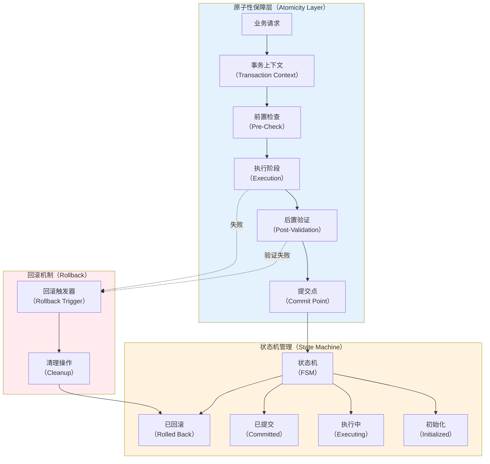
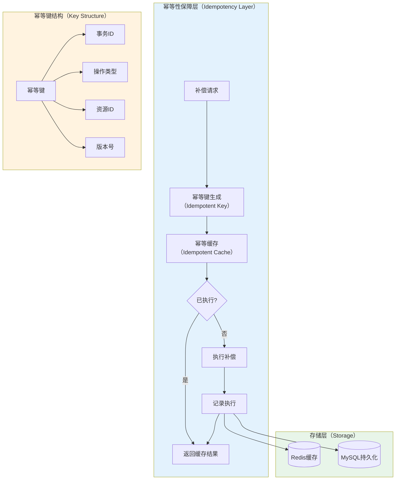

# 虚拟机操作的 SAGA 原子性与幂等性保障设计

代码仅辅助示意

## 一、正向步骤保障机制设计

### 1.1 原子性保障架构



### 1.2 原子性实现：事务上下文模式

```go
package transaction

import (
    "context"
    "fmt"
    "sync"
    "time"
    
)

// AtomicOperation 原子操作接口
type AtomicOperation interface {
    // PreCheck 前置检查（必须是只读操作）
    PreCheck(ctx context.Context, tx *TransactionContext) error
    
    // Execute 执行阶段（可能修改状态）
    Execute(ctx context.Context, tx *TransactionContext) error
    
    // PostValidate 后置验证（验证执行结果）
    PostValidate(ctx context.Context, tx *TransactionContext) error
    
    // Rollback 回滚操作（清理Execute产生的副作用）
    Rollback(ctx context.Context, tx *TransactionContext) error
    
    // Name 操作名称
    Name() string
}

// TransactionContext 事务上下文
type TransactionContext struct {
    // 事务ID（全局唯一）
    TxID string
    
    // Proxmox客户端
    Client *vmm.Client
    
    // 状态存储（用于在步骤间传递数据）
    State sync.Map
    
    // 操作日志
    operationLog []OperationLogEntry
    
    // 回滚栈（记录需要回滚的操作）
    rollbackStack []AtomicOperation
    
    // 锁（保证并发安全）
    mu sync.RWMutex
    
    // 超时控制
    timeout time.Duration
    
    // 持久化层
    persistence PersistenceLayer
}

// OperationLogEntry 操作日志条目
type OperationLogEntry struct {
    Timestamp   time.Time
    Operation   string
    Phase       string // "pre_check" | "execute" | "post_validate" | "rollback"
    Success     bool
    ErrorMsg    string
    StateChange map[string]interface{}
}

// NewTransactionContext 创建事务上下文
func NewTransactionContext(client *vmm.Client, timeout time.Duration) *TransactionContext {
    return &TransactionContext{
        TxID:          generateTxID(),
        Client:        client,
        operationLog:  make([]OperationLogEntry, 0),
        rollbackStack: make([]AtomicOperation, 0),
        timeout:       timeout,
        persistence:   NewMySQLPersistence(),
    }
}

// ExecuteAtomic 原子执行操作
func (tx *TransactionContext) ExecuteAtomic(ctx context.Context, op AtomicOperation) error {
    // 设置超时上下文
    ctx, cancel := context.WithTimeout(ctx, tx.timeout)
    defer cancel()
    
    // 加锁保证原子性
    tx.mu.Lock()
    defer tx.mu.Unlock()
    
    // 阶段1：前置检查
    if err := tx.executePhase(ctx, op, "pre_check", op.PreCheck); err != nil {
        return fmt.Errorf("前置检查失败: %w", err)
    }
    
    // 阶段2：执行操作
    if err := tx.executePhase(ctx, op, "execute", op.Execute); err != nil {
        // 执行失败，触发回滚
        _ = tx.rollbackOperation(ctx, op)
        return fmt.Errorf("执行失败: %w", err)
    }
    
    // 将操作加入回滚栈（在提交前保留回滚能力）
    tx.rollbackStack = append(tx.rollbackStack, op)
    
    // 阶段3：后置验证
    if err := tx.executePhase(ctx, op, "post_validate", op.PostValidate); err != nil {
        // 验证失败，触发回滚
        _ = tx.rollbackOperation(ctx, op)
        return fmt.Errorf("后置验证失败: %w", err)
    }
    
    // 提交点：持久化状态变更
    if err := tx.commitStateChange(ctx, op); err != nil {
        // 持久化失败，触发回滚
        _ = tx.rollbackOperation(ctx, op)
        return fmt.Errorf("持久化失败: %w", err)
    }
    
    return nil
}

// executePhase 执行操作阶段
func (tx *TransactionContext) executePhase(
    ctx context.Context,
    op AtomicOperation,
    phase string,
    fn func(context.Context, *TransactionContext) error,
) error {
    startTime := time.Now()
    err := fn(ctx, tx)
    
    // 记录操作日志
    logEntry := OperationLogEntry{
        Timestamp: startTime,
        Operation: op.Name(),
        Phase:     phase,
        Success:   err == nil,
    }
    
    if err != nil {
        logEntry.ErrorMsg = err.Error()
    }
    
    tx.operationLog = append(tx.operationLog, logEntry)
    
    return err
}

// commitStateChange 提交状态变更（持久化）
func (tx *TransactionContext) commitStateChange(ctx context.Context, op AtomicOperation) error {
    // 收集状态变更
    stateChange := make(map[string]interface{})
    tx.State.Range(func(key, value interface{}) bool {
        stateChange[key.(string)] = value
        return true
    })
    
    // 持久化到数据库（必须在返回成功前完成）
    record := &TransactionRecord{
        TxID:        tx.TxID,
        Operation:   op.Name(),
        StateChange: stateChange,
        Timestamp:   time.Now(),
        Status:      "committed",
    }
    
    // 使用WAL（Write-Ahead Logging）确保持久性
    if err := tx.persistence.WriteAheadLog(ctx, record); err != nil {
        return fmt.Errorf("WAL写入失败: %w", err)
    }
    
    // 同步刷盘
    if err := tx.persistence.Sync(ctx); err != nil {
        return fmt.Errorf("持久化同步失败: %w", err)
    }
    
    return nil
}

// rollbackOperation 回滚单个操作
func (tx *TransactionContext) rollbackOperation(ctx context.Context, op AtomicOperation) error {
    return tx.executePhase(ctx, op, "rollback", op.Rollback)
}

// RollbackAll 回滚所有操作（按栈顺序反向回滚）
func (tx *TransactionContext) RollbackAll(ctx context.Context) error {
    tx.mu.Lock()
    defer tx.mu.Unlock()
    
    var rollbackErrors []error
    
    // 反向遍历回滚栈
    for i := len(tx.rollbackStack) - 1; i >= 0; i-- {
        op := tx.rollbackStack[i]
        if err := tx.rollbackOperation(ctx, op); err != nil {
            rollbackErrors = append(rollbackErrors, err)
        }
    }
    
    if len(rollbackErrors) > 0 {
        return fmt.Errorf("回滚过程中发生 %d 个错误: %v", len(rollbackErrors), rollbackErrors)
    }
    
    return nil
}

// SetState 设置状态（用于步骤间传递数据）
func (tx *TransactionContext) SetState(key string, value interface{}) {
    tx.State.Store(key, value)
}

// GetState 获取状态
func (tx *TransactionContext) GetState(key string) (interface{}, bool) {
    return tx.State.Load(key)
}

func generateTxID() string {
    return fmt.Sprintf("tx_%d_%s", time.Now().UnixNano(), randomString(8))
}

func randomString(n int) string {
    const letters = "abcdefghijklmnopqrstuvwxyz0123456789"
    b := make([]byte, n)
    for i := range b {
        b[i] = letters[rand.Intn(len(letters))]
    }
    return string(b)
}
```

### 1.3 VM 创建操作的原子性实现

```go
package vm

import (
    "context"
    "fmt"
    "time"
    
    "github.com/Telmate/proxmox-api-go/proxmox"
)

// CreateVMAtomicOp 创建VM的原子操作
type CreateVMAtomicOp struct {
    VMID         int
    Node         string
    VMConfig     *proxmox.ConfigQemu
    DiskSize     string
    NetworkBridge string
    
    // 记录已分配的资源（用于回滚）
    allocatedVMID    int
    createdDisk      string
    configuredNetwork string
}

// PreCheck 前置检查（只读操作）
func (op *CreateVMAtomicOp) PreCheck(ctx context.Context, tx *transaction.TransactionContext) error {
    // 1. 检查VMID是否已存在
    vmr := proxmox.NewVmRef(op.VMID)
    vmr.SetNode(op.Node)
    
    _, err := tx.Client.GetVmConfig(vmr)
    if err == nil {
        return fmt.Errorf("VMID %d 已存在", op.VMID)
    }
    
    // 2. 检查节点资源是否充足
    nodeStatus, err := tx.Client.GetNodeStatus(op.Node)
    if err != nil {
        return fmt.Errorf("获取节点状态失败: %w", err)
    }
    
    requiredMemory := op.VMConfig.Memory
    availableMemory := nodeStatus.Memory.Free
    
    if requiredMemory > availableMemory {
        return fmt.Errorf("节点内存不足: 需要 %dMB, 可用 %dMB", 
            requiredMemory, availableMemory)
    }
    
    // 3. 验证网桥是否存在
    networks, err := tx.Client.GetNetworkInterfaces(op.Node)
    if err != nil {
        return fmt.Errorf("获取网络接口失败: %w", err)
    }
    
    bridgeExists := false
    for _, net := range networks {
        if net.Iface == op.NetworkBridge {
            bridgeExists = true
            break
        }
    }
    
    if !bridgeExists {
        return fmt.Errorf("网桥 %s 不存在", op.NetworkBridge)
    }
    
    return nil
}

// Execute 执行阶段（修改状态）
func (op *CreateVMAtomicOp) Execute(ctx context.Context, tx *transaction.TransactionContext) error {
    // 步骤1: 创建VM配置
    vmr := proxmox.NewVmRef(op.VMID)
    vmr.SetNode(op.Node)
    
    // 记录VMID以便回滚
    op.allocatedVMID = op.VMID
    tx.SetState("allocated_vmid", op.VMID)
    
    // 创建VM
    if err := op.VMConfig.CreateVm(vmr, tx.Client); err != nil {
        return fmt.Errorf("创建VM失败: %w", err)
    }
    
    // 步骤2: 创建磁盘
    diskConfig := fmt.Sprintf("local-lvm:%s", op.DiskSize)
    params := map[string]interface{}{
        "scsi0": diskConfig,
    }
    
    if _, err := tx.Client.SetVmConfig(vmr, params); err != nil {
        return fmt.Errorf("创建磁盘失败: %w", err)
    }
    
    op.createdDisk = "scsi0"
    tx.SetState("created_disk", "scsi0")
    
    // 步骤3: 配置网络
    networkConfig := fmt.Sprintf("virtio,bridge=%s", op.NetworkBridge)
    params = map[string]interface{}{
        "net0": networkConfig,
    }
    
    if _, err := tx.Client.SetVmConfig(vmr, params); err != nil {
        return fmt.Errorf("配置网络失败: %w", err)
    }
    
    op.configuredNetwork = "net0"
    tx.SetState("configured_network", "net0")
    
    return nil
}

// PostValidate 后置验证
func (op *CreateVMAtomicOp) PostValidate(ctx context.Context, tx *transaction.TransactionContext) error {
    vmr := proxmox.NewVmRef(op.VMID)
    vmr.SetNode(op.Node)
    
    // 1. 验证VM配置已正确保存
    config, err := tx.Client.GetVmConfig(vmr)
    if err != nil {
        return fmt.Errorf("验证VM配置失败: %w", err)
    }
    
    // 2. 验证磁盘已创建
    if _, exists := config["scsi0"]; !exists {
        return fmt.Errorf("磁盘未正确创建")
    }
    
    // 3. 验证网络已配置
    if _, exists := config["net0"]; !exists {
        return fmt.Errorf("网络未正确配置")
    }
    
    // 4. 验证内存配置
    if config["memory"].(float64) != float64(op.VMConfig.Memory) {
        return fmt.Errorf("内存配置不匹配")
    }
    
    return nil
}

// Rollback 回滚操作
func (op *CreateVMAtomicOp) Rollback(ctx context.Context, tx *transaction.TransactionContext) error {
    if op.allocatedVMID == 0 {
        return nil // 未创建VM，无需回滚
    }
    
    vmr := proxmox.NewVmRef(op.allocatedVMID)
    vmr.SetNode(op.Node)
    
    // 删除VM（会自动清理磁盘和网络配置）
    _, err := tx.Client.DeleteVm(vmr)
    if err != nil {
        return fmt.Errorf("回滚删除VM失败: %w", err)
    }
    
    // 等待删除完成
    timeout := time.After(30 * time.Second)
    ticker := time.NewTicker(1 * time.Second)
    defer ticker.Stop()
    
    for {
        select {
        case <-timeout:
            return fmt.Errorf("回滚超时: VM删除未完成")
        case <-ticker.C:
            _, err := tx.Client.GetVmConfig(vmr)
            if err != nil {
                // VM不存在，删除成功
                return nil
            }
        }
    }
}

// Name 操作名称
func (op *CreateVMAtomicOp) Name() string {
    return fmt.Sprintf("CreateVM_%d", op.VMID)
}

// 使用示例
func CreateVMWithAtomicity(client *vmm.Client, vmConfig *VMCreateRequest) error {
    // 创建事务上下文
    tx := transaction.NewTransactionContext(client, 5*time.Minute)
    
    // 创建原子操作
    op := &CreateVMAtomicOp{
        VMID:         vmConfig.VMID,
        Node:         vmConfig.Node,
        VMConfig:     vmConfig.Config,
        DiskSize:     vmConfig.DiskSize,
        NetworkBridge: vmConfig.NetworkBridge,
    }
    
    // 执行原子操作
    ctx := context.Background()
    if err := tx.ExecuteAtomic(ctx, op); err != nil {
        return fmt.Errorf("创建VM失败: %w", err)
    }
    
    return nil
}
```

### 1.4 超时控制实现

```go
package timeout

import (
    "context"
    "fmt"
    "time"
)

// TimeoutConfig 超时配置
type TimeoutConfig struct {
    // VM创建超时
    CreateVM time.Duration
    
    // VM启动超时
    StartVM time.Duration
    
    // VM迁移超时
    MigrateVM time.Duration
    
    // 磁盘创建超时
    CreateDisk time.Duration
    
    // 网络配置超时
    ConfigureNetwork time.Duration
    
    // VM API调用超时
    APICall time.Duration
}

// DefaultTimeoutConfig 默认超时配置
var DefaultTimeoutConfig = &TimeoutConfig{
    CreateVM:         5 * time.Minute,
    StartVM:          2 * time.Minute,
    MigrateVM:        30 * time.Minute,
    CreateDisk:       3 * time.Minute,
    ConfigureNetwork: 1 * time.Minute,
    APICall:          30 * time.Second,
}

// WithTimeout 执行带超时的操作
func WithTimeout(ctx context.Context, timeout time.Duration, fn func(context.Context) error) error {
    ctx, cancel := context.WithTimeout(ctx, timeout)
    defer cancel()
    
    errChan := make(chan error, 1)
    
    go func() {
        errChan <- fn(ctx)
    }()
    
    select {
    case err := <-errChan:
        return err
    case <-ctx.Done():
        if ctx.Err() == context.DeadlineExceeded {
            return fmt.Errorf("操作超时: %v", timeout)
        }
        return ctx.Err()
    }
}

// ProxmoxClientWithTimeout Proxmox客户端超时包装器
type ProxmoxClientWithTimeout struct {
    client        *vmm.Client
    timeoutConfig *TimeoutConfig
}

// CreateVMWithTimeout 带超时的VM创建
func (c *ProxmoxClientWithTimeout) CreateVMWithTimeout(ctx context.Context, vmr *proxmox.VmRef, config *proxmox.ConfigQemu) error {
    return WithTimeout(ctx, c.timeoutConfig.CreateVM, func(ctx context.Context) error {
        return config.CreateVm(vmr, c.client)
    })
}

// StartVMWithTimeout 带超时的VM启动
func (c *ProxmoxClientWithTimeout) StartVMWithTimeout(ctx context.Context, vmr *proxmox.VmRef) error {
    return WithTimeout(ctx, c.timeoutConfig.StartVM, func(ctx context.Context) error {
        _, err := c.client.StartVm(vmr)
        if err != nil {
            return err
        }
        
        // 等待VM真正启动
        return c.waitForVMStatus(ctx, vmr, "running", c.timeoutConfig.StartVM)
    })
}

// waitForVMStatus 等待VM达到指定状态
func (c *ProxmoxClientWithTimeout) waitForVMStatus(ctx context.Context, vmr *proxmox.VmRef, expectedStatus string, timeout time.Duration) error {
    deadline := time.Now().Add(timeout)
    ticker := time.NewTicker(2 * time.Second)
    defer ticker.Stop()
    
    for {
        select {
        case <-ctx.Done():
            return ctx.Err()
        case <-ticker.C:
            if time.Now().After(deadline) {
                return fmt.Errorf("等待VM状态超时: 期望 %s", expectedStatus)
            }
            
            status, err := c.client.GetVmState(vmr)
            if err != nil {
                continue
            }
            
            if status["status"].(string) == expectedStatus {
                return nil
            }
        }
    }
}
```

---

## 二、补偿步骤保障机制设计

### 2.1 幂等性保障架构



### 2.2 幂等性实现：幂等键机制

```go
package idempotency

import (
    "context"
    "crypto/sha256"
    "encoding/json"
    "fmt"
    "time"
    
    "github.com/go-redis/redis/v8"
)

// IdempotencyKey 幂等键
type IdempotencyKey struct {
    TxID       string // SAGA全局事务ID
    BranchID   string // 分支事务ID
    Operation  string // 操作类型（如 "delete_vm", "cleanup_disk"）
    ResourceID string // 资源ID（如 VMID）
    Version    int64  // 版本号（用于处理并发）
}

// Generate 生成幂等键字符串
func (k *IdempotencyKey) Generate() string {
    data := fmt.Sprintf("%s:%s:%s:%s:%d", 
        k.TxID, k.BranchID, k.Operation, k.ResourceID, k.Version)
    
    hash := sha256.Sum256([]byte(data))
    return fmt.Sprintf("idem:%x", hash[:16])
}

// IdempotencyManager 幂等性管理器
type IdempotencyManager struct {
    redisClient *redis.Client
    mysqlDB     *sql.DB
    ttl         time.Duration // 缓存过期时间
}

// IdempotencyRecord 幂等记录
type IdempotencyRecord struct {
    Key         string
    TxID        string
    Operation   string
    ResourceID  string
    ExecutedAt  time.Time
    Success     bool
    ErrorMsg    string
    Result      interface{}
}

// NewIdempotencyManager 创建幂等性管理器
func NewIdempotencyManager(redisClient *redis.Client, mysqlDB *sql.DB) *IdempotencyManager {
    return &IdempotencyManager{
        redisClient: redisClient,
        mysqlDB:     mysqlDB,
        ttl:         24 * time.Hour, // 幂等记录保留24小时
    }
}

// CheckAndExecute 检查幂等性并执行
func (m *IdempotencyManager) CheckAndExecute(
    ctx context.Context,
    key *IdempotencyKey,
    fn func(context.Context) (interface{}, error),
) (interface{}, error) {
    idempotentKey := key.Generate()
    
    // 1. 检查Redis缓存
    record, exists, err := m.checkRedisCache(ctx, idempotentKey)
    if err != nil {
        return nil, fmt.Errorf("检查Redis缓存失败: %w", err)
    }
    
    if exists {
        // 已执行过，返回缓存结果
        if !record.Success {
            return nil, fmt.Errorf("操作已失败: %s", record.ErrorMsg)
        }
        return record.Result, nil
    }
    
    // 2. 检查MySQL持久化记录
    record, exists, err = m.checkMySQLRecord(ctx, idempotentKey)
    if err != nil {
        return nil, fmt.Errorf("检查MySQL记录失败: %w", err)
    }
    
    if exists {
        // 已执行过，回写到Redis并返回
        _ = m.writeToRedis(ctx, idempotentKey, record)
        
        if !record.Success {
            return nil, fmt.Errorf("操作已失败: %s", record.ErrorMsg)
        }
        return record.Result, nil
    }
    
    // 3. 未执行过，执行操作
    result, execErr := fn(ctx)
    
    // 4. 记录执行结果
    record = &IdempotencyRecord{
        Key:        idempotentKey,
        TxID:       key.TxID,
        Operation:  key.Operation,
        ResourceID: key.ResourceID,
        ExecutedAt: time.Now(),
        Success:    execErr == nil,
        Result:     result,
    }
    
    if execErr != nil {
        record.ErrorMsg = execErr.Error()
    }
    
    // 5. 持久化记录
    if err := m.persistRecord(ctx, record); err != nil {
        return nil, fmt.Errorf("持久化幂等记录失败: %w", err)
    }
    
    // 6. 返回执行结果
    if execErr != nil {
        return nil, execErr
    }
    
    return result, nil
}

// checkRedisCache 检查Redis缓存
func (m *IdempotencyManager) checkRedisCache(ctx context.Context, key string) (*IdempotencyRecord, bool, error) {
    data, err := m.redisClient.Get(ctx, key).Bytes()
    if err == redis.Nil {
        return nil, false, nil
    }
    if err != nil {
        return nil, false, err
    }
    
    var record IdempotencyRecord
    if err := json.Unmarshal(data, &record); err != nil {
        return nil, false, err
    }
    
    return &record, true, nil
}

// checkMySQLRecord 检查MySQL持久化记录
func (m *IdempotencyManager) checkMySQLRecord(ctx context.Context, key string) (*IdempotencyRecord, bool, error) {
    query := `
        SELECT tx_id, operation, resource_id, executed_at, success, error_msg, result
        FROM idempotency_records
        WHERE idem_key = ?
    `
    
    var record IdempotencyRecord
    var resultJSON []byte
    
    err := m.mysqlDB.QueryRowContext(ctx, query, key).Scan(
        &record.TxID,
        &record.Operation,
        &record.ResourceID,
        &record.ExecutedAt,
        &record.Success,
        &record.ErrorMsg,
        &resultJSON,
    )
    
    if err == sql.ErrNoRows {
        return nil, false, nil
    }
    if err != nil {
        return nil, false, err
    }
    
    if len(resultJSON) > 0 {
        if err := json.Unmarshal(resultJSON, &record.Result); err != nil {
            return nil, false, err
        }
    }
    
    record.Key = key
    return &record, true, nil
}

// persistRecord 持久化幂等记录
func (m *IdempotencyManager) persistRecord(ctx context.Context, record *IdempotencyRecord) error {
    // 1. 写入MySQL（持久化）
    if err := m.writeToMySQL(ctx, record); err != nil {
        return err
    }
    
    // 2. 写入Redis（缓存）
    if err := m.writeToRedis(ctx, record.Key, record); err != nil {
        // Redis写入失败不影响主流程
        fmt.Printf("警告: Redis写入失败: %v\n", err)
    }
    
    return nil
}

// writeToMySQL 写入MySQL
func (m *IdempotencyManager) writeToMySQL(ctx context.Context, record *IdempotencyRecord) error {
    resultJSON, _ := json.Marshal(record.Result)
    
    query := `
        INSERT INTO idempotency_records 
        (idem_key, tx_id, operation, resource_id, executed_at, success, error_msg, result)
        VALUES (?, ?, ?, ?, ?, ?, ?, ?)
        ON DUPLICATE KEY UPDATE executed_at = executed_at
    `
    
    _, err := m.mysqlDB.ExecContext(ctx, query,
        record.Key,
        record.TxID,
        record.Operation,
        record.ResourceID,
        record.ExecutedAt,
        record.Success,
        record.ErrorMsg,
        resultJSON,
    )
    
    return err
}

// writeToRedis 写入Redis
func (m *IdempotencyManager) writeToRedis(ctx context.Context, key string, record *IdempotencyRecord) error {
    data, err := json.Marshal(record)
    if err != nil {
        return err
    }
    
    return m.redisClient.Set(ctx, key, data, m.ttl).Err()
}
```

### 2.3 VM 删除补偿的幂等性实现

```go
package compensation

import (
    "context"
    "fmt"
    "time"
    
)

// DeleteVMCompensation VM删除补偿操作
type DeleteVMCompensation struct {
    VMID   int
    Node   string
    TxID   string
    
    idempotencyMgr *idempotency.IdempotencyManager
}

// Execute 执行补偿（幂等）
func (c *DeleteVMCompensation) Execute(ctx context.Context, client *vmm.Client) error {
    // 构造幂等键
    key := &idempotency.IdempotencyKey{
        TxID:       c.TxID,
        BranchID:   "compensation",
        Operation:  "delete_vm",
        ResourceID: fmt.Sprintf("%s:%d", c.Node, c.VMID),
        Version:    1,
    }
    
    // 通过幂等性管理器执行
    _, err := c.idempotencyMgr.CheckAndExecute(ctx, key, func(ctx context.Context) (interface{}, error) {
        return c.executeDeleteVM(ctx, client)
    })
    
    return err
}

// executeDeleteVM 实际执行VM删除（内部方法）
func (c *DeleteVMCompensation) executeDeleteVM(ctx context.Context, client *vmm.Client) (interface{}, error) {
    vmr := proxmox.NewVmRef(c.VMID)
    vmr.SetNode(c.Node)
    
    // 1. 检查VM是否存在
    _, err := client.GetVmConfig(vmr)
    if err != nil {
        // VM不存在，视为已删除（幂等）
        return map[string]interface{}{
            "status": "already_deleted",
            "vmid":   c.VMID,
        }, nil
    }
    
    // 2. 检查VM状态
    state, err := client.GetVmState(vmr)
    if err != nil {
        return nil, fmt.Errorf("获取VM状态失败: %w", err)
    }
    
    // 3. 如果VM正在运行，先停止
    if state["status"].(string) == "running" {
        if _, err := client.StopVm(vmr); err != nil {
            return nil, fmt.Errorf("停止VM失败: %w", err)
        }
        
        // 等待停止完成
        if err := c.waitForVMStopped(ctx, client, vmr, 2*time.Minute); err != nil {
            return nil, err
        }
    }
    
    // 4. 删除VM
    _, err = client.DeleteVm(vmr)
    if err != nil {
        return nil, fmt.Errorf("删除VM失败: %w", err)
    }
    
    // 5. 等待删除完成
    if err := c.waitForVMDeleted(ctx, client, vmr, 1*time.Minute); err != nil {
        return nil, err
    }
    
    return map[string]interface{}{
        "status": "deleted",
        "vmid":   c.VMID,
    }, nil
}

// waitForVMStopped 等待VM停止
func (c *DeleteVMCompensation) waitForVMStopped(ctx context.Context, client *vmm.Client, vmr *proxmox.VmRef, timeout time.Duration) error {
    deadline := time.Now().Add(timeout)
    ticker := time.NewTicker(2 * time.Second)
    defer ticker.Stop()
    
    for {
        select {
        case <-ctx.Done():
            return ctx.Err()
        case <-ticker.C:
            if time.Now().After(deadline) {
                return fmt.Errorf("等待VM停止超时")
            }
            
            state, err := client.GetVmState(vmr)
            if err != nil {
                continue
            }
            
            if state["status"].(string) == "stopped" {
                return nil
            }
        }
    }
}

// waitForVMDeleted 等待VM删除完成
func (c *DeleteVMCompensation) waitForVMDeleted(ctx context.Context, client *vmm.Client, vmr *proxmox.VmRef, timeout time.Duration) error {
    deadline := time.Now().Add(timeout)
    ticker := time.NewTicker(2 * time.Second)
    defer ticker.Stop()
    
    for {
        select {
        case <-ctx.Done():
            return ctx.Err()
        case <-ticker.C:
            if time.Now().After(deadline) {
                return fmt.Errorf("等待VM删除超时")
            }
            
            _, err := client.GetVmConfig(vmr)
            if err != nil {
                // VM不存在，删除成功
                return nil
            }
        }
    }
}
```

### 2.4 补偿步骤重试保障

```go
package retry

import (
    "context"
    "fmt"
    "math"
    "time"
)

// RetryPolicy 重试策略
type RetryPolicy struct {
    MaxAttempts       int           // 最大重试次数
    InitialBackoff    time.Duration // 初始退避时间
    MaxBackoff        time.Duration // 最大退避时间
    BackoffMultiplier float64       // 退避倍数
    RetryableErrors   []error       // 可重试的错误类型
}

// DefaultCompensationRetryPolicy 默认补偿重试策略
var DefaultCompensationRetryPolicy = &RetryPolicy{
    MaxAttempts:       10,                // 补偿操作最多重试10次
    InitialBackoff:    1 * time.Second,
    MaxBackoff:        5 * time.Minute,
    BackoffMultiplier: 2.0,
    RetryableErrors: []error{
        ErrNetworkTimeout,
        ErrProxmoxBusy,
        ErrResourceLocked,
    },
}

// CompensationExecutor 补偿执行器（带重试）
type CompensationExecutor struct {
    policy             *RetryPolicy
    idempotencyManager *idempotency.IdempotencyManager
}

// NewCompensationExecutor 创建补偿执行器
func NewCompensationExecutor(policy *RetryPolicy, idempotencyMgr *idempotency.IdempotencyManager) *CompensationExecutor {
    return &CompensationExecutor{
        policy:             policy,
        idempotencyManager: idempotencyMgr,
    }
}

// ExecuteWithRetry 执行补偿（带重试和幂等性）
func (e *CompensationExecutor) ExecuteWithRetry(
    ctx context.Context,
    key *idempotency.IdempotencyKey,
    fn func(context.Context) error,
) error {
    var lastErr error
    
    for attempt := 0; attempt < e.policy.MaxAttempts; attempt++ {
        // 通过幂等性管理器执行
        _, err := e.idempotencyManager.CheckAndExecute(ctx, key, func(ctx context.Context) (interface{}, error) {
            return nil, fn(ctx)
        })
        
        if err == nil {
            return nil // 成功
        }
        
        lastErr = err
        
        // 检查是否可重试
        if !e.isRetryable(err) {
            return fmt.Errorf("不可重试错误: %w", err)
        }
        
        // 计算退避时间
        backoff := e.calculateBackoff(attempt)
        
        // 记录重试日志
        fmt.Printf("补偿操作失败，%v 后重试 (尝试 %d/%d): %v\n", 
            backoff, attempt+1, e.policy.MaxAttempts, err)
        
        // 等待退避时间
        select {
        case <-ctx.Done():
            return ctx.Err()
        case <-time.After(backoff):
        }
    }
    
    return fmt.Errorf("补偿操作失败，已重试 %d 次: %w", e.policy.MaxAttempts, lastErr)
}

// calculateBackoff 计算退避时间（指数退避）
func (e *CompensationExecutor) calculateBackoff(attempt int) time.Duration {
    backoff := float64(e.policy.InitialBackoff) * math.Pow(e.policy.BackoffMultiplier, float64(attempt))
    
    if backoff > float64(e.policy.MaxBackoff) {
        return e.policy.MaxBackoff
    }
    
    return time.Duration(backoff)
}

// isRetryable 判断错误是否可重试
func (e *CompensationExecutor) isRetryable(err error) bool {
    for _, retryableErr := range e.policy.RetryableErrors {
        if errors.Is(err, retryableErr) {
            return true
        }
    }
    return false
}
```

### 2.5 资源清理保障

```go
package cleanup

import (
    "context"
    "fmt"
    "sync"
    
    "github.com/Telmate/proxmox-api-go/proxmox"
)

// ResourceCleanupManager 资源清理管理器
type ResourceCleanupManager struct {
    client             *vmm.Client
    compensationExecutor *retry.CompensationExecutor
    cleanupRegistry    map[string][]CleanupTask
    mu                 sync.RWMutex
}

// CleanupTask 清理任务
type CleanupTask struct {
    ResourceType string
    ResourceID   string
    CleanupFunc  func(context.Context) error
}

// NewResourceCleanupManager 创建资源清理管理器
func NewResourceCleanupManager(client *vmm.Client, executor *retry.CompensationExecutor) *ResourceCleanupManager {
    return &ResourceCleanupManager{
        client:               client,
        compensationExecutor: executor,
        cleanupRegistry:      make(map[string][]CleanupTask),
    }
}

// RegisterCleanup 注册清理任务
func (m *ResourceCleanupManager) RegisterCleanup(txID string, task CleanupTask) {
    m.mu.Lock()
    defer m.mu.Unlock()
    
    m.cleanupRegistry[txID] = append(m.cleanupRegistry[txID], task)
}

// ExecuteCleanup 执行清理（逆序执行）
func (m *ResourceCleanupManager) ExecuteCleanup(ctx context.Context, txID string) error {
    m.mu.RLock()
    tasks := m.cleanupRegistry[txID]
    m.mu.RUnlock()
    
    if len(tasks) == 0 {
        return nil
    }
    
    var cleanupErrors []error
    
    // 逆序执行清理任务
    for i := len(tasks) - 1; i >= 0; i-- {
        task := tasks[i]
        
        // 构造幂等键
        key := &idempotency.IdempotencyKey{
            TxID:       txID,
            BranchID:   "cleanup",
            Operation:  fmt.Sprintf("cleanup_%s", task.ResourceType),
            ResourceID: task.ResourceID,
            Version:    1,
        }
        
        // 通过补偿执行器执行（带重试和幂等性）
        if err := m.compensationExecutor.ExecuteWithRetry(ctx, key, task.CleanupFunc); err != nil {
            cleanupErrors = append(cleanupErrors, fmt.Errorf("清理 %s:%s 失败: %w", 
                task.ResourceType, task.ResourceID, err))
        }
    }
    
    // 清理完成后移除注册
    m.mu.Lock()
    delete(m.cleanupRegistry, txID)
    m.mu.Unlock()
    
    if len(cleanupErrors) > 0 {
        return fmt.Errorf("清理过程中发生 %d 个错误: %v", len(cleanupErrors), cleanupErrors)
    }
    
    return nil
}

// CreateVMWithCleanup VM创建（带资源清理注册）
func CreateVMWithCleanup(
    ctx context.Context,
    client *vmm.Client,
    cleanupMgr *ResourceCleanupManager,
    txID string,
    vmConfig *VMCreateRequest,
) error {
    vmr := proxmox.NewVmRef(vmConfig.VMID)
    vmr.SetNode(vmConfig.Node)
    
    // 1. 创建VM
    if err := vmConfig.Config.CreateVm(vmr, client); err != nil {
        return err
    }
    
    // 注册VM清理任务
    cleanupMgr.RegisterCleanup(txID, CleanupTask{
        ResourceType: "vm",
        ResourceID:   fmt.Sprintf("%s:%d", vmConfig.Node, vmConfig.VMID),
        CleanupFunc: func(ctx context.Context) error {
            _, err := client.DeleteVm(vmr)
            return err
        },
    })
    
    // 2. 创建磁盘
    diskConfig := fmt.Sprintf("local-lvm:%s", vmConfig.DiskSize)
    params := map[string]interface{}{
        "scsi0": diskConfig,
    }
    
    if _, err := client.SetVmConfig(vmr, params); err != nil {
        return err
    }
    
    // 磁盘会随VM一起删除，无需单独清理
    
    // 3. 配置网络
    networkConfig := fmt.Sprintf("virtio,bridge=%s", vmConfig.NetworkBridge)
    params = map[string]interface{}{
        "net0": networkConfig,
    }
    
    if _, err := client.SetVmConfig(vmr, params); err != nil {
        return err
    }
    
    // 网络会随VM一起删除，无需单独清理
    
    return nil
}
```

### 2.6 完整的补偿步骤示例

```go
package example

import (
    "context"
    "fmt"
    
    "github.com/dtm-labs/client/workflow"
)

// CreateVMWithFullCompensation 完整的VM创建SAGA（含补偿）
func CreateVMWithFullCompensation(
    ctx context.Context,
    client *vmm.Client,
    idempotencyMgr *idempotency.IdempotencyManager,
    compensationExecutor *retry.CompensationExecutor,
    cleanupMgr *cleanup.ResourceCleanupManager,
    req *CreateVMRequest,
) error {
    txID := generateTxID()
    
    wfName := fmt.Sprintf("create_vm_full_%d", req.VMID)
    
    return workflow.Register(wfName, func(wf *workflow.Workflow, data []byte) error {
        // 步骤1: 创建VM配置
        wf.NewBranch().OnRollback(func(bb *dtmcli.BranchBarrier) error {
            // 幂等性补偿
            key := &idempotency.IdempotencyKey{
                TxID:       txID,
                BranchID:   "step1_rollback",
                Operation:  "delete_vm",
                ResourceID: fmt.Sprintf("%s:%d", req.Node, req.VMID),
                Version:    1,
            }
            
            // 通过补偿执行器执行（带重试和幂等性）
            return compensationExecutor.ExecuteWithRetry(ctx, key, func(ctx context.Context) error {
                comp := &compensation.DeleteVMCompensation{
                    VMID:           req.VMID,
                    Node:           req.Node,
                    TxID:           txID,
                    idempotencyMgr: idempotencyMgr,
                }
                return comp.Execute(ctx, client)
            })
        })
        
        // 执行创建
        if err := CreateVMWithCleanup(ctx, client, cleanupMgr, txID, req); err != nil {
            return err
        }
        
        // 步骤2: 启动VM
        wf.NewBranch().OnRollback(func(bb *dtmcli.BranchBarrier) error {
            // 停止VM（幂等）
            key := &idempotency.IdempotencyKey{
                TxID:       txID,
                BranchID:   "step2_rollback",
                Operation:  "stop_vm",
                ResourceID: fmt.Sprintf("%s:%d", req.Node, req.VMID),
                Version:    1,
            }
            
            return compensationExecutor.ExecuteWithRetry(ctx, key, func(ctx context.Context) error {
                vmr := proxmox.NewVmRef(req.VMID)
                vmr.SetNode(req.Node)
                _, err := client.StopVm(vmr)
                return err
            })
        })
        
        vmr := proxmox.NewVmRef(req.VMID)
        vmr.SetNode(req.Node)
        if _, err := client.StartVm(vmr); err != nil {
            return err
        }
        
        return nil
    })
}
```

---

## 三、总结

### 3.1 正向步骤保障总结

| 保障机制 | 实现方式               | 关键组件                                     |
| ---- | ------------------ | ---------------------------------------- |
| 原子性  | 事务上下文 + 状态机 + 回滚栈  | `TransactionContext`, `AtomicOperation`  |
| 持久化  | WAL + 同步刷盘         | `PersistenceLayer.WriteAheadLog()`       |
| 超时控制 | Context超时 + 多级超时配置 | `context.WithTimeout()`, `TimeoutConfig` |

### 3.2 补偿步骤保障总结

| 保障机制 | 实现方式                     | 关键组件                                    |
| ---- | ------------------------ | --------------------------------------- |
| 幂等性  | 幂等键 + Redis缓存 + MySQL持久化 | `IdempotencyManager`, `IdempotencyKey`  |
| 最终成功 | 指数退避重试 + 可重试错误判断         | `CompensationExecutor`, `RetryPolicy`   |
| 资源清理 | 清理任务注册 + 逆序执行            | `ResourceCleanupManager`, `CleanupTask` |

### 3.3 架构优势

1. **完全解耦**: 幂等性、重试、清理机制独立，可单独测试
2. **可观测性**: 每个步骤都有完整的日志和状态追踪
3. **故障恢复**: 支持从任意失败点恢复，不丢失数据
4. **性能优化**: Redis缓存减少MySQL压力，幂等检查毫秒级响应
