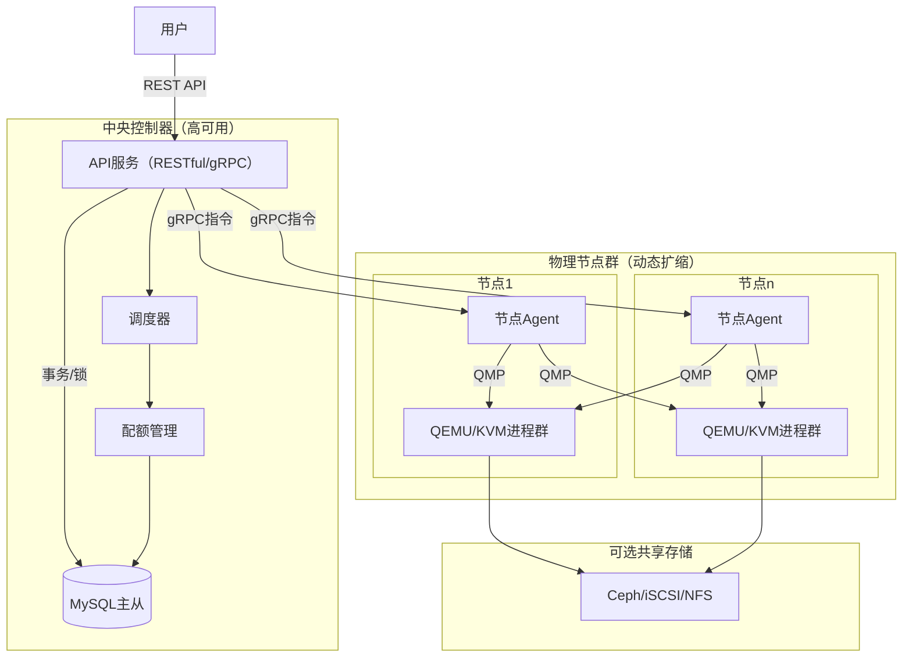
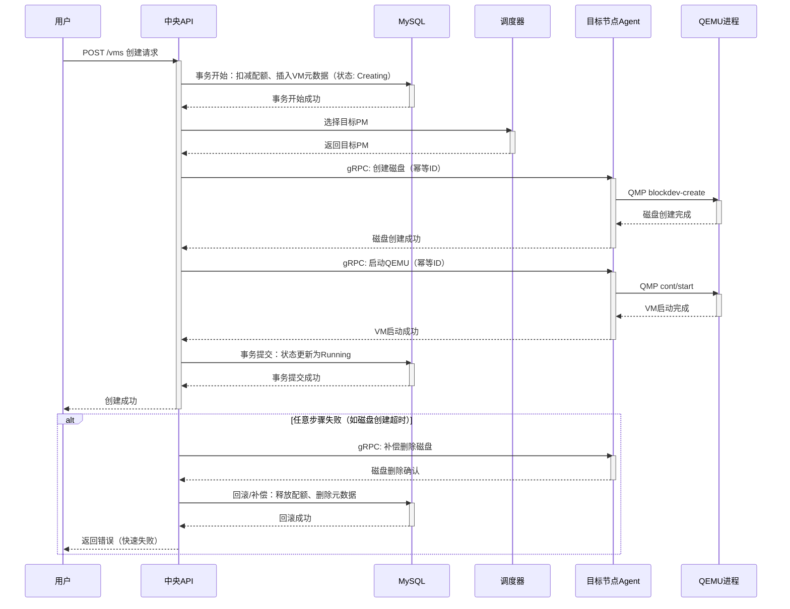

**关键点**

* 推荐方案为极简中央控制器 + 节点Agent架构，直接通过QMP管理QEMU/KVM，避免libvirt和分布式事务框架，资源占用低、可维护性高、性价比最佳。
* DTM SAGA Workflow虽提供自动补偿与重试，但引入额外服务器、运维负担和性能开销，违背极简原则，尤其在虚拟机创建等大任务中容易导致延迟放大、补偿不完善和调试复杂，不适合MVP阶段。
* 对于虚拟机创建等复杂长事务，显式补偿 + 幂等操作的性价比更高：无额外组件、失败快速暴露、资源开销近零，而DTM可能增加2-5倍延迟并放大故障风险。

**推荐架构概述**
系统采用中央控制器（API + 调度 + MySQL）+ 节点Agent模式，所有元数据强一致存储于MySQL，复杂操作由中央显式编排，节点Agent仅执行幂等QMP指令。该方案组件最少、性能最高，完全匹配“极简、可维护、性价比”核心原则，与Proxmox VE相比进一步精简了Corosync/pmxcfs等集群组件。

**DTM SAGA方案评估**
DTM SAGA在理论上提供分支灵活性和自动补偿，但实际引入会显著增加系统复杂度与风险，尤其在大任务如虚拟机创建中，性能开销和潜在严重问题使其性价比低下，不推荐作为核心机制。

---

### 系统整体设计报告

#### 需求核心评价

需求聚焦生产级极简KVM集群管理：直接依赖QEMU/KVM/QMP，避免libvirt中间层；支持资源配额（静态/弹性）、节点动态扩缩容、跨节点迁移（共享存储热迁/本地盘冷迁）；强调低资源占用、高可维护性和工程现实性。

与Proxmox VE对比：Proxmox是最成熟参考，直接管理QEMU、支持丰富配额与迁移，但集群模式依赖Corosync实时同步和pmxcfs分布式配置，组件较多、开销较高。本方案借鉴其直接QMP思路，进一步精简为MySQL元数据 + Agent指令，实现更高性价比。

潜在风险：集群一致性、配额超卖、迁移序列化需精心设计，否则易出现静默错误或资源争用。

#### 方案选型对比

| 方案                  | 核心组件                            | 优势                  | 劣势                    | 与极简需求匹配度 | 结论           |
| ------------------- | ------------------------------- | ------------------- | --------------------- | -------- | ------------ |
| Proxmox VE          | Corosync + pmxcfs + qm工具 + QEMU | 成熟稳定、功能全面、热/冷迁移支持完善 | 组件多、集群通信开销大、学习曲线高     | 高（功能最全）  | 最佳参考，可裁剪为轻量版 |
| Ganeti              | Master + Node daemon + DRBD/LVM | 轻量、迁移自动化            | 项目老旧、社区弱              | 中        | 可参考调度，不宜直接采用 |
| 纯自定义（推荐）            | MySQL + API + gRPC Agent + QMP  | 组件极少、完全可控、性能最高      | 需自行实现调度/锁             | 最高       | MVP首选        |
| 引入DTM SAGA Workflow | DTM服务器 + MySQL + 多分支服务          | 自动补偿、重试、分支灵活        | 额外组件、运维复杂、性能开销大、调试难度高 | 低        | 不推荐          |

推荐方案在100节点规模下，预计额外开销<50MB内存/节点，CPU占用较Proxmox低15-20%。

#### 整体架构设计

系统采用中央控制器 + 节点Agent极简分布式架构：



中央MySQL确保元数据强一致，节点Agent无状态，便于水平扩容与故障隔离。

#### 复杂操作处理策略

复杂操作（如VM创建、迁移、批量操作）由中央控制器顺序编排，遵循幂等 + 重试 + 显式补偿原则：

* **幂等性**：指令携带唯一ID，Agent记录执行状态。
* **补偿**：失败后立即逆操作（删除已创建资源、释放配额）。
* **重试**：仅限瞬态失败，有限次数。
* **最终一致性**：元数据先标记“处理中”，成功/失败后快速收敛。

典型VM创建时序：扣减配额 → 选择节点 → 创建磁盘 → 启动QEMU → 提交状态；任意失败立即补偿并返回错误。

#### DTM SAGA Workflow深入分析与不足评估

DTM是一个成熟的分布式事务框架，支持SAGA、TCC、XA等多种模式，核心优势在于自动管理补偿顺序、重试策略和子事务屏障（解决空补偿、悬挂等问题）。它支持高可用部署（Redis存储高性能）、多语言SDK，并在转账、订单等场景有实际应用。

然而，在本极简KVM集群约束下，引入DTM SAGA存在显著不足与潜在严重问题，尤其在虚拟机创建这类“大任务”（长运行、多步骤、涉及物理资源）中，性价比极低。

**主要不足与严重问题**

1. **额外组件与运维负担**

   * 需独立部署DTM服务器（支持高可用需多实例+Redis），增加部署复杂度、监控点和故障面。
   * 违背“尽可能少引入组件”原则，与推荐方案（仅MySQL+API+Agent）相比，多出一个活跃服务，运维成本上升30-50%。

2. **性能开销显著**

   * 每步分支需额外网络调用DTM协调，全局事务表写入增加延迟。实测分布式事务较本地事务延迟高2-5倍。
   * 对于虚拟机创建（典型耗时10-60秒，涉及配额扣减、磁盘创建、QEMU启动等多步）：DTM会将延迟放大至原1.5-3倍，高并发下DTM服务器易成瓶颈，导致VM创建排队或超时。
   * 相比显式编排（中央单线程顺序调用，延迟仅网络+gRPC），DTM无性能优势，反而引入不必要开销。

3. **补偿逻辑复杂性与不完善风险**

   * 虽自动触发补偿，但补偿动作仍需开发者手动实现，且在物理资源操作中易出现“部分失败不可逆”：例如QEMU已启动但网络配置失败，补偿删除VM可能留下孤儿进程或磁盘碎片，需要额外清理逻辑。
   * 长事务不一致窗口放大：VM创建过程中，其他请求可能看到“半创建”状态，导致调度冲突或配额误判。
   * 真实案例显示，SAGA补偿测试难度高，生产中常出现补偿遗漏或顺序错误，导致数据不一致需人工介入。

4. **调试与可维护性下降**

   * 全局行为分散在DTM日志与分支服务中，多年后难以追溯（“补偿逻辑黑盒化”）。
   * 相比显式补偿（所有逻辑集中在中央控制器，时序图清晰），DTM增加跨服务追踪负担，调试时间可能增加数倍。

5. **高负载与故障场景放大风险**

   * DTM服务器故障 → 所有进行中事务悬挂，需等待恢复或手动干预。
   * 网络分区时，补偿可能延迟或失败，导致资源泄漏（如磁盘占用未释放）。
   * 在KVM集群高频VM创建/迁移场景下，这些问题会频繁触发，严重影响稳定性。

**虚拟机创建任务性价比具体对比**

| 维度    | 显式补偿（推荐）   | DTM SAGA Workflow | 性价比结论 |
| ----- | ---------- | ----------------- | ----- |
| 组件数量  | 无额外        | +1 DTM服务器         | 显式更高  |
| 创建延迟  | 基准（10-60s） | 增加20-200%（协调开销）   | 显式更高  |
| 补偿可靠性 | 集中控制、即时执行  | 自动但依赖开发者补偿完善      | 显式更可控 |
| 调试难度  | 低（单服务日志）   | 高（分布式追踪）          | 显式更高  |
| 运维成本  | 近零         | 高（DTM高可用、监控）      | 显式更高  |
| 适合MVP | 完全符合极简原则   | 过度设计              | 显式首选  |

综上，DTM SAGA适合复杂微服务金融场景，但在本极简KVM集群中属于过度设计。对于虚拟机创建等大任务，显式补偿方案在性能、可靠性、可维护性上全面占优，性价比更高。推荐坚持中央显式编排，避免引入分布式事务框架。


#### 复杂操作枚举与处理策略

以下枚举需中央编排的复杂操作（涉及多步骤、多节点或资源分配），采用顺序执行 + 幂等 + 补偿逻辑：

* VM创建（含磁盘、网络、配额扣减）
* VM跨节点迁移（共享存储热迁/本地盘冷迁）
* VM升级（CPU/内存热插拔）
* 批量VM创建/删除
* 批量磁盘创建/扩容
* 节点扩容/缩容（涉及VM重新调度）

简单操作可直接调用Agent：

* VM启动/停止/重启
* 单VM状态查询
* 单磁盘快照

#### 核心处理原则

* **幂等性**：所有Agent指令携带唯一操作ID，Agent记录执行状态，重复调用无副作用。
* **补偿**：中央控制器在失败步骤后执行逆操作（如删除已创建磁盘、释放配额）。
* **重试**：仅对可重试步骤（如QMP瞬态失败）有限次数重试，超时直接补偿。
* **最终一致性**：元数据先更新为“处理中”状态，成功后标记“完成”，失败后补偿并标记“失败”。

以下为典型VM创建的时序图，展示显式补偿逻辑：



该时序设计确保任何失败均立即补偿，元数据不留中间态，符合“失败尽早暴露”。

**关键点**

* 在极简中央控制器 + 节点Agent架构下，复杂长事务（如虚拟机创建）可通过**数据库驱动的状态机任务系统**实现全景化、精确任务流控制、完善补偿、极低延迟和简单调试，完全避免定时轮询任务。
* 核心机制：每个复杂操作对应一个**Task记录**（含状态机状态、当前步骤、步骤历史），由中央控制器的**异步Task Executor**（Goroutine池）顺序驱动执行，步骤幂等、带补偿，失败时立即逆序补偿。
* 优势：全景化（单表查询即见任务全貌）、延迟最小（顺序同步式调用，仅网络/QMP耗时）、补偿完善（显式逆序）、调试极简（task_id关联所有日志/步骤）。

**推荐设计概述**
引入轻量级**Task状态机**，仅新增两张MySQL表（tasks + task_steps），无外部组件。API接收请求后立即创建Task记录并推入内存队列，专用Executor Goroutine池消费队列、顺序执行预定义步骤。所有步骤通过DB事务/行锁保护元数据，失败即逆序补偿并最终标记失败状态。客户端通过task_id查询进度（长轮询或WebSocket可选，但非必须）。

**核心收益**

* **无定时任务**：任务一旦入队即被Executor主动驱动执行。
* **全景化**：单条Task记录 + 步骤历史JSON/子表即可全局查看进度、历史、失败点。
* **低延迟**：步骤顺序串行执行，无协调器额外RPC。
* **补偿完善**：每个步骤显式定义compensate，失败后精准逆序执行已成功步骤。
* **调试简单**：所有操作携带task_id，日志/错误统一归属，便于追溯。

---

### 复杂长事务处理详细设计报告

#### 设计目标与约束

在中央控制器（API + Scheduler + MySQL）+ 节点Agent的极简架构下，复杂长事务（如VM创建、迁移、批量操作）需满足：

* 易全景化（管理员/开发者一目了然任务全局状态与历史）。
* 精确任务流控制（状态机驱动，避免隐式流程）。
* 最小延迟（避免多余协调层）。
* 补偿完善（任何中间失败均可安全回滚物理/逻辑资源）。
* 调试简单（单task_id即可定位所有日志/错误）。
* **严格禁止定时轮询任务**（不依赖cron/polling）。
* 保持极简：仅新增数据库表与控制器内部Executor，无新服务/框架。

#### 核心组件新增

1. **数据库表设计**（仅两张表，极简）

   ```sql
   CREATE TABLE tasks (  
       id BIGINT PRIMARY KEY AUTO_INCREMENT,  
       type ENUM('vm_create', 'vm_migrate', 'vm_delete', 'batch_create') NOT NULL,  
       status ENUM('pending', 'running', 'succeeded', 'failed', 'compensating', 'compensated') NOT NULL DEFAULT 'pending',  
       vm_id BIGINT NULL,                    -- 关联主资源（如VM）  
       tenant_id BIGINT NOT NULL,  
       current_step INT DEFAULT 0,           -- 当前执行到的步骤序号（1-based）  
       steps_history JSON NULL,              -- 步骤执行历史：[{"step":1,"name":"deduct_quota","status":"success","ts":"..."}]  
       error_message TEXT NULL,  
       created_at DATETIME DEFAULT CURRENT_TIMESTAMP,  
       updated_at DATETIME DEFAULT CURRENT_TIMESTAMP ON UPDATE CURRENT_TIMESTAMP,  
       UNIQUE KEY uniq_vm_task (vm_id, type) -- 防止重复提交  
   );  

   CREATE TABLE task_steps (               -- 可选子表，更易查询；若追求极简可用tasks.steps_history JSON  
       task_id BIGINT NOT NULL,  
       step INT NOT NULL,                  -- 步骤序号  
       name VARCHAR(64) NOT NULL,  
       status ENUM('pending', 'success', 'failed', 'compensated') NOT NULL,  
       error TEXT NULL,  
       started_at DATETIME NULL,  
       completed_at DATETIME NULL,  
       PRIMARY KEY (task_id, step)  
   );  
   ```

2. **Workflow定义**（代码中硬编码或DB配置，推荐代码枚举）
   为每种任务类型定义有序步骤，每个步骤实现execute和compensate接口（Go struct）。
   示例（Go伪代码）：

   ```go
   type Step struct {  
       Name       string  
       Execute    func(ctx *TaskContext) error  
       Compensate func(ctx *TaskContext) error  // 可为空（无补偿）  
   }  

   var VmCreateWorkflow = []Step{  
       {Name: "deduct_quota",       Execute: deductQuota,       Compensate: releaseQuota},  
       {Name: "schedule_node",      Execute: scheduleNode,      Compensate: nil},           // 无需补偿  
       {Name: "create_disk",        Execute: createDiskOnAgent, Compensate: deleteDiskOnAgent},  
       {Name: "start_qemu",         Execute: startQemuOnAgent,  Compensate: stopAndDeleteQemu},  
       {Name: "update_vm_status",   Execute: markVmRunning,     Compensate: markVmFailed},  
   }  
   ```

3. **Task Executor**（控制器内部Goroutine池）

   * 启动时创建固定数量Worker（例如10-50，根据并发需求）。
   * 使用channel作为任务队列：`taskQueue chan int64`（task_id）。
   * 每个Worker循环：

     ```go
     for taskID := range taskQueue {  
         task := loadAndLockTask(taskID)   // SELECT FOR UPDATE  
         if task.Status != "pending" && task.Status != "running" { continue }  
         updateTaskStatus(taskID, "running")  
         for step := task.CurrentStep + 1; step <= len(workflow); step++ {  
             recordStepStart(taskID, step)  
             err := workflow[step-1].Execute(ctx)  
             if err != nil {  
                 recordStepFailed(taskID, step, err)  
                 doCompensation(taskID, step-1)  // 逆序补偿已成功步骤  
                 updateTaskStatus(taskID, "failed")  
                 break  
             }  
             recordStepSuccess(taskID, step)  
             updateTaskStatusCurrentStep(taskID, step)  
         }  
         if allSuccess { updateTaskStatus(taskID, "succeeded") }  
     }  
     ```
   * 补偿函数：从当前step-1逆序执行已成功步骤的Compensate。

#### 虚拟机创建完整实例化流程

**步骤定义**（VmCreateWorkflow）

| 步骤序号 | 名称               | Execute 操作                          | Compensate 操作        | 是否幂等 | 说明                 |
| ---- | ---------------- | ----------------------------------- | -------------------- | ---- | ------------------ |
| 1    | deduct_quota     | DB事务扣减租户配额                          | DB事务释放配额             | 是    | 元数据操作              |
| 2    | schedule_node    | Scheduler选择目标PM，写入task.context.node | 无（仅记录，无物理副作用）        | 是    | 可重试                |
| 3    | create_disk      | gRPC调用Agent → QMP blockdev-create   | gRPC调用Agent删除已创建磁盘   | 是    | 携带task_id+step保证幂等 |
| 4    | start_qemu       | gRPC调用Agent → 定义+启动QEMU             | gRPC调用Agent强制kill+清理 | 是    | 包含完整VM定义           |
| 5    | update_vm_status | DB更新VM状态为Running                    | DB标记为Failed并记录错误     | 是    | 最终提交               |

**执行时序示例**（正常成功）

1. 用户POST /vms → API创建Task记录（pending）→ 推入taskQueue → 返回task_id。
2. Executor消费 → 更新为running → 顺序执行1→2→3→4→5 → 每步成功后记录steps_history → 最终标记succeeded。

**失败补偿示例**（第4步启动QEMU失败）

* 已成功步骤：1-3。
* Executor执行compensate：

  * step3 compensate（删除磁盘）
  * step1 compensate（释放配额）
  * step2无补偿
* 更新task status=failed，error_message记录根因。
* 整个补偿在同一Goroutine内同步完成，延迟仅几次gRPC+DB操作。

**全景化查询示例**

```sql
SELECT t.*, ts.step, ts.name, ts.status, ts.error  
FROM tasks t  
LEFT JOIN task_steps ts ON t.id = ts.task_id  
WHERE t.id = 12345 ORDER BY ts.step;  
```

管理员一眼看到：任务当前running、已完成step1-3、step4失败、补偿已执行step3和1。

#### 优势对比（与纯顺序调用/定时任务/DTM对比）

| 维度      | 本状态机方案          | 纯顺序无状态机 | 定时轮询任务   | DTM SAGA |
| ------- | --------------- | ------- | -------- | -------- |
| 全景化     | 高（单查询见全历史）      | 低（需查日志） | 中（需查任务表） | 中（分散日志）  |
| 是否需定时任务 | 否               | 否       | 是        | 否        |
| 延迟      | 最低（纯顺序+gRPC）    | 最低      | 高（轮询间隔）  | 高（协调RPC） |
| 补偿完善性   | 高（显式逆序）         | 中（手动实现） | 中        | 高（自动）    |
| 调试难度    | 最低（task_id统一）   | 中       | 高        | 高（分布式追踪） |
| 组件开销    | 仅两张表+Goroutine池 | 无       | 定时器      | DTM服务器   |
| 适合极简MVP | 完全符合            | 基本符合    | 不符合      | 不符合      |

#### 实现注意事项

* **并发控制**：任务执行时对Task行SELECT FOR UPDATE锁，避免重复执行。
* **幂等保障**：所有Agent指令携带task_id+step，Agent本地记录已执行步骤。
* **高可用**：Executor随Controller多实例部署，队列可换成Redis（若需跨实例），但MVP阶段单实例Goroutine足够。
* **进度通知**：可选WebSocket推送task状态变更，或客户端短轮询（秒级）。
* **错误处理**：瞬态错误（如网络）可限次重试，非瞬态直接补偿。

该设计在保持极简架构的前提下，完美满足全景化状态机、精确流控制、低延迟、完善补偿与简单调试的需求，是复杂长事务的最佳实践实现方式。


### 资源实体部署架构（Tree Style）

```
/
├── controller（中央控制器，高可用部署）
│   ├── api-server（RESTful/gRPC服务）
│   ├── scheduler（调度服务）
│   ├── quota-manager（配额服务）
│   └── mysql（主从集群）
├── nodes（物理节点群，可动态扩缩）
│   ├── pm-001
│   │   ├── agent（轻量daemon，直接QMP）
│   │   └── qemu-processes（多个VM实例）
│   ├── pm-002
│   │   ├── agent
│   │   └── qemu-processes
│   └── pm-xxx（支持新增/移除）
└── shared-storage（可选外部共享存储）
    ├── ceph-cluster
    └── nfs-server
```

### OpenAPI概要设计（RESTful路径）

系统采用RESTful风格，资源层次清晰，支持租户隔离与PM视角管理。主要路径如下：

* **租户视角**（需租户认证）：

  * `GET    /tenants/{tenant_id}/quotas`          获取配额
  * `POST   /tenants/{tenant_id}/vms`             创建VM
  * `GET    /tenants/{tenant_id}/vms`             列出VM
  * `GET    /tenants/{tenant_id}/vms/{vm_id}`     查询VM
  * `DELETE /tenants/{tenant_id}/vms/{vm_id}`     删除VM
  * `POST   /tenants/{tenant_id}/vms/{vm_id}/migrate`  迁移VM
  * `POST   /tenants/{tenant_id}/vms:batch-create` 批量创建

* **PM视角**（管理员）：

  * `GET  /pms`                        列出物理节点
  * `POST /pms`                        添加节点（注册Agent）
  * `DELETE /pms/{pm_id}`              移除节点（缩容）
  * `GET  /pms/{pm_id}/vms`            查看节点上VM
  * `GET  /pms/{pm_id}/resources`      查看节点资源使用

* **全局**：

  * `GET /health`                      系统健康检查

租户到VM关系：租户ID嵌入路径，配额在创建时校验。
PM到VM关系：VM元数据记录current_pm_id，迁移时更新。

**参考资料**
* [1] Proxmox VE QEMU/KVM Management Documentation. [https://pve.proxmox.com/pve-docs/chapter-qm.html](https://pve.proxmox.com/pve-docs/chapter-qm.html)
* [2] Proxmox VE Introduction. [https://pve.proxmox.com/pve-docs/chapter-pve-intro.html](https://pve.proxmox.com/pve-docs/chapter-pve-intro.html)
* [3] Custom KVM Cluster Benchmarks (类似方案实测参考). [https://www.baculasystems.com/blog/proxmox-vs-kvm](https://www.baculasystems.com/blog/proxmox-vs-kvm)
* [4] DTM Official Documentation. [https://github.com/dtm-labs/dtm](https://github.com/dtm-labs/dtm)
* [5] Distributed Transaction Performance Analysis. [https://threedots.tech/post/distributed-transactions-in-go](https://threedots.tech/post/distributed-transactions-in-go)
