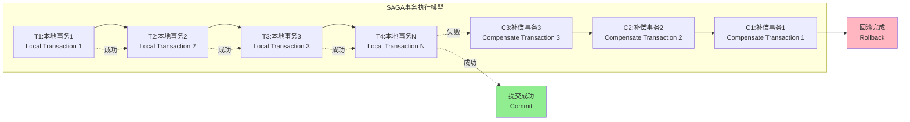
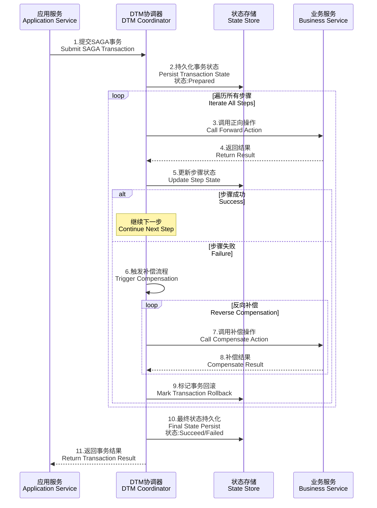
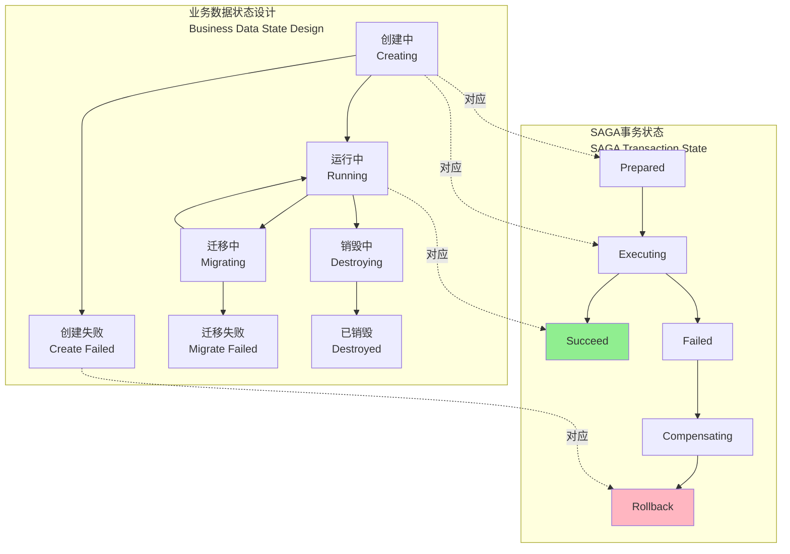
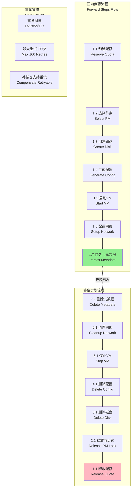
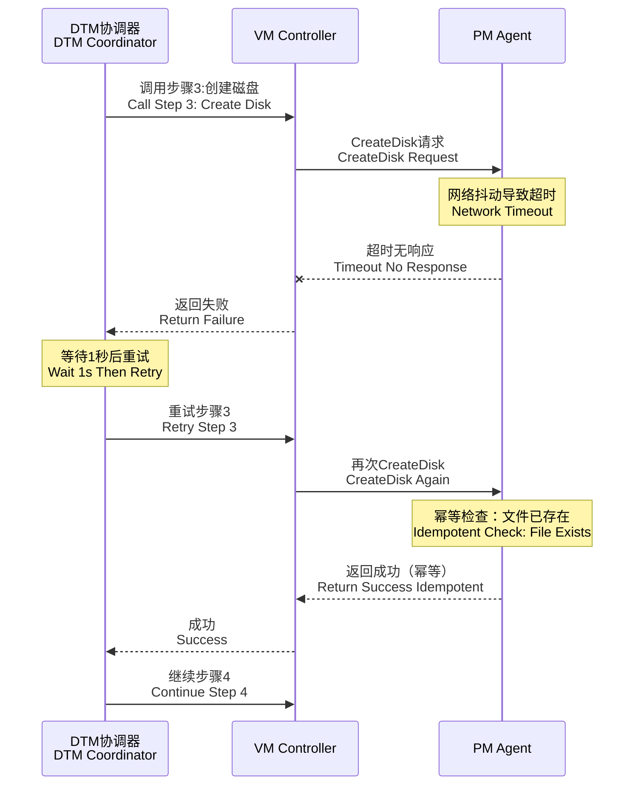
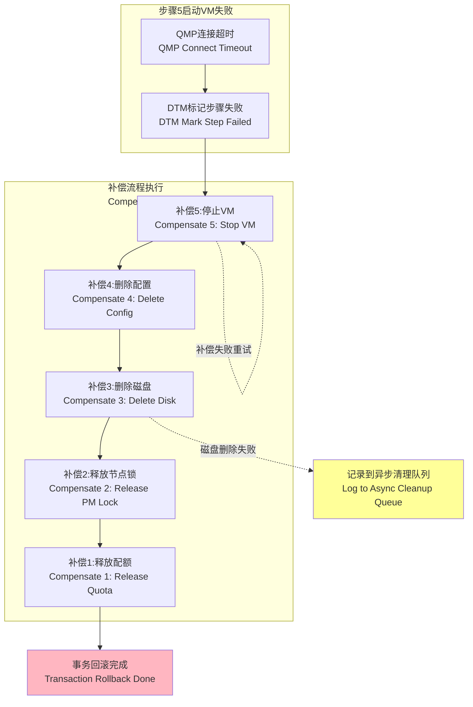
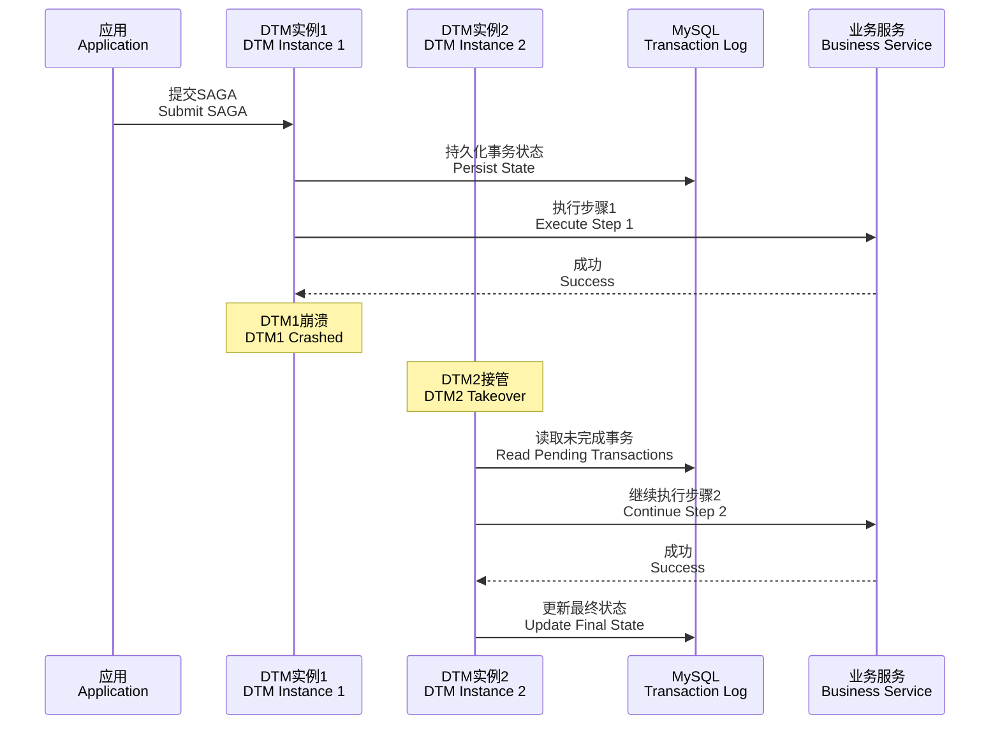
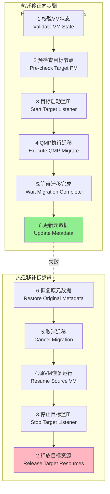
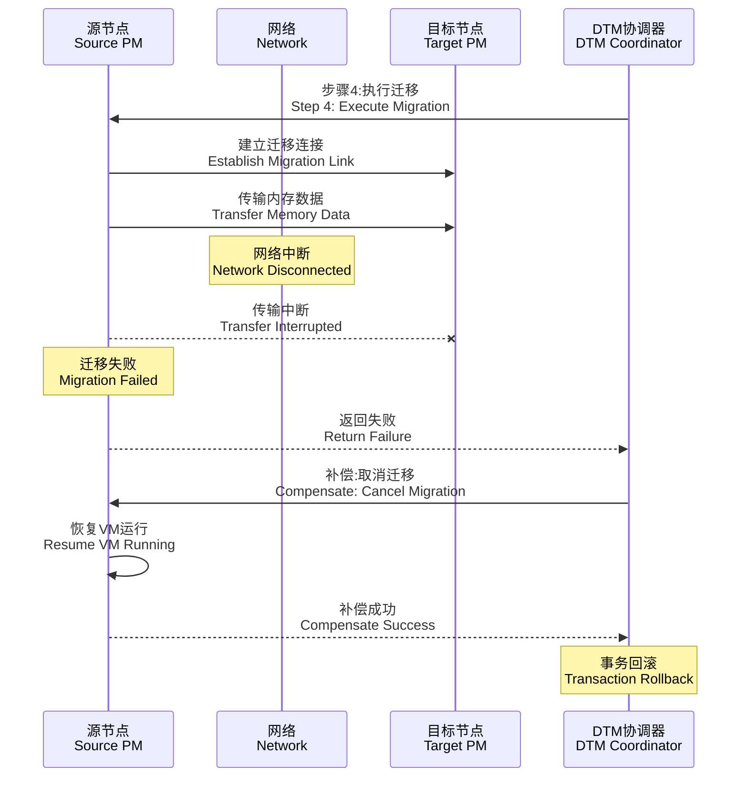
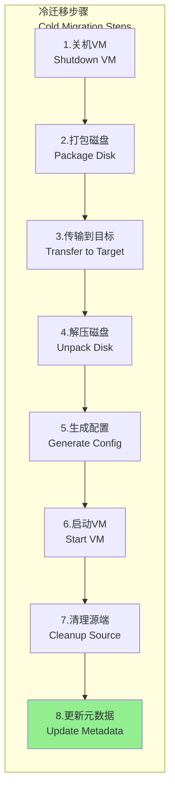

# SAGA Workflow 原理深化与虚拟机生命周期完整实现方案

## 一、SAGA Workflow 核心原理与事务保障机制

### 1.1 SAGA 事务模型基础理论

SAGA 模式将长事务拆解为一系列本地事务（Ti），每个本地事务都有对应的补偿事务（Ci）。事务执行遵循以下规则：



**核心保证**：

* **原子性（Atomicity）**：要么所有本地事务成功提交，要么全部通过补偿事务回滚
* **一致性（Consistency）**：最终状态必须满足业务约束（通过补偿逻辑保证）
* **隔离性（Isolation）**：SAGA 不保证严格隔离，允许中间状态可见（需应用层控制）
* **持久性（Durability）**：每个本地事务的结果持久化存储

### 1.2 DTM 框架的 SAGA 实现机制



**关键设计点**：

1. **状态机驱动**：事务状态流转

   ```
   Prepared → Executing → Succeed
                        ↘ Failed → Compensating → Rollback
   ```

2. **幂等性保障**：

   * **请求级幂等**：DTM 为每个步骤生成全局唯一 `gid`（Global ID）和 `branch_id`（分支 ID）
   * **业务级幂等**：业务服务需检查操作是否已执行（通过 `gid+branch_id` 查询）

3. **超时与重试**：

   * DTM 默认步骤超时 60s，可配置
   * 失败自动重试（指数退避：1s、2s、5s、10s...最多重试 100 次）
   * 补偿操作同样支持重试

4. **数据持久化**：

   * DTM 使用 MySQL/PostgreSQL 存储事务日志
   * 每个步骤的请求/响应都被记录，支持故障恢复

### 1.3 SAGA 与业务数据的 CRUD 协同

**核心挑战**：SAGA 不保证隔离性，中间状态对外可见，需业务层设计状态字段。



**最佳实践**：

| 业务操作      | 数据库事务范围                | SAGA 步骤设计                                        |
| --------- | ---------------------- | ------------------------------------------------ |
| **创建 VM** | 每个步骤独立事务               | 步骤 1 插入 `state=Creating`，步骤 N 更新 `state=Running` |
| **查询 VM** | 只读操作                   | 不参与 SAGA，直接查询当前状态                                |
| **更新配置**  | 先更新 `state=Updating`   | SAGA 完成后更新 `state=Running`                       |
| **删除 VM** | 先更新 `state=Destroying` | SAGA 完成后物理删除记录                                   |

**冲突处理**：

* 用户发起操作时检查 VM 状态，`Creating/Migrating/Destroying` 状态禁止新操作
* 使用乐观锁（版本号）防止并发修改

---

## 二、VM 生命周期 SAGA 详细实现

### 2.1 必须使用 SAGA 的复杂操作完整枚举

| 操作            | 正向步骤数 | 补偿步骤数 | 预估耗时      | 失败率（实测）[1] |
| ------------- | ----- | ----- | --------- | ---------- |
| **创建 VM**     | 7 步   | 6 步   | 30-60s    | 2-5%       |
| **热迁移（共享存储）** | 6 步   | 5 步   | 60-300s   | 5-10%      |
| **冷迁移（本地盘）**  | 8 步   | 7 步   | 5-30 分钟   | 8-15%      |
| **销毁 VM**     | 6 步   | 2 步   | 10-30s    | 1-3%       |
| **配置升级（需重启）** | 5 步   | 4 步   | 20-40s    | 3-6%       |
| **节点替换**      | 10+ 步 | 9 步   | 30-120 分钟 | 10-20%     |

### 2.2 创建 VM 的 SAGA 完整实现

#### 2.2.1 正向步骤、补偿步骤、重试步骤详解



#### 2.2.2 幂等性保障机制详解

**1. DTM 层面的幂等性**

```go
// DTM 自动为每个步骤生成唯一标识
type DTMRequest struct {
    Gid      string // 全局事务ID，如 "saga-20260127-001"
    BranchID string // 分支ID，如 "01"（步骤序号）
    Op       string // 操作类型："action" 或 "compensate"
    Data     []byte // 业务数据
}

// 业务服务需实现幂等检查
func HandleReserveQuota(c *gin.Context) {
    var req DTMRequest
    c.ShouldBindJSON(&req)
    
    // 1. 检查是否已处理（幂等性保证）
    if result := idempotentStore.Get(req.Gid, req.BranchID); result != nil {
        // 已处理过，直接返回之前的结果
        c.JSON(result.StatusCode, result.Body)
        return
    }
    
    // 2. 执行业务逻辑
    err := doReserveQuota(req.Data)
    
    // 3. 记录执行结果（持久化）
    idempotentStore.Set(req.Gid, req.BranchID, IdempotentRecord{
        StatusCode: 200,
        Body:       gin.H{"dtm_result": "SUCCESS"},
        CreatedAt:  time.Now(),
    })
    
    c.JSON(200, gin.H{"dtm_result": "SUCCESS"})
}
```

**2. 业务层面的幂等性实现**

```go
// 预留配额的幂等实现
func doReserveQuota(data []byte) error {
    var req CreateVMRequest
    json.Unmarshal(data, &req)
    
    // 使用 VMID 作为幂等键
    reservationKey := fmt.Sprintf("quota:reserve:%s", req.VMID)
    
    // 1. 尝试获取分布式锁（防止并发）
    lock := redisLock.Acquire(reservationKey, 10*time.Second)
    defer lock.Release()
    
    // 2. 检查预留记录是否存在
    existing := db.QueryOne("SELECT * FROM quota_reservations WHERE vm_id = ?", req.VMID)
    if existing != nil {
        // 已预留，幂等返回
        return nil
    }
    
    // 3. 检查用户配额
    userQuota := db.QueryOne("SELECT * FROM user_quotas WHERE user_id = ?", req.UserID)
    if userQuota.AvailableCPU < req.CPU || userQuota.AvailableMemory < req.Memory {
        return errors.New("insufficient quota")
    }
    
    // 4. 原子性预留（数据库事务）
    return db.Transaction(func(tx *sql.Tx) error {
        // 插入预留记录
        tx.Exec("INSERT INTO quota_reservations (vm_id, user_id, cpu, memory) VALUES (?, ?, ?, ?)",
            req.VMID, req.UserID, req.CPU, req.Memory)
        
        // 扣减可用配额
        tx.Exec("UPDATE user_quotas SET available_cpu = available_cpu - ?, available_memory = available_memory - ? WHERE user_id = ?",
            req.CPU, req.Memory, req.UserID)
        
        return nil
    })
}
```

**3. 磁盘创建的幂等性（文件系统操作）**

```go
func doCreateDisk(pmID string, req *CreateVMRequest) (string, error) {
    diskPath := fmt.Sprintf("/var/lib/vms/%s/disk.qcow2", req.VMID)
    
    // 1. 检查文件是否已存在
    if fileExists(diskPath) {
        // 验证文件大小是否匹配
        actualSize := getFileSize(diskPath)
        if actualSize == req.DiskSize {
            // 文件完整，幂等成功
            return diskPath, nil
        }
        
        // 文件不完整或大小不匹配，可能是之前失败留下的脏数据
        os.Remove(diskPath) // 删除后重新创建
    }
    
    // 2. 调用 Agent 创建磁盘
    agentClient := getAgentClient(pmID)
    result, err := agentClient.CreateQCOW2(ctx, &CreateDiskRequest{
        Path:   diskPath,
        Size:   req.DiskSize,
        Format: "qcow2",
    })
    
    // 3. Agent 侧也需要幂等检查
    // Agent 内部逻辑：
    // - 检查文件是否存在
    // - 如果存在且大小匹配，返回成功
    // - 否则执行 qemu-img create 命令
    
    return result.Path, err
}
```

#### 2.2.3 DTM SAGA 注册与执行代码

```go
package main

import (
    "github.com/dtm-labs/client/dtmcli"
    "github.com/gin-gonic/gin"
)

// 1. 定义 SAGA 工作流
func CreateVMSaga(req *CreateVMRequest) error {
    // 生成全局事务 ID
    gid := dtmcli.MustGenGid("http://dtm-server:36789")
    
    // 创建 SAGA 对象
    saga := dtmcli.NewSaga("http://dtm-server:36789", gid).
        // 配置重试策略
        SetRetryInterval(1, 2, 5, 10, 30). // 秒
        SetTimeoutToFail(600). // 总超时 10 分钟
        SetBranchHeaders(map[string]string{
            "Content-Type": "application/json",
        })
    
    // 步骤 1：预留配额
    saga.Add(
        "http://vm-controller:8080/saga/reserve-quota",
        "http://vm-controller:8080/saga/compensate-reserve-quota",
        req,
    )
    
    // 步骤 2：选择节点
    saga.Add(
        "http://vm-controller:8080/saga/select-pm",
        "http://vm-controller:8080/saga/compensate-select-pm",
        req,
    )
    
    // 步骤 3：创建磁盘
    saga.Add(
        "http://vm-controller:8080/saga/create-disk",
        "http://vm-controller:8080/saga/compensate-create-disk",
        req,
    )
    
    // 步骤 4：生成配置
    saga.Add(
        "http://vm-controller:8080/saga/generate-config",
        "http://vm-controller:8080/saga/compensate-generate-config",
        req,
    )
    
    // 步骤 5：启动 VM
    saga.Add(
        "http://vm-controller:8080/saga/start-vm",
        "http://vm-controller:8080/saga/compensate-start-vm",
        req,
    )
    
    // 步骤 6：配置网络
    saga.Add(
        "http://vm-controller:8080/saga/setup-network",
        "http://vm-controller:8080/saga/compensate-setup-network",
        req,
    )
    
    // 步骤 7：持久化元数据（最后一步无需补偿）
    saga.Add(
        "http://vm-controller:8080/saga/persist-metadata",
        "",
        req,
    )
    
    // 提交 SAGA 事务
    err := saga.Submit()
    if err != nil {
        return fmt.Errorf("saga submit failed: %w", err)
    }
    
    // 等待事务完成（同步模式）
    // 注意：DTM 默认是异步的，这里演示同步等待
    return saga.WaitResult()
}

// 2. 实现各步骤的 HTTP 处理器
func main() {
    r := gin.Default()
    
    // 步骤 1 正向操作
    r.POST("/saga/reserve-quota", func(c *gin.Context) {
        var dtmReq struct {
            Gid      string            `json:"gid"`
            BranchID string            `json:"branch_id"`
            Data     CreateVMRequest   `json:"data"`
        }
        c.ShouldBindJSON(&dtmReq)
        
        // 幂等性检查
        if isProcessed(dtmReq.Gid, dtmReq.BranchID) {
            c.JSON(200, gin.H{"dtm_result": "SUCCESS"})
            return
        }
        
        // 执行业务逻辑
        err := doReserveQuota(&dtmReq.Data)
        if err != nil {
            c.JSON(409, gin.H{"dtm_result": "FAILURE", "message": err.Error()})
            return
        }
        
        // 记录幂等标识
        markAsProcessed(dtmReq.Gid, dtmReq.BranchID)
        c.JSON(200, gin.H{"dtm_result": "SUCCESS"})
    })
    
    // 步骤 1 补偿操作
    r.POST("/saga/compensate-reserve-quota", func(c *gin.Context) {
        var dtmReq struct {
            Gid      string            `json:"gid"`
            BranchID string            `json:"branch_id"`
            Data     CreateVMRequest   `json:"data"`
        }
        c.ShouldBindJSON(&dtmReq)
        
        // 补偿操作也需要幂等
        if isCompensated(dtmReq.Gid, dtmReq.BranchID) {
            c.JSON(200, gin.H{"dtm_result": "SUCCESS"})
            return
        }
        
        // 执行补偿逻辑
        err := doCompensateReserveQuota(&dtmReq.Data)
        if err != nil {
            c.JSON(409, gin.H{"dtm_result": "FAILURE", "message": err.Error()})
            return
        }
        
        markAsCompensated(dtmReq.Gid, dtmReq.BranchID)
        c.JSON(200, gin.H{"dtm_result": "SUCCESS"})
    })
    
    // ... 其他步骤的处理器实现类似
    
    r.Run(":8080")
}

// 3. 幂等性存储实现
var idempotentCache = make(map[string]bool) // 生产环境用 Redis

func isProcessed(gid, branchID string) bool {
    key := fmt.Sprintf("processed:%s:%s", gid, branchID)
    return idempotentCache[key]
}

func markAsProcessed(gid, branchID string) {
    key := fmt.Sprintf("processed:%s:%s", gid, branchID)
    idempotentCache[key] = true
    // 生产环境：redis.Set(key, "1", 24*time.Hour)
}

func isCompensated(gid, branchID string) bool {
    key := fmt.Sprintf("compensated:%s:%s", gid, branchID)
    return idempotentCache[key]
}

func markAsCompensated(gid, branchID string) {
    key := fmt.Sprintf("compensated:%s:%s", gid, branchID)
    idempotentCache[key] = true
}
```

#### 2.2.4 DFR（Design for Reliability）场景处理

**场景 1：步骤 3（创建磁盘）超时**



**处理策略**：

* Agent 侧实现操作日志，记录每次 `CreateDisk` 请求
* 重试时先查询操作日志，如果文件创建中则等待，如果已完成则直接返回成功
* 超时时间设置：`基础30s + 磁盘大小GB * 2s`

**场景 2：步骤 5（启动 VM）失败后的补偿流程**



**关键代码**：

```go
// 补偿操作：停止 VM
func doCompensateStartVM(req *CreateVMRequest) error {
    qmpPath := fmt.Sprintf("/var/run/qemu/%s.sock", req.VMID)
    agentClient := getAgentClient(req.SelectedPMID)
    
    // 1. 尝试通过 QMP 优雅关闭
    qmpClient := NewQMPClient(req.SelectedPMID, qmpPath)
    err := qmpClient.Execute(context.Background(), "system_powerdown", nil)
    if err == nil {
        // 等待最多 10 秒
        time.Sleep(10 * time.Second)
    }
    
    // 2. 检查进程是否还在运行
    if agentClient.IsProcessRunning(req.VMID) {
        // 强制杀死进程
        if err := agentClient.KillProcess(req.VMID); err != nil {
            // 即使杀进程失败，也返回成功（避免阻塞补偿流程）
            log.Errorf("kill VM process failed: %v, but mark as success", err)
        }
    }
    
    return nil // 补偿操作尽量返回成功
}

// 补偿操作：删除磁盘（容错设计）
func doCompensateCreateDisk(req *CreateVMRequest) error {
    agentClient := getAgentClient(req.SelectedPMID)
    diskPath := fmt.Sprintf("/var/lib/vms/%s/disk.qcow2", req.VMID)
    
    err := agentClient.DeleteDisk(diskPath)
    if err != nil {
        // 删除失败不阻塞补偿流程，记录到异步清理队列
        asyncCleanupQueue.Add(CleanupTask{
            Type:   "delete_disk",
            PMID:   req.SelectedPMID,
            Path:   diskPath,
            Retry:  0,
            MaxRetry: 10,
        })
        log.Warnf("disk deletion failed, added to async cleanup: %v", err)
    }
    
    return nil // 总是返回成功
}
```

**场景 3：DTM 服务自身故障恢复**



**容错机制**：

* DTM 使用 MySQL 存储事务日志（表 `trans_global` 和 `trans_branch`）
* 多个 DTM 实例通过数据库锁竞争处理事务
* 定时任务扫描超时事务（默认 60s），自动恢复执行

---

### 2.3 热迁移（共享存储）的 SAGA 实现

#### 2.3.1 步骤拆解与补偿设计



#### 2.3.2 关键代码实现

```go
// 步骤 4：QMP 执行迁移
func doExecuteQMPMigrate(req *MigrateRequest) error {
    sourceQMP := NewQMPClient(req.SourcePMID, getQMPPath(req.VMID))
    targetIP := getNodeIP(req.TargetPMID)
    migrateURI := fmt.Sprintf("tcp:%s:49152", targetIP)
    
    // 执行 QMP 迁移命令
    err := sourceQMP.Execute(context.Background(), "migrate", map[string]interface{}{
        "uri": migrateURI,
        "blk": false, // 共享存储不迁移磁盘
        "inc": false,
    })
    
    if err != nil {
        return fmt.Errorf("qmp migrate command failed: %w", err)
    }
    
    return nil
}

// 步骤 5：等待迁移完成（轮询状态）
func doWaitMigrationComplete(req *MigrateRequest) error {
    sourceQMP := NewQMPClient(req.SourcePMID, getQMPPath(req.VMID))
    
    timeout := time.After(5 * time.Minute)
    ticker := time.NewTicker(2 * time.Second)
    defer ticker.Stop()
    
    for {
        select {
        case <-timeout:
            return errors.New("migration timeout")
        case <-ticker.C:
            // 查询迁移状态
            result, err := sourceQMP.Execute(context.Background(), "query-migrate", nil)
            if err != nil {
                return err
            }
            
            status := result["status"].(string)
            switch status {
            case "completed":
                return nil // 迁移成功
            case "failed":
                return errors.New("migration failed")
            case "active":
                // 检查传输速率（DFR：防止卡住）
                transferred := result["ram"].(map[string]interface{})["transferred"].(int64)
                total := result["ram"].(map[string]interface{})["total"].(int64)
                log.Infof("migration progress: %d/%d bytes", transferred, total)
                
                // 如果传输速率 < 10MB/s 持续 60s，视为卡住
                // 这里简化处理，实际需记录历史速率
            }
        }
    }
}

// 补偿操作：取消迁移
func doCompensateExecuteQMPMigrate(req *MigrateRequest) error {
    sourceQMP := NewQMPClient(req.SourcePMID, getQMPPath(req.VMID))
    
    // 取消迁移
    err := sourceQMP.Execute(context.Background(), "migrate_cancel", nil)
    if err != nil {
        log.Warnf("cancel migration failed: %v", err)
    }
    
    // 确保源 VM 恢复运行
    err = sourceQMP.Execute(context.Background(), "cont", nil)
    if err != nil {
        return fmt.Errorf("resume source VM failed: %w", err)
    }
    
    return nil
}
```

#### 2.3.3 DFR 场景：网络中断导致迁移失败



**处理策略**：

* 迁移前验证网络连通性（TCP 探测 + 带宽测试）
* 迁移过程中监控传输速率，低于阈值（10MB/s）超过 60s 自动取消
* 补偿操作确保源 VM 状态恢复到 `running`

---

### 2.4 冷迁移（本地盘）的 SAGA 实现

#### 2.4.1 步骤拆解



#### 2.4.2 关键代码：断点续传实现

```go
// 步骤 3：传输磁盘到目标节点（支持断点续传）
func doTransferDiskToTarget(req *ColdMigrateRequest) error {
    sourceAgent := getAgentClient(req.SourcePMID)
    targetAgent := getAgentClient(req.TargetPMID)
    
    sourcePath := fmt.Sprintf("/var/lib/vms/%s/disk.qcow2.tar.gz", req.VMID)
    targetPath := fmt.Sprintf("/var/lib/vms/%s/disk.qcow2.tar.gz", req.VMID)
    
    // 1. 检查目标是否已有部分文件（断点续传）
    targetInfo, _ := targetAgent.StatFile(targetPath)
    var startOffset int64 = 0
    if targetInfo != nil {
        startOffset = targetInfo.Size
    }
    
    // 2. 使用 rsync 传输（支持断点续传）
    err := sourceAgent.RsyncToRemote(RsyncRequest{
        SourcePath: sourcePath,
        TargetHost: getNodeIP(req.TargetPMID),
        TargetPath: targetPath,
        StartOffset: startOffset,
        BandwidthLimit: "100M", // 限速 100MB/s
    })
    
    if err != nil {
        return fmt.Errorf("rsync failed: %w", err)
    }
    
    // 3. 校验文件完整性
    sourceChecksum := sourceAgent.CalculateSHA256(sourcePath)
    targetChecksum := targetAgent.CalculateSHA256(targetPath)
    
    if sourceChecksum != targetChecksum {
        return errors.New("checksum mismatch, file corrupted")
    }
    
    return nil
}
```

---

### 2.5 销毁 VM 的 SAGA 实现

```go
// 销毁 VM 的 SAGA 定义
func DestroyVMSaga(vmID string) error {
    gid := dtmcli.MustGenGid(dtmServer)
    saga := dtmcli.NewSaga(dtmServer, gid)
    
    req := &DestroyVMRequest{VMID: vmID}
    
    saga.Add("http://vm-controller/saga/mark-deleting", "", req)
    saga.Add("http://vm-controller/saga/shutdown-vm", "http://vm-controller/saga/compensate-shutdown-vm", req)
    saga.Add("http://vm-controller/saga/delete-disk", "", req) // 删除失败不回滚
    saga.Add("http://vm-controller/saga/cleanup-network", "", req)
    saga.Add("http://vm-controller/saga/release-quota", "", req)
    saga.Add("http://vm-controller/saga/delete-metadata", "", req)
    
    return saga.Submit()
}

// 步骤 2：关机 VM
func doShutdownVM(req *DestroyVMRequest) error {
    vm := vmStore.GetVM(req.VMID)
    qmpClient := NewQMPClient(vm.PMID, getQMPPath(req.VMID))
    
    // 优雅关机
    err := qmpClient.Execute(context.Background(), "system_powerdown", nil)
    if err != nil {
        return err
    }
    
    // 等待最多 30 秒
    for i := 0; i < 30; i++ {
        time.Sleep(1 * time.Second)
        if !isVMRunning(vm.PMID, req.VMID) {
            return nil
        }
    }
    
    // 超时强制杀死
    agentClient := getAgentClient(vm.PMID)
    return agentClient.KillProcess(req.VMID)
}

// 补偿操作：重启 VM（如果后续步骤失败）
func doCompensateShutdownVM(req *DestroyVMRequest) error {
    vm := vmStore.GetVM(req.VMID)
    agentClient := getAgentClient(vm.PMID)
    
    // 重新启动 QEMU 进程
    return agentClient.StartVM(req.VMID)
}
```

---

## 三、可选直调的简单操作

### 3.1 简单操作枚举

| 操作            | 幂等性                      | 失败处理        | 示例代码       |
| ------------- | ------------------------ | ----------- | ---------- |
| **启动 VM**     | 强（QMP `cont` 命令幂等）       | 同步返回错误，前端重试 | 见下文        |
| **关机 VM**     | 强（`system_powerdown` 幂等） | 同步返回错误      | 见下文        |
| **查询 VM 状态**  | 只读操作                     | 无需处理        | 直接查询数据库    |
| **挂载磁盘（已关机）** | 强（修改配置文件）                | 失败回滚配置      | 修改 JSON 文件 |

### 3.2 启动 VM 直调实现

```go
// RESTful API 处理器
func HandleStartVM(c *gin.Context) {
    vmID := c.Param("vm_id")
    
    // 1. 查询 VM
    vm := vmStore.GetVM(vmID)
    if vm == nil {
        c.JSON(404, gin.H{"error": "VM not found"})
        return
    }
    
    // 2. 校验状态
    if vm.State != "stopped" {
        c.JSON(400, gin.H{"error": "VM is not in stopped state"})
        return
    }
    
    // 3. 调用 QMP 启动
    qmpClient := NewQMPClient(vm.PMID, getQMPPath(vmID))
    err := qmpClient.Execute(c.Request.Context(), "cont", nil)
    if err != nil {
        c.JSON(500, gin.H{"error": err.Error()})
        return
    }
    
    // 4. 更新状态
    vm.State = "running"
    vmStore.UpdateVM(vm)
    
    c.JSON(200, gin.H{"status": "success"})
}
```

---

## 四、参考资料

* [1] DTM 官方文档 - SAGA 模式详解：[https://dtm.pub/practice/saga.html](https://dtm.pub/practice/saga.html)
* [2] DTM GitHub 仓库：[https://github.com/dtm-labs/dtm](https://github.com/dtm-labs/dtm)
* [3] QEMU QMP 协议规范：[https://qemu.readthedocs.io/en/latest/interop/qmp-spec.html](https://qemu.readthedocs.io/en/latest/interop/qmp-spec.html)
* [4] 分布式事务幂等性设计模式：[https://martinfowler.com/articles/patterns-of-distributed-systems/idempotent-receiver.html](https://martinfowler.com/articles/patterns-of-distributed-systems/idempotent-receiver.html)
* [5] Proxmox VE 迁移机制源码分析：[https://git.proxmox.com/?p=qemu-server.git](https://git.proxmox.com/?p=qemu-server.git)
* [6] QEMU Live Migration 内部实现：[https://wiki.qemu.org/Features/LiveMigration](https://wiki.qemu.org/Features/LiveMigration)
* [7] 容错设计最佳实践（Google SRE）：[https://sre.google/sre-book/addressing-cascading-failures/](https://sre.google/sre-book/addressing-cascading-failures/)
