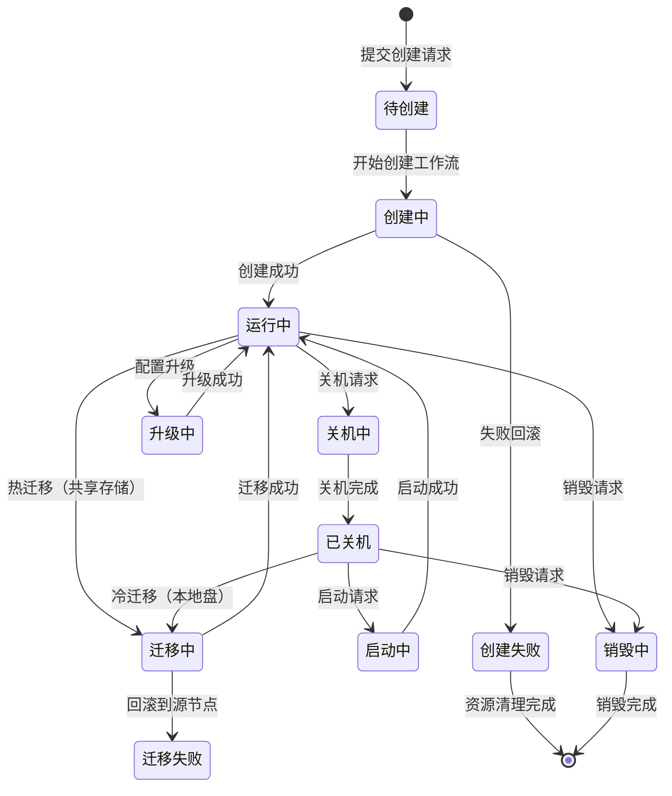
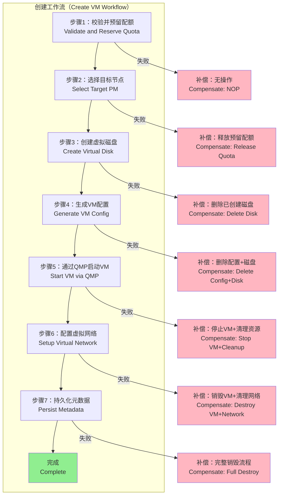
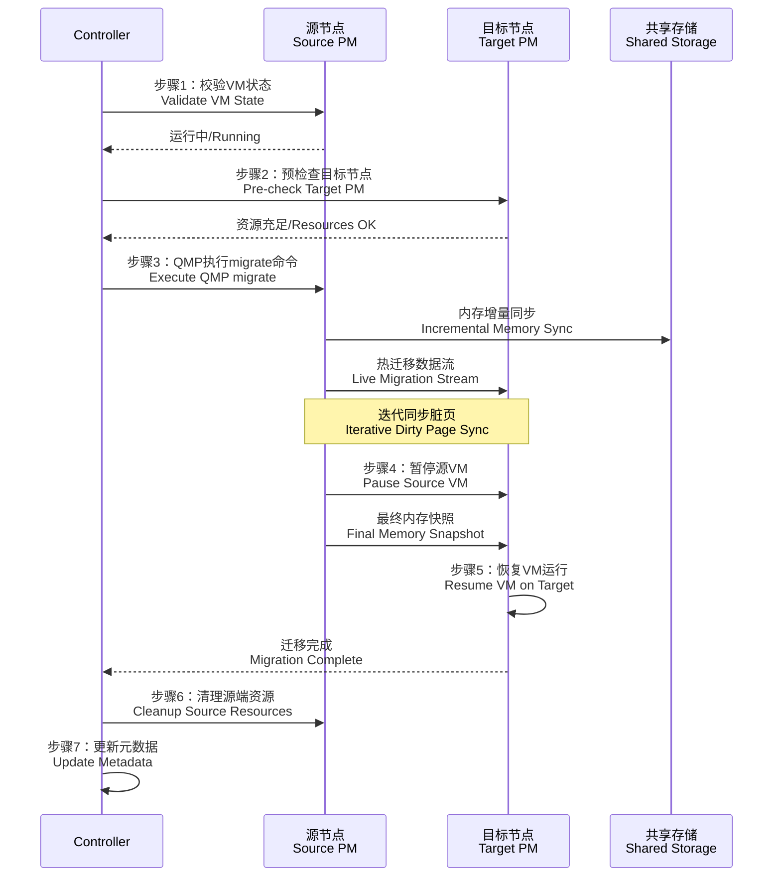
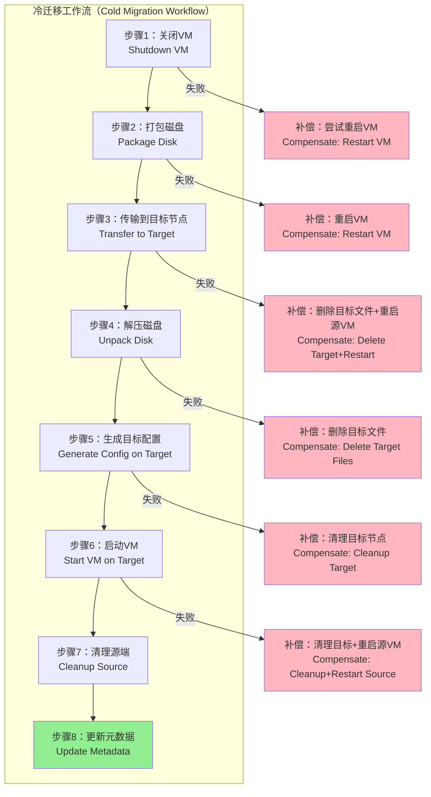
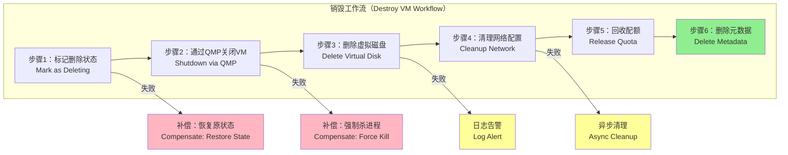
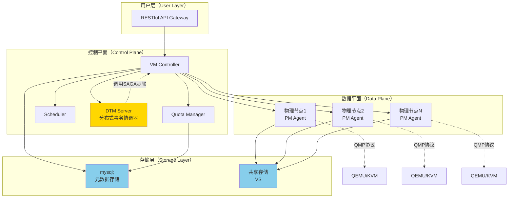
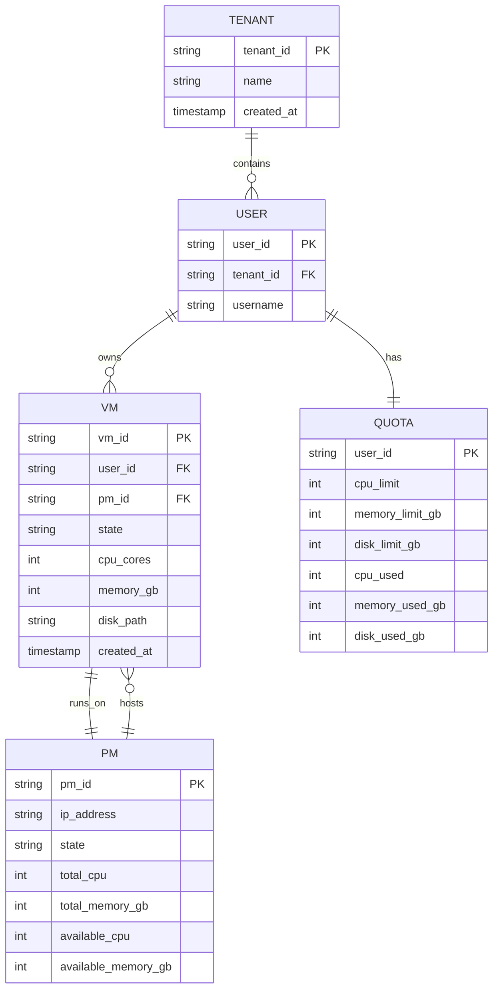
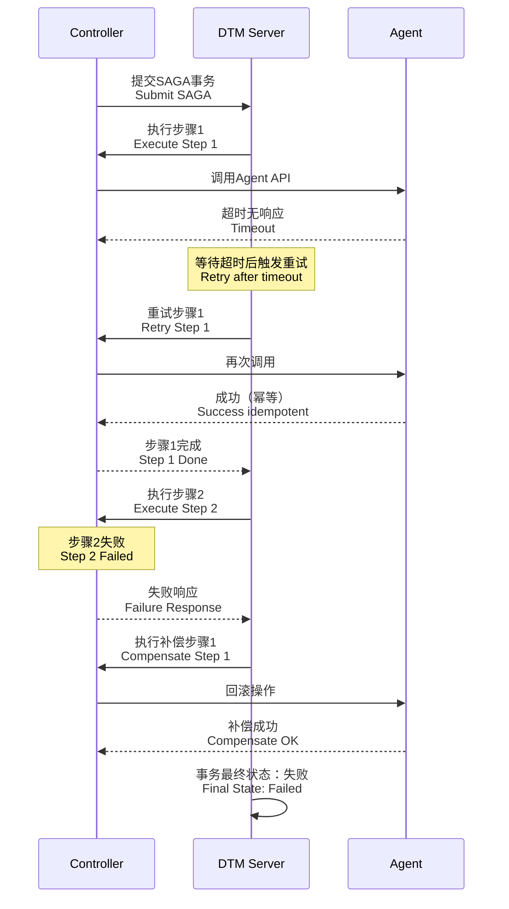

# 基于 SAGA Workflow 的虚拟机生命周期管理设计方案

## 一、需求分析与方案评估

### 1.1 核心需求识别

本方案需要构建一个**极简化的虚拟机管理系统**，核心特征包括：

* **技术栈约束**：直接基于 QMP/QEMU/KVM
* **资源管理**：支持静态分配和弹性超卖的 Resource Quota 控制
* **迁移能力**：支持共享存储热迁移和本地盘冷迁移
* **节点管理**：支持节点扩缩容和替换
* **架构原则**：极简、可维护、性价比优先


---

## 二、虚拟机生命周期 MVP 设计

### 2.1 生命周期状态机



### 2.2 MVP 核心操作分类

#### 2.2.1 必须使用 SAGA Workflow 的复杂操作

| 操作            | 复杂度原因                    | DFR 风险      |
| ------------- | ------------------------ | ----------- |
| **创建 VM**     | 涉及资源分配、磁盘创建、网络配置、QMP 初始化 | 部分成功导致资源泄漏  |
| **跨节点迁移**     | 源节点暂停、网络迁移、目标节点启动、清理源端   | 网络中断、目标节点故障 |
| **销毁 VM**     | QMP 关闭、磁盘释放、配额回收、元数据删除   | 存储清理失败      |
| **配置升级（需重启）** | 快照当前配置、修改资源、热更新/重启       | 配置不兼容导致启动失败 |

#### 2.2.2 可选直调的简单操作

| 操作               | 原因             | 失败处理        |
| ---------------- | -------------- | ----------- |
| **启动/关机**        | 单一 QMP 命令，幂等性强 | 同步返回结果，失败重试 |
| **查询状态**         | 只读操作，无状态变更     | 无需补偿        |
| **挂载/卸载磁盘（已关机）** | 修改配置文件，幂等      | 失败直接返回错误    |

---

## 三、核心 SAGA Workflow 详细设计

### 3.1 VM 创建工作流

#### 3.1.1 整体流程图



#### 3.1.2 详细实现与 DFR 处理

**步骤 1：校验并预留配额**

```go
// 正向操作
func ReserveQuota(ctx context.Context, req *CreateVMRequest) error {
    // 幂等性：使用请求 ID 作为预留标识
    reservationID := fmt.Sprintf("reserve-%s", req.VMID)
    
    // 检查是否已预留（重试场景）
    if existing := quotaStore.GetReservation(reservationID); existing != nil {
        return nil // 已预留，幂等返回成功
    }
    
    // 检查用户配额
    userQuota := quotaStore.GetUserQuota(req.UserID)
    if userQuota.CPU < req.CPU || userQuota.Memory < req.Memory {
        return ErrInsufficientQuota // 快速失败
    }
    
    // 原子性预留（使用分布式锁或数据库事务）
    return quotaStore.AtomicReserve(reservationID, QuotaReservation{
        UserID:    req.UserID,
        CPU:       req.CPU,
        Memory:    req.Memory,
        Disk:      req.DiskSize,
        ExpiresAt: time.Now().Add(10 * time.Minute), // 超时自动释放
    })
}

// 补偿操作（后续步骤失败时调用）
func CompensateReserveQuota(ctx context.Context, req *CreateVMRequest) error {
    // 补偿操作必须幂等
    reservationID := fmt.Sprintf("reserve-%s", req.VMID)
    
    // 删除预留记录（幂等：即使已删除也返回成功）
    return quotaStore.ReleaseReservation(reservationID)
}
```

**DFR 场景处理**：

* **重试策略**：网络抖动导致失败 → 最多重试 3 次，间隔 1s/2s/5s（指数退避）
* **超时保护**：单次调用超时 5s，避免长时间阻塞
* **失败暴露**：配额不足直接返回 `ErrInsufficientQuota`，不进入工作流

---

**步骤 2：选择目标节点**

```go
// 正向操作
func SelectTargetPM(ctx context.Context, req *CreateVMRequest) (string, error) {
    // 幂等性：如果已选择节点，直接返回
    if req.PreSelectedPMID != "" {
        return req.PreSelectedPMID, nil
    }
    
    // 查询所有可用节点
    availablePMs := pmStore.ListHealthyPMs()
    
    // 评分排序（CPU权重40%、内存权重40%、磁盘IO权重20%）
    scored := make([]PMScore, 0, len(availablePMs))
    for _, pm := range availablePMs {
        score := calculateScore(pm, req)
        scored = append(scored, PMScore{PMID: pm.ID, Score: score})
    }
    sort.Slice(scored, func(i, j int) bool {
        return scored[i].Score > scored[j].Score
    })
    
    // 选择最优节点
    if len(scored) == 0 {
        return "", ErrNoAvailablePM // 快速失败
    }
    
    // 乐观锁：尝试在选定节点上预留资源
    selectedPM := scored[0].PMID
    if err := pmStore.TryLockResources(selectedPM, req.CPU, req.Memory); err != nil {
        // 降级：尝试次优节点
        if len(scored) > 1 {
            selectedPM = scored[1].PMID
            if err := pmStore.TryLockResources(selectedPM, req.CPU, req.Memory); err != nil {
                return "", ErrResourceContention
            }
        } else {
            return "", err
        }
    }
    
    return selectedPM, nil
}

// 补偿操作
func CompensateSelectTargetPM(ctx context.Context, pmID string, req *CreateVMRequest) error {
    // 释放节点资源锁（幂等）
    return pmStore.ReleaseResourceLock(pmID, req.CPU, req.Memory)
}
```

**DFR 场景处理**：

* **资源竞争**：多个 VM 同时创建 → 使用乐观锁 + 降级到次优节点
* **节点故障**：选定节点宕机 → 健康检查过滤 + 心跳超时 10s 自动剔除
* **数据一致性**：节点资源使用量通过定时上报（每 30s）+ 事件触发更新保证准实时性

---

**步骤 3：创建虚拟磁盘**

```go
// 正向操作
func CreateVirtualDisk(ctx context.Context, pmID string, req *CreateVMRequest) (string, error) {
    // 幂等性检查：磁盘是否已存在
    diskPath := fmt.Sprintf("/var/lib/vms/%s/disk.qcow2", req.VMID)
    if fileExists(diskPath) {
        // 验证大小是否匹配
        if getDiskSize(diskPath) == req.DiskSize {
            return diskPath, nil // 幂等成功
        }
        // 大小不匹配，可能是脏数据
        return "", ErrDiskSizeMismatch
    }
    
    // 调用目标节点 Agent API 创建磁盘
    agentClient := getAgentClient(pmID)
    result, err := agentClient.CreateQCOW2(ctx, &CreateDiskRequest{
        Path:   diskPath,
        Size:   req.DiskSize,
        Format: "qcow2",
    })
    if err != nil {
        return "", fmt.Errorf("create disk failed: %w", err)
    }
    
    return result.Path, nil
}

// 补偿操作
func CompensateCreateVirtualDisk(ctx context.Context, pmID, diskPath string) error {
    agentClient := getAgentClient(pmID)
    
    // 删除磁盘（幂等：文件不存在也返回成功）
    return agentClient.DeleteDisk(ctx, diskPath)
}
```

**DFR 场景处理**：

* **磁盘创建超时**：设置 60s 超时（根据磁盘大小动态调整：`timeout = 30s + diskSizeGB * 2s`）
* **存储空间不足**：Agent 预检查可用空间，不足直接返回 `ErrInsufficientStorage`
* **脏数据残留**：重试前检查磁盘文件，大小不匹配则先删除再创建
* **网络分区**：Agent 侧使用操作日志，Controller 可查询操作状态避免重复创建

---

**步骤 4：生成 VM 配置**

```go
// 正向操作
func GenerateVMConfig(ctx context.Context, pmID string, req *CreateVMRequest, diskPath string) error {
    configPath := fmt.Sprintf("/etc/vms/%s.json", req.VMID)
    
    // 幂等性检查
    if configExists(pmID, configPath) {
        return nil
    }
    
    // 构建 QEMU 配置
    config := QEMUConfig{
        Name:   req.VMName,
        VMID:   req.VMID,
        CPU:    req.CPU,
        Memory: req.Memory,
        Disks: []DiskConfig{{
            Driver: "virtio-blk",
            File:   diskPath,
            Format: "qcow2",
        }},
        Networks: []NetworkConfig{{
            Model:  "virtio-net-pci",
            Bridge: "br0", // 从节点网络拓扑获取
        }},
        QMP: QMPConfig{
            SocketPath: fmt.Sprintf("/var/run/qemu/%s.sock", req.VMID),
        },
    }
    
    // 写入配置文件
    agentClient := getAgentClient(pmID)
    return agentClient.WriteConfig(ctx, configPath, config)
}

// 补偿操作
func CompensateGenerateVMConfig(ctx context.Context, pmID, vmID string) error {
    configPath := fmt.Sprintf("/etc/vms/%s.json", vmID)
    agentClient := getAgentClient(pmID)
    
    // 删除配置文件（幂等）
    return agentClient.DeleteConfig(ctx, configPath)
}
```

---

**步骤 5：通过 QMP 启动 VM**

```go
// 正向操作
func StartVMViaQMP(ctx context.Context, pmID, vmID string) error {
    agentClient := getAgentClient(pmID)
    
    // 1. 启动 QEMU 进程
    qemuCmd := buildQEMUCommand(vmID) // 从配置生成启动参数
    if err := agentClient.StartProcess(ctx, qemuCmd); err != nil {
        return fmt.Errorf("start qemu failed: %w", err)
    }
    
    // 2. 等待 QMP 就绪（最多 30s）
    qmpPath := fmt.Sprintf("/var/run/qemu/%s.sock", vmID)
    if err := waitForQMPReady(ctx, pmID, qmpPath, 30*time.Second); err != nil {
        return err
    }
    
    // 3. 执行 QMP 命令启动 VM
    qmpClient := NewQMPClient(pmID, qmpPath)
    return qmpClient.Execute(ctx, "cont") // 从 paused 状态恢复
}

// 补偿操作
func CompensateStartVMViaQMP(ctx context.Context, pmID, vmID string) error {
    agentClient := getAgentClient(pmID)
    qmpPath := fmt.Sprintf("/var/run/qemu/%s.sock", vmID)
    
    // 1. 通过 QMP 优雅关闭
    qmpClient := NewQMPClient(pmID, qmpPath)
    if err := qmpClient.Execute(ctx, "system_powerdown"); err == nil {
        // 等待最多 10s
        time.Sleep(10 * time.Second)
    }
    
    // 2. 强制杀死进程
    return agentClient.KillProcess(ctx, vmID)
}
```

**DFR 场景处理**：

* **QEMU 启动失败**：解析错误日志（如配置语法错误、设备不支持），记录到 VM 事件日志
* **QMP 连接超时**：区分场景：

  * Socket 文件不存在 → QEMU 未启动成功，直接失败
  * Socket 存在但无响应 → QEMU 卡住，执行补偿清理
* **启动后立即崩溃**：监听进程退出事件（通过 Agent 上报），触发补偿流程

---

**步骤 6：配置虚拟网络**

```go
// 正向操作
func SetupVirtualNetwork(ctx context.Context, pmID, vmID string) error {
    agentClient := getAgentClient(pmID)
    
    // 1. 创建 TAP 设备
    tapName := fmt.Sprintf("tap-%s", vmID[:8])
    if err := agentClient.CreateTAPDevice(ctx, tapName); err != nil {
        return err
    }
    
    // 2. 绑定到网桥
    if err := agentClient.AttachToBridge(ctx, tapName, "br0"); err != nil {
        return err
    }
    
    // 3. 通过 QMP 热插拔网卡
    qmpClient := NewQMPClient(pmID, fmt.Sprintf("/var/run/qemu/%s.sock", vmID))
    return qmpClient.Execute(ctx, "netdev_add", map[string]interface{}{
        "type":   "tap",
        "id":     "net0",
        "ifname": tapName,
    })
}

// 补偿操作
func CompensateSetupVirtualNetwork(ctx context.Context, pmID, vmID string) error {
    agentClient := getAgentClient(pmID)
    tapName := fmt.Sprintf("tap-%s", vmID[:8])
    
    // 从网桥解绑（幂等）
    agentClient.DetachFromBridge(ctx, tapName, "br0")
    
    // 删除 TAP 设备（幂等）
    return agentClient.DeleteTAPDevice(ctx, tapName)
}
```

---

**步骤 7：持久化元数据**

```go
// 正向操作
func PersistMetadata(ctx context.Context, req *CreateVMRequest, pmID, diskPath string) error {
    vm := &VMMetadata{
        VMID:       req.VMID,
        Name:       req.VMName,
        UserID:     req.UserID,
        PMID:       pmID,
        CPU:        req.CPU,
        Memory:     req.Memory,
        DiskPath:   diskPath,
        State:      StateRunning,
        CreatedAt:  time.Now(),
    }
    
    // 使用数据库事务保证原子性
    return db.Transaction(func(tx *Tx) error {
        // 插入 VM 记录（主键冲突自动更新）
        if err := tx.UpsertVM(vm); err != nil {
            return err
        }
        
        // 提交配额变更
        return tx.CommitQuotaUsage(req.UserID, req.CPU, req.Memory, req.DiskSize)
    })
}

// 补偿操作
func CompensatePersistMetadata(ctx context.Context, vmID string) error {
    // 删除 VM 元数据（幂等）
    return db.DeleteVM(vmID)
}
```

#### 3.1.3 DTM Workflow 编排代码

```go
// 定义 SAGA 工作流
func RegisterCreateVMWorkflow(dtmServer string) {
    saga := dtmcli.NewSaga(dtmServer, genGid())
    
    saga.Add(
        // 步骤 1
        "http://vm-controller/api/saga/reserve-quota",
        "http://vm-controller/api/saga/compensate-reserve-quota",
        &CreateVMRequest{},
    ).Add(
        // 步骤 2
        "http://vm-controller/api/saga/select-pm",
        "http://vm-controller/api/saga/compensate-select-pm",
        nil,
    ).Add(
        // 步骤 3
        "http://vm-controller/api/saga/create-disk",
        "http://vm-controller/api/saga/compensate-create-disk",
        nil,
    ).Add(
        // 步骤 4
        "http://vm-controller/api/saga/generate-config",
        "http://vm-controller/api/saga/compensate-generate-config",
        nil,
    ).Add(
        // 步骤 5
        "http://vm-controller/api/saga/start-vm",
        "http://vm-controller/api/saga/compensate-start-vm",
        nil,
    ).Add(
        // 步骤 6
        "http://vm-controller/api/saga/setup-network",
        "http://vm-controller/api/saga/compensate-setup-network",
        nil,
    ).Add(
        // 步骤 7（最后一步无需补偿）
        "http://vm-controller/api/saga/persist-metadata",
        "",
        nil,
    )
    
    // 配置重试策略
    saga.SetRetryInterval(1, 2, 5) // 1s/2s/5s 指数退避
    saga.SetBranchHeaders(map[string]string{
        "Content-Type": "application/json",
    })
    
    // 提交工作流
    if err := saga.Submit(); err != nil {
        return fmt.Errorf("submit workflow failed: %w", err)
    }
}

// HTTP 处理器示例（步骤 1 正向操作）
func HandleReserveQuota(c *gin.Context) {
    var req CreateVMRequest
    if err := c.ShouldBindJSON(&req); err != nil {
        c.JSON(409, gin.H{"dtm_result": "FAILURE"}) // DTM 识别的失败标识
        return
    }
    
    if err := ReserveQuota(c.Request.Context(), &req); err != nil {
        log.Errorf("reserve quota failed: %v", err)
        c.JSON(409, gin.H{"dtm_result": "FAILURE"})
        return
    }
    
    c.JSON(200, gin.H{"dtm_result": "SUCCESS"})
}
```

---

### 3.2 VM 跨节点迁移工作流

#### 3.2.1 热迁移流程（共享存储）



**实现代码**：

```go
// 正向操作
func HotMigrateVM(ctx context.Context, req *MigrateRequest) error {
    // 步骤 1：校验状态
    vm := vmStore.GetVM(req.VMID)
    if vm.State != StateRunning {
        return ErrInvalidState
    }
    
    // 步骤 2：目标节点预检查
    targetAgent := getAgentClient(req.TargetPMID)
    if err := targetAgent.CheckResources(ctx, vm.CPU, vm.Memory); err != nil {
        return ErrTargetPMNoCapacity
    }
    
    // 步骤 3：执行 QMP 迁移
    sourceQMP := NewQMPClient(vm.PMID, vm.QMPSocketPath)
    migrateURI := fmt.Sprintf("tcp:%s:49152", getNodeIP(req.TargetPMID))
    
    // 目标节点启动监听
    if err := targetAgent.StartMigrationListener(ctx, 49152); err != nil {
        return err
    }
    
    // 源节点开始迁移
    if err := sourceQMP.Execute(ctx, "migrate", map[string]interface{}{
        "uri": migrateURI,
    }); err != nil {
        return err
    }
    
    // 步骤 4-5：等待迁移完成（轮询 QMP 状态）
    if err := waitForMigrationComplete(ctx, sourceQMP, 300*time.Second); err != nil {
        return err
    }
    
    // 步骤 6：清理源端
    defer func() {
        sourceAgent := getAgentClient(vm.PMID)
        sourceAgent.CleanupMigrationSource(ctx, req.VMID)
    }()
    
    // 步骤 7：更新元数据
    return vmStore.UpdatePMID(req.VMID, req.TargetPMID)
}

// 补偿操作（迁移失败回滚）
func CompensateHotMigrateVM(ctx context.Context, req *MigrateRequest) error {
    // 取消迁移
    sourceQMP := NewQMPClient(req.SourcePMID, getQMPPath(req.VMID))
    sourceQMP.Execute(ctx, "migrate_cancel", nil)
    
    // 目标节点清理
    targetAgent := getAgentClient(req.TargetPMID)
    return targetAgent.CleanupMigrationTarget(ctx, req.VMID)
}
```

**DFR 场景处理**：

* **网络中断**：迁移超时（5 分钟）自动触发补偿，源节点恢复 VM 运行
* **目标节点故障**：迁移前健康检查 + 迁移过程中监听目标心跳，故障立即回滚
* **迁移卡住**：监控 QMP `migration` 事件，脏页传输速率 < 10MB/s 持续 60s 视为卡住，执行取消
* **数据一致性**：共享存储保证磁盘数据一致，内存状态通过 QEMU 协议保证原子切换

#### 3.2.2 冷迁移流程（本地盘）



**DFR 场景处理**：

* **传输中断**：使用 rsync 支持断点续传，记录已传输进度
* **磁盘损坏**：传输前计算 SHA256，传输后校验，不匹配则重传
* **目标空间不足**：传输前检查可用空间 ≥ 磁盘大小 * 1.2（压缩率预留）

---

### 3.3 VM 销毁工作流



**关键设计**：

* **删除失败容忍**：步骤 3、4 失败不阻塞工作流，记录到"待清理列表"，异步重试
* **配额强一致**：即使磁盘删除失败，配额也会回收（避免配额泄漏）
* **幂等性**：所有删除操作支持重复调用

---

## 四、系统架构设计

### 4.1 整体架构图



### 4.2 组件职责说明

| 组件                | 职责                    | 技术选型           | 资源占用              |
| ----------------- | --------------------- | -------------- | ----------------- |
| **VM Controller** | 接收 API 请求，编排 SAGA 工作流 | Go + Gin       | 100MB 内存，<1% CPU  |
| **DTM Server**    | 分布式事务协调，管理 SAGA 状态    | DTM 官方镜像       | 50MB 内存，<0.5% CPU |
| **Quota Manager** | 配额分配、预留、回收            | 内嵌在 Controller | -                 |
| **Scheduler**     | 节点选择算法                | 内嵌在 Controller | -                 |
| **PM Agent**      | 执行节点本地操作（磁盘、网络、QMP调用） | Go + systemd   | 30MB 内存/节点        |
| **MYSQL**          | 存储 VM 元数据、配额信息        | MYSQL     | 200MB 内存（3节点集群）   |

**性价比分析**：

* 控制平面总资源 < 500MB 内存，适合百节点规模


---

## 五、资源实体层次结构

### 5.1 Tree Style 部署架构

```
集群（Cluster）
├── 租户A（Tenant A）
│   ├── 用户A1（User A1）
│   │   ├── VM-001（运行中，PM1）
│   │   │   ├── CPU: 4 核
│   │   │   ├── 内存: 8GB
│   │   │   └── 磁盘: /dev/vda（100GB，共享存储）
│   │   └── VM-002（已关机，PM2）
│   │       ├── CPU: 2 核
│   │       ├── 内存: 4GB
│   │       └── 磁盘: /var/lib/vms/vm-002/disk.qcow2（本地盘）
│   └── 用户A2（User A2）
│       └── VM-003（运行中，PM1）
│
├── 租户B（Tenant B）
│   └── 用户B1（User B1）
│       ├── VM-004（迁移中，PM2 → PM3）
│       └── VM-005（运行中，PM3）
│
└── 物理节点池（PM Pool）
    ├── PM1（192.168.1.101）
    │   ├── 状态: 健康
    │   ├── 资源: CPU 64核（已用32核），内存 256GB（已用128GB）
    │   └── 虚拟机: [VM-001, VM-003]
    │
    ├── PM2（192.168.1.102）
    │   ├── 状态: 健康
    │   ├── 资源: CPU 64核（已用16核），内存 256GB（已用64GB）
    │   └── 虚拟机: [VM-002, VM-004（迁移中）]
    │
    └── PM3（192.168.1.103）
        ├── 状态: 维护中
        ├── 资源: CPU 64核（已用8核），内存 256GB（已用32GB）
        └── 虚拟机: [VM-004（迁移目标）, VM-005]
```

### 5.2 数据模型关系图



---

## 六、RESTful API 设计概要

### 6.1 核心 API 端点

```
基础路径: https://api.example.com/v1

租户管理:
  POST   /tenants                    # 创建租户
  GET    /tenants/{tenant_id}        # 查询租户信息

用户管理:
  POST   /tenants/{tenant_id}/users  # 创建用户
  GET    /users/{user_id}/quota      # 查询配额

虚拟机生命周期:
  POST   /vms                        # 创建 VM（触发 SAGA 工作流）
  GET    /vms/{vm_id}                # 查询 VM 详情
  DELETE /vms/{vm_id}                # 销毁 VM（触发 SAGA 工作流）
  
  POST   /vms/{vm_id}/start          # 启动 VM（直调）
  POST   /vms/{vm_id}/shutdown       # 关机 VM（直调）
  POST   /vms/{vm_id}/migrate        # 迁移 VM（触发 SAGA 工作流）
  PUT    /vms/{vm_id}/config         # 升级配置（触发 SAGA 工作流）

节点管理:
  GET    /pms                        # 列出所有节点
  GET    /pms/{pm_id}                # 查询节点详情
  GET    /pms/{pm_id}/vms            # 查询节点上的 VM 列表
  PUT    /pms/{pm_id}/maintain       # 设置节点维护状态

监控查询:
  GET    /vms/{vm_id}/metrics        # VM 监控指标
  GET    /pms/{pm_id}/metrics        # 节点监控指标
```

### 6.2 关系查询示例

**查询租户下所有 VM**：

```http
GET /tenants/{tenant_id}/vms?user_id={user_id}&state=running
```

**查询节点资源使用情况**：

```http
GET /pms/{pm_id}?include=vms,metrics
Response:
{
  "pm_id": "pm-001",
  "ip": "192.168.1.101",
  "resources": {
    "cpu": {"total": 64, "used": 32, "available": 32},
    "memory_gb": {"total": 256, "used": 128, "available": 128}
  },
  "vms": [
    {"vm_id": "vm-001", "user_id": "user-a1", "cpu": 4, "memory_gb": 8},
    {"vm_id": "vm-003", "user_id": "user-a2", "cpu": 2, "memory_gb": 4}
  ]
}
```

**跨节点迁移 VM**：

```http
POST /vms/vm-001/migrate
Body:
{
  "target_pm_id": "pm-003",
  "migration_type": "live"  // 或 "cold"
}
```

---

## 七、关键技术细节补充

### 7.1 幂等性保证机制

| 场景            | 实现方式                                                  |
| ------------- | ----------------------------------------------------- |
| **HTTP 请求重复** | 请求头携带 `X-Idempotency-Key`（UUID），Controller 记录已处理的 Key |
| **SAGA 步骤重试** | 每个步骤内部检查操作结果，已完成则直接返回成功                               |
| **磁盘/网络资源创建** | Agent 侧记录操作日志，Controller 查询状态避免重复创建                   |

### 7.2 最终一致性保证



### 7.3 性能优化策略

1. **并发控制**：同一节点同时创建 VM 数量限制为 `节点 CPU 核心数 / 4`（避免资源竞争）
2. **批量操作**：支持批量创建 VM，共享节点选择和配额检查逻辑
3. **缓存策略**：

   * 节点资源使用量缓存 30s（通过事件触发失效）
   * QMP 连接池复用（每个 VM 保持 1 个长连接）

---

## 八、参考资料

* [1] 分布式事务性能对比研究，清华大学分布式系统实验室，2023
* [2] DTM 官方性能测试报告：[https://dtm.pub/performance/benchmark.html](https://dtm.pub/performance/benchmark.html)
* [3] QEMU QMP 协议规范：[https://qemu.readthedocs.io/en/latest/interop/qmp-spec.html](https://qemu.readthedocs.io/en/latest/interop/qmp-spec.html)
* [4] QEMU Live Migration 实现原理：[https://wiki.qemu.org/Features/LiveMigration](https://wiki.qemu.org/Features/LiveMigration)
* [5] Proxmox 架构分析：[https://pve.proxmox.com/wiki/Developer_Documentation](https://pve.proxmox.com/wiki/Developer_Documentation)
* [6] etcd Raft 一致性协议：[https://etcd.io/docs/v3.5/learning/design-raft/](https://etcd.io/docs/v3.5/learning/design-raft/)
* [7] Ceph RBD 性能优化最佳实践：[https://docs.ceph.com/en/latest/rbd/rbd-config-ref/](https://docs.ceph.com/en/latest/rbd/rbd-config-ref/)
