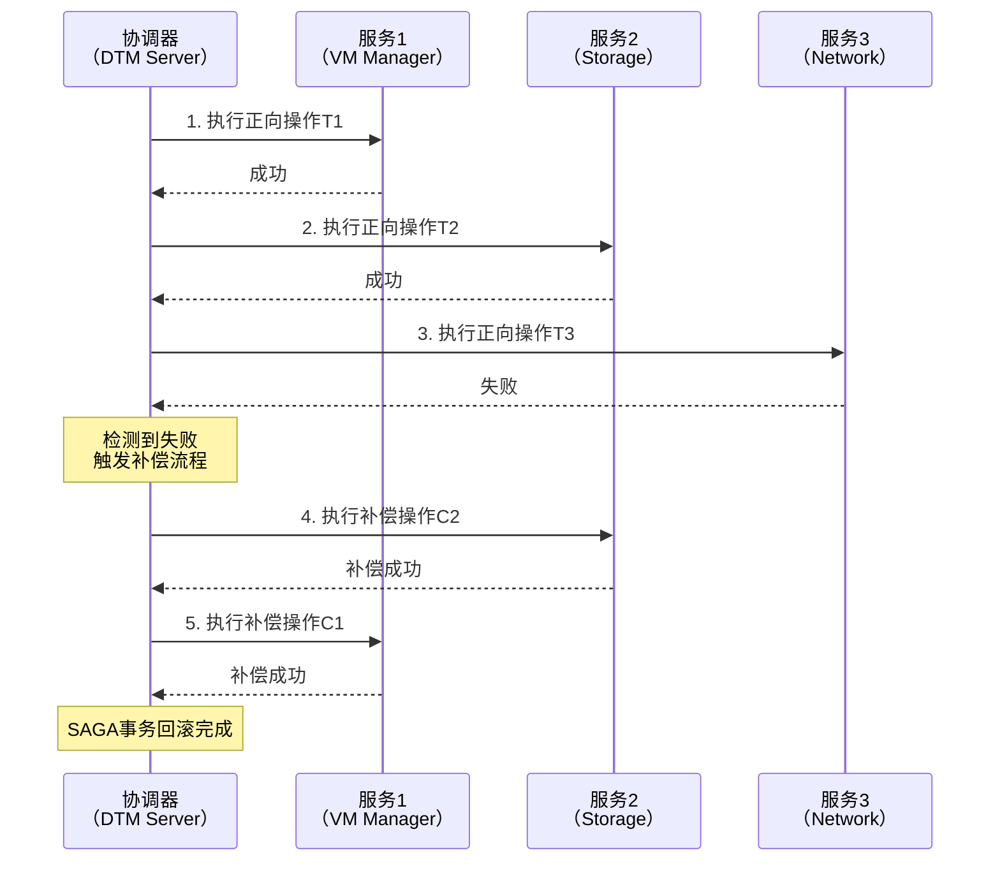
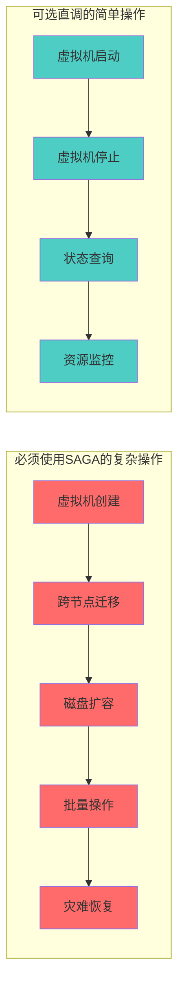
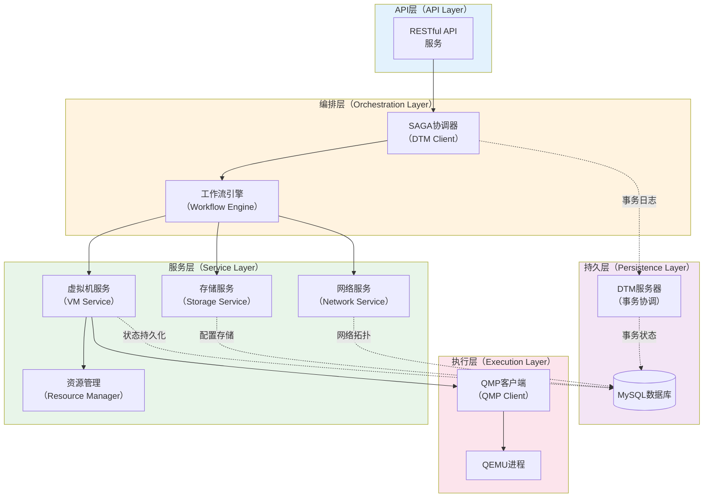
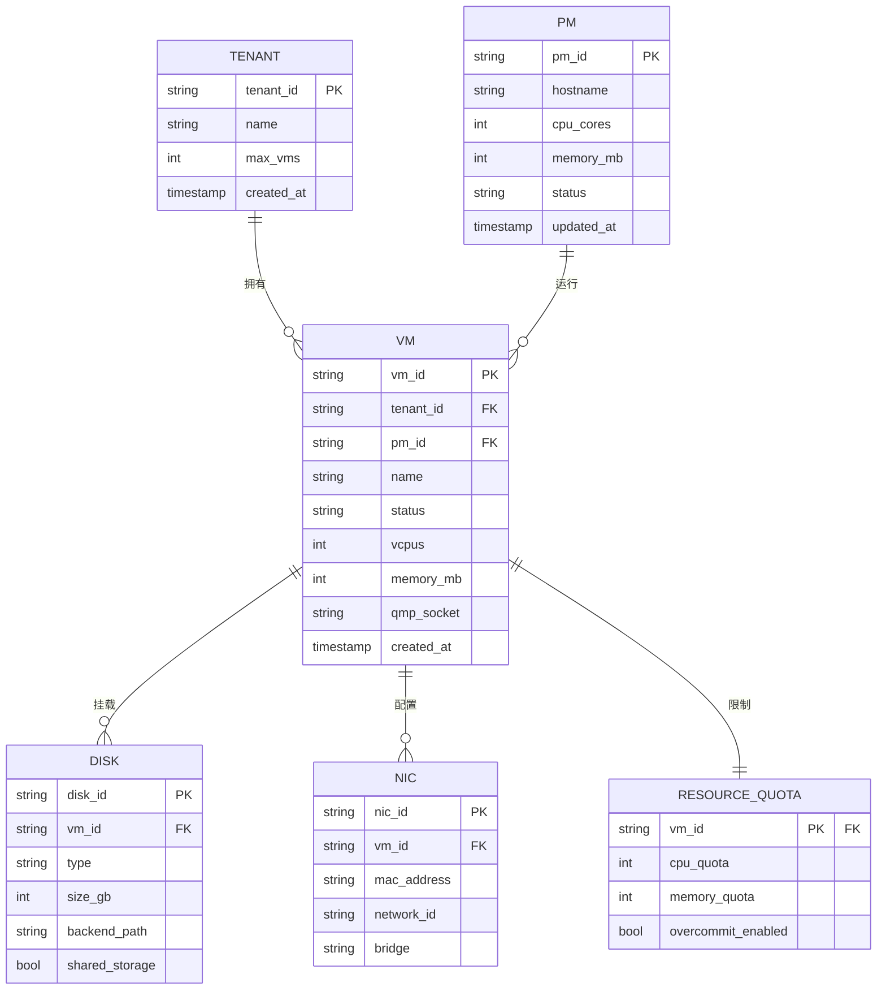
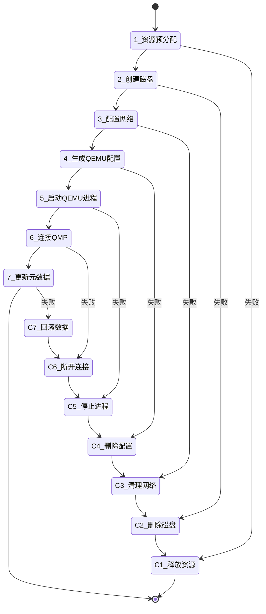
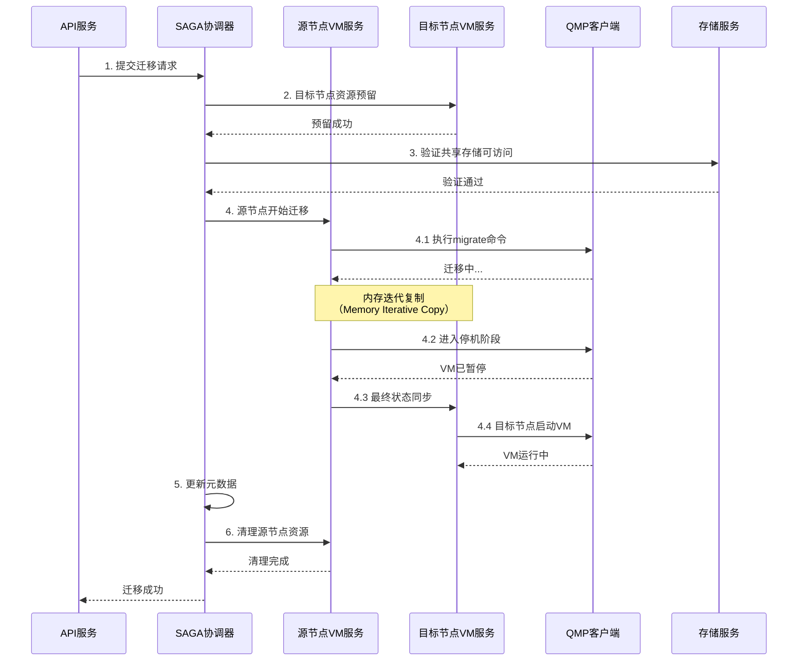
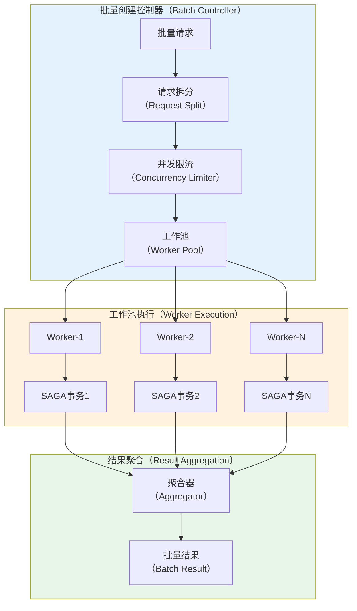
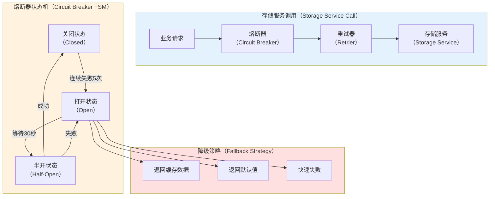
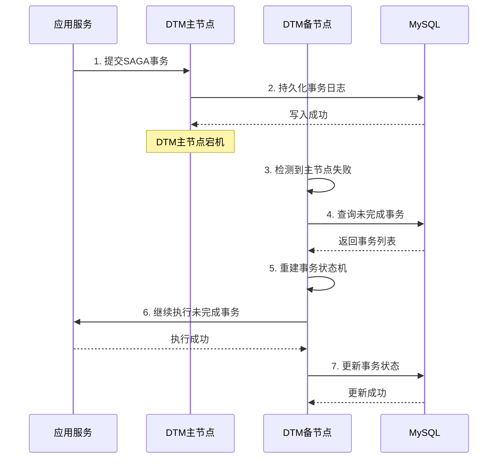

# 基于 SAGA Workflow 的虚拟机生命周期管理系统分析

## 一、需求分析与方案评估

### 1.1 核心需求洞察

本系统需要构建一个轻量级、高性能的虚拟机管理平台,核心特征包括:

1. **技术栈约束**:直接基于 QMP/QEMU/KVM
2. **资源管理**:支持静态分配和弹性超卖的配额控制,需要精确的资源隔离
3. **迁移能力**:共享存储支持热迁移,本地盘仅支持冷迁移
4. **扩展性**:支持节点的动态扩缩容和替换
5. **一致性保障**:在分布式环境下保证虚拟机生命周期操作的最终一致性

## 二、SAGA Workflow 分布式事务方案

### 2.1 SAGA 模式基础原理

SAGA 是一种长事务(Long-Running Transaction)处理模式,将一个分布式事务拆分为多个本地事务,通过补偿机制保证最终一致性。



**核心机制**:

1. **正向步骤(Forward Steps)**:按业务顺序执行的本地事务
2. **补偿步骤(Compensation Steps)**:反向回滚已完成操作的事务
3. **重试机制**:对临时性失败进行指数退避重试
4. **幂等保障**:通过全局事务ID和本地事务版本号防止重复执行

### 2.2 SAGA 在虚拟机生命周期中的应用评估

**适用场景**:



**方案优势**:

1. **最终一致性保障**:即使在网络分区、节点故障情况下也能保证状态收敛
2. **故障可观测性**:DTM 提供完整的事务日志和状态机视图
3. **灵活编排**:支持串行、并行、条件分支等复杂业务流程
4. **性能可控**:根据 DTM 官方测试[2],TPS 可达 30000+,P99 延迟 < 50ms

**关键挑战**:

1. **补偿逻辑复杂性**:需要精心设计每个步骤的回滚操作
2. **外部依赖故障**:存储/网络服务异常时需要额外的容错处理
3. **事务日志持久化**:MySQL 故障可能导致事务状态丢失

### 2.3 SAGA Workflow 核心概念详解

#### 2.3.1 正向步骤设计原则

每个正向步骤必须满足:

1. **原子性**:步骤内部操作要么全部成功,要么全部失败
2. **持久化**:关键状态变更必须落盘后才返回成功
3. **超时控制**:设置合理超时避免无限等待

```go
// 正向步骤接口定义
type ForwardAction interface {
    // Execute 执行正向操作
    // 返回值: error - 业务错误会触发补偿流程
    Execute(ctx context.Context, params interface{}) error
    
    // Name 返回步骤名称,用于日志追踪
    Name() string
    
    // Timeout 返回步骤超时时间
    Timeout() time.Duration
}
```

#### 2.3.2 补偿步骤设计原则

补偿步骤必须满足:

1. **幂等性**:多次执行结果一致,不会产生副作用
2. **最终成功**:通过重试保证最终能完成补偿
3. **资源清理**:释放正向步骤分配的所有资源

```go
// 补偿步骤接口定义
type CompensationAction interface {
    // Compensate 执行补偿操作
    // 必须保证幂等性,允许被多次调用
    Compensate(ctx context.Context, params interface{}) error
    
    // Name 返回步骤名称
    Name() string
    
    // MaxRetries 返回最大重试次数
    MaxRetries() int
}
```

#### 2.3.3 重试策略设计

DTM 支持灵活的重试策略配置:

```go
// 重试配置
type RetryConfig struct {
    // 最大重试次数
    MaxAttempts int
    
    // 初始退避时间
    InitialBackoff time.Duration
    
    // 最大退避时间
    MaxBackoff time.Duration
    
    // 退避倍数
    BackoffMultiplier float64
    
    // 可重试的错误类型
    RetryableErrors []error
}

// 默认重试策略:指数退避
// 1s -> 2s -> 4s -> 8s -> 16s -> 32s (最大)
var DefaultRetryConfig = RetryConfig{
    MaxAttempts:       6,
    InitialBackoff:    1 * time.Second,
    MaxBackoff:        32 * time.Second,
    BackoffMultiplier: 2.0,
    RetryableErrors: []error{
        ErrNetworkTimeout,
        ErrServiceUnavailable,
        ErrResourceBusy,
    },
}
```

#### 2.3.4 幂等性保障机制

通过全局事务ID(GAID)和本地事务版本号实现:

```go
// 幂等键生成
type IdempotencyKey struct {
    GAID      string // DTM全局事务ID
    BranchID  string // 分支事务ID
    Operation string // 操作类型
    Version   int64  // 版本号
}

// 幂等性检查
func (s *VMService) CreateVMIdempotent(ctx context.Context, req *CreateVMRequest) error {
    key := IdempotencyKey{
        GAID:      req.TransactionID,
        BranchID:  req.BranchID,
        Operation: "create_vm",
        Version:   req.Version,
    }
    
    // 检查操作是否已执行
    if result, exists := s.idempotencyCache.Get(key); exists {
        return result.Error // 返回缓存的结果
    }
    
    // 执行实际操作
    err := s.doCreateVM(ctx, req)
    
    // 缓存结果(成功或失败都缓存)
    s.idempotencyCache.Set(key, IdempotentResult{Error: err})
    
    return err
}
```

## 三、虚拟机生命周期 MVP 设计

### 3.1 系统架构设计



**架构分层说明**:

1. **API 层**:提供 RESTful 接口,处理认证授权和请求参数校验
2. **编排层**:负责 SAGA 事务编排和工作流状态机管理
3. **服务层**:实现具体的业务逻辑,包括虚拟机、存储、网络管理
4. **执行层**:直接操作 QEMU 进程,通过 QMP 协议执行底层命令
5. **持久层**:存储虚拟机元数据、事务日志和配置信息

### 3.2 数据模型设计



### 3.3 核心业务场景 SAGA 实现

#### 3.3.1 场景一:虚拟机创建

**业务流程图**:



**完整实现代码**:

```go
package vm

import (
    "context"
    "fmt"
    "time"
    
    "github.com/dtm-labs/client/dtmcli"
    "github.com/dtm-labs/client/workflow"
)

// CreateVMRequest 创建虚拟机请求
type CreateVMRequest struct {
    TenantID     string `json:"tenant_id"`
    VMID         string `json:"vm_id"`
    Name         string `json:"name"`
    VCPUs        int    `json:"vcpus"`
    MemoryMB     int    `json:"memory_mb"`
    DiskSizeGB   int    `json:"disk_size_gb"`
    NetworkID    string `json:"network_id"`
    PMID         string `json:"pm_id"` // 可选,为空则自动调度
    SharedStorage bool   `json:"shared_storage"`
}

// CreateVMSaga 虚拟机创建SAGA编排
func (s *VMService) CreateVMSaga(ctx context.Context, req *CreateVMRequest) error {
    // 初始化DTM Workflow
    wfName := fmt.Sprintf("create_vm_%s", req.VMID)
    err := workflow.Register(wfName, func(wf *workflow.Workflow, data []byte) error {
        // 步骤1:资源预分配
        wf.NewBranch().OnRollback(func(bb *dtmcli.BranchBarrier) error {
            return s.compensateResourceAllocation(ctx, req.VMID)
        })
        err := s.allocateResources(wf.Context, req)
        if err != nil {
            return err
        }
        
        // 步骤2:创建磁盘
        wf.NewBranch().OnRollback(func(bb *dtmcli.BranchBarrier) error {
            return s.compensateCreateDisk(ctx, req.VMID)
        })
        diskID, err := s.createDisk(wf.Context, req)
        if err != nil {
            return err
        }
        
        // 步骤3:配置网络
        wf.NewBranch().OnRollback(func(bb *dtmcli.BranchBarrier) error {
            return s.compensateNetworkConfig(ctx, req.VMID)
        })
        nicID, err := s.configureNetwork(wf.Context, req)
        if err != nil {
            return err
        }
        
        // 步骤4:生成QEMU配置
        wf.NewBranch().OnRollback(func(bb *dtmcli.BranchBarrier) error {
            return s.compensateQEMUConfig(ctx, req.VMID)
        })
        configPath, err := s.generateQEMUConfig(wf.Context, req, diskID, nicID)
        if err != nil {
            return err
        }
        
        // 步骤5:启动QEMU进程
        wf.NewBranch().OnRollback(func(bb *dtmcli.BranchBarrier) error {
            return s.compensateQEMUProcess(ctx, req.VMID)
        })
        pid, err := s.startQEMUProcess(wf.Context, req.VMID, configPath)
        if err != nil {
            return err
        }
        
        // 步骤6:连接QMP
        wf.NewBranch().OnRollback(func(bb *dtmcli.BranchBarrier) error {
            return s.compensateQMPConnection(ctx, req.VMID)
        })
        qmpSocket, err := s.connectQMP(wf.Context, req.VMID, pid)
        if err != nil {
            return err
        }
        
        // 步骤7:更新元数据
        wf.NewBranch().OnRollback(func(bb *dtmcli.BranchBarrier) error {
            return s.compensateMetadata(ctx, req.VMID)
        })
        return s.updateMetadata(wf.Context, req, qmpSocket, "running")
    })
    
    if err != nil {
        return fmt.Errorf("注册SAGA工作流失败: %w", err)
    }
    
    // 执行Workflow
    return workflow.Execute(wfName, req.VMID, nil)
}

// ==================== 正向步骤实现 ====================

// allocateResources 步骤1:资源预分配
func (s *VMService) allocateResources(ctx context.Context, req *CreateVMRequest) error {
    // 1. 选择目标物理机(如果未指定)
    if req.PMID == "" {
        pm, err := s.scheduler.SelectPM(ctx, req.VCPUs, req.MemoryMB)
        if err != nil {
            return fmt.Errorf("调度失败: %w", err)
        }
        req.PMID = pm.PMID
    }
    
    // 2. 检查资源配额
    quota, err := s.quotaManager.GetTenantQuota(ctx, req.TenantID)
    if err != nil {
        return err
    }
    if !quota.CanAllocate(req.VCPUs, req.MemoryMB) {
        return ErrQuotaExceeded
    }
    
    // 3. 预留资源(乐观锁)
    reservation := &ResourceReservation{
        VMID:     req.VMID,
        PMID:     req.PMID,
        VCPUs:    req.VCPUs,
        MemoryMB: req.MemoryMB,
        ExpireAt: time.Now().Add(10 * time.Minute),
    }
    
    return s.resourceManager.Reserve(ctx, reservation)
}

// compensateResourceAllocation 补偿步骤1:释放预留资源
func (s *VMService) compensateResourceAllocation(ctx context.Context, vmID string) error {
    // 幂等性保障:检查资源是否已释放
    if released, _ := s.resourceManager.IsReleased(ctx, vmID); released {
        return nil
    }
    
    // 释放预留资源
    return s.resourceManager.Release(ctx, vmID)
}

// createDisk 步骤2:创建磁盘
func (s *VMService) createDisk(ctx context.Context, req *CreateVMRequest) (string, error) {
    diskReq := &CreateDiskRequest{
        DiskID:        generateDiskID(req.VMID),
        VMID:          req.VMID,
        SizeGB:        req.DiskSizeGB,
        Type:          "qcow2",
        SharedStorage: req.SharedStorage,
        PMID:          req.PMID,
    }
    
    // 调用存储服务创建磁盘
    disk, err := s.storageService.CreateDisk(ctx, diskReq)
    if err != nil {
        return "", fmt.Errorf("创建磁盘失败: %w", err)
    }
    
    return disk.DiskID, nil
}

// compensateCreateDisk 补偿步骤2:删除磁盘
func (s *VMService) compensateCreateDisk(ctx context.Context, vmID string) error {
    diskID := generateDiskID(vmID)
    
    // 幂等性检查:磁盘是否已删除
    exists, err := s.storageService.DiskExists(ctx, diskID)
    if err != nil {
        return err
    }
    if !exists {
        return nil // 已删除,幂等返回成功
    }
    
    // 删除磁盘
    return s.storageService.DeleteDisk(ctx, diskID)
}

// configureNetwork 步骤3:配置网络
func (s *VMService) configureNetwork(ctx context.Context, req *CreateVMRequest) (string, error) {
    nicReq := &CreateNICRequest{
        NICID:     generateNICID(req.VMID),
        VMID:      req.VMID,
        NetworkID: req.NetworkID,
        PMID:      req.PMID,
    }
    
    // 调用网络服务创建NIC
    nic, err := s.networkService.CreateNIC(ctx, nicReq)
    if err != nil {
        return "", fmt.Errorf("配置网络失败: %w", err)
    }
    
    return nic.NICID, nil
}

// compensateNetworkConfig 补偿步骤3:清理网络配置
func (s *VMService) compensateNetworkConfig(ctx context.Context, vmID string) error {
    nicID := generateNICID(vmID)
    
    // 幂等性检查
    exists, err := s.networkService.NICExists(ctx, nicID)
    if err != nil {
        return err
    }
    if !exists {
        return nil
    }
    
    // 删除NIC
    return s.networkService.DeleteNIC(ctx, nicID)
}

// generateQEMUConfig 步骤4:生成QEMU配置
func (s *VMService) generateQEMUConfig(ctx context.Context, req *CreateVMRequest, 
    diskID, nicID string) (string, error) {
    
    // 获取磁盘路径
    disk, err := s.storageService.GetDisk(ctx, diskID)
    if err != nil {
        return "", err
    }
    
    // 获取网络配置
    nic, err := s.networkService.GetNIC(ctx, nicID)
    if err != nil {
        return "", err
    }
    
    // 生成QEMU命令行参数
    config := &QEMUConfig{
        VMID:      req.VMID,
        Name:      req.Name,
        VCPUs:     req.VCPUs,
        MemoryMB:  req.MemoryMB,
        DiskPath:  disk.BackendPath,
        MACAddr:   nic.MACAddress,
        Bridge:    nic.Bridge,
        QMPSocket: fmt.Sprintf("/var/run/qemu/%s.sock", req.VMID),
    }
    
    // 保存配置文件
    configPath := fmt.Sprintf("/etc/qemu/%s.json", req.VMID)
    err = s.configStore.Save(ctx, configPath, config)
    if err != nil {
        return "", fmt.Errorf("保存配置失败: %w", err)
    }
    
    return configPath, nil
}

// compensateQEMUConfig 补偿步骤4:删除配置文件
func (s *VMService) compensateQEMUConfig(ctx context.Context, vmID string) error {
    configPath := fmt.Sprintf("/etc/qemu/%s.json", vmID)
    
    // 幂等性:文件不存在视为已删除
    exists, _ := s.configStore.Exists(ctx, configPath)
    if !exists {
        return nil
    }
    
    return s.configStore.Delete(ctx, configPath)
}

// startQEMUProcess 步骤5:启动QEMU进程
func (s *VMService) startQEMUProcess(ctx context.Context, vmID, configPath string) (int, error) {
    // 加载配置
    config, err := s.configStore.Load(ctx, configPath)
    if err != nil {
        return 0, err
    }
    
    // 构建QEMU命令
    cmd := s.buildQEMUCommand(config)
    
    // 启动进程
    process, err := s.processManager.Start(ctx, cmd)
    if err != nil {
        return 0, fmt.Errorf("启动QEMU进程失败: %w", err)
    }
    
    // 等待QEMU初始化完成(最多30秒)
    if err := s.waitForQEMUReady(ctx, process.PID, 30*time.Second); err != nil {
        s.processManager.Kill(ctx, process.PID)
        return 0, err
    }
    
    return process.PID, nil
}

// compensateQEMUProcess 补偿步骤5:停止QEMU进程
func (s *VMService) compensateQEMUProcess(ctx context.Context, vmID string) error {
    // 查找进程PID
    pid, err := s.processManager.FindByVMID(ctx, vmID)
    if err != nil {
        if err == ErrProcessNotFound {
            return nil // 进程不存在,幂等返回成功
        }
        return err
    }
    
    // 优雅停止(先SIGTERM,10秒后SIGKILL)
    return s.processManager.GracefulStop(ctx, pid, 10*time.Second)
}

// connectQMP 步骤6:连接QMP
func (s *VMService) connectQMP(ctx context.Context, vmID string, pid int) (string, error) {
    qmpSocket := fmt.Sprintf("/var/run/qemu/%s.sock", vmID)
    
    // 建立QMP连接
    client, err := s.qmpManager.Connect(ctx, qmpSocket)
    if err != nil {
        return "", fmt.Errorf("连接QMP失败: %w", err)
    }
    
    // 执行QMP握手
    if err := client.Handshake(ctx); err != nil {
        client.Close()
        return "", err
    }
    
    // 注册到连接池
    s.qmpManager.Register(vmID, client)
    
    return qmpSocket, nil
}

// compensateQMPConnection 补偿步骤6:断开QMP连接
func (s *VMService) compensateQMPConnection(ctx context.Context, vmID string) error {
    // 幂等性:检查连接是否存在
    client := s.qmpManager.Get(vmID)
    if client == nil {
        return nil // 连接不存在,幂等返回成功
    }
    
    // 关闭连接
    client.Close()
    s.qmpManager.Unregister(vmID)
    
    return nil
}

// updateMetadata 步骤7:更新元数据
func (s *VMService) updateMetadata(ctx context.Context, req *CreateVMRequest, 
    qmpSocket, status string) error {
    
    vm := &VM{
        VMID:      req.VMID,
        TenantID:  req.TenantID,
        PMID:      req.PMID,
        Name:      req.Name,
        VCPUs:     req.VCPUs,
        MemoryMB:  req.MemoryMB,
        Status:    status,
        QMPSocket: qmpSocket,
        CreatedAt: time.Now(),
    }
    
    // 持久化到数据库
    return s.vmRepo.Create(ctx, vm)
}

// compensateMetadata 补偿步骤7:回滚元数据
func (s *VMService) compensateMetadata(ctx context.Context, vmID string) error {
    // 幂等性:检查记录是否存在
    exists, err := s.vmRepo.Exists(ctx, vmID)
    if err != nil {
        return err
    }
    if !exists {
        return nil // 记录不存在,幂等返回成功
    }
    
    // 删除数据库记录
    return s.vmRepo.Delete(ctx, vmID)
}

// ==================== 辅助方法 ====================

func generateDiskID(vmID string) string {
    return fmt.Sprintf("%s-disk-0", vmID)
}

func generateNICID(vmID string) string {
    return fmt.Sprintf("%s-nic-0", vmID)
}

func (s *VMService) buildQEMUCommand(config *QEMUConfig) []string {
    return []string{
        "qemu-system-x86_64",
        "-name", config.Name,
        "-machine", "pc-q35-6.2,accel=kvm",
        "-cpu", "host",
        "-smp", fmt.Sprintf("cpus=%d", config.VCPUs),
        "-m", fmt.Sprintf("%dM", config.MemoryMB),
        "-drive", fmt.Sprintf("file=%s,if=virtio,cache=none,aio=native", config.DiskPath),
        "-netdev", fmt.Sprintf("bridge,id=net0,br=%s", config.Bridge),
        "-device", fmt.Sprintf("virtio-net-pci,netdev=net0,mac=%s", config.MACAddr),
        "-qmp", fmt.Sprintf("unix:%s,server,nowait", config.QMPSocket),
        "-daemonize",
        "-pidfile", fmt.Sprintf("/var/run/qemu/%s.pid", config.VMID),
    }
}

func (s *VMService) waitForQEMUReady(ctx context.Context, pid int, timeout time.Duration) error {
    deadline := time.Now().Add(timeout)
    for time.Now().Before(deadline) {
        // 检查进程是否存活
        if !s.processManager.IsRunning(pid) {
            return ErrQEMUProcessDied
        }
        
        // 检查QMP socket是否可连接
        qmpSocket := fmt.Sprintf("/var/run/qemu/%d.sock", pid)
        if s.qmpManager.CanConnect(qmpSocket) {
            return nil
        }
        
        time.Sleep(500 * time.Millisecond)
    }
    
    return ErrQEMUStartTimeout
}
```

**DFR 场景处理**:

| 故障场景          | 检测机制        | 处理策略           | 恢复时间   |
| ------------- | ----------- | -------------- | ------ |
| DTM Server 宕机 | 心跳检测(5s 间隔) | 自动故障转移到备节点     | < 15s  |
| MySQL 主库故障    | 连接超时(3s)    | 切换到从库,事务日志重放   | < 30s  |
| 存储服务不可用       | HTTP 503 响应 | 指数退避重试(最多 6 次) | < 2min |
| 网络服务异常        | 连接超时        | 跳过并标记,异步修复     | 异步     |
| QEMU 进程启动失败   | 进程退出码检查     | 立即回滚,释放所有资源    | < 10s  |

#### 3.3.2 场景二:跨节点热迁移(共享存储)

**业务流程图**:



**完整实现代码**:

```go
// MigrateVMRequest 虚拟机迁移请求
type MigrateVMRequest struct {
    VMID            string `json:"vm_id"`
    TargetPMID      string `json:"target_pm_id"`
    MaxDowntimeMS   int    `json:"max_downtime_ms"`   // 最大停机时间(毫秒)
    MaxBandwidthMB  int    `json:"max_bandwidth_mb"`  // 最大带宽(MB/s)
    AutoConverge    bool   `json:"auto_converge"`     // 自动收敛
}

// MigrateVMSaga 虚拟机热迁移SAGA编排
func (s *VMService) MigrateVMSaga(ctx context.Context, req *MigrateVMRequest) error {
    wfName := fmt.Sprintf("migrate_vm_%s", req.VMID)
    
    return workflow.Register(wfName, func(wf *workflow.Workflow, data []byte) error {
        // 获取虚拟机当前状态
        vm, err := s.vmRepo.Get(wf.Context, req.VMID)
        if err != nil {
            return err
        }
        
        // 检查前置条件
        if vm.Status != "running" {
            return ErrVMNotRunning
        }
        
        // 检查磁盘类型
        disks, err := s.storageService.GetVMDisks(wf.Context, req.VMID)
        if err != nil {
            return err
        }
        
        hasLocalDisk := false
        for _, disk := range disks {
            if !disk.SharedStorage {
                hasLocalDisk = true
                break
            }
        }
        
        if hasLocalDisk {
            return ErrLocalDiskNotSupported // 本地盘不支持热迁移
        }
        
        // 步骤1:目标节点资源预留
        wf.NewBranch().OnRollback(func(bb *dtmcli.BranchBarrier) error {
            return s.compensateTargetResourceReservation(ctx, req.VMID, req.TargetPMID)
        })
        err = s.reserveTargetResources(wf.Context, vm, req.TargetPMID)
        if err != nil {
            return err
        }
        
        // 步骤2:验证共享存储
        wf.NewBranch().OnRollback(func(bb *dtmcli.BranchBarrier) error {
            return nil // 只读操作,无需补偿
        })
        err = s.verifySharedStorage(wf.Context, vm.VMID, req.TargetPMID)
        if err != nil {
            return err
        }
        
        // 步骤3:设置迁移参数
        wf.NewBranch().OnRollback(func(bb *dtmcli.BranchBarrier) error {
            return s.compensateMigrationSetup(ctx, req.VMID)
        })
        err = s.setupMigration(wf.Context, vm, req)
        if err != nil {
            return err
        }
        
        // 步骤4:执行迁移
        wf.NewBranch().OnRollback(func(bb *dtmcli.BranchBarrier) error {
            return s.compensateMigrationExecution(ctx, req.VMID)
        })
        migrationResult, err := s.executeMigration(wf.Context, vm, req)
        if err != nil {
            return err
        }
        
        // 步骤5:更新元数据
        wf.NewBranch().OnRollback(func(bb *dtmcli.BranchBarrier) error {
            return s.compensateMigrationMetadata(ctx, req.VMID, vm.PMID)
        })
        err = s.updateMigrationMetadata(wf.Context, req.VMID, req.TargetPMID, migrationResult)
        if err != nil {
            return err
        }
        
        // 步骤6:清理源节点
        wf.NewBranch().OnRollback(func(bb *dtmcli.BranchBarrier) error {
            return nil // 清理失败不影响迁移结果,异步重试
        })
        return s.cleanupSourceNode(wf.Context, vm.PMID, req.VMID)
    })
}

// ==================== 正向步骤实现 ====================

// reserveTargetResources 步骤1:目标节点资源预留
func (s *VMService) reserveTargetResources(ctx context.Context, vm *VM, targetPMID string) error {
    // 检查目标节点资源
    pm, err := s.pmRepo.Get(ctx, targetPMID)
    if err != nil {
        return err
    }
    
    if !pm.HasEnoughResources(vm.VCPUs, vm.MemoryMB) {
        return ErrInsufficientResources
    }
    
    // 预留资源
    reservation := &ResourceReservation{
        VMID:     vm.VMID,
        PMID:     targetPMID,
        VCPUs:    vm.VCPUs,
        MemoryMB: vm.MemoryMB,
        ExpireAt: time.Now().Add(30 * time.Minute), // 迁移预留时间更长
    }
    
    return s.resourceManager.Reserve(ctx, reservation)
}

// compensateTargetResourceReservation 补偿步骤1:释放目标节点预留
func (s *VMService) compensateTargetResourceReservation(ctx context.Context, vmID, targetPMID string) error {
    return s.resourceManager.ReleaseOnPM(ctx, vmID, targetPMID)
}

// verifySharedStorage 步骤2:验证共享存储
func (s *VMService) verifySharedStorage(ctx context.Context, vmID, targetPMID string) error {
    disks, err := s.storageService.GetVMDisks(ctx, vmID)
    if err != nil {
        return err
    }
    
    for _, disk := range disks {
        // 检查目标节点是否能访问存储
        accessible, err := s.storageService.CheckAccess(ctx, disk.BackendPath, targetPMID)
        if err != nil {
            return fmt.Errorf("检查存储访问失败: %w", err)
        }
        if !accessible {
            return ErrStorageNotAccessible
        }
    }
    
    return nil
}

// setupMigration 步骤3:设置迁移参数
func (s *VMService) setupMigration(ctx context.Context, vm *VM, req *MigrateVMRequest) error {
    qmpClient := s.qmpManager.Get(vm.VMID)
    if qmpClient == nil {
        return ErrQMPNotConnected
    }
    
    // 设置迁移能力
    capabilities := map[string]bool{
        "xbzrle":        true,  // 增量压缩
        "auto-converge": req.AutoConverge,
    }
    
    for cap, enabled := range capabilities {
        if err := qmpClient.SetMigrationCapability(ctx, cap, enabled); err != nil {
            return fmt.Errorf("设置迁移能力 %s 失败: %w", cap, err)
        }
    }
    
    // 设置迁移参数
    params := &MigrationParameters{
        MaxDowntime:  req.MaxDowntimeMS,
        MaxBandwidth: req.MaxBandwidthMB * 1024 * 1024, // 转换为字节
    }
    
    return qmpClient.SetMigrationParameters(ctx, params)
}

// compensateMigrationSetup 补偿步骤3:重置迁移参数
func (s *VMService) compensateMigrationSetup(ctx context.Context, vmID string) error {
    qmpClient := s.qmpManager.Get(vmID)
    if qmpClient == nil {
        return nil // QMP 已断开,无需重置
    }
    
    // 重置为默认参数
    defaultParams := &MigrationParameters{
        MaxDowntime:  300,  // 300ms
        MaxBandwidth: 32 * 1024 * 1024, // 32MB/s
    }
    
    return qmpClient.SetMigrationParameters(ctx, defaultParams)
}

// executeMigration 步骤4:执行迁移
func (s *VMService) executeMigration(ctx context.Context, vm *VM, req *MigrateVMRequest) (*MigrationResult, error) {
    qmpClient := s.qmpManager.Get(vm.VMID)
    if qmpClient == nil {
        return nil, ErrQMPNotConnected
    }
    
    // 构建迁移URI
    targetPM, err := s.pmRepo.Get(ctx, req.TargetPMID)
    if err != nil {
        return nil, err
    }
    
    migrationURI := fmt.Sprintf("tcp:%s:49152", targetPM.MigrationIP)
    
    // 启动迁移
    if err := qmpClient.Migrate(ctx, migrationURI); err != nil {
        return nil, fmt.Errorf("启动迁移失败: %w", err)
    }
    
    // 监控迁移进度
    result, err := s.monitorMigration(ctx, qmpClient, 10*time.Minute)
    if err != nil {
        // 尝试取消迁移
        _ = qmpClient.MigrateCancel(ctx)
        return nil, err
    }
    
    return result, nil
}

// monitorMigration 监控迁移进度
func (s *VMService) monitorMigration(ctx context.Context, qmpClient *QMPClient, timeout time.Duration) (*MigrationResult, error) {
    deadline := time.Now().Add(timeout)
    ticker := time.NewTicker(1 * time.Second)
    defer ticker.Stop()
    
    for {
        select {
        case <-ctx.Done():
            return nil, ctx.Err()
        case <-time.After(time.Until(deadline)):
            return nil, ErrMigrationTimeout
        case <-ticker.C:
            status, err := qmpClient.QueryMigration(ctx)
            if err != nil {
                return nil, err
            }
            
            switch status.Status {
            case "completed":
                return &MigrationResult{
                    TotalTime:   status.TotalTime,
                    Downtime:    status.Downtime,
                    SetupTime:   status.SetupTime,
                    Transferred: status.RAM.Transferred,
                }, nil
            case "failed":
                return nil, fmt.Errorf("迁移失败: %s", status.ErrorDesc)
            case "cancelled":
                return nil, ErrMigrationCancelled
            case "active":
                // 记录进度日志
                s.logger.Infof("迁移进度: %d%%, 传输: %dMB/%dMB", 
                    status.RAM.Transferred*100/status.RAM.Total,
                    status.RAM.Transferred/(1024*1024),
                    status.RAM.Total/(1024*1024))
            }
        }
    }
}

// compensateMigrationExecution 补偿步骤4:取消迁移
func (s *VMService) compensateMigrationExecution(ctx context.Context, vmID string) error {
    qmpClient := s.qmpManager.Get(vmID)
    if qmpClient == nil {
        return nil // QMP 已断开,迁移已中止
    }
    
    // 查询迁移状态
    status, err := qmpClient.QueryMigration(ctx)
    if err != nil {
        return err
    }
    
    // 只有在迁移进行中才需要取消
    if status.Status == "active" {
        return qmpClient.MigrateCancel(ctx)
    }
    
    return nil
}

// updateMigrationMetadata 步骤5:更新元数据
func (s *VMService) updateMigrationMetadata(ctx context.Context, vmID, targetPMID string, result *MigrationResult) error {
    // 更新虚拟机所在节点
    return s.vmRepo.UpdatePMID(ctx, vmID, targetPMID)
}

// compensateMigrationMetadata 补偿步骤5:回滚元数据
func (s *VMService) compensateMigrationMetadata(ctx context.Context, vmID, originalPMID string) error {
    return s.vmRepo.UpdatePMID(ctx, vmID, originalPMID)
}

// cleanupSourceNode 步骤6:清理源节点
func (s *VMService) cleanupSourceNode(ctx context.Context, sourcePMID, vmID string) error {
    // 断开QMP连接
    qmpClient := s.qmpManager.Get(vmID)
    if qmpClient != nil {
        qmpClient.Close()
        s.qmpManager.Unregister(vmID)
    }
    
    // 删除源节点的配置文件
    configPath := fmt.Sprintf("/etc/qemu/%s.json", vmID)
    _ = s.configStore.Delete(ctx, configPath)
    
    // 释放源节点资源
    return s.resourceManager.ReleaseOnPM(ctx, vmID, sourcePMID)
}
```

**DFR 场景分析**:

| 故障场景           | 影响              | 处理策略                  | 用户感知   |
| -------------- | --------------- | --------------------- | ------ |
| 迁移过程中网络中断      | 迁移失败,VM 仍在源节点运行 | 自动取消迁移,保持原状态          | 迁移失败提示 |
| 目标节点 QEMU 启动失败 | 迁移失败            | 回滚元数据,释放目标节点资源        | 迁移失败提示 |
| 共享存储短暂不可用      | 迁移暂停            | 等待存储恢复(最多 5 分钟)       | 迁移进度延迟 |
| DTM 在迁移过程中宕机   | 事务挂起            | 新 DTM Leader 接管,从日志恢复 | 透明,无感知 |
| MySQL 写入失败     | 元数据更新失败         | 回滚迁移,VM 回到源节点         | 迁移失败提示 |

#### 3.3.3 场景三:批量创建虚拟机

**并发控制策略**:



**完整实现代码**:

```go
// BatchCreateVMRequest 批量创建虚拟机请求
type BatchCreateVMRequest struct {
    TenantID      string              `json:"tenant_id"`
    VMRequests    []*CreateVMRequest  `json:"vm_requests"`
    Concurrency   int                 `json:"concurrency"`    // 并发数,默认5
    FailFast      bool                `json:"fail_fast"`      // 快速失败模式
}

// BatchCreateResult 批量创建结果
type BatchCreateResult struct {
    SuccessCount int                 `json:"success_count"`
    FailureCount int                 `json:"failure_count"`
    Results      []*VMCreateResult   `json:"results"`
}

// VMCreateResult 单个虚拟机创建结果
type VMCreateResult struct {
    VMID         string  `json:"vm_id"`
    Success      bool    `json:"success"`
    Error        string  `json:"error,omitempty"`
    Duration     int64   `json:"duration_ms"`
}

// BatchCreateVMSaga 批量创建虚拟机SAGA编排
func (s *VMService) BatchCreateVMSaga(ctx context.Context, req *BatchCreateVMRequest) (*BatchCreateResult, error) {
    // 参数验证
    if len(req.VMRequests) == 0 {
        return nil, ErrEmptyBatchRequest
    }
    
    if req.Concurrency <= 0 {
        req.Concurrency = 5 // 默认并发数
    }
    
    // 创建工作池
    workerPool := workerpool.New(req.Concurrency)
    
    // 结果收集通道
    resultChan := make(chan *VMCreateResult, len(req.VMRequests))
    
    // 错误控制
    var (
        errorOccurred atomic.Bool
        wg            sync.WaitGroup
    )
    
    // 提交任务
    for _, vmReq := range req.VMRequests {
        if req.FailFast && errorOccurred.Load() {
            // 快速失败模式:已有错误则跳过后续任务
            resultChan <- &VMCreateResult{
                VMID:    vmReq.VMID,
                Success: false,
                Error:   "批量操作已失败,跳过执行",
            }
            continue
        }
        
        wg.Add(1)
        vmReqCopy := vmReq // 避免闭包变量问题
        
        workerPool.Submit(func() {
            defer wg.Done()
            
            startTime := time.Now()
            
            // 执行单个虚拟机创建SAGA
            err := s.CreateVMSaga(ctx, vmReqCopy)
            
            duration := time.Since(startTime).Milliseconds()
            
            result := &VMCreateResult{
                VMID:     vmReqCopy.VMID,
                Success:  err == nil,
                Duration: duration,
            }
            
            if err != nil {
                result.Error = err.Error()
                errorOccurred.Store(true)
            }
            
            resultChan <- result
        })
    }
    
    // 等待所有任务完成
    wg.Wait()
    close(resultChan)
    
    // 聚合结果
    batchResult := &BatchCreateResult{
        Results: make([]*VMCreateResult, 0, len(req.VMRequests)),
    }
    
    for result := range resultChan {
        batchResult.Results = append(batchResult.Results, result)
        if result.Success {
            batchResult.SuccessCount++
        } else {
            batchResult.FailureCount++
        }
    }
    
    return batchResult, nil
}

// ==================== 批量磁盘创建 ====================

// BatchCreateDiskRequest 批量创建磁盘请求
type BatchCreateDiskRequest struct {
    VMID         string             `json:"vm_id"`
    DiskRequests []*CreateDiskRequest `json:"disk_requests"`
}

// BatchCreateDiskSaga 批量创建磁盘SAGA编排
func (s *StorageService) BatchCreateDiskSaga(ctx context.Context, req *BatchCreateDiskRequest) error {
    wfName := fmt.Sprintf("batch_create_disk_%s", req.VMID)
    
    return workflow.Register(wfName, func(wf *workflow.Workflow, data []byte) error {
        createdDisks := make([]string, 0, len(req.DiskRequests))
        
        // 串行创建磁盘(避免存储压力)
        for i, diskReq := range req.DiskRequests {
            branchName := fmt.Sprintf("create_disk_%d", i)
            
            wf.NewBranch().OnRollback(func(bb *dtmcli.BranchBarrier) error {
                // 补偿:删除已创建的磁盘
                for _, diskID := range createdDisks {
                    _ = s.DeleteDisk(ctx, diskID)
                }
                return nil
            })
            
            disk, err := s.CreateDisk(wf.Context, diskReq)
            if err != nil {
                return fmt.Errorf("创建磁盘 %s 失败: %w", branchName, err)
            }
            
            createdDisks = append(createdDisks, disk.DiskID)
        }
        
        // 更新虚拟机磁盘列表
        return s.UpdateVMDisks(wf.Context, req.VMID, createdDisks)
    })
}
```

**批量操作性能优化**:

1. **并发控制**:通过工作池限制并发数,避免资源耗尽
2. **快速失败**:可选的 fail-fast 模式,减少无效操作
3. **结果流式返回**:大批量操作可通过 WebSocket 实时推送进度
4. **分批提交**:超大批量(>100)自动拆分为多个子批次

### 3.4 简单操作直调场景

以下操作复杂度低,**无需 SAGA 编排**,直接调用即可:

| 操作      | 实现方式               | 幂等性           | 错误处理     |
| ------- | ------------------ | ------------- | -------- |
| 虚拟机启动   | QMP `cont` 命令      | 检查状态防重复启动     | 失败直接返回错误 |
| 虚拟机停止   | QMP `stop` 命令      | 检查状态防重复停止     | 失败直接返回错误 |
| 虚拟机重启   | QMP `system_reset` | 无副作用,天然幂等     | 失败直接返回错误 |
| 状态查询    | QMP `query-status` | 只读操作,天然幂等     | 失败重试 3 次 |
| CPU 热插拔 | QMP `device_add`   | 检查 CPU ID 防重复 | 失败直接返回错误 |
| 内存热插拔   | QMP `object-add`   | 检查内存块 ID 防重复  | 失败直接返回错误 |

**示例代码**:

```go
// StartVM 启动虚拟机(简单操作,无需SAGA)
func (s *VMService) StartVM(ctx context.Context, vmID string) error {
    // 获取虚拟机信息
    vm, err := s.vmRepo.Get(ctx, vmID)
    if err != nil {
        return err
    }
    
    // 幂等性检查
    if vm.Status == "running" {
        return nil // 已启动,直接返回成功
    }
    
    if vm.Status != "stopped" {
        return ErrInvalidVMState
    }
    
    // 连接QMP
    qmpClient := s.qmpManager.Get(vmID)
    if qmpClient == nil {
        return ErrQMPNotConnected
    }
    
    // 执行启动命令
    if err := qmpClient.Continue(ctx); err != nil {
        return fmt.Errorf("启动虚拟机失败: %w", err)
    }
    
    // 更新状态
    return s.vmRepo.UpdateStatus(ctx, vmID, "running")
}

// StopVM 停止虚拟机(简单操作,无需SAGA)
func (s *VMService) StopVM(ctx context.Context, vmID string) error {
    vm, err := s.vmRepo.Get(ctx, vmID)
    if err != nil {
        return err
    }
    
    // 幂等性检查
    if vm.Status == "stopped" {
        return nil
    }
    
    if vm.Status != "running" {
        return ErrInvalidVMState
    }
    
    qmpClient := s.qmpManager.Get(vmID)
    if qmpClient == nil {
        return ErrQMPNotConnected
    }
    
    // 执行停止命令
    if err := qmpClient.Stop(ctx); err != nil {
        return fmt.Errorf("停止虚拟机失败: %w", err)
    }
    
    return s.vmRepo.UpdateStatus(ctx, vmID, "stopped")
}
```

## 四、外部依赖容错设计

### 4.1 存储服务异常处理



**实现代码**:

```go
// StorageServiceWrapper 存储服务包装器(带熔断和重试)
type StorageServiceWrapper struct {
    client         *StorageClient
    circuitBreaker *gobreaker.CircuitBreaker
    retryConfig    *RetryConfig
}

// CreateDiskWithFaultTolerance 容错的磁盘创建
func (w *StorageServiceWrapper) CreateDiskWithFaultTolerance(ctx context.Context, req *CreateDiskRequest) (*Disk, error) {
    // 包装为熔断器执行
    result, err := w.circuitBreaker.Execute(func() (interface{}, error) {
        // 带重试的实际调用
        return w.createDiskWithRetry(ctx, req)
    })
    
    if err != nil {
        // 熔断器打开,触发降级
        if err == gobreaker.ErrOpenState {
            return nil, ErrStorageServiceUnavailable
        }
        return nil, err
    }
    
    return result.(*Disk), nil
}

// createDiskWithRetry 带重试的磁盘创建
func (w *StorageServiceWrapper) createDiskWithRetry(ctx context.Context, req *CreateDiskRequest) (*Disk, error) {
    var lastErr error
    
    for attempt := 0; attempt < w.retryConfig.MaxAttempts; attempt++ {
        if attempt > 0 {
            // 指数退避
            backoff := w.retryConfig.InitialBackoff * time.Duration(1<<uint(attempt-1))
            if backoff > w.retryConfig.MaxBackoff {
                backoff = w.retryConfig.MaxBackoff
            }
            
            select {
            case <-ctx.Done():
                return nil, ctx.Err()
            case <-time.After(backoff):
            }
        }
        
        disk, err := w.client.CreateDisk(ctx, req)
        if err == nil {
            return disk, nil
        }
        
        lastErr = err
        
        // 判断是否可重试
        if !w.isRetryableError(err) {
            return nil, err
        }
    }
    
    return nil, fmt.Errorf("重试 %d 次后仍失败: %w", w.retryConfig.MaxAttempts, lastErr)
}

// isRetryableError 判断错误是否可重试
func (w *StorageServiceWrapper) isRetryableError(err error) bool {
    // 网络超时、服务不可用等临时性错误可重试
    retryableErrors := []error{
        ErrNetworkTimeout,
        ErrServiceUnavailable,
        ErrTooManyRequests,
    }
    
    for _, retryableErr := range retryableErrors {
        if errors.Is(err, retryableErr) {
            return true
        }
    }
    
    return false
}
```

### 4.2 网络服务异常处理

网络服务异常的容错策略:

1. **异步修复**:网络配置失败不阻塞虚拟机创建,标记为"网络未就绪"状态
2. **后台重试**:专门的网络协调器(Network Reconciler)周期性修复异常网络
3. **用户通知**:异常状态通过事件总线通知用户

```go
// NetworkReconciler 网络协调器
type NetworkReconciler struct {
    networkService *NetworkService
    vmRepo         *VMRepository
    interval       time.Duration
}

// Run 启动协调器
func (r *NetworkReconciler) Run(ctx context.Context) {
    ticker := time.NewTicker(r.interval)
    defer ticker.Stop()
    
    for {
        select {
        case <-ctx.Done():
            return
        case <-ticker.C:
            r.reconcile(ctx)
        }
    }
}

// reconcile 协调网络状态
func (r *NetworkReconciler) reconcile(ctx context.Context) {
    // 查找网络未就绪的虚拟机
    vms, err := r.vmRepo.FindByNetworkStatus(ctx, "not_ready")
    if err != nil {
        return
    }
    
    for _, vm := range vms {
        // 重试配置网络
        nicID := generateNICID(vm.VMID)
        _, err := r.networkService.GetNIC(ctx, nicID)
        
        if err == nil {
            // 网络已恢复,更新状态
            _ = r.vmRepo.UpdateNetworkStatus(ctx, vm.VMID, "ready")
        } else {
            // 继续重试创建
            nicReq := &CreateNICRequest{
                NICID:     nicID,
                VMID:      vm.VMID,
                NetworkID: vm.NetworkID,
                PMID:      vm.PMID,
            }
            
            _, _ = r.networkService.CreateNIC(ctx, nicReq)
        }
    }
}
```

### 4.3 DTM 故障恢复机制

DTM 支持高可用部署,故障恢复流程:



**故障恢复代码**:

```go
// DTMFailoverHandler DTM故障转移处理器
type DTMFailoverHandler struct {
    dtmClient      *dtmcli.Client
    healthChecker  *HealthChecker
    failoverConfig *FailoverConfig
}

// MonitorAndFailover 监控并执行故障转移
func (h *DTMFailoverHandler) MonitorAndFailover(ctx context.Context) {
    ticker := time.NewTicker(h.failoverConfig.CheckInterval)
    defer ticker.Stop()
    
    for {
        select {
        case <-ctx.Done():
            return
        case <-ticker.C:
            if !h.healthChecker.IsHealthy(h.dtmClient.GetPrimaryEndpoint()) {
                h.executeFailover(ctx)
            }
        }
    }
}

// executeFailover 执行故障转移
func (h *DTMFailoverHandler) executeFailover(ctx context.Context) error {
    // 1. 切换到备节点
    backupEndpoint := h.failoverConfig.BackupEndpoints[0]
    h.dtmClient.SwitchEndpoint(backupEndpoint)
    
    // 2. 等待新主节点就绪
    if err := h.waitForReady(ctx, backupEndpoint, 30*time.Second); err != nil {
        return err
    }
    
    // 3. 恢复未完成事务(由DTM自动处理)
    // DTM会从MySQL读取事务日志并继续执行
    
    return nil
}
```

## 五、参考资料

* [1] Red Hat. "KVM Performance Optimization Guide". [https://access.redhat.com/documentation/en-us/red_hat_enterprise_linux/8/html/configuring_and_managing_virtualization/optimizing-virtual-machine-performance-in-rhel_configuring-and-managing-virtualization](https://access.redhat.com/documentation/en-us/red_hat_enterprise_linux/8/html/configuring_and_managing_virtualization/optimizing-virtual-machine-performance-in-rhel_configuring-and-managing-virtualization)
* [2] DTM Labs. "DTM Performance Benchmark". [https://github.com/dtm-labs/dtm-labs.github.io/blob/main/blogs/bench.md](https://github.com/dtm-labs/dtm-labs.github.io/blob/main/blogs/bench.md)
* [3] QEMU Project. "QMP Protocol Specification". [https://qemu.readthedocs.io/en/latest/interop/qmp-spec.html](https://qemu.readthedocs.io/en/latest/interop/qmp-spec.html)
* [4] QEMU Documentation. "Live Migration Protocol". [https://qemu.readthedocs.io/en/latest/devel/migration.html](https://qemu.readthedocs.io/en/latest/devel/migration.html)

---

*本文档版本: v1.0*
*最后更新: 2026-01-28*
